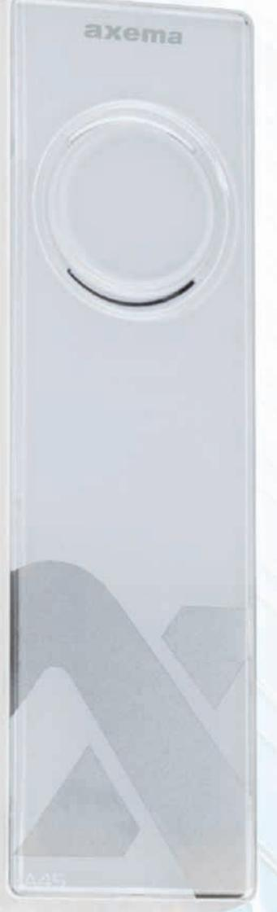
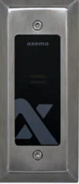
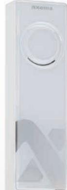

# **Karmläsare A45 EM och Mifare**

**Karmläsaren A45 designad för kontorsmiljöer**

**Inbyggd högtalare för talade meddelanden**

**Enkel a� använda** 

### **EM & Mifare**

A45 är en kombiläsare som hanterar beröringsfria nyckelbrickor och kort för både EM & Mifare. Läsavståndet är ca 8-10 cm med EM och 3-6 cm med Mifare.

## **Designad för kontorsmiljöer**

A45 är designad för installa�on på dörrkarmar i kontorsmiljöer. A45 ansluts �ll Axemas dörrcentral i e� VAKA-system.

## **Vandalsäker kapsling**

Vandalskydd i ros�ri� stål (�llbehör) kan användas vid montering i extra utsa�a miljöer som t ex garage, grindar, källare mm.

#### **Talade meddelanden**

Den inbyggda högtalaren ger ljudindikeringar vid varningar, larm (sabotage) samt talmeddelanden.

## **Öka säkerheten & tänk kostnadseffek�vt**

Använd nyckelbrickor istället för nycklar. Nyckelbrickor kan enkelt spärras om de tappas bort. Bor�appade nycklar kan i vissa fall innebära höga kostnader i fall låscylindrar måste bytas ut och nya nycklar tas fram.

## **Vandalskydd C811**

- Vandalskydd �ll A45
- Ros�ri ram med slagtålig polykarbonat
- Enkel Installa�on
- Designad för utsa�a miljöer
- Må�: 155x67x20 (HxBxD)

**Art.nr. 2-3811** 

## **Teknisk data**

- Kapsling i ABS plast samt front i reptålig polykarbonat
- Läsare EM4200/4102 samt Mifare
- Högtalare integrerad
- Grön LED = lås olåst
- Röd LED för larmindikering
- Blå LED indikerar läst kort/nyckelbricka
- Temperatur: -30° �ll + 55°C
- Spänning: från dörrcentral (max 150m)
- Må�: 140x45x20 (HxBxD)
- Strömförbrukning:

|     | EM    | Mifare | EM & Mifare |
|-----|-------|--------|-------------|
| 12V | 40 mA | 70 mA  | 85 mA       |
| 24V | 25-mA | 40 mA  | 45 mA       |

#### **Art.nr. 2-1450 E5870746**

