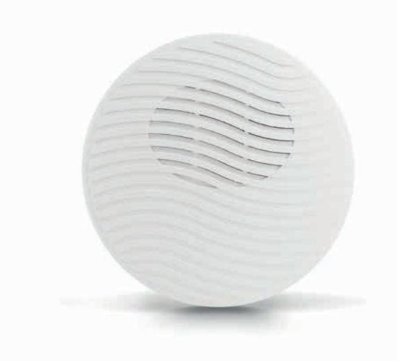

## **SP 1000 INOMHUSSIREN**

- Låg strömförbrukning
- Justerbar ljudstyrka
- Olika tonval
- EN Grade 3, SBSC larmklass III
- Mycket högt ljudtryck
- Vit färg som standard

SP 1000 är en modern och snyggt designad inomhussiren som passar samtliga kontors- och hemmamiljöer. Den är utvecklad för dagens moderna säkerhetsinstallationer.

SP 1000 är en piezoelektrisk siren med högt ljudtryck med stort frekvens omfång, som gör det obehagligt att vistas i samma utrymme vid larm.

SP 1000 levereras i vit ABS plast. Den runda utformningen gör sirenen enkel att montera och smälter in i de flesta miljöer.

SP 1000 är försedd med sabotageskydd mot öppning och bortbrytning från vägg.

| Matningsspänning  10-15 Vdc            |  |
|----------------------------------------|--|
| Max strömförbrukning80 mA +/-10%       |  |
| Ljudeffekt > 90dB @ 1 m, Max 115 dB    |  |
| Frekvens  från 500 till 3000 Hz        |  |
| Kapsling Vit ABS plast                 |  |
| Dimensioner Ø135 D 38 mm               |  |
| Temperatur- 10 till +40 °C             |  |
| Godkännande SBSC larmklass III, 16-597 |  |
|                                        |  |

| Beställningsinformation |         |               |  |
|-------------------------|---------|---------------|--|
| Typ                     | E-nr    | Beskrivning   |  |
| SP 1000                 | 5372314 | Inomhusserien |  |