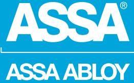
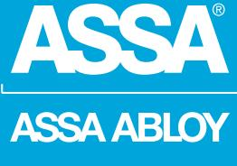
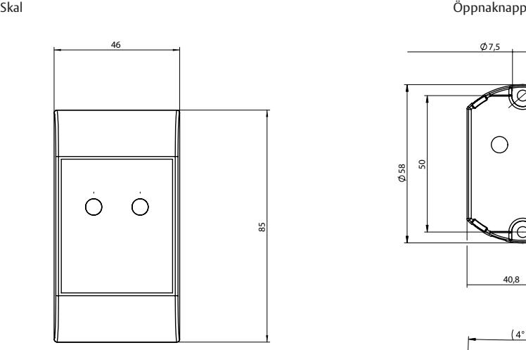
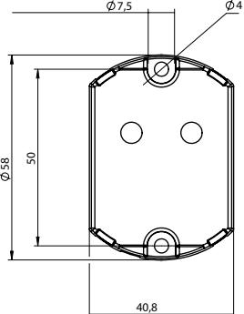
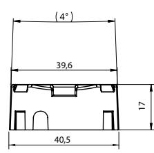

## ASSA Pando® Touch RE

ASSA ABLOY, the global leader in door opening solutions

### Beröringsknapp för smidig upplåsning

Pando Touch RE är en beröringsöppnarknapp för smidig upplåsning av dörren från insidan. Funktionen är mycket lämplig i högfrekventa dörrmiljöer, det räcker med att placera handen på öppnarknappen för att låsa upp dörren vilket skapar mindre mekaniskt slitage.

Öppnarknappen ansluts enkelt till dörrmiljön via en reläutgång i knappen, till DAC i ARX system eller motsvarande enheter. Pando Touch RE har blå indikering för att indikera aktiverad knapp.

# ASSA Pando® Touch RE

ASSA ABLOY, the global leader in door opening solutions

19

40,5

4

50

58

40,8

7,5

**Indikeringar**

- Blå LED
### **Data**

- Matniningsspänning: 12-24 V DC
- Strömförbrukning mätt vid 24V:
	- MIN 3mA
- MAX 36mA
- Vikt 35 g
- Temperaturområde: -15ºC till +70ºC
- Uppfyller kraven för IP 44
- Halon/Halogenfri

#### **Artikelnummer**

- S514 000 185 Vit
ASSA ABLOY is the global leader in door opening solutions, dedicated to satisfying end-user needs for security, safety and convenience

ASSA AB P.O. Box 371 SE-631 05 Eskilstuna Sweden Phone +46 (0)16 17 70 00

Fax +46 (0)16 17 70 49 Customer support: Phone intl. +46 (0)16 17 71 00 Phone nat. 0771-640 640 Fax +46 (0)16 17 73 72 e-mail: helpdesk.marknad@assaabloy.com

www.assa.se