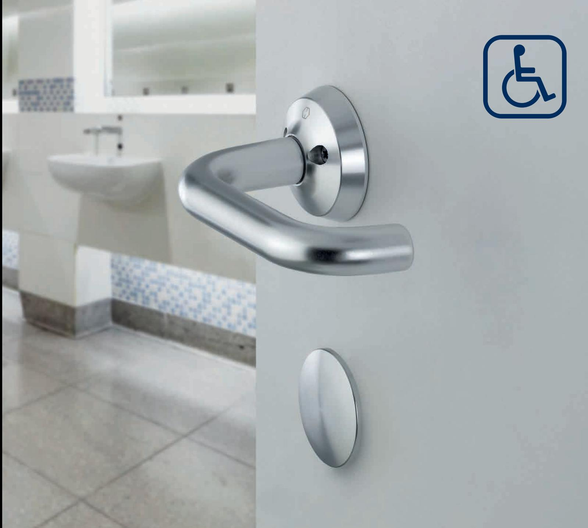
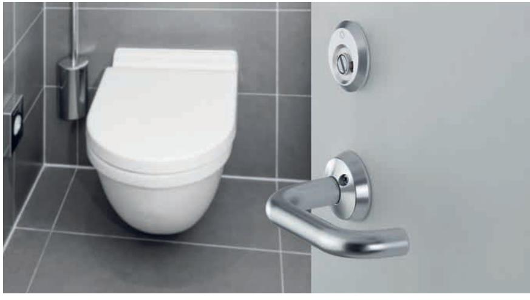
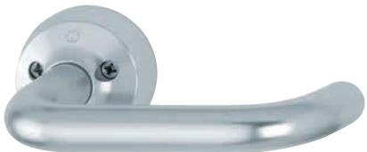
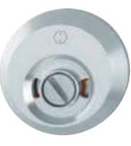
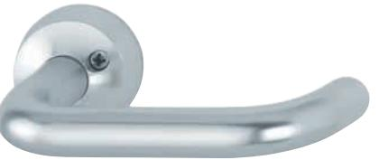

HOPPE kompletterar med WC-behör typ 9565T för institutioner och offentliga miljöer

Artikelnr. 11591316 F1 – aluminium silverfärgad Artikelnr. 11592242 F9 – aluminium rostfritt stål nyans

996S/138F/995/998S/997/138F

## Flip-up handtag

HOPPEs produkter har sedan tidigare används flitigt i offentliga miljöer.

Mycket på grund av den höga kvaliteten, som ger produkterna en långvarig hållbarhet, men också på grund av det miljövänliga materialet aluminium.

Nu kompletteras HOPPEs produkt program med handikappanpassade WC-behör med flip-up funktion. Man låser från insidan genom att lyfta trycket uppåt och låser upp igen genom att trycka det nedåt.

Det enkla montaget samt att WC-behöret är vändbart höger/vänster, ger dig många fördelar när det gäller montage, användarvänlighet och lagerhållning. En ytterligare fördel är att alla HOPPEs aluminium produkter är nickelfria, testade enligt gällande EU-direktiv.

Allt detta för att tillgodose krav och byggnormer i den offentliga miljön.

10 års garanti på mekanisk funktion

Tillverkad i

DIN EN ISO 14001 Miljövänlig tillverkning