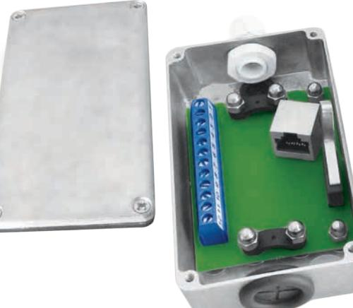

## **JB RJ45 KOPPLINGSDOSA I METALL**

## **Fördelar**

- 12 skruvplintar
- RJ45-kontakt för spiralkabel
- 3 kabelingångar
- Kabelavlastningsskydd
- Sabotagekontakt

JB RJ45 är en kopplingsdosa med en RJ45-kontakt samt 12 skruvanslutningar varav 2 är för sabotagekontakten. Kopplingsdosan är avsedd för larm- och passersystem där en robust och säker dosa behövs. Det finns 3 kabelingångar, ovansida, undersida samt baksida för diskret montering. Dosan är också försedd med kabelavlastningsskydd för RJ45-kontakten. Skruvanslutningarna har hissfunktion för säker montering.

| Sabotageskydd Ja                         |  |
|------------------------------------------|--|
| AnslutningSkruvplint med hissfunktion    |  |
| Kapsling, Färg  Metall, Vit              |  |
| Kapslingsklass IP 44                     |  |
| Dimensioner (L x B x H) mm 115 x 65 x 28 |  |

| Beställningsinformation |      |                                                 |       |
|-------------------------|------|-------------------------------------------------|-------|
| Typ                     | E-nr | Beskrivning                                     | Paket |
| JB RJ45                 | -    | Kopplingsdosa i metall, 12 pol med RJ45-kontakt | 1st   |