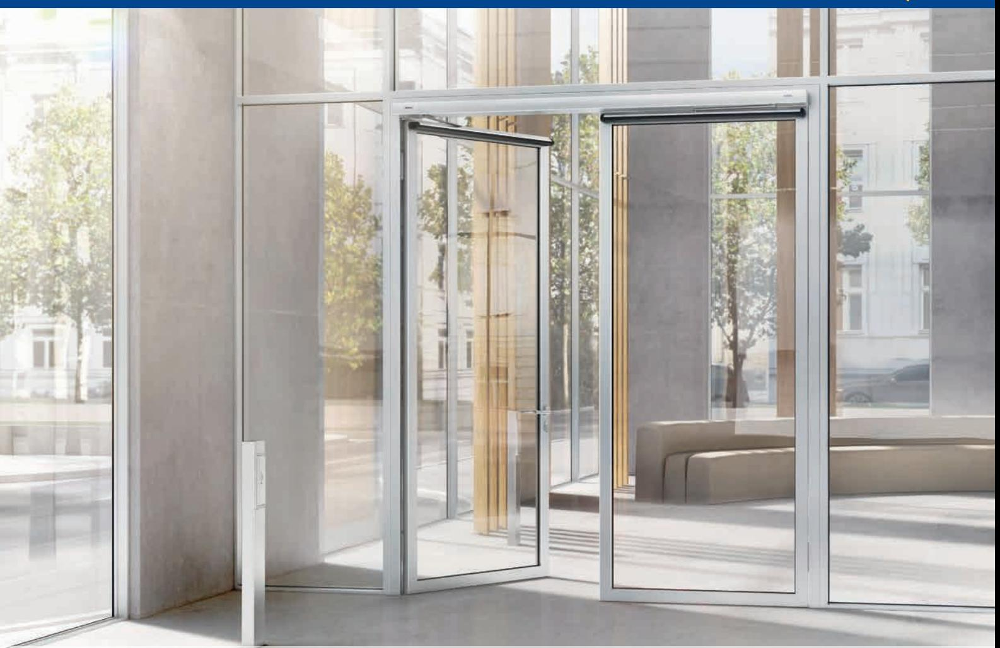

# GEZE POWERTURN AUTOMATISKA DÖRRSYSTEM

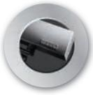

Dørteknik

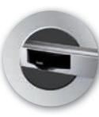

**DØRSYSTEMER**

**DÖRRSYSTEM**

Dørsystemer

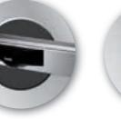

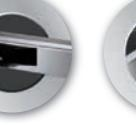

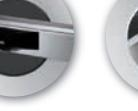

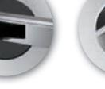

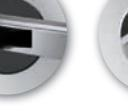

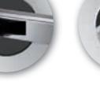

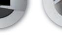

logoer 1 09/03/10 14.29

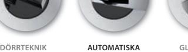

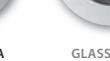

**Glassystemer**

> Røgventilation

**VENTILATION OG RØGVENTILATION KOMFORT- OCH RÖKVENTILATION**

Sikkerhedsteknik

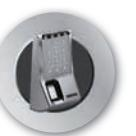

**GLASSYSTEMER SIKKERHEDSTEKNIK GLASSYSTEM SÄKERHETSTEKNIK**

Glassystemer

BEWEGUNG MIT SYSTEM

## GEZE POWERTURN

Automatiska

dörrsystem

| GEZE POWERTURN     | Powerturn är den multifunktionella lösningen. Den öppnar enkelt stora och tunga dörrar – med ett eller två dörrblad – och tack vare sin stilrena design med en höjd på endast sju cm smälter den in så gott som i alla omgivningar.                                                                                                                                         |                                                                                     |  |  |
|--------------------|-----------------------------------------------------------------------------------------------------------------------------------------------------------------------------------------------------------------------------------------------------------------------------------------------------------------------------------------------------------------------------------|-------------------------------------------------------------------------------------|--|--|
|                    | Flexibel montering helt enkelt: Med Powerturn går det att använda olika monteringssätt på en enda utoma tikvariant, till exempel karm- eller dörrmontering med länkarm eller glidarm – på gångjärns- eller anslags sidan. Allt med en och samma automatik. Det smarta monteringssystemet från GEZE minskar inte bara lagerhållningen, utan underlättar även monteringen. |                                                                                     |  |  |
|                    | Powerturn erbjuder komfort och säkerhet i alla passeringssituationer, särskilt för barn och funktionshindrade personer. Den gör det nämligen enklare för alla att öppna stora och tunga dörrar, som t.ex. branddörrar – automatiskt eller manuellt. Detta är möjligt med den unika Smart Swing-funktionen.                                                                  |                                                                                     |  |  |
|                    | Som tillförlitlig lösning för rök- och värmeevakuering eller komplex säkerhetssluss: Den starka automatiken från GEZE är en riktig lagspelare som kan integreras flexibelt i olika system – exakt och produktövergripande. Powerturn erbjuder därmed stor frihet för individuell utformning.                                                                                |                                                                                     |  |  |
| ANVÄNDNINGSOMRÅDE: | För invändiga och utvändiga slagdörrar J                                                                                                                                                                                                                                                                                                                                       | För montage på gångjärn- eller anslagssida J                                     |  |  |
|                    | För både höger- och vänsterhängda dörrar J                                                                                                                                                                                                                                                                                                                                     | För montage på dörrblad eller karm J                                             |  |  |
|                    | För enkel- och dubbelflygliga dörrar J                                                                                                                                                                                                                                                                                                                                         | För montage på branddörrar J                                                     |  |  |
| PRODUKTEGENSKAPER: | En modell för alla monteringssätt utan J omställning                                                                                                                                                                                                                                                                                                                        | Standardkulör silver eller vitlackerad RAL 9016 J RAL färger mot tillägg J |  |  |
|                    | Stilren design J                                                                                                                                                                                                                                                                                                                                                               | Justerbarhet J                                                                   |  |  |
|                    | Tyst gång J                                                                                                                                                                                                                                                                                                                                                                    | Stängkraft, EN 4 -EN 7 J                                                         |  |  |
|                    | Dörrbladsvikter upp till 600 kg med J dörrbladsbredder på 930 mm                                                                                                                                                                                                                                                                                                            | Stängningsfart J                                                                 |  |  |
|                    | Dörrbladsvikter upp till 300 kg med J                                                                                                                                                                                                                                                                                                                                          | Öppningsbroms J                                                                  |  |  |
|                    | dörrbladsbredder på 1.350 kg (branddörrar)                                                                                                                                                                                                                                                                                                                                        | Tillslag J                                                                       |  |  |
|                    | Dörrstängare funktion under strömavbrott J                                                                                                                                                                                                                                                                                                                                     | Tilltryck på el-slutbleck vid aktivering J                                       |  |  |
|                    | Inbyggnadsmått 70 x 130 x 720 mm J (höjd x djup x bredd)                                                                                                                                                                                                                                                                                                                    | Aktiveringsfördröjning J Öppningsvinkel upp till 136º J                    |  |  |
|                    | Nätspänning 230 V AC J                                                                                                                                                                                                                                                                                                                                                         | MPA-testad för 500.000 cykler J                                                  |  |  |
|                    | Utgångsström styrspänning 24 V 1200 mA J långvarigt                                                                                                                                                                                                                                                                                                                         | Smart swing-funktion J                                                           |  |  |
|                    | Förberedd för alla standardmotorlås, J                                                                                                                                                                                                                                                                                                                                         | Lågenergidrift J                                                                 |  |  |

el-slutbleck m.m.

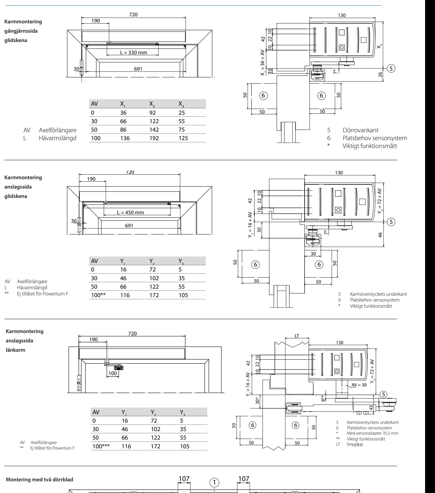

Forberedelse af montering

6.2.1 Topmontering hængselside med standard rulleskinne

Bemærk separat monteringsvejledning til sensorrulleskinne.

Hulmønster DIN venstre og DIN højre spejlvendt.

6.2 Anslagsmål til monteringstyper

Forberedelse af montering

6.2 Anslagsmål til monteringstyper

**Montering DIN venstre Montering DIN højre**

6.2.1 Topmontering hængselside med standard rulleskinne

4 4

à Bemærk separat monteringsvejledning til sensorrulleskinne.

Forberedelse af montering

**Montering DIN venstre Montering DIN højre**

6.2 Anslagsmål til monteringstyper

6.2.1 Topmontering hængselside med standard rulleskinne

Bemærk separat monteringsvejledning til sensorrulleskinne.

**Montering DIN venstre Montering DIN højre**

4 4

Stål-/ aluminiumdøre Trædøre

2 undersænkskruer M5 × 40 og nittemøtrik M5 2 træskruer Ø5 × 50

Forberedelse af montering

130

Forberedelse af montering

50

X2

26

**15**

**19**

43

5

Y2 = 72 + AV

**19**

Y2 = 72 + AV

46

30*

5

5

Drevmontering 8 undersænkskruer M6 × 25 og nittemøtrik M6 8 træskruer Ø6 × 50

**Montering DIN højre Montering DIN venstre**

Hulmønster DIN venstre og DIN højre spejlvendt.

4 4

1 Målreference hængselmidte/døroverkant 2 skjult kabeltilførsel i det skraverede område muligt,

Forberedelse af montering

Stål-/ aluminiumdøre Trædøre

f.eks. Ø 20 mm til nettilslutning eller lavspændingstilslutning 3 Orienteringspil til præcis positionsbestemmelse af monteringspladen

6.2.2 Topmontering modsat hængselside med

2 undersænkskruer M5 × 40 og nittemøtrik M5 2 træskruer Ø5 × 50

 Hulmønster DIN venstre og DIN højre spejlvendt. Bemærk separat monteringsvejledning til sensorrulleskinne.

130

Drevmontering 8 undersænkskruer M6 × 25 og nittemøtrik M6 8 træskruer Ø6 × 50

**Pladsbehov og montering af standard rulleskinne**

4 4

standard rulleskinne

à Hulmønster DIN venstre og DIN højre spejlvendt.

1 Målreference hængselmidte/døroverkant 2 skjult kabeltilførsel i det skraverede område muligt,

à Hulmønster DIN venstre og DIN højre spejlvendt.

6.2.2 Topmontering modsat hængselside med

Drevmontering 8 undersænkskruer M6 × 25 og nittemøtrik M6 8 træskruer Ø6 × 50

4 Målebånd

f.eks. Ø 20 mm til nettilslutning eller lavspændingstilslutning 3 Orienteringspil til præcis positionsbestemmelse af monteringspladen

standard rulleskinne

1 Målreference hængselmidte/døroverkant 2 skjult kabeltilførsel i det skraverede område muligt,

Powerturn

4 Målebånd

6.2.2 Topmontering modsat hængselside med

Powerturn

30

**22**

leskinne

standard rulleskinne

190

**Monteringsmaterialer**

 Hulmønster DIN venstre og DIN højre spejlvendt. Bemærk separat monteringsvejledning til sensorrulleskinne.

Montering standard rul-

720

leskinne

**Pladsbehov og montering af standard rulleskinne**

**Montering DIN højre Montering DIN venstre**

**Monteringsmaterialer**

Montering standard rul-

f.eks. Ø 20 mm til nettilslutning eller lavspændingstilslutning 3 Orienteringspil til præcis positionsbestemmelse af monteringspladen

4 Målebånd

à Bemærk separat monteringsvejledning til sensorrulleskinne.

Stål-/ aluminiumdøre Trædøre

leskinne

190

2 undersænkskruer M5 × 40 og nittemøtrik M5 2 træskruer Ø5 × 50

720

Montering standard rul-

**Monteringsmaterialer**

**Montering DIN højre Montering DIN venstre**

Powerturn

Powerturn

Powerturn

Powerturn

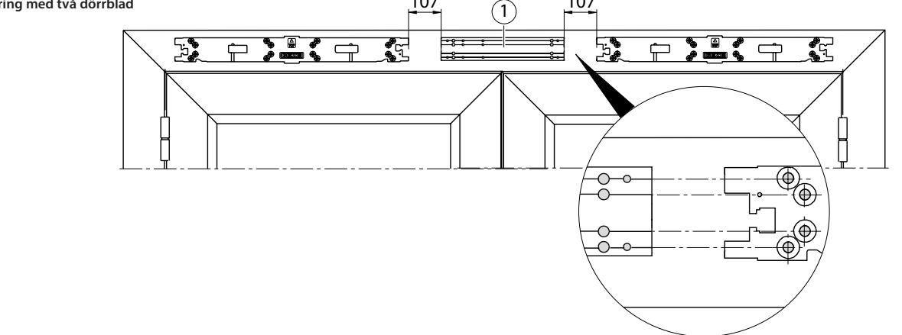

à Topmontering hængselside med standard rulleskinne, se kapitel 6.2.1 à Topmontering modsat hængselside med standard rulleskinne, se kapitel 6.2.2

à Topmontering modsat hængselside med stænger, se kapitel 6.2.6

Vertikal positionering til

X Skru grundpladen fast.

lonen.

kontur.

side.

7 Montering

X Opmærk borehuller. X Fjern skabelon (2).

X Skru monteringspladen (3) fast. X Montér det andet drev analog på højre

X Opmærk borepositioner til grundplade (1).

X Skub skabelonen (2) ind i grundpladen (1).

X Skub monteringspladen (3) ind i skabe-

X Positionér også med vaterpas på dørens

X Positionér grundpladen (1) efter skabelonen (2), evt. ved hjælp af et vaterpas eller på dørens kontur.

#### AUTOMATISK DØRÅPNER GEZE POWERTURN Drevmontering 8 undersænkskruer M6 × 25 og nittemøtrik M6 8 træskruer Ø6 × 50 Montering standard rulleskinne 2 undersænkskruer M5 × 40 og nittemøtrik M5 2 træskruer Ø5 × 50 Montering tilslutningsvinkel 2 cylinderskruer M6 × 12 og nittemøtrik M6 2 træskruer Ø6 × 30 **Montering DIN venstre Montering DIN højre**

Forberedelse af montering

Powerturn

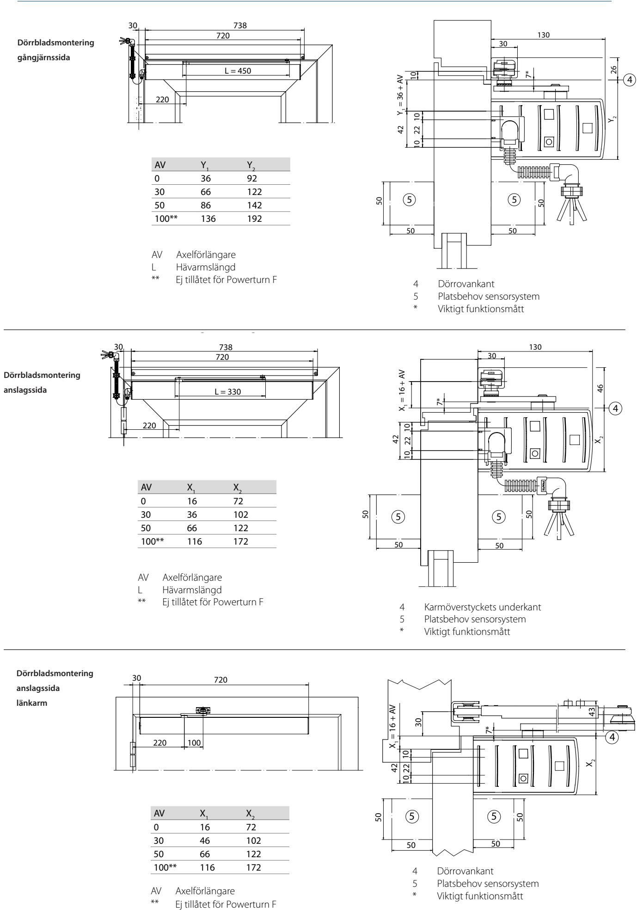

Powerturn

6.2.4 Dørmontering modsat hængselside med

Hulmønster DIN venstre og DIN højre spejlvendt.

1 Målreference hængselmidte/sargunderkant

Hulmønster DIN venstre og DIN højre spejlvendt.

3 Målebånd

Forberedelse af montering

**19**

**18**

43

5

Y2 = 72 + AV

AV = 30

130

Forberedelse af montering

30*

Powerturn

30*

6.2.6 Topmontering modsat hængselside med stænger Hulmønster DIN venstre og DIN højre spejlvendt.

> 1 Målreference hængselmidte/døroverkant 2 skjult kabeltilførsel i det skraverede område muligt, f.eks. Ø 20 mm til nettilslutning eller lavspændingstilslutning 3 Orienteringspil til præcis positionsbestemmelse af monteringspladen

**Pladsbehov og montering af stænger**  720

AV Y1 Y2 Y3 0 16 72 5 30 46 102 35 50 66 122 55 100*** 116 172 105

4 Målebånd *

100

AV Axelförlängare ** Ej tillåtet för Powerturn F

190

**Monteringsmaterialer**

**Montering DIN højre Montering DIN venstre**

4 4

Stål-/ aluminiumdøre Trædøre

42 Y1 = 16 + AV

50

1010 22

30*

50 50

6 6

LT

50

5 Karmöverstyckets underkant 6 Platsbehov sensorsystem * Med sensoradapter 35,5 mm ** Viktigt funktionsmått LT Smygdjup

8**

Drevmontering 8 undersænkskruer M6 × 25 og nittemøtrik M6 8 træskruer Ø6 × 50 Montering stænger 2 undersænkskruer M5 × 40 og nittemøtrik M5 2 træskruer Ø5 × 50 **Monteringsmaterialer**

6.2.3 Dørmontering hængselside med standard rulleskinne

2 Orienteringspil til præcis positionsbestemmelse af monteringspladen

**Montering DIN højre Montering DIN venstre**

3 3

Stål-/ aluminiumdøre Trædøre

standard rulleskinne

### **TEKNISK DATA**

| Produktegenskaber                   |                             |  |  |
|-------------------------------------|-----------------------------|--|--|
| Mått (H x D x L):                   | 70 × 130 × 720 mm           |  |  |
| Max. omgivningstemperaturområde:    | –15°C … +50°C               |  |  |
| Vikt automatik:                     | ca. 11,7 kg                 |  |  |
| Nätanslutning:                      | 230 V AC, 10–14 %, 50/60 Hz |  |  |
| Nominell effekt:                    | max. 200 W                  |  |  |
| Apparater som kan anslutas externt: | 24 V DC, max. 1200 mA       |  |  |

### **POWERTURN DIAGRAM**

#### **Powerturn diagram**

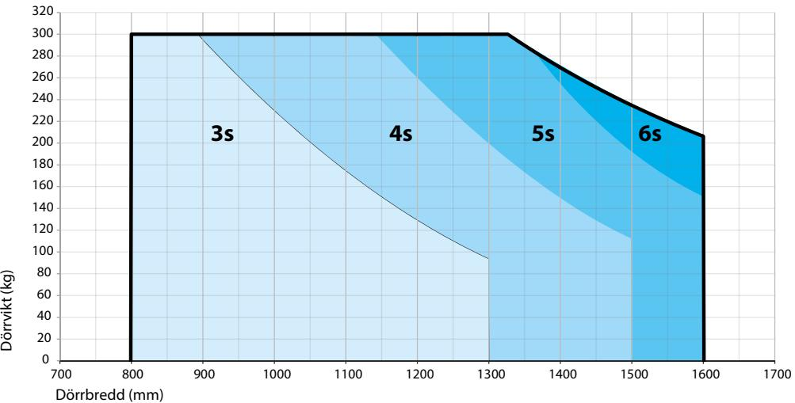

#### **ID NR.**

| Beteckning                                                     |        | Udførelse | ID nr. |
|----------------------------------------------------------------|--------|-----------|--------|
| Powerturn-automatik                                            |        | Silver    | 153065 |
| Powerturn F-automatik                                          |        | Silver    | 155162 |
| Powerturn kåpa                                                 |        | Silver    | 161927 |
| Powerturn Elmontagevinkel, 2 bl. dörrar                        |        | Silver    | 146066 |
| Powerturn rullskena standardmontering                          |        | Silver    | 153787 |
| Powerturn rullskena standardmontering BG                       |        | Silver    | 153812 |
| Powerturn rullskena dörrbladsmontering                         |        | Silver    | 153815 |
| Powerturn rullskena dörrbladsmontering BG                      |        | Silver    | 153818 |
|                                                                | 245 mm | Silver    | 154707 |
|                                                                | 345 mm | Silver    | 154711 |
| Standardarm                                                    | 445 mm | Silver    | 154717 |
|                                                                | 545 mm | Silver    | 154720 |
|                                                                | 645 mm | Silver    | 154720 |
| Adaptersats för standardarm och sensor                         |        |           | 144352 |
|                                                                | 30 mm  | Silver    | 153822 |
| Axelförlängare                                                 | 50 mm  | Silver    | 153826 |
|                                                                | 100 mm | Silver    | 153829 |
| Sats för ABDL-anslutning Powerturn                             |        |           | 154876 |
| IS-sats för mekanisk sekvenskontroll av stängning Powerturn |        |           | 154838 |
| Integrerat skenstopp Powerturn                                 |        |           | 153765 |
| 230 V-kontakt Powerturn                                        |        |           | 156890 |
| Kabelövergång för dörrbladsmontering                           |        |           | 157558 |
| Radiomottagare WRB-5                                           |        |           | 135170 |
| Monteringsverktyg Powerturn                                    |        |           | 158454 |

## Automatiska dörrsystem GEZE POWERTURN

- **TILLBEHÖR:** J Elektronisk programväljare
	- J Säkerhetssensor
	- J ST220 service terminal
	- J Armbågskontakter
- J Nyckelkontakter
- J Tryckkontakter
- J Fjärrkontroll
- J Radar

#### **POWERTURN VARIANTER:**

- J Powerturn elektromekanisk dörröppnare, med mekanisk dörrstängning
- J Powerturn F elektromekanisk dörröppnare, med mekanisk dörrstängning och förberedd för anslutning till ABDL-anlägg
- J Powerturn elektromekanisk dörröppnare, med mekanisk dörrstängning till dubbelbladiga dörrar med elektronisk sekvenskontroll av stängning
- J Powerturn IS elektromekanisk dörröppnare, med mekanisk dörrstängning till dubbelbladiga dörrar med integrerad sekvenskontroll av stängning
- J Powerturn F IS elektromekanisk dörröppnare, med mekanisk dörrstängning till dubbelbladiga dörrar med integrerad sekvenskontroll av stängning och förberedd för anslutning till ABDL-anlägg

| OM GEZE          | GEZE Scandinavia AB är ett helägt dotterbolag till GEZE GmbH. GEZE är en världsledande tillverkare av manuella och automatiska dörr- och fönsterteknologisystem med dotterbolag och produktion runt om i världen. Sedan starten 1863 har design, funktion och innovation varit det centrala i GEZE´s filosofi. För marknaden betyder det den senaste tekniken, kvalitet, funktionalitet och formskön design. |                      |                      |  |  |
|------------------|-----------------------------------------------------------------------------------------------------------------------------------------------------------------------------------------------------------------------------------------------------------------------------------------------------------------------------------------------------------------------------------------------------------------------|----------------------|----------------------|--|--|
|                  | Vi arbetar i nära samarbete med marknadens aktörer, tillsammans utvecklar vi lösningar som förvandlar ambitiösa visioner till verklighet.                                                                                                                                                                                                                                                                          |                      |                      |  |  |
| GEZE SCANDINAVIA | GEZE Sverige                                                                                                                                                                                                                                                                                                                                                                                                          | GEZE Danmark         | GEZE Norge           |  |  |
|                  | Mallslingan 10                                                                                                                                                                                                                                                                                                                                                                                                        | Mårkærvej 13 J-K     | Industrivegen 34B    |  |  |
|                  | S-187 66 Täby                                                                                                                                                                                                                                                                                                                                                                                                         | DK-2630 Taastrup     | NO-2072 Dal          |  |  |
|                  | Tel. +46 (0) 8-732 34 00                                                                                                                                                                                                                                                                                                                                                                                              | Tel. +45 46 32 33 24 | Tel. +47 63 95 72 00 |  |  |
|                  | Fax +46 (0) 8-732 34 98                                                                                                                                                                                                                                                                                                                                                                                               | Fax +45 46 32 33 26  | Fax +47 63 95 71 73  |  |  |

E-mail: danmark.se@geze.com

www.geze.dk

E-mail: sverige.se@geze.com

www.geze.se

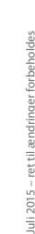

### BEWEGUNG MIT SYSTEM

E-mail: norge.se@geze.com

www.geze.no