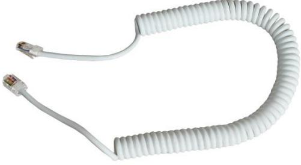
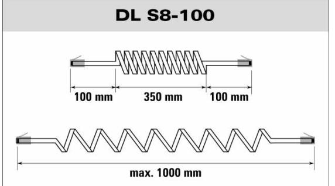
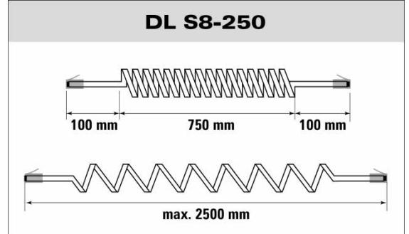

## **Detectors Spiralkabel med RJ45-kontakt**

| Datablad och instruktionsmanual | DL S8 |  |
|---------------------------------|-------|--|
|                                 |       |  |

## **BESKRIVNING**

DL S8 är en spiralkabel med 8 ledare och RJ45 kontakt i vardera änden.

Spiralkabeln är avsedd för skjutdörrar, garagedörrar, portar och andra objekt där en flexibel kabel behövs.

DL S8 är utförd i PUR vilket innebär att den är mer elastisk och hållbar än en PVC-kabel.

DL S8 passar till Alarmtechs kopplingsdosa JB RJ45 med 12 skruvanslutningar och RJ45 kontakt (E-nr 6309601) samt de flesta andra kopplingsdosor med RJ45-kontakt.

Kabeln finns i två storlekar, 100 cm och 250 cm (rekommenderad utdragen längd).

## **TECHNICAL DATA**

| Kontakt         | RJ45                                     |
|-----------------|------------------------------------------|
| Färg            | Vit                                      |
| Kvalitet        | PUR                                      |
| Ledare          | Ø 11x 36mm                               |
| Längd DL S8-100 | 55-100 cm (rekommenderad utdragen längd) |
| Längd DL S8-250 | 95-250 cm (rekommenderad utdragen längd) |
| Kabel Ø         | 4,6 (+/- 0,05) mm                        |
| Yttre spiral Ø  | 19 (+/- 2) mm                            |

## **Beställningsinformation**

| Typ       | E-nr    | Beskrivning                                | Antal per förpackning |
|-----------|---------|--------------------------------------------|-----------------------|
| DL S8-100 | 6309603 | Spiralkabel med RJ 45 kontakt, 100 cm, vit | 1 st                  |
| DL S8-250 | 6309602 | Spiralkabel med RJ 45 kontakt, 250 cm, vit | 1 st                  |