# Network Fisheye Camera

Quick Start Guide

*UD04395B*

**1**

### **Quick Start Guide**

COPYRIGHT © 2017 Hangzhou Hikvision Digital Technology Co., Ltd.

# **ALL RIGHTS RESERVED.**

Any and all information, including, among others, wordings, pictures, graphs are the properties of Hangzhou Hikvision Digital Technology Co., Ltd. or its subsidiaries (hereinafter referred to be "Hikvision"). This user manual (hereinafter referred to be "the Manual") cannot be reproduced, changed, translated, or distributed, partially or wholly, by any means, without the prior written permission of Hikvision. Unless otherwise stipulated, Hikvision does not make any warranties, guarantees or representations, express or implied, regarding to the Manual.

# **About this Manual**

This Manual is applicable to 29xx Network Camera.

The Manual includes instructions for using and managing the product. Pictures, charts, images and all other information hereinafter are for description and explanation only. The information contained in the Manual is subject to change, without notice, due to firmware updates or other reasons. Please find the latest version in the company website

(http://overseas.hikvision.com/en/).

Please use this user manual under the guidance of professionals.

# **Trademarks Acknowledgement**

and other Hikvision's trademarks and logos are the properties of Hikvision in various jurisdictions. Other trademarks and logos mentioned below are the properties of their respective owners.

**2**

### **Legal Disclaimer**

TO THE MAXIMUM EXTENT PERMITTED BY APPLICABLE LAW, THE PRODUCT DESCRIBED, WITH ITS HARDWARE, SOFTWARE AND FIRMWARE, IS PROVIDED "AS IS", WITH ALL FAULTS AND ERRORS, AND HIKVISION MAKES NO WARRANTIES, EXPRESS OR IMPLIED, INCLUDING WITHOUT LIMITATION, MERCHANTABILITY, SATISFACTORY QUALITY, FITNESS FOR A PARTICULAR PURPOSE, AND NON-INFRINGEMENT OF THIRD PARTY. IN NO EVENT WILL HIKVISION, ITS DIRECTORS, OFFICERS, EMPLOYEES, OR AGENTS BE LIABLE TO YOU FOR ANY SPECIAL, CONSEQUENTIAL, INCIDENTAL, OR INDIRECT DAMAGES, INCLUDING, AMONG OTHERS, DAMAGES FOR LOSS OF BUSINESS PROFITS, BUSINESS INTERRUPTION, OR LOSS OF DATA OR DOCUMENTATION, IN CONNECTION WITH THE USE OF THIS PRODUCT, EVEN IF HIKVISION HAS BEEN ADVISED OF THE POSSIBILITY OF SUCH DAMAGES.

REGARDING TO THE PRODUCT WITH INTERNET ACCESS, THE USE OF PRODUCT SHALL BE WHOLLY AT YOUR OWN RISKS. HIKVISION SHALL NOT TAKE ANY RESPONSIBILITES FOR ABNORMAL OPERATION, PRIVACY LEAKAGE OR OTHER DAMAGES RESULTING FROM CYBER ATTACK, HACKER ATTACK, VIRUS INSPECTION, OR OTHER INTERNET SECURITY RISKS; HOWEVER, HIKVISION WILL PROVIDE TIMELY TECHNICAL SUPPORT IF REQUIRED.

SURVEILLANCE LAWS VARY BY JURISDICTION. PLEASE CHECK ALL RELEVANT LAWS IN YOUR JURISDICTION BEFORE USING THIS PRODUCT IN ORDER TO ENSURE THAT YOUR USE CONFORMS THE APPLICABLE LAW. HIKVISION SHALL NOT BE LIABLE IN THE EVENT THAT THIS PRODUCT IS USED WITH ILLEGITIMATE PURPOSES.

**3**

IN THE EVENT OF ANY CONFLICTS BETWEEN THIS MANUAL AND THE APPLICABLE LAW, THE LATER PREVAILS.

# **Regulatory Information**

*For products that do NOT support Wi-Fi or cellular data:* 

*(Marked with a "W", "GLT", "GLE", "GLF", "GE", "GT" or "GW" in the Part C of a product model.* 

*Product Model Example: Part A-Part B-Part C. Part C is optional.)* 

# **FCC Information**

Please take attention that changes or modification not expressly approved by the party responsible for compliance could void the user's authority to operate the equipment.

**FCC compliance:** This equipment has been tested and found to comply with the limits for a Class B digital device, pursuant to part 15 of the FCC Rules. These limits are designed to provide reasonable protection against harmful interference in a residential installation. This equipment generates, uses and can radiate radio frequency energy and, if not installed and used in accordance with the instructions, may cause harmful interference to radio communications. However, there is no guarantee that interference will not occur in a particular installation. If this equipment does cause harmful interference to radio or television reception, which can be determined by turning the equipment off and on, the user is encouraged to try to correct the interference by one or more of the following measures:

—Reorient or relocate the receiving antenna.

—Increase the separation between the equipment and receiver.

**4**

—Connect the equipment into an outlet on a circuit different from that to which the receiver is connected.

—Consult the dealer or an experienced radio/TV technician for help.

# **FCC Conditions**

This device complies with part 15 of the FCC Rules. Operation is subject to the following two conditions:

1. This device may not cause harmful interference.

2. This device must accept any interference received, including interference that may cause undesired operation.

# **EU Conformity Statement**

This product and - if applicable - the supplied accessories too are marked with "CE" and comply therefore with the applicable harmonized European

standards listed under the EMC Directive 2014/30/EU, the RoHS Directive 2011/65/EU.

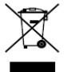

2012/19/EU (WEEE directive): Products marked with this symbol cannot be disposed of as unsorted municipal waste in the European Union. For proper recycling, return this product to your local supplier

upon the purchase of equivalent new equipment, or dispose of it at designated collection points. For more information see:

www.recyclethis.info

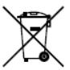

2006/66/EC (battery directive): This product contains a battery that cannot be disposed of as unsorted municipal waste in the European Union. See the product documentation for specific battery information. The battery is marked with this symbol,

**5**

which may include lettering to indicate cadmium (Cd), lead (Pb), or mercury (Hg). For proper recycling, return the battery to your supplier or to a designated collection point. For more information see: www.recyclethis.info

# **Industry Canada ICES-003 Compliance**

This device meets the CAN ICES-3 (B)/NMB-3(B) standards requirements.

*For products that support Wi-Fi or cellular data: (Marked with a "W", "GLT", "GLE", "GLF", "GE", "GT" or "GW" in the Part C of a product model.* 

*Product Model Example: Part A-Part B-Part C. Part C is optional.)* 

# **FCC Information**

Please take attention that changes or modification not expressly approved by the party responsible for compliance could void the user's authority to operate the equipment.

**FCC compliance:** This equipment has been tested and found to comply with the limits for a Class B digital device, pursuant to part 15 of the FCC Rules. These limits are designed to provide reasonable protection against harmful interference in a residential installation. This equipment generates, uses and can radiate radio frequency energy and, if not installed and used in accordance with the instructions, may cause harmful interference to radio communications. However, there is no guarantee that interference will not occur in a particular installation. If this equipment does cause harmful interference to radio or television reception, which can be determined by turning the equipment off and on, the user is

**6**

encouraged to try to correct the interference by one or more of the following measures:

—Reorient or relocate the receiving antenna.

—Increase the separation between the equipment and receiver.

—Connect the equipment into an outlet on a circuit different from that to which the receiver is connected.

—Consult the dealer or an experienced radio/TV technician for help.

This equipment should be installed and operated with a minimum distance 20cm between the radiator and your body.

# **FCC Conditions**

This device complies with part 15 of the FCC Rules. Operation is subject to the following two conditions:

1. This device may not cause harmful interference.

2. This device must accept any interference received, including interference that may cause undesired operation

# **EU Conformity Statement**

This product and - if applicable - the supplied accessories too are marked with "CE" and comply therefore with the applicable harmonized European

standards listed under the Radio Equipment Directive 2014/53/EU, the EMC Directive 2014/30/EU, the RoHS Directive 2011/65/EU.

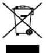

2012/19/EU (WEEE directive): Products marked with this symbol cannot be disposed of as unsorted municipal waste in the European Union. For proper recycling, return this product to your local supplier

upon the purchase of equivalent new equipment, or dispose of it at

designated collection points. For more information see: www.recyclethis.info

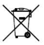

2006/66/EC (battery directive): This product contains a battery that cannot be disposed of as unsorted municipal waste in the European Union. See the product documentation for specific battery information. The battery is marked with this symbol, **7**

which may include lettering to indicate cadmium (Cd), lead (Pb), or mercury (Hg). For proper recycling, return the battery to your supplier or to a designated collection point. For more information see:www.recyclethis.info

# **Industry Canada ICES-003 Compliance**

This device meets the CAN ICES-3 (B)/NMB-3(B) standards requirements.

This device complies with Industry Canada licence-exempt RSS standard(s). Operation is subject to the following two conditions:

(1) this device may not cause interference, and

(2) this device must accept any interference, including interference that may cause undesired operation of the device.

Le présent appareil est conforme aux CNR d'Industrie Canada applicables aux appareils radioexempts de licence. L'exploitation est autorisée aux deux conditions suivantes :

(1) l'appareil ne doit pas produire de brouillage, et

(2) l'utilisateur de l'appareil doit accepter tout brouillage radioélectrique subi, même si le brouillage est susceptible d'en compromettre le fonctionnement.

**8**

Under Industry Canada regulations, this radio transmitter may only operate using an antenna of a type and maximum (or lesser) gain approved for the transmitter by Industry Canada. To reduce potential radio interference to other users, the antenna type and its gain should be so chosen that the equivalent isotropically radiated power (e.i.r.p.) is not more than that necessary for successful communication.

Conformément à la réglementation d'Industrie Canada, le présent émetteur radio peut fonctionner avec une antenne d'un type et d'un gain maximal (ou inférieur) approuvé pour l'émetteur par Industrie Canada. Dans le but de réduire les risques de brouillage radioélectrique à l'intention des autres utilisateurs, il faut choisir le type d'antenne et son gain de sorte que la puissance isotrope rayonnée équivalente (p.i.r.e.) ne dépasse pas l'intensité nécessaire à l'établissement d'une communication satisfaisante.

This equipment should be installed and operated with a minimum distance 20cm between the radiator and your body.

Cet équipement doit être installé et utilisé à une distance minimale de 20 cm entre le radiateur et votre corps.

# **Safety Instruction**

These instructions are intended to ensure that user can use the product correctly to avoid danger or property loss.

The precaution measure is divided into "Warnings" and "Cautions" **Warnings:** Serious injury or death may occur if any of the warnings are neglected.

**Cautions:** Injury or equipment damage may occur if any of the cautions are neglected.

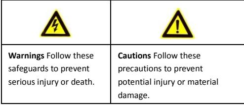

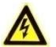

# **Warnings**

- Proper configuration of all passwords and other security settings is the responsibility of the installer and/or end-user.
- In the use of the product, you must be in strict compliance with the electrical safety regulations of the nation and region. Please refer to technical specifications for detailed information.
- Input voltage should meet both the SELV (Safety Extra Low Voltage) and the Limited Power Source with 24 VAC or 12 VDC according to the IEC60950-1 standard. Please refer to technical specifications for detailed information.
- Do not connect several devices to one power adapter as adapter overload may cause over-heating or a fire hazard.

- Please make sure that the plug is firmly connected to the power socket. When the product is mounted on wall or ceiling, the device shall be firmly fixed.
- If smoke, odor or noise rise from the device, turn off the power at once and unplug the power cable, and then please contact the service center.

- Make sure the power supply voltage is correct before using the camera.
- Do not drop the camera or subject it to physical shock.
- Do not touch sensor modules with fingers. If cleaning is necessary, use clean cloth with a bit of ethanol and wipe it gently. If the camera will not be used for an extended period, please replace the lens cap to protect the sensor from dirt.
- Do not aim the camera at the sun or extra bright places. Blooming or smearing may occur otherwise (which is not a malfunction), and affect the endurance of sensor at the same time.
- The sensor may be burned out by a laser beam, so when any laser equipment is in using, make sure that the surface of sensor will not be exposed to the laser beam.
- Do not place the camera in extremely hot, cold (the operating temperature shall be-10°C to +50°C), dusty or damp locations, and do not expose it to high electromagnetic radiation.

- To avoid heat accumulation, good ventilation is required for operating environment.
- Keep the camera away from liquid while in use.
- While in delivery, the camera shall be packed in its original packing, or packing of the same texture.
- Regular part replacement: a few parts (e.g. electrolytic capacitor) of the equipment shall be replaced regularly according to their average enduring time. The average time varies because of differences between operating environment and using history, so regular checking is recommended for all the users. Please contact with your dealer for more details.
- Improper use or replacement of the battery may result in hazard of explosion. Replace with the same or equivalent type only. Dispose of used batteries according to the instructions provided by the battery manufacturer.
- If the product does not work properly, please contact your dealer or the nearest service center. Never attempt to disassemble the camera yourself. (We shall not assume any responsibility for problems caused by unauthorized repair or maintenance.)

# **Table of Contents**

| 1 Appearance Description                           | 13 |
|----------------------------------------------------|----|
| 1.1 Overview of Fisheye Camera                     | 13 |
| 2 Installation                                     | 15 |
| 2.1 Installing the Memory Card                     | 16 |
| 2.2 Ceiling Mounting                               | 17 |
| 2.3 Wall Mounting with a Slant Mounting Base       | 20 |
| 2.4 Wall Mounting with a Bracket                   | 24 |
| 2.5 Pendant Mounting with a Bracket  27            |    |
| 3 Setting the Network Camera over the LAN          | 29 |
| 3.1 Wiring                                         | 29 |
| 3.2 Activating the Camera                          | 30 |
| 3.2.1 Activation via Web Browser                   | 30 |
| 3.2.2 Activation via SADP Software                 | 31 |
| 3.3 Modifying the IP Address                       | 33 |
| 4 Accessing via Web Browser                        | 36 |
| 5 Operating via Hik-Connect App                    | 38 |
| 5.1 Enable Hik-Connect Service on Camera           | 38 |
| 5.1.1 Enable Hik-Connect Service via SADP Software | 38 |
| 5.1.2 Enable Hik-Connect Service via Web Browser   | 39 |
| 5.2 Hik-Connect Setup                              | 41 |
| 5.3 Adding Camera to Hik-Connect                   | 41 |
| 5.4 Initializing the Memory Card                   | 43 |

0504051070109

# **1 Appearance Description**

# **1.1 Overview of Fisheye Camera**

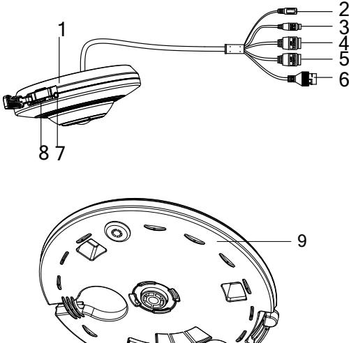

Figure 1-1 Overview of the Fisheye Camera

**14**

| Table 1-1 | Description of Overview |
|-----------|-------------------------|
|-----------|-------------------------|

| No. | Description                                                         |  |  |  |  |  |
|-----|---------------------------------------------------------------------|--|--|--|--|--|
| 1   | Camera Body                                                         |  |  |  |  |  |
| 2   | Power Interface                                                     |  |  |  |  |  |
| 3   | RS-485 Interface                                                    |  |  |  |  |  |
| 4   | Audio Interfaces: Audio In / Audio Out (Certain models support.) |  |  |  |  |  |
| 5   | Alarm Interfaces: Alarm In / Alarm Out (Certain models support.) |  |  |  |  |  |
| 6   | Ethernet Interface                                               |  |  |  |  |  |
| 7   | Reset Button                                                        |  |  |  |  |  |
| 8   | Memory Card Slot                                                    |  |  |  |  |  |
| 9   | Base Plate                                                          |  |  |  |  |  |

#### *Notes:*

- The figures shown in this manual are for reference only. The appearance and interfaces of the camera are subject to the actual model.
- Press RESET about 10s when the camera is powering on or rebooting to restore the default settings, including the user name, password, IP address, port No., etc.

# **2 Installation**

#### *Before you start:*

- Make sure the device in the package is in good condition and all the assembly parts are included.
- The standard power supply is 12V DC or PoE (802.3af), please make sure your power supply matches with your camera.
- Make sure all the related equipment is power-off during the installation.
- Check the specification of the products for the installation environment.
- Make sure that the wall is strong enough to withstand four times the weight of the camera and the bracket.

For the camera that supports IR, you are required to pay attention to the following precautions to prevent IR reflection:

- Dust or grease on the dome cover will cause IR reflection. Please do not remove the dome cover film until the installation is finished. If there is dust or grease on the dome cover, clean the dome cover with clean soft cloth and isopropyl alcohol.
- Make sure that there is no reflective surface too close to the camera lens. The IR light from the camera may reflect back into the lens causing reflection.
- The foam ring around the lens must be seated flush against the inner surface of the bubble to isolate the lens from the IR LEDS. Fasten the dome cover to camera body so that the foam ring and the dome cover are attached seamlessly.

# **2.1 Installing the Memory Card**

### *Steps:*

- 1. Move the Memory Card/Reset Cover aside, and you can see the reset button and the memory card slot.
- 2. Insert the memory card into the memory card slot.
- 3. Re-cover the reset button and memory card slot.

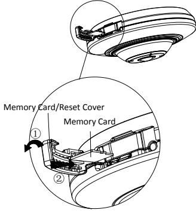

Figure 2-1 Install the Memory Card

# **2.2 Ceiling Mounting**

## *Steps:*

- 1. Drill two screw holes and the cable hole according to the supplied drill template.
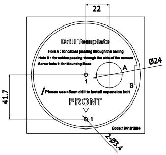

Figure 2-2 Drill Template

- 2. Align the screw holes and cable hole on the drill template and the base plate, and then fix the base plate to the ceiling with the two supplied screws.
**18**

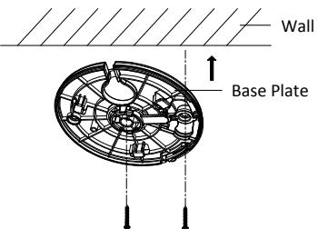

Figure 2-3 Fix the Base Plate

#### *Notes:*

- For cement wall, you need to use the expansion screw to fix the mount.
- For wooden wall, you can just use the self-tapping screw to fix the mount.
- 3. Route the cables through the cable hole or the side opening according to the actual needs, and connect the corresponding cables including power cable, network cable, audio and alarm cables, etc.
- 4. Align the triangle mark on the camera and base plate, and then rotate the camera clockwise until it is locked up by the three bayonet joints on the base plate.

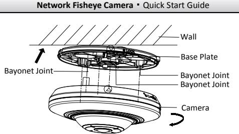

Figure 2-4 Install the Camera

- 5. To disassemble the camera: Press the **Push** button on the base plate, rotate the camera anticlockwise, and then you can remove the camera from the base plate.
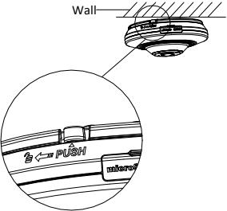

Figure 2-5 Disassemble the Camera

- 6. To adjust the view angle: Rotate the camera body clockwise or anticlockwise with the base plate, and then you can adjust the camera to the desired view angle.
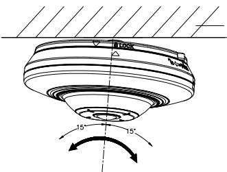

Figure 2-6 Adjust View Angle

# **2.3 Wall Mounting with a Slant Mounting Base**

# *Before you start:*

The wall mounting with a slant mounting base provides a wider surveillance view compared to the wall mounting.

You need to purchase a slant mounting base separately if this mounting method is selected.

# *Steps:*

- 1. Drill two screw holes and the cable hole according to the supplied drill template.
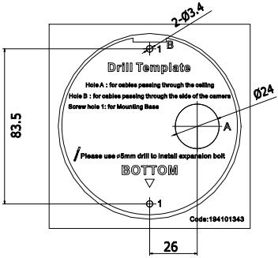

Figure 2-7 Drill Template

- 2. Fix the slant mounting base to the wall with the screws.
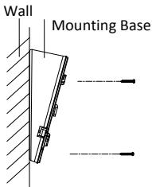

Figure 2-8 Fix the Slant Mounting Base

- 3. Align the screw holes on the slant mounting base and the base plate, and then secure the base plate on the slant mounting base with the two supplied screws.
- 4. Route the cables through the cable hole or the side opening according to the actual needs, and connect the corresponding cables including power cable, network cable, audio and alarm cables, etc.
- 5. Align the triangle mark on the camera and mounting base, and then rotate the camera clockwise until it is locked up.

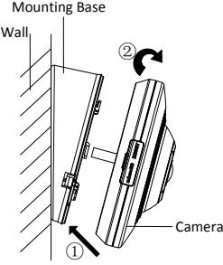

Figure 2-9 Fix the Camera

- 6. The installation is complete.
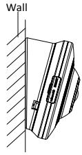

Figure 2-10 Complete the Installation

- 7. To disassemble the camera: Press the **Push** button on the base plate, rotate the camera anticlockwise, and then you can remove the camera from the base plate.
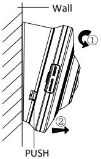

Figure 2-11 Disassemble the Camera

# **2.4 Wall Mounting with a Bracket**

## *Before you start:*

You need to purchase the bracket separately if this mounting method is selected.

# *Steps:*

- 1. Unfasten and remove the screw marked in the figure, and then disassemble the bracket.
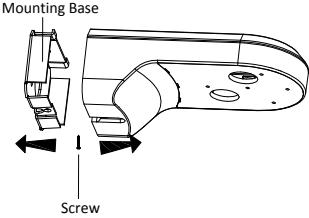

Figure 2-12 Disassemble the Bracket

- 2. Align the screw holes on the bracket and the base plate, and then secure the base plate on the bracket with the two supplied screws.
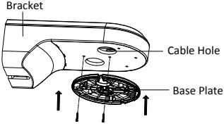

Figure 2-13 Secure the Base Plate

- 3. Route the cables through the cable hole according to the actual needs, and connect the corresponding cables including power cable, network cable, audio and alarm cables, etc.
- 4. Align the triangle mark on the camera and base plate, and then rotate the camera clockwise until it is locked up by the three bayonet joints on the base plate.

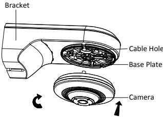

Figure 2-14 Fix the Camera

- 5. Fix the mounting base to the wall with the screws.
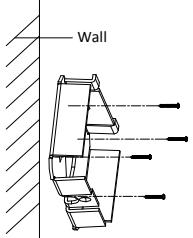

Figure 2-15 Fix the Mounting Base

- 6. Re-install the main body of the bracket to the mounting base, and fix it with the screw.
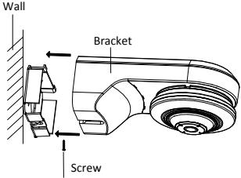

Figure 2-16 Re-install the Bracket

- 7. To disassemble the camera, refer to the *Step 5 in Section 2.1*.
- 8. To adjust the view angle, refer to the *Step 6 in Section 2.1.*

# **2.5 Pendant Mounting with a Bracket**

# *Before you start:*

You have to purchase the bracket separately if this mounting method is selected.

# *Steps:*

- 1. Fix the pendant bracket to the wall with the supplied screws.
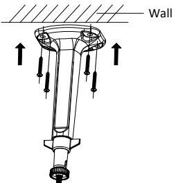

Figure 2-17 Fix the Bracket

- 2. Aim the screwed hole on the camera at the top of the pendant bracket, and then rotate the camera until it is secured tightly.
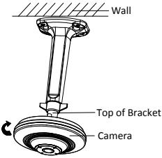

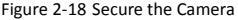

- 3. Loosen the knob on the bracket and adjust the camera body to get the desired surveillance angle. Tighten the knob on bracket to secure the camera.
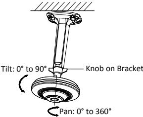

Figure 2-19 Adjust the Angle

# **3 Setting the Network Camera over the LAN**

### *Note:*

You shall acknowledge that the use of the product with Internet access might be under network security risks. For avoidance of any network attacks and information leakage, please strengthen your own protection.

If the product does not work properly, contact your dealer or the nearest service center for help.

# **3.1 Wiring**

Connect the camera to network according to the following figures.

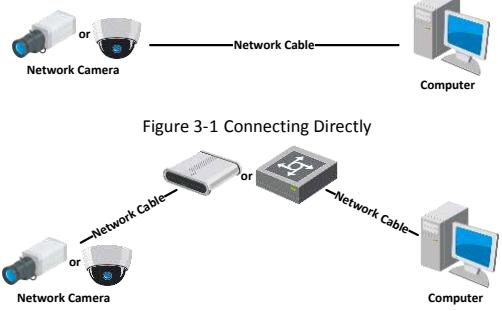

Figure 3-2 Connecting via a Switch or a Router

# **3.2 Activating the Camera**

You are required to activate the camera first by setting a strong password for it before you can use the camera.

Activation via Web Browser, Activation via SADP, and Activation via Client Software are all supported. We will take activation via SADP software and Activation via Web Browser as examples to introduce the camera activation.

# *Note:*

Refer to the User Manual of Network Camera for Activation via Client Software.

# **3.2.1 Activation via Web Browser**

## *Steps:*

- 1. Power on the camera. Connect the camera to your computer or the switch/router which your computer connects to.
- 2. Input the IP address into the address bar of the web browser, and press Enter to enter the activation interface.

# *Notes:*

- The default IP address of the camera is 192.168.1.64.
- The computer and the camera should belong to the same subnet.
- For the camera enables the DHCP by default, you need to use the SADP software to search the IP address.

| Network Fisheye Camera·Quick Start Guide |  |  |  |  |
|------------------------------------------|--|--|--|--|
|                                          |  |  |  |  |
|                                          |  |  |  |  |
|                                          |  |  |  |  |
|                                          |  |  |  |  |

Figure 3-3 Activation Interface(Web)

- 3. Create a password and input the password into the password field.
	- **STRONG PASSWORD RECOMMENDED***– We highly recommend you create a strong password of your own choosing (using a minimum of 8 characters, including upper case letters, lower case letters, numbers, and special characters) in order to increase the security of your product. And we recommend you reset your password regularly, especially in the high security system, resetting the password monthly or weekly can better protect your product.*
- 4. Confirm the password.
- 5. Click **OK** to save the password and enter the live view interface.

# **3.2.2 Activation via SADP Software**

SADP software is used for detecting the online device, activating the camera, and resetting the password.

**32**

Get the SADP software from the supplied disk or the official website, and install the SADP according to the prompts.

Follow the steps to activate the camera.

#### *Steps:*

- 1. Run the SADP software to search the online devices.
- 2. Check the device status from the device list, and select the inactive device.

|  |  | Select inactive device. |                   |  |
|--|--|-------------------------|-------------------|--|
|  |  |                         |                   |  |
|  |  |                         |                   |  |
|  |  |                         | Input and confirm |  |
|  |  |                         |                   |  |
|  |  | password.               |                   |  |
|  |  |                         |                   |  |
|  |  |                         |                   |  |

Figure 3-4 SADP Interface

#### *Note:*

The SADP software supports activating the camera in batch. Refer to the user manual of SADP software for details.

- 3. Create and input the new password in the password field, and confirm the password.
**33**

**STRONG PASSWORD RECOMMENDED***– We highly* 

*recommend you create a strong password of your own choosing (using a minimum of 8 characters, including upper case letters, lower case letters, numbers, and special characters) in order to increase the security of your product. And we recommend you reset your password regularly, especially in the high security system, resetting the password monthly or weekly can better protect your product.* 

#### *Note:*

You can enable the Hik-Connect service for the device during activation. Refer to Chapter 5.1 for detailed information.

- 4. Click **Activate** to start activation.
You can check whether the activation is completed on the popup window. If activation failed, make sure that the password meets the requirement and try again.

# **3.3 Modifying the IP Address**

## *Purpose:*

To view and configure the camera via LAN (Local Area Network), you need to connect the network camera in the same subnet with your PC.

Use the SADP software or client software to search and change the IP address of the device. We take modifying the IP Address via SADP software as an example to introduce the IP address modification.

For IP address modification via client software, refer to the user manual of client software.

#### *Steps:*

- 1. Run the SADP software.
- 2. Select an active device.
- 3. Change the device IP address to the same subnet with your computer by either modifying the IP address manually or checking the checkbox of Enable DHCP.

| I Modify Network Parameters |                                                                                                                                                                                |
|-----------------------------|--------------------------------------------------------------------------------------------------------------------------------------------------------------------------------|
| Enable DHCP                 |                                                                                                                                                                                |
| Enable Hik-Connect          |                                                                                                                                                                                |
|                             | Device Serial No .:   XX-XXXXXXXXXXXXXXXXXXXXXXXXXXXXXXXXXXXXXXXXXXXXXXXXXXXXXXXXXXXXXXXXXXXXXXXXXXXXXXXXXXXXXXXXXXXXXXXXXXXXXXXXXXXXXXXXXXXXXXXXXXXXXXXXXXXXXXXXXXXXXXXXXXXXX |
| 19 Address:                 | 192.168.1.64                                                                                                                                                                   |
| Papa Ez                     | 0000                                                                                                                                                                           |
| Subnet Mosk:                | 255.255.255.0                                                                                                                                                                  |
| Gateway:                    | 192.168.1.1                                                                                                                                                                    |
| IPv6 Address:               | =                                                                                                                                                                              |
| IPv6 Gateway:               | t =                                                                                                                                                                            |
| IPv6 Prefix Length:         | 0                                                                                                                                                                              |
| HTTP Port                   | 80                                                                                                                                                                             |
|                             | Security Verification                                                                                                                                                          |
| Admin Password              |                                                                                                                                                                                |
|                             | Modily                                                                                                                                                                         |
|                             | Forgot Password                                                                                                                                                                |

Figure 3-5 Modify the IP Address

### *Note:*

You can enable the Hik-Connect service for the device during activation. Refer to Chapter 5.1 for detailed information.

- 4. Input the admin password and click **Modify** to activate your IP address modification.
The batch IP address modification is supported by the SADP. Refer to the user manual of SADP for details.

# **4 Accessing via Web Browser**

# *System Requirement:*

Operating System: Microsoft Windows XP SP1 and above version

CPU: 2.0 GHz or higher

RAM: 1G or higher

Display: 1024×768 resolution or higher

Web Browser: Internet Explorer 8.0 and above version, Apple Safari 5.0.2 and above version, Mozilla Firefox 5.0 and above version and Google Chrome 18 and above version

# *Steps:*

- 1. Open the web browser.
- 2. In the browser address bar, input the IP address of the network camera, and press the **Enter** key to enter the login interface.

# *Note:*

- The default IP address is 192.168.1.64. You are recommended to change the IP address to the same subnet with your computer.
- 3. Input the user name and password.

The admin user should configure the device accounts and user/operator permissions properly. Delete the unnecessary accounts and user/operator permissions.

### *Note:*

The device IP address gets locked if the admin user performs 7 failed password attempts (5 attempts for the user/operator).

**37**

- 4. Click **Login**.
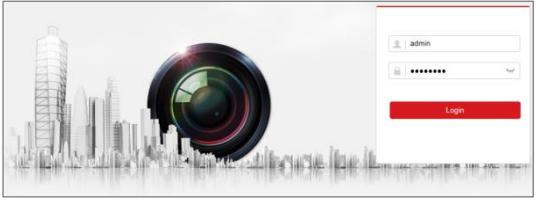

Figure 4-1 Login Interface

- 5. Install the plug-in before viewing the live video and managing the camera. Follow the installation prompts to install the plug-in.
#### *Note:*

You may have to close the web browser to finish the installation of the plug-in.

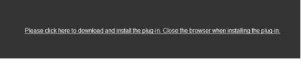

Figure 4-2 Download Plug-in

- 6. Reopen the web browser after the installation of the plug-in and repeat steps 2 to 4 to login.
#### *Note:*

For detailed instructions of further configuration, please refer to the user manual of network camera.

# **5 Operating via Hik-Connect App**

# *Purpose:*

Hik-Connect is an application for mobile devices. With the App, you can view live image of the camera, receive alarm notification and so on.

# *Note:*

Hik-Connect service is not supported by certain camera models.

# **5.1 Enable Hik-Connect Service on Camera**

# *Purpose:*

Hik-Connect service should be enabled on your camera before using the service.

You can enable the service through SADP software or web browser.

# **5.1.1 Enable Hik-Connect Service via SADP Software**

# *Steps:*

- 1. Check the checkbox of **Enable Hik-Connect** on:
	- 1). "Activate the Device" page during camera activation, refer to Chapter 3.2.2.
	- 2). Or "Modify Network Parameters" page during modifying IP address, refer to Chapter 3.3.
- 2. Create a verification code or change the verification code.

**39**

| Tips                                                                                                                                         |  |  |  |
|----------------------------------------------------------------------------------------------------------------------------------------------|--|--|--|
| To enable Hik-Connect service, you need to create a verification code or change the verification code.                                    |  |  |  |
| Verification Code                                                                                                                         |  |  |  |
| 6 to 12 letters or numbers, case sensitive. You are recommended to use a combination of no less than 8 letters or numbers.          |  |  |  |
| Confirm Verification Code                                                                                                                 |  |  |  |
| The Hik-Connect service will require internet access. Please read the "Terms of Service and "Privacy Policy" before enabling the service. |  |  |  |
| Cancel                                                                                                                                       |  |  |  |

Figure 5-1 Verification Code Setting (SADP)

#### *Note:*

The verification code is required when you add the camera to Hik-Connect app.

- 3. Click and read "Terms of Service" and "Privacy Policy".
- 4. Confirm the settings.

# **5.1.2 Enable Hik-Connect Service via Web Browser**

#### *Before you start:*

You need to activate the camera before enabling the service. Refer to Chapter 3.2.

**40**

#### *Steps:*

- 1. Access the camera via web browser. Refer to Chapter 4.
- 2. Enter platform access configuration interface: Configuration >

Network > Advanced Settings > Platform Access

| Enable                                                                                            |                     |        |  |
|---------------------------------------------------------------------------------------------------|---------------------|--------|--|
| Platform Access Mode                                                                              | Hik-Connect         | >      |  |
| Server IP                                                                                         | dev.hik-connect.com | Custom |  |
| Register Status                                                                                   | Offline             | >      |  |
| Verification Code                                                                                 |                     | ಗ್ಗ    |  |
| 6 to 12 letters (a to z, A to Z) or numbers (0 to 9), case sensitive. You are recommended to use, |                     |        |  |
|                                                                                                   |                     |        |  |
| - Save                                                                                            |                     |        |  |

Figure 5-2 Platform Access Configuration (Web)

- 3. Select Platform Access Mode as Hik-Connect.
- 4. Check the checkbox of Enable.
- 5. Click and read "Terms of Service" and "Privacy Policy" in pop-up window.
- 6. Create a verification code or change the verification code for the camera.

#### *Note:*

The verification code is required when you add the camera to Hik-Connect app.

- 7. Save the settings.
# **5.2 Hik-Connect Setup**

# *Steps:*

- 1. Download and install the Hik-Connect app by searching "Hik-Connect" in App Store or Google PlayTM .
- 2. Launch the app and register for a Hik-Connect user account.
- 3. Log in Hik-Connect app after registration.

# **5.3 Adding Camera to Hik-Connect**

# *Before you start:*

You need to enable the Hik-Connect service on camera before adding it to your Hik-Connect account. Refer to Chapter 5.1.

# *Steps:*

- 1. Use a network cable to connect the camera with a router if the camera does not support Wi-Fi.

Figure 5-3 Connect a Router

# *Note:*

After the camera connects to the network, please wait one minute before any operation on the camera using Hik-Connect app.

- 2. In the Hik-Connect app, tap "+" on the upper-right corner and then scan the QR code of the camera to add the camera.
You can find the QR code on the camera or on the cover of the

Quick Start Guide of the camera in the package.

Figure 5-4 Scan QR Code

# *Note:*

If the QR code is missing or too blur to be recognized, you can also add the camera by tapping the icon and inputting the camera's serial number.

- 3. Input the verification code of your camera.
# *Note:*

- The required verification code is the code you create or change when you enabling Hik-Connect service on camera.
- If you forget the verification code, you can check the current verification code on **Platform Access** configuration page via web browser.
- 4. Follow the prompts to set the network connection and add the camera to your Hik-Connect account.

# *Note:*

For detailed information, refer to the user manual of the Hik-Connect app.

# **5.4 Initializing the Memory Card**

.

Check the memory card status by tapping on the Storage Status in the Device Settings interface.

If the memory card status displays as Uninitialized, tap to initialize it. The status will then change to Normal. You can then start recording any event triggered video in the camera such as motion detection.

