# **Network Fisheye Camera**

**User Manual** 

UD04808B

### **User Manual**

COPYRIGHT ©2017 Hangzhou Hikvision Digital Technology Co., Ltd.

#### **ALL RIGHTS RESERVED.**

Any and all information, including, among others, wordings, pictures, graphs are the properties of Hangzhou Hikvision Digital Technology Co., Ltd. or its subsidiaries (hereinafter referred to be "Hikvision"). This user manual (hereinafter referred to be "the Manual") cannot be reproduced, changed, translated, or distributed, partially or wholly, by any means, without the prior written permission of Hikvision. Unless otherwise stipulated, Hikvision does not make any warranties, guarantees or representations, express or implied, regarding to the Manual.

### **About this Manual**

This Manual is applicable to Network Fisheye Camera.

The Manual includes instructions for using and managing the product. Pictures, charts, images and all other information hereinafter are for description and explanation only. The information contained in the Manual is subject to change, without notice, due to firmware updates or other reasons. Please find the latest version in the company website (http://overseas.hikvision.com/en/).

Please use this user manual under the guidance of professionals.

### **Trademarks Acknowledgement**

and other Hikvision's trademarks and logos are the properties of Hikvision in various jurisdictions. Other trademarks and logos mentioned below are the properties of their respective owners.

### **Legal Disclaimer**

TO THE MAXIMUM EXTENT PERMITTED BY APPLICABLE LAW, THE PRODUCT DESCRIBED, WITH ITS HARDWARE, SOFTWARE AND FIRMWARE, IS PROVIDED "AS IS", WITH ALL FAULTS AND ERRORS, AND HIKVISION MAKES NO WARRANTIES, EXPRESS OR IMPLIED, INCLUDING WITHOUT LIMITATION, MERCHANTABILITY, SATISFACTORY QUALITY, FITNESS FOR A PARTICULAR PURPOSE, AND NON-INFRINGEMENT OF THIRD PARTY. IN NO EVENT WILL HIKVISION, ITS DIRECTORS, OFFICERS, EMPLOYEES, OR AGENTS BE LIABLE TO YOU FOR ANY SPECIAL, CONSEQUENTIAL, INCIDENTAL, OR INDIRECT DAMAGES, INCLUDING, AMONG OTHERS, DAMAGES FOR LOSS OF BUSINESS PROFITS, BUSINESS INTERRUPTION, OR LOSS OF DATA OR DOCUMENTATION, IN CONNECTION WITH THE USE OF THIS PRODUCT, EVEN IF HIKVISION HAS BEEN ADVISED OF THE POSSIBILITY OF SUCH DAMAGES.

REGARDING TO THE PRODUCT WITH INTERNET ACCESS, THE USE OF PRODUCT SHALL BE WHOLLY AT YOUR OWN RISKS. HIKVISION SHALL NOT TAKE ANY RESPONSIBILITES FOR ABNORMAL OPERATION, PRIVACY LEAKAGE OR OTHER DAMAGES RESULTING FROM CYBER ATTACK, HACKER ATTACK, VIRUS INSPECTION, OR OTHER INTERNET SECURITY RISKS; HOWEVER, HIKVISION WILL PROVIDE TIMELY TECHNICAL SUPPORT IF REQUIRED.

SURVEILLANCE LAWS VARY BY JURISDICTION. PLEASE CHECK ALL RELEVANT LAWS IN YOUR JURISDICTION BEFORE USING THIS PRODUCT IN ORDER TO ENSURE THAT YOUR USE CONFORMS THE APPLICABLE LAW. HIKVISION SHALL NOT BE LIABLE IN THE EVENT THAT THIS PRODUCT IS USED WITH ILLEGITIMATE PURPOSES.

IN THE EVENT OF ANY CONFLICTS BETWEEN THIS MANUAL AND THE APPLICABLE LAW, THE LATER PREVAILS.

# **Regulatory Information**

*For products that do NOT support Wi-Fi or cellular data: (Marked with a "W", "GLT", "GLE", "GLF", "GE", "GT" or "GW" in the Part C of a product model.* 

*Product Model Example: Part A-Part B-Part C. Part C is optional.)* 

# **FCC Information**

Please take attention that changes or modification not expressly approved by the party

responsible for compliance could void the user's authority to operate the equipment.

**FCC compliance:** This equipment has been tested and found to comply with the limits for a Class B digital device, pursuant to part 15 of the FCC Rules. These limits are designed to provide reasonable protection against harmful interference in a residential installation. This equipment generates, uses and can radiate radio frequency energy and, if not installed and used in accordance with the instructions, may cause harmful interference to radio communications. However, there is no guarantee that interference will not occur in a particular installation. If this equipment does cause harmful interference to radio or television reception, which can be determined by turning the equipment off and on, the user is encouraged to try to correct the interference by one or more of the following measures:

—Reorient or relocate the receiving antenna.

—Increase the separation between the equipment and receiver.

—Connect the equipment into an outlet on a circuit different from that to which the receiver is connected.

—Consult the dealer or an experienced radio/TV technician for help.

#### **FCC Conditions**

This device complies with part 15 of the FCC Rules. Operation is subject to the following two conditions:

1. This device may not cause harmful interference.

2. This device must accept any interference received, including interference that may cause undesired operation.

### **EU Conformity Statement**

This product and - if applicable - the supplied accessories too are marked with "CE" and comply therefore with the applicable harmonized European standards listed under the EMC Directive

2014/30/EU, the RoHS Directive 2011/65/EU.


2012/19/EU (WEEE directive): Products marked with this symbol cannot be disposed of as unsorted municipal waste in the European Union. For proper recycling, return this product to your local supplier upon the purchase of equivalent new equipment, or dispose

of it at designated collection points. For more information see: www.recyclethis.info.


2006/66/EC (battery directive): This product contains a battery that cannot be disposed of as unsorted municipal waste in the European Union. See the product documentation for specific battery information. The battery is marked with this symbol, which may

include lettering to indicate cadmium (Cd), lead (Pb), or mercury (Hg). For proper recycling, return the battery to your supplier or to a designated collection point. For more information see: www.recyclethis.info.

#### **Industry Canada ICES-003 Compliance**

This device meets the CAN ICES-3 (B)/NMB-3(B) standards requirements.

*For products that support Wi-Fi or cellular data:* 

*(Marked with a "W", "GLT", "GLE", "GLF", "GE", "GT" or "GW" in the Part C of a product model.* 

*Product Model Example: Part A-Part B-Part C. Part C is optional.)* 

### **FCC Information**

Please take attention that changes or modification not expressly approved by the party responsible for compliance could void the user's authority to operate the equipment.

**FCC compliance:** This equipment has been tested and found to comply with the limits for a Class B digital device, pursuant to part 15 of the FCC Rules. These limits are designed to provide reasonable protection against harmful interference in a residential installation. This equipment generates, uses and can radiate radio frequency energy and, if not installed and used in accordance with the instructions, may cause harmful interference to radio communications. However, there is no guarantee that interference will not occur in a particular installation. If this equipment does cause harmful interference to radio or television reception, which can be determined by turning the equipment off and on, the user is encouraged to try to correct the interference by one or more of the following measures:

—Reorient or relocate the receiving antenna.

—Increase the separation between the equipment and receiver.

—Connect the equipment into an outlet on a circuit different from that to which the receiver is connected.

—Consult the dealer or an experienced radio/TV technician for help.

This equipment should be installed and operated with a minimum distance 20cm between the radiator and your body.

### **FCC Conditions**

This device complies with part 15 of the FCC Rules. Operation is subject to the following two conditions:

1. This device may not cause harmful interference.

2. This device must accept any interference received, including interference that may cause undesired operation

#### **EU Conformity Statement**


This product and - if applicable - the supplied accessories too are marked with "CE" and comply therefore with the applicable harmonized European standards listed under the Radio Equipment

Directive 2014/53/EU, EMC Directive 2014/30/EU, the RoHS Directive 2011/65/EU.


2012/19/EU (WEEE directive): Products marked with this symbol cannot be disposed of as unsorted municipal waste in the European Union. For proper recycling, return this product to your local supplier upon the purchase of equivalent new equipment, or dispose

of it at designated collection points. For more information see: www.recyclethis.info.


2006/66/EC (battery directive): This product contains a battery that cannot be disposed of as unsorted municipal waste in the European Union. See the product documentation for specific battery information. The battery is marked with this symbol, which may include lettering to indicate cadmium (Cd), lead (Pb), or mercury (Hg). For proper recycling, return the battery to your supplier or to a designated collection point. For more information see: www.recyclethis.info.

#### **Industry Canada ICES-003 Compliance**

This device meets the CAN ICES-3 (B)/NMB-3(B) standards requirements.

This device complies with Industry Canada licence-exempt RSS standard(s). Operation is subject to the following two conditions:

(1) this device may not cause interference, and

(2) this device must accept any interference, including interference that may cause undesired operation of the device.

Le présent appareil est conforme aux CNR d'Industrie Canada applicables aux appareils radioexempts de licence. L'exploitation est autorisée aux deux conditions suivantes :

(1) l'appareil ne doit pas produire de brouillage, et

(2) l'utilisateur de l'appareil doit accepter tout brouillage radioélectrique subi, même si le brouillage est susceptible d'en compromettre le fonctionnement.

Under Industry Canada regulations, this radio transmitter may only operate using an antenna of a type and maximum (or lesser) gain approved for the transmitter by Industry Canada. To reduce potential radio interference to other users, the antenna type and its gain should be so chosen that the equivalent isotropically radiated power (e.i.r.p.) is not more than that necessary for successful communication.

Conformément à la réglementation d'Industrie Canada, le présent émetteur radio peut fonctionner avec une antenne d'un type et d'un gain maximal (ou inférieur) approuvé pour l'émetteur par Industrie Canada. Dans le but de réduire les risques de brouillage radioélectrique à l'intention des autres utilisateurs, il faut choisir le type d'antenne et son gain de sorte que la puissance isotrope rayonnée équivalente (p.i.r.e.) ne dépasse pas l'intensité nécessaire à l'établissement d'une communication satisfaisante.

This equipment should be installed and operated with a minimum distance 20cm

between the radiator and your body.

Cet équipement doit être installé et utilisé à une distance minimale de 20 cm entre le radiateur et votre corps.

### **Safety Instruction**

These instructions are intended to ensure that the user can use the product correctly to

avoid danger or property loss.

The precaution measure is divided into 'Warnings' and 'Cautions':

- **Warnings**: Serious injury or death may be caused if any of these warnings are neglected.
- **Cautions**: Injury or equipment damage may be caused if any of these cautions are neglected.

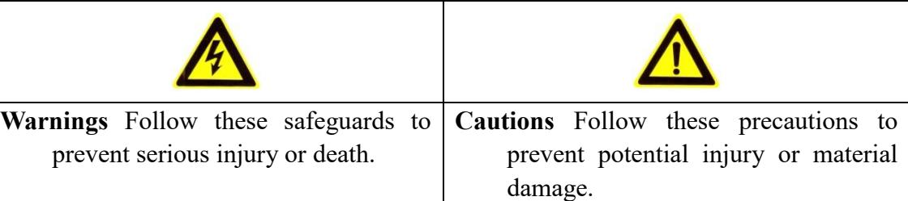


- Please adopt the power adapter which can meet the safety extra low voltage (SELV) standard. And source with 12 VDC or 24 VAC (depending on models) according to the IEC60950-1 and Limited Power Source standard.
- To reduce the risk of fire or electrical shock, do not expose this product to rain or moisture.
- This installation should be made by a qualified service person and should conform to all the local codes.
- Please install blackouts equipment into the power supply circuit for convenient supply interruption.
- Please make sure that the ceiling can support more than 50(N) Newton gravities if the camera is fixed to the ceiling.

- If the product does not work properly, please contact your dealer or the nearest service center. Never attempt to disassemble the camera yourself. (We shall not assume any responsibility for problems caused by unauthorized repair or maintenance.)


- Make sure the power supply voltage is correct before using the camera.
- Do not drop the camera or subject it to physical shock.
- Do not touch sensor modules with fingers. If cleaning is necessary, use a clean cloth with a bit of ethanol and wipe it gently. If the camera will not be used for an extended period of time, put on the lens cap to protect the sensor from dirt.
- Do not aim the camera lens at the strong light such as sun or incandescent lamp. The strong light can cause fatal damage to the camera.
- The sensor may be burned out by a laser beam, so when any laser equipment is being used, make sure that the surface of the sensor not be exposed to the laser beam.
- Do not place the camera in extremely hot, cold temperatures (the operating temperature should be between -10°C ~ 40°C), dusty or damp environment, and do not expose it to high electromagnetic radiation.
- To avoid heat accumulation, good ventilation is required for a proper operating environment.
- Keep the camera away from water and any liquid.
- While shipping, the camera should be packed in its original packing.
- Improper use or replacement of the battery may result in hazard of explosion. Please use the manufacturer recommended battery type.

#### *Notes:*

For the camera supports IR, you are required to pay attention to the following precautions to prevent IR reflection:

- Dust or grease on the dome cover will cause IR reflection. Please do not remove
the dome cover film until the installation is finished. If there is dust or grease on the dome cover, clean the dome cover with clean soft cloth and isopropyl alcohol.

- Make certain the installation location does not have reflective surfaces of objects too close to the camera. The IR light from the camera may reflect back into the lens causing reflection.
- The foam ring around the lens must be seated flush against the inner surface of the bubble to isolate the lens from the IR LEDS. Fasten the dome cover to camera body so that the foam ring and the dome cover are attached seamlessly.

0504051070218

| Chapter 1 | System Requirement12                          |  |
|-----------|-----------------------------------------------|--|
| Chapter 2 | Network Connection13                          |  |
| 2.1       | Setting the Network Camera over the LAN  13   |  |
| 2.1.1     | Wiring over the LAN13                         |  |
| 2.1.2     | Creating a Password 14                        |  |
| 2.2       | Setting the Network Camera over the WAN  21   |  |
| 2.2.1     | Static IP Connection 21                       |  |
| 2.2.2     | Dynamic IP Connection 22                      |  |
| Chapter 3 | Access to the Network Camera24                |  |
| 3.1       | Accessing by Web Browsers  24                 |  |
| 3.2       | Accessing by Client Software  25              |  |
| Chapter 4 | Wi-Fi Settings26                              |  |
| Chapter 5 | Live View<br>31                               |  |
| 5.1       | Live View Page  31                            |  |
| 5.2       | Starting Live View  34                        |  |
| 5.3       | Recording and Capturing Pictures Manually  35 |  |
| 5.4       | Operating PTZ Control  35                     |  |
| 5.4.1     | PTZ Control Panel 36                          |  |
| 5.4.2     | Setting/Calling/Deleting a Preset 38          |  |
| 5.4.3     | Setting/Calling/Deleting a Patrol 40          |  |
| Chapter 6 | Network Camera Configuration<br>42            |  |
| 6.1       | Configuring Local Parameters  42              |  |
| 6.2       | Configuring System Settings  44               |  |
| 6.2.1     | Viewing Basic Information 44                  |  |
| 6.2.2     | Time and DST Settings 45                      |  |
| 6.2.3     | RS-232 Settings 47                            |  |
| 6.2.4     | RS-485 Settings 48                            |  |
| 6.2.5     | Upgrade and Maintenance 49                    |  |
| 6.2.6     | Log Searching 50                              |  |
| 6.2.7     | System Service Settings 51                    |  |
| 6.2.8     | Authentication 52                             |  |
| 6.2.9     | IP Address Filter 52                          |  |
| 6.2.10    | Security Service54                            |  |
| 6.2.11    | User Management 54                            |  |
| 6.3       | Configuring Network Settings  58              |  |
| 6.3.1     | Configuring TCP/IP Settings 58                |  |

| 6.3.2     | Configuring Port Settings 59                              |  |
|-----------|-----------------------------------------------------------|--|
| 6.3.3     | Configuring PPPoE Settings 60                             |  |
| 6.3.4     | Configuring DDNS Settings 61                              |  |
| 6.3.5     | Configuring NAT (Network Address Translation) Settings 63 |  |
| 6.3.6     | Configuring SNMP Settings 64                              |  |
| 6.3.7     | Configuring FTP Settings  67                              |  |
| 6.3.8     | Email Settings 69                                         |  |
| 6.3.9     | Configuring HTTPS Settings 71                             |  |
| 6.3.10    | Configuring QoS Settings 74                               |  |
| 6.3.11    | Configuring 802.1X Settings 74                            |  |
| 6.3.12    | Configuring Platform Access 76                            |  |
| 6.4       | Configuring Video and Audio Settings  77                  |  |
| 6.4.1     | Configuring Video Settings77                              |  |
| 6.4.2     | Configuring Audio Settings 81                             |  |
| 6.4.3     | Configuring ROI Encoding 82                               |  |
| 6.4.4     | Display Info.on Stream 84                                 |  |
| 6.5       | Configuring Image Parameters  84                          |  |
| 6.5.1     | Configuring Display Settings 84                           |  |
| 6.5.2     | Configuring OSD Settings 89                               |  |
| 6.5.3     | Configuring Privacy Mask90                                |  |
| 6.6       | Configuring Event Settings  91                            |  |
| 6.6.1     | Configuring Motion Detection 92                           |  |
| 6.6.2     | Configuring Video Tampering Alarm 98                      |  |
| 6.6.3     | Configuring Alarm Input  99                               |  |
| 6.6.4     | Configuring Alarm Output 100                              |  |
| 6.6.5     | Handling Exception 102                                    |  |
| 6.6.6     | Configuring Line Crossing Detection 102                   |  |
| 6.6.7     | Configuring Intrusion Detection 104                       |  |
| Chapter 7 | Storage Settings<br>107                                   |  |
| 7.1       | Configuring Recording Schedule  107                       |  |
| 7.2       | Configuring Capture Setting  111                          |  |
| 7.3       | Configuring Net HDD  112                                  |  |
| 7.4       | Memory Card Detection  114                                |  |
| Chapter 8 | Playback<br>117                                           |  |
| Chapter 9 | Picture<br>120                                            |  |
| Appendix  | 121                                                       |  |
|           | Appendix 1 SADP Software Introduction<br>121              |  |
|           | Appendix 2 Port Mapping<br>124                            |  |

# **Chapter 1 System Requirement**

**Operating System**: Microsoft Windows XP SP1 and above version

**CPU**: 2.0 GHz or higher

**RAM**: 1G or higher

**Display**: 1024×768 resolution or higher

**Web Browser**: Internet Explorer 8.0 and above version, Apple Safari 5.0.2 and above version, Mozilla Firefox 5.0 and above version and Google Chrome 18 and above version

# **Chapter 2 Network Connection**

#### *Note:*

- You shall acknowledge that the use of the product with Internet access might be under network security risks. For avoidance of any network attacks and information leakage, please strengthen your own protection. If the product does not work properly, please contact with your dealer or the nearest service center.
- To ensure the network security of the network camera, we recommend you to have the network camera assessed and maintained termly. You can contact us if you need such service.

#### *Before you start:*

- If you want to set the network camera via a LAN (Local Area Network), please refer to *Section 2.1 Setting the Network Camera over the LAN.*
- If you want to set the network camera via a WAN (Wide Area Network), please refer to *Section 2.2 Setting the Network Camera over the WAN.*

## **2.1 Setting the Network Camera over the LAN**

#### *Purpose:*

To view and configure the camera via a LAN, you need to connect the network camera in the same subnet with your computer, and install the SADP or iVMS-4200 software to search and change the IP of the network camera.

*Note:* For the detailed introduction of SADP, please refer to Appendix 1.

### **2.1.1 Wiring over the LAN**

The following figures show the two ways of cable connection of a network camera and a computer:

#### *Purpose:*

- To test the network camera, you can directly connect the network camera to the computer with a network cable as shown in Figure 2-1.
- Refer to the Figure 2-2 to set network camera over the LAN via a switch or a router.
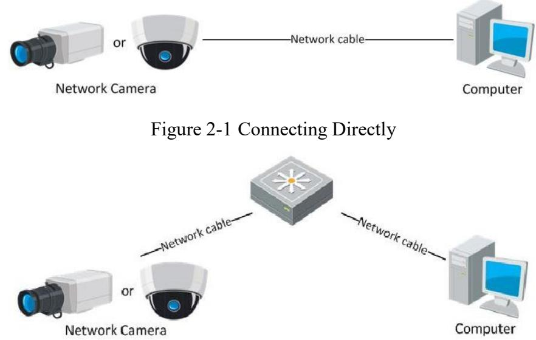

Figure 2-2 Connecting via a Switch or a Router

### **2.1.2 Creating a Password**

You are required to activate the camera first by setting a strong password for it before you can use the camera.

Creating a Password via Web Browser, Creating a Password via SADP, and Creating a Password via Client Software are all supported.

### **Creating a Password via Web Browser**

#### *Steps:*

1. Power on the camera, and connect the camera to the network.

2. Input the IP address into the address bar of the web browser, and click Enter to enter the activation interface.

#### *Notes:*

- The default IP address of the camera is 192.168.1.64.
 For the camera enables the DHCP by default, the IP address is allocated automatically. And you need to activate the camera via SADP software. Please refer to the following chapter for Activation via SADP.

| Activation            |                                                                                                                                                                                        |    |                  |
|-----------------------|----------------------------------------------------------------------------------------------------------------------------------------------------------------------------------------|----|------------------|
| User Name<br>Password | admin                                                                                                                                                                                  | 8  |                  |
|                       | Valid password range [8-16]. You<br>can use a combination of numbers,<br>lowercase, uppercase and special<br>character for your password with at<br>least two kinds of them contained. |    | asswar<br>Logiti |
| Confirm               |                                                                                                                                                                                        | OK |                  |

Figure 2-3 Creating a Password via Web Browser

3. Create a password and input the password into the password field.

**STRONG PASSWORD RECOMMENDED**– We highly recommend you create a strong password of your own choosing (using a minimum of 8 characters, including at least three of the following categories: upper case letters, lower case letters, numbers, and special characters) in order to increase the security of your product. And we recommend you reset your password regularly, especially in the high security system, resetting the password monthly or weekly can better protect your product.

4. Confirm the password.

5. Click OK to save the password and enter the live view interface.

### **Creating a Password via SADP Software**

SADP software is used for detecting the online device, activating the camera, and resetting the password.

Get the SADP software from the supplied disk or the official website, and install the SADP according to the prompts. Follow the steps to activate the camera.

### *Steps:*

1. Run the SADP software to search the online devices.

- 2. Check the device status from the device list, and select the inactive device.

|  |  | Select inactive device. |           |  |                   |  |
|--|--|-------------------------|-----------|--|-------------------|--|
|  |  |                         |           |  | Input and confirm |  |
|  |  |                         |           |  |                   |  |
|  |  |                         | password. |  |                   |  |
|  |  |                         |           |  |                   |  |

Figure 2-4 SADP Interface

- 3. Create a password and input the password in the password field, and confirm the
password.

**STRONG PASSWORD RECOMMENDED***–* We highly recommend you create a strong password of your own choosing (using a minimum of 8 characters, including at least three of the following categories: upper case letters, lower case letters, numbers, and special characters) in order to increase the security of your product. And we recommend you reset your password regularly, especially in the high security system, resetting the password monthly or weekly can better protect your product.

#### *Note:*

You can enable the Hik-Connect service for the device during activation.

- 4. Click **Activate** to start activation.
You can check whether the activation is completed on the popup window. If activation failed, please make sure that the password meets the requirement and try again.

- 5. Change the device IP address to the same subnet with your computer by either modifying the IP address manually or checking the checkbox of Enable DHCP.

| Enable DHCP         |                                                                              |
|---------------------|------------------------------------------------------------------------------|
| Enable Hik-Connect  |                                                                              |
| Device Serial No .: | XX-XXXXXXXXXXX-XXXXXXXXXXXXXXXXXXXXXXXXXXXXXXXXXXXXXXXXXXXXXXXXXXXXXXXXXXXXX |
| IP Address:         | 192.168.1.64                                                                 |
| Port:               | 8000                                                                         |
| Subnet Mask:        | 255.255.255.0                                                                |
| Gateway:            | 192.168.1.1                                                                  |
| IPv6 Address:       | ::                                                                           |
| IPv6 Gateway:       | ::                                                                           |
| IPv6 Prefix Length: | 0                                                                            |
| HTTP Port:          | 80                                                                           |
|                     | Security Verification                                                        |
| Admin Password:     |                                                                              |
|                     |                                                                              |
|                     | Modify                                                                       |

Figure 2-5 Modify the IP Address

6. Input the admin password and click Modify to activate your IP address modification.

The batch IP address modification is supported by the SADP. Refer to the user manual of SADP for details.

### **Creating a Password via Client Software**

The client software is versatile video management software for multiple kinds of devices.

Get the client software from the supplied disk or the official website, and install the software according to the prompts. Follow the steps to activate the camera*.* 

### *Steps:*

- 1. Run the client software and the control panel of the software pops up, as shown in the figure below.
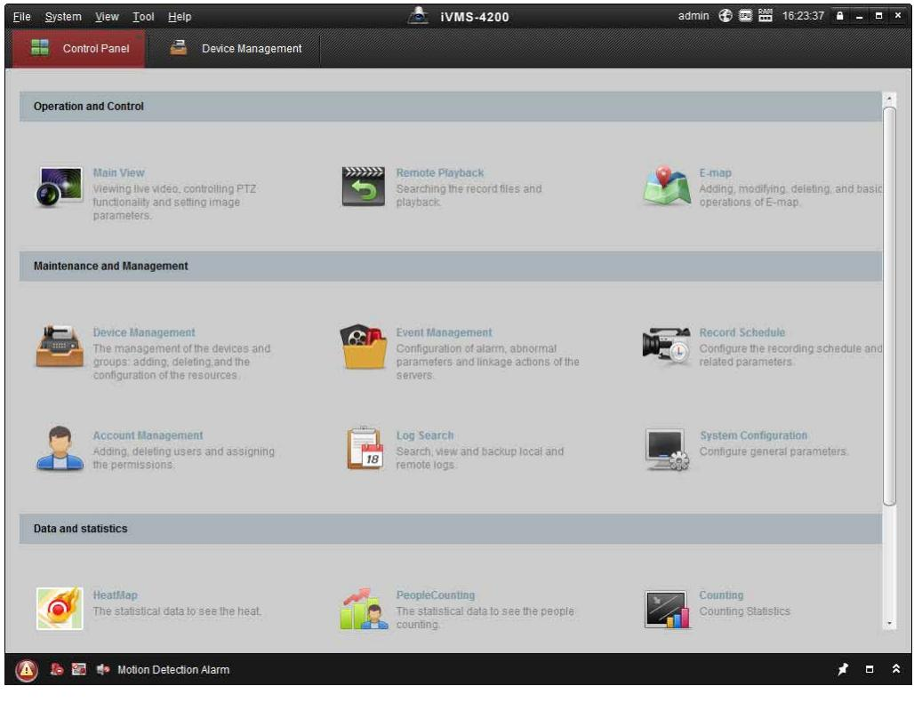

Figure 2-6 Control Panel

- 2. Click the **Device Management** icon to enter the Device Management interface, as shown in the figure below.

|                                                   |                           |                     | iVMS-4200                        | admin                   |                     |                |
|---------------------------------------------------|---------------------------|---------------------|----------------------------------|-------------------------|---------------------|----------------|
| 1)<br>Control Panel                               | Device Management         |                     |                                  |                         |                     |                |
| Server<br>Group                                   |                           |                     |                                  |                         |                     |                |
| Organization                                      | Device for Management (0) |                     |                                  |                         |                     |                |
| Encoding Device                                   | Add Device                | Modify<br>Delete    | VCA Alloca<br>Remote C           | Activate<br>Refresh All | Filter              |                |
| Add New Device Type                               | Nickname                  | - IP                | Device Serial No.                | Security                | Net Status          | HDD Statu      |
|                                                   |                           |                     |                                  |                         |                     |                |
|                                                   |                           |                     |                                  |                         |                     |                |
|                                                   |                           |                     |                                  |                         |                     |                |
|                                                   | Online Device (3)         |                     | Refresh Every 15s                |                         |                     |                |
|                                                   | Add to Client             | Add All             | Modify Netinfo<br>Reset Password | Activate                | Filter              |                |
|                                                   | lb                        | Device Type         | Firmware Version<br>  Security   | Server Port             | Start time          |                |
|                                                   | 192.168.1.64              | XX-XXXXXXXXXXXXXXXX | Vx.x.xbuild xxxxxx<br>Inactive   | 8000                    | 2015-03-20 16:13:47 |                |
| Encoding device:<br>DVR/DVS/NVR/IPC/IPD/IVMS-4200 | 10.16.1.222               | XX-XXXXXXXXX-XX     | Vx.x.xbuild xxxxxxx<br>Active    | 8000                    | 2015-03-20 10:27:51 | Ac<br>No<br>NC |

User Manual of Network Fisheye Camera

Figure 2-7 Device Management Interface

- 3. Check the device status from the device list, and select an inactive device.
- 4. Click the **Activate** button to pop up the Activation interface.
- 5. Create a password and input the password in the password field, and confirm the password.

**STRONG PASSWORD RECOMMENDED***–* We highly recommend you create a strong password of your own choosing (using a minimum of 8 characters, including at least three of the following categories: upper case letters, lower case letters, numbers, and special characters) in order to increase the security of your product. We recommend you reset your password regularly, especially in the high security system, resetting the password monthly or weekly can better protect your product.

|                       | Activation                                                                                                                                                                             |  |
|-----------------------|----------------------------------------------------------------------------------------------------------------------------------------------------------------------------------------|--|
| User Name:            | admin                                                                                                                                                                                  |  |
| Password:             |                                                                                                                                                                                        |  |
|                       |                                                                                                                                                                                        |  |
|                       | Valid password range [8-16]. You can<br>use a combination of numbers,<br>lowercase, uppercase and special<br>character for your password with at least<br>two kinds of them contained, |  |
| Confirm New Password: |                                                                                                                                                                                        |  |
|                       |                                                                                                                                                                                        |  |

Figure 2-8 Activation Interface (Client Software)

- 6. Click **OK** button to start activation.
- 7. Click the Modify Netinfo button to pop up the Network Parameter Modification interface, as shown in the figure below.

|                              | Modify Network Parameter                                                                                                                                                       |        |
|------------------------------|--------------------------------------------------------------------------------------------------------------------------------------------------------------------------------|--------|
| Device Information:          |                                                                                                                                                                                |        |
| MAC Address:                 | XX-XX-XX-XX-XX-XX-XX                                                                                                                                                           | Copy   |
| Software Version:            | Vx.x.xbuild xxxxxx                                                                                                                                                             | Copy   |
| Device Serial No .:          | XX-XXXXXXXXXXXXXXXXXXXXXXXXXXXXXXXXXXXXXXXXXXXXXXXXXXXXXXXXXXXXXXXXXXXXXXXXXXXXXXXXXXXXXXXXXXXXXXXXXXXXXXXXXXXXXXXXXXXXXXXXXXXXXXXXXXXXXXXXXXXXXXXXXXXXXXXXXXXXXXXXXXXXXXXXXXX | Copy   |
| Network Information:<br>DHCP |                                                                                                                                                                                |        |
| Port                         | 8000                                                                                                                                                                           |        |
| J IPv4(Enable)               |                                                                                                                                                                                |        |
| IP address:                  | 192.168.1.64                                                                                                                                                                   |        |
| Subnet Mask:                 | 255.255.255.0                                                                                                                                                                  |        |
| Gateway:                     | 192.168.1.1                                                                                                                                                                    |        |
| I IPv6(Disable)              |                                                                                                                                                                                |        |
| Password:                    |                                                                                                                                                                                |        |
|                              |                                                                                                                                                                                |        |
|                              | OK                                                                                                                                                                             | Cancel |

Figure 2-9 Modifying the Network Parameters

- 8. Change the device IP address to the same subnet with your computer by either modifying the IP address manually or checking the checkbox of Enable DHCP.
- 9. Input the password to activate your IP address modification.

## **2.2 Setting the Network Camera over the WAN**

### *Purpose:*

This section explains how to connect the network camera to the WAN with a static IP or a dynamic IP.

### **2.2.1 Static IP Connection**

#### *Before you start:*

Please apply a static IP from an ISP (Internet Service Provider). With the static IP address, you can connect the network camera via a router or connect it to the WAN directly.

### **Connecting the network camera via a router**

### *Steps:*

- 1. Connect the network camera to the router.
- 2. Assign a LAN IP address, the subnet mask and the gateway. Refer to Section 2.1.2 for detailed IP address configuration of the network camera.
- 3. Save the static IP in the router.
- 4. Set port mapping, e.g., 80, 8000, and 554 ports. The steps for port mapping vary according to the different routers. Please call the router manufacturer for assistance with port mapping.

*Note:* Refer to Appendix 2 for detailed information about port mapping.

- 5. Visit the network camera through a web browser or the client software over the internet.
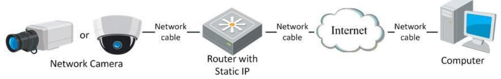

Figure 2-10 Accessing the Camera through Router with Static IP

### **Connecting the network camera with static IP directly**

You can also save the static IP in the camera and directly connect it to the internet

without using a router. Refer to Section 2.1.2 for detailed IP address configuration of the network camera.

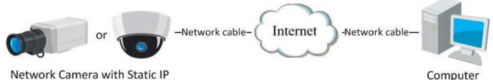

Figure 2-11 Accessing the Camera with Static IP Directly

### **2.2.2 Dynamic IP Connection**

### *Before you start:*

Please apply a dynamic IP from an ISP. With the dynamic IP address, you can connect the network camera to a modem or a router.

### **Connecting the network camera via a router**

#### *Steps:*

- 1. Connect the network camera to the router.
- 2. In the camera, assign a LAN IP address, the subnet mask and the gateway. Refer to Section 2.1.2 for detailed IP address configuration of the network camera.
- 3. In the router, set the PPPoE user name, password and confirm the password.
- 4. Set port mapping. E.g. 80, 8000, and 554 ports. The steps for port mapping vary depending on different routers. Please call the router manufacturer for assistance with port mapping.

*Note:* Refer to Appendix 2 for detailed information about port mapping.

- 5. Apply a domain name from a domain name provider.
- 6. Configure the DDNS settings in the setting interface of the router.
- 7. Visit the camera via the applied domain name.

### **Connecting the network camera via a modem**

### *Purpose:*

This camera supports the PPPoE auto dial-up function. The camera gets a public IP address by ADSL dial-up after the camera is connected to a modem. You need to configure the PPPoE parameters of the network camera. Refer to *Section 6.3.3 Configuring PPPoE Settings* for detailed configuration.

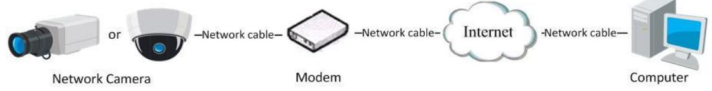

Figure 2-12 Accessing the Camera with Dynamic IP

*Note:* The obtained IP address is dynamically assigned via PPPoE, so the IP address always changes after rebooting the camera. To solve the inconvenience of the dynamic IP, you need to get a domain name from the DDNS provider (E.g. DynDns.com). Please follow the steps below for normal domain name resolution and private domain name resolution to solve the problem.

- Normal Domain Name Resolution
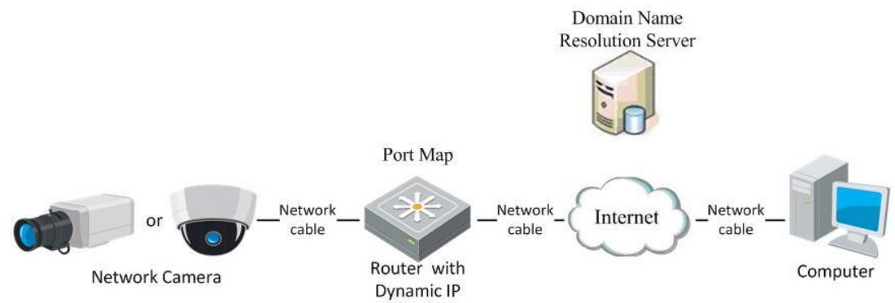

Figure 2-13 Normal Domain Name Resolution

### *Steps:*

- 1. Apply a domain name from a domain name provider.
- 2. Configure the DDNS settings in the **DDNS Settings** interface of the network camera. Refer to *Section 6.3.4 Configuring DDNS Settings* for detailed configuration.
- 3. Visit the camera via the applied domain name.

# **Chapter 3 Access to the Network Camera**

# **3.1 Accessing by Web Browsers**

### *Steps:*

- 1. Open the web browser.
- 2. Input the IP address of the network camera in the address bar, e.g., 192.168.1.64 and press the **Enter** key to enter the login interface.
- 3. Input the user name and password and click **Login**.

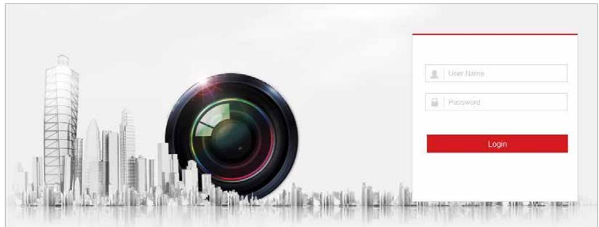

Figure 3-1 Login Interface

### *Note:*

Switch the display language from the upper-right corner among different languages.

- 4. Install the plug-in before viewing the live video and operating the camera. Please follow the installation prompts to install the plug-in.
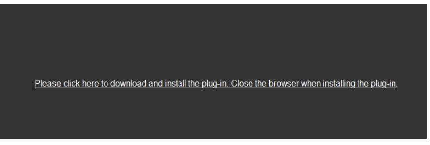

Figure 3-2 Download and Install Plug-in

*Note:* You may have to close the web browser to install the plug-in. Please reopen the web browser and log in again after installing the plug-in.

# **3.2 Accessing by Client Software**

The product CD contains the iVMS-4200 client software. You can view the live video and manage the camera with the software.

Follow the installation prompts to install the software. The control panel interface of iVMS-4200 client software is shown as bellow.

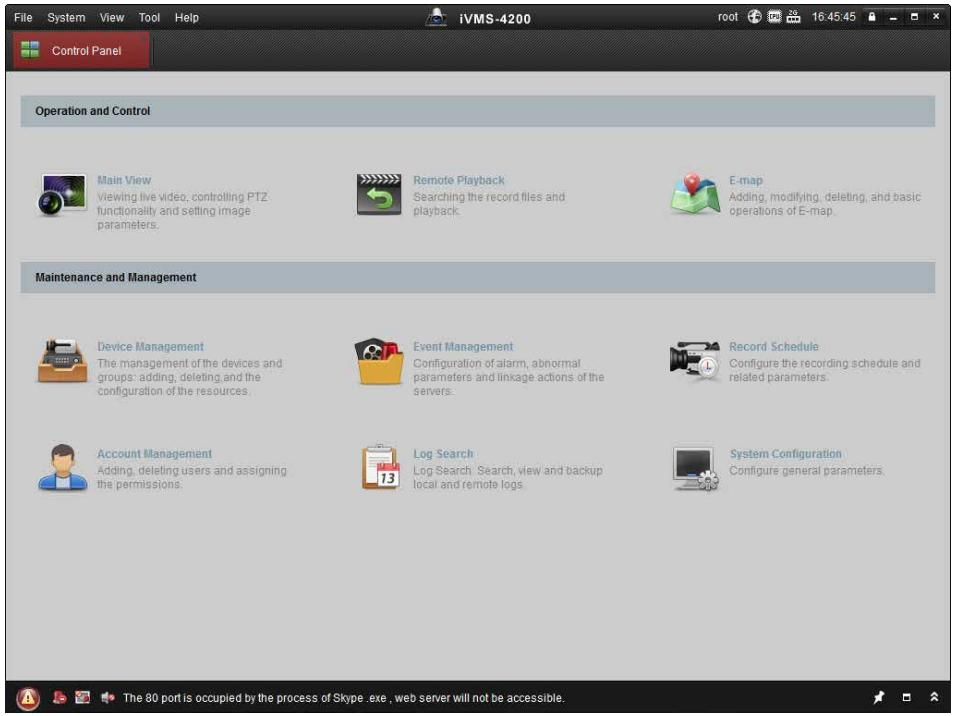

Figure 3-3 iVMS-4200 Client Software

*Note:* For detailed information about the software, please refer to the user manual of the iVMS-4200 Client Software.

# **Chapter 4 Wi-Fi Settings**

### *Purpose:*

By connecting to the wireless network, you don't need to use cable of any kind for network connection, which is very convenient for the actual surveillance application. Two connection modes are supported. Choose a mode as desired and perform the steps to configure the Wi-Fi.

*Note:* This chapter is only applicable for the cameras with the built-in Wi-Fi module.

### **Wireless Connection in Manage Mode**

### *Steps:*

- 1. Enter the Wi-Fi Settings interface:
### **Configuration > Network > Advanced Settings > Wi-Fi**

- 2. Click **Search** to search the online wireless connections as the figure below.

|     | Wireless List    |              |               |         |                 | Search       |
|-----|------------------|--------------|---------------|---------|-----------------|--------------|
| No. | SSID             | Working Mode | Security Mode | Channel | Signal Strength | Speed (Mbps) |
| 1   | TP-LINK_SoftWare | Manage       | disable       | 1       | 81              | 150          |
| 2   | C-WEP            | Manage       | WEP           | 11      | 50              | 54           |
| 3   | C-not-encrypted  | Manage       | disable       | 11      | 50              | 54           |
| 4   | C-WPA2-Personal  | Manage       | WPA2-personal | 11      | 47              | 54           |
| 5   | FINALHAUT        | Manage       | WPA2-personal | 6       | 46              | 54           |
| 6   | 6688             | Manage       | WPA2-personal | 6       | 46              | 54           |
| 7   | C199TH           | Manage       | WPA2-personal | 6       | 46              | 54           |
| 8   | 6688             | Manage       | WPA2-personal | 6       | 44              | 54           |
| 9   | FINALHAUT        | Manage       | WPA2-personal | 0       | 44              | 54           |
| 10  | maomao           | Manage       | WPA2-personal | 6       | 43              | 54           |
| 11  | yingkongshi12    | Manage       | WPA2-personal | 6       | 43              | 54           |

Figure 4-1 Wi-Fi list

- 3. Click to choose a wireless connection on the list.

| Wi-Fi           |                   |
|-----------------|-------------------|
| SSID            | C-WPA2-Personal   |
| Network Mode    | @ Manage @ Ad-Hoc |
| Security Mode   | WPA2-personal     |
| Encryption Type | TKIP              |
| Key 1 @         |                   |

Figure 4-2 Wi-Fi Setting- Manage Mode

- 4. Check the radio button to select the Network mode as Manage, and the Security mode of the network is automatically shown when you select the wireless network, please don't change it manually.
*Note:* These parameters are exactly identical with those of the router.

- 5. Enter the key to connect the wireless network. The key should be that of the wireless network connection you set on the router.
#### **Wireless Connection in Ad-hoc Mode**

If you choose the Ad-hoc mode, you don't need to connect the wireless camera via a router. The scenario is the same as you connect the camera and the PC directly with a network cable.

### *Steps:*

- 1. Choose Ad-hoc mode.

| Wi-Fi           |                   |
|-----------------|-------------------|
| SSID            | C-WPA2-Personal   |
| Network Mode    | @ Manage @ Ad-Hoc |
| Security Mode   | WPA2-personal     |
| Encryption Type | TKIP              |
| Key 1 @         |                   |

Figure 4-3 Wi-Fi Setting- Ad-hoc

- 2. Customize a SSID for the camera.
- 3. Choose the Security Mode of the wireless connection.
- 4. Enable the wireless connection function for your PC.
- 5. On the PC side, search the network and you can see the SSID of the camera listed.

| camera6467 wifi |  |
|-----------------|--|
| belkin54g       |  |
| Tenda_0A0698    |  |
| yourPC          |  |
| HenryHu         |  |
| APPLE           |  |
| Peter Ma        |  |

Figure 4-4 Ad-hoc Connection Point

- 6. Choose the SSID and connect.
### **Security Mode Description:**

| WPA2-personal   |
|-----------------|
| not-encrypted   |
| WEP             |
| WPA-personal    |
| WPA-enterprise  |
| WPA2-personal   |
| WPA2-enterprise |

Figure 4-5 Security Mode

You can choose the Security Mode as not-encrypted, WEP, WPA-personal, WPA-enterprise, WPA2-personal, and WPA2-enterprise.

*WEP mode:* 

| Security Mode  | WEP              |
|----------------|------------------|
| Authentication | Open @ Shared    |
| Key Length     | @ 64bit @ 128bit |
| Key Type       | @ HEX @ ASCII    |
| Key 1 @        |                  |
| Key 2 @        |                  |
| Key 3 @        |                  |
| Key 4 @        |                  |

### Figure 4-6 WEP Mode

- Authentication Select Open or Shared Key System Authentication, depending on the method used by your access point. Not all access points have this option, in which case they probably use Open System, which is sometimes known as SSID
Authentication.

- Key length This sets the length of the key used for the wireless encryption, 64 or 128 bit. The encryption key length can sometimes be shown as 40/64 and 104/128.
- Key type The key types available depend on the access point being used. The following options are available:

HEX - Allows you to manually enter the hex key.

ASCII - In this method the string must be exactly 5 characters for 64-bit WEP and

13 characters for 128-bit WEP.

*WPA-personal and WPA2-personal Mode:* 

Enter the required Pre-shared Key for the access point, which can be a hexadecimal number or a passphrase.

| Security Mode   | WPA-personal |  |
|-----------------|--------------|--|
| Encryption Type | TKIP         |  |
| Key 1 @         |              |  |

Figure 4-7 Security Mode- WPA-personal

*WPA- enterprise and WPA2-enterprise Mode:* 

Choose the type of client/server authentication being used by the access point, EAP-TLS or EAP-PEAP.

EAP-TLS:

| Security Mode        | WPA-enterprise | >                |
|----------------------|----------------|------------------|
| Authentication       | EAP-TTLS       | >                |
| User Name            |                |                  |
| Password             |                |                  |
| Inner authentication | PAP<br>>       |                  |
| Anonymous identity   |                |                  |
| EAPOL version        | 1              | >                |
| CA certificate       |                | Upload<br>Browse |

Figure 4-8 EAP-TLS

- Identity Enter the user ID to present to the network.
- Private key password Enter the password for your user ID.
- EAPOL version Select the version used (1 or 2) in your access point.
- CA Certificates Upload a CA certificate to present to the access point for authentication.

EAP-PEAP:

- User Name Enter the user name to present to the network.
- Password Enter the password of the network.
- PEAP Version Select the PEAP version used at the access point.
- Label Select the label used by the access point.
- EAPOL Version Select version (1 or 2) depending on the version used at the access point.
- CA Certificates Upload a CA certificate to present to the access point for authentication.


- *For your privacy and to better protect your system against security risks, we strongly recommend the use of strong passwords for all functions and network devices. The password should be something of your own choosing (using a minimum of 8 characters, including at least three of the following categories: upper case letters, lower case letters, numbers and special characters) in order to increase the security of your product.*
- *Proper configuration of all passwords and other security settings is the responsibility of the installer and/or end-user.*

# **Chapter 5 Live View**

# **5.1 Live View Page**

### *Purpose:*

The live view page allows you to view the real-time video, capture images, realize

PTZ control, set/call presets and configure video parameters.

Log in the network camera to enter the live view page, or you can click **Live View** on the menu bar of the main page to enter the live view page.

### *Note:*

You can also visit the fisheye camera to get the live view in different live view modes via iVMS-4200 client software. Please refer to the User Manual of iVMS-4200 Client Software for detailed instructions.

### *Introduction:*

The **Live View Page** is mainly composed of three parts, the display control area on the left, the live view screen in the middle and a PTZ panel which can be shown or hidden on the right.

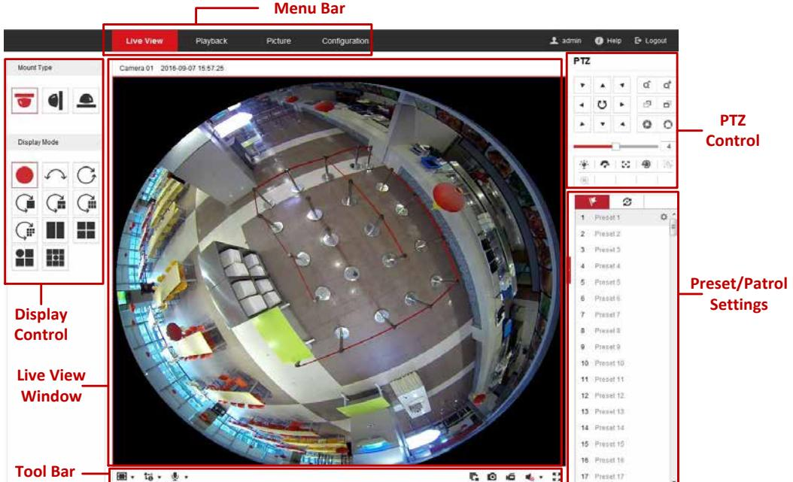

### **Descriptions of the live view page:**

Figure 5-1 Live View Page

### **Menu Bar:**

Click the tab to enter Live View, Playback, Picture and Configuration page respectively.

### **Display Control:**

The display control area allows you to select mount type and display mode of live view.

### **Mount Type**

Select ceiling mounting, wall mounting and table mounting according to the actual mount type you adopted for your camera.

| Mount Type Icon | Description       |  |
|-----------------|-------------------|--|
|                 | Ceiling mounting. |  |
|                 | Wall mounting.    |  |
|                 | Table mounting.   |  |

Table 5-1 Description of Mount Types

### **Display Mode**

You can select a display mode for the layout of the live view window. The description of each display mode is shown in the following table.

- **Fisheye View**: In the Fisheye View mode, the whole wide-angle view of the fisheye camera is displayed. This view mode is called Fisheye View because it approximates the vision of a fish's convex eye. The lens produces curvilinear images of a large area, while distorting the perspective and angles of objects in the image.
- **Panorama View**: In the Panorama View mode, the round fisheye image is transformed to rectangular image by some calibration methods.
- **PTZ View**: The PTZ View is the close-up view of some defined area in the Fisheye View or Panorama View, and it supports the electronic PTZ function, which is also called e-PTZ.

| Mode | Description                                                    | Mode | Description                                                                   |
|------|----------------------------------------------------------------|------|-------------------------------------------------------------------------------|
|      | Fisheye view.                                                  |      | 180 degrees panorama view.                                                    |
|      | 360 degrees panorama view.                                     |      | Live view with a 360 degrees<br>panorama view and a PTZ view.                 |
|      | Live view with a 360 degrees<br>panorama view and 3 PTZ views. |      | Live view with a 360 degrees<br>panorama<br>view<br>and<br>6<br>PTZ<br>views. |
|      | Live view with a 360 degrees<br>panorama view and 8 PTZ views. |      | Live view with 2 PTZ views.                                                   |
|      | Live view with into 4 PTZ views.                               |      | Live view with 1 fisheye view<br>and 3 PTZ views.                             |
|      | Live view with 1 fisheye view<br>and 8 PTZ views.              |      | Panorama view.                                                                |
|      | Live view with a panorama view<br>and 3 PTZ views.             |      | Live<br>view<br>with<br>a<br>panorama<br>view and 3 PTZ views.                |

Table 5-2 Description of Display Modes

*Note:* Available display modes vary according to camera models.

### **Live View Window:**

Display the live video on the display window of live view.

### **Toolbar:**

Start/Stop the live view, enable/disable the two-way audio, adjust the audio volume,

capture pictures, record the video files, etc..

### **PTZ Control:**

Realize the pan/tilt/zoom function of PTZ view via the navigation box, and set the

PTZ moving speed.

### **Preset/Patrol Settings:**

Set and call the preset/patrol for the camera.

# **5.2 Starting Live View**

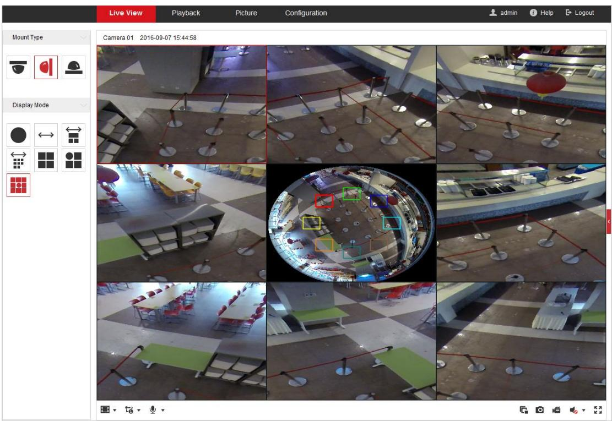

Figure 5-2 Live View Interface

| Icon | Description                                   |  |  |
|------|-----------------------------------------------|--|--|
|      | Start all live view.                          |  |  |
|      | Stop all live view.                           |  |  |
|      | Set aspect<br>ratio as 1:1.                   |  |  |
|      | Set aspect ratio as 4:3.                      |  |  |
|      | Set aspect ratio as 16:9.                     |  |  |
|      | Window size for original video stream.        |  |  |
|      | Stream Type: Select Main Stream or Sub Stream |  |  |
|      | Self-adaptive window size.                    |  |  |
| /    | Manually start/stop recording.                |  |  |
|      | Audio on and adjust the volume.               |  |  |
|      | Mute.                                         |  |  |
| /    | Start/stop two-way audio.                     |  |  |
|      | Manually capture a picture.                   |  |  |
|      | Full screen.                                  |  |  |

### Table 5-3 Descriptions of Live View Icons

| / |
|---|
|   |

Show/hide the PTZ panel.

*Notes:* Toolbar icons on the live view page vary according to camera models.

# **5.3 Recording and Capturing Pictures Manually**

In the live view interface, click on the toolbar to capture the live pictures or click to record the live video. The saving paths of the captured pictures and record files can be set on the **Configuration > Local Configuration** page. To configure remote scheduled recording, please refer to *Section 6.1*

*Note***:** The captured image will be saved as JPEG file or BMP file in your computer.

# **5.4 Operating PTZ Control**

### *Purpose:*

A PTZ View is a close-up view of some defined area on the panoramic and fisheye view, and it supports digital PTZ control.

When PTZ View is selected for live view, you can use the PTZ control panel on the right of the window to realize pan/tilt/zoom control of the PTZ View.

| A    | - -          |         | Q Q   |     |      |
|------|--------------|---------|-------|-----|------|
| -    | 65 >         |         | ப்    | 0   |      |
| 4    |              | 4       | 0     | 0   |      |
|      |              |         |       | 1 4 |      |
|      |              | @ 3 0 0 |       | (c) |      |
| (10) |              |         |       |     |      |
|      | ي            | ਲ       |       |     |      |
| 1    | Preset 1     |         | xxxxx |     | 1118 |
| 2    | Preset 2     |         |       |     |      |
| 3    | Preset 3     |         |       |     |      |
| র্ব  | Preset 4     |         |       |     |      |
| 5    | Preset 5     |         |       |     |      |
| 6    | Preset 6     |         |       |     |      |
| 7    | Preset 7     |         |       |     |      |
| 8    | Preset 8     |         |       |     |      |
| の    | Preset 9     |         |       |     |      |
|      | 10 Preset 10 |         |       |     |      |
| 11   | Preset 11    |         |       |     |      |
| 12   | Preset 12    |         |       |     |      |
| 13   | Preset 13    |         |       |     |      |
|      | 14 Preset 14 |         |       |     |      |
|      |              |         |       |     |      |

Figure 5-3 PTZ Control

*Note:* If Fisheye View or Panorama View is selected for live view together with the PTZ View, when you click on a random PTZ view, a navigation box indicating the location of the PTZ view will be shown on the fisheye or panorama view. SeeFigure 5-2.

### **5.4.1 PTZ Control Panel**

On the live view page, you can click to show the PTZ control panel, and click to hide it.

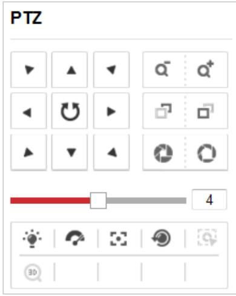

Figure 5-4 PTZ Control Panel

| Icon | Description                        |  |  |  |
|------|------------------------------------|--|--|--|
|      | Direction buttons                  |  |  |  |
| /    | Start/stop auto scan               |  |  |  |
|      | Zoom out/Zoom in                   |  |  |  |
|      | Focus -/Focus +                    |  |  |  |
|      | Iris -/Iris +                      |  |  |  |
|      | Adjust speed of pan/tilt movements |  |  |  |
|      | Enable/disable light               |  |  |  |
|      | Auxiliary Focus                    |  |  |  |
|      | Enable/disable wiper               |  |  |  |
|      | Lens initialization                |  |  |  |
|      | Start manual<br>tracking           |  |  |  |
|      | Start 3D zoom                      |  |  |  |
|      | Click to set presets               |  |  |  |
|      | Click to set patrol                |  |  |  |

| Table 5-4 | Descriptions of PTZ Control Panel |
|-----------|-----------------------------------|
|-----------|-----------------------------------|

### *Steps:*

- 1. Click to select a PTZ View on the display window, and then the navigation box appears on the Fisheye View and Panorama View.
- 2. Click the direction arrows on the PTZ control panel. The navigation box will move in the corresponding pan/tilt direction.
- 3. Adjust zoom, focus and iris level of the PTZ view image.
- 4. Click-and-drag the slider on the speed bar to adjust the moving speed of PTZ View when auto scan is enabled.
- 5. (Optional) you can click on other buttons to realize corresponding functions.

### **5.4.2 Setting/Calling/Deleting a Preset**

### **Setting a Preset:**

### *Purpose:*

A preset for the fisheye camera is a predefined PTZ View which contains information of pan, tilt, focus and other parameters.

### *Steps:*

- 1. Click to select a PTZ View on the display window.
- 2. Click the direction/zoom buttons on the PTZ Control panel to adjust the PTZ View as desired.
- 3. Select a preset number from the preset list.
- 4. Click the icon to save the current PTZ View as the preset.

The preset name turns from grey to black.

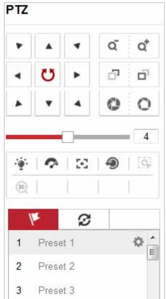

Figure 5-5 Setting a Preset

*Note***:** Up to 256 presets are supported.

### **Calling a Preset:**

### *Purpose:*

The PTZ View of the fisheye camera can directly and quickly move to the area of interest, which is defined as a preset.

### *Before you start:*

Set the preset. The icons ( , and ) will appear on the preset list.

### *Steps:*

- 1. Click to select a PTZ View on the display window.
- 2. Select the preset number from the list.
- 3. Click the icon to call the selected preset.

The selected PTZ View will move to the pre-defined preset scene.

### **Deleting a Preset**

### *Steps:*

- 1. Select the preset number from the list.
- 2. Click the icon to delete the selected preset.

The preset name turns from black to grey.

### **5.4.3 Setting/Calling/Deleting a Patrol**

### *Purpose:*

A patrol is a scanning track specified by a group of defined presets, with the duration time at each preset separately programmable.

#### *Before you start:*

At least 2 presets are required to set a patrol.

### **Setting a Patrol**

### *Steps:*

- 1. Click the icon to enter the patrol configuration interface.
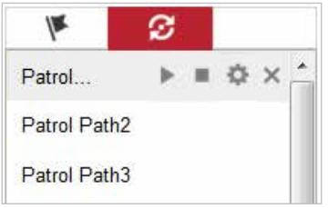

Figure 5-6 Patrol Configuration (1)

- 2. Select a path No. from the drop-down list, and click the icon to configure patrol path.
- 3. Click to add a preset into the path, and click to delete a preset.
- 4. Set the preset number, speed and lingering time at each preset. You can adjust the order of presets by using and .

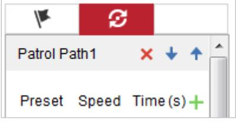

Figure 5-7 Patrol Configuration (2)

- 5. Click **OK** to save patrol path.
*Note:* Up to 32 patrol paths can be set, and each path supporting 16 key points at

most.

### **Calling a Patrol**

### *Steps:*

- 1. Click to select a PTZ View on the display window.
- 2. Select the patrol path number from the drop-down list.
- 3. Click the icon to start the selected patrol and to stop it.

### **Deleting a Patrol**

- 1. Select the patrol path number from the drop-down list.
- 2. Click the icon to delete the patrol path.

# **Chapter 6 Network Camera Configuration**

# **6.1 Configuring Local Parameters**

### *Purpose:*

Local configuration provides live view parameters settings, record file settings and picture and clip settings. The recorded videos and captured pictures can be saved on the local PC that runs the web browser.

### *Steps:*

- 1. Enter the Local Configuration interface: **Configuration > Local**

| Live View Parameters            |                             |                            |             |        |        |      |  |
|---------------------------------|-----------------------------|----------------------------|-------------|--------|--------|------|--|
| Protocol                        | @ TCP                       | C UDP                      | @ MULTICAST | © HTTP |        |      |  |
| Play Performance                | @ Shortest Delay            | @ Auto                     |             |        |        |      |  |
| Rules                           | C Enable                    | @ Disable                  |             |        |        |      |  |
| Image Format                    | JPEG                        | C BMP                      |             |        |        |      |  |
| Record File Settings            |                             |                            |             |        |        |      |  |
| Record File Size                | ® 256M                      | @ 512M                     | © 1G        |        |        |      |  |
| Save record files to            |                             | C:\Users\test\RecordFiles  |             |        |        | Open |  |
| Save downloaded files to        | C:\Users\test\DownloadFiles |                            |             |        | Browse | Open |  |
| Picture and Clip Settings       |                             |                            |             |        |        |      |  |
| Save snapshots in live view to  |                             | C:\Users\test\CaptureFiles |             |        |        | Open |  |
| Save snapshots when playback to | C:\Users\test\PlaybackPics  |                            |             |        | Browse | Open |  |
| Save clips to                   | C:\Users\test\PlaybackFiles |                            |             |        | Browse | Open |  |
|                                 |                             |                            |             |        |        |      |  |
| 글 Save                          |                             |                            |             |        |        |      |  |

Figure 6-1 Local Configuration Interface

- 2. Configure the following settings:
- **Live View Parameters:** Select a protocol type.
	- **Protocol Type:** TCP, UDP, MULTICAST and HTTP are selectable.

**TCP:** Ensures complete delivery of streaming data and better video quality, yet the real-time transmission will be affected.

**UDP:** Provides real-time audio and video streams.

**HTTP:** Allows the same quality as that of TCP without setting specific ports

for streaming under some network environments.

**MULTICAST:** It's recommended to select MCAST type when using the Multicast function. For detailed information about Multicast, refer to *Section 5.3.1 Configuring TCP/IP Settings.*

- **Live View Performance:** Set the live view performance to Shortest Delay or Auto.
- **Rules:** It refers to the rules on your local browser, select enable or disable to display or not display the colored marks when the motion detection, line crossing detection, or intrusion detection is triggered. E.g.: If motion detection and rules are both enabled, when a moving object is detected, it will be marked with a green rectangle on the live video.
- **Image Format:** The captured picture can be saved in format of *jpeg or *bmp.
- **Record File Settings:** Set the saving path of the recorded video files. Valid for the record files you recorded with the web browser.
	- **Record File Size:** Select the packed size of the manually recorded and downloaded video files to 256M, 512M or 1G. After the selection, the maximum record file size is the value you selected.
	- **Save record files to:** Set the saving path for the manually recorded video files.
	- **Save downloaded files to:** Set the saving path for the downloaded video files in playback mode.
- **Picture and Clip Settings:** Set the saving paths of the captured pictures and clipped video files. Valid for the pictures you captured with the web browser.
	- **Save snapshots in live view to:** Set the saving path of the manually captured pictures in live view mode.
	- **Save snapshots when playback to:** Set the saving path of the captured pictures in playback mode.

 **Save clips to:** Set the saving path of the clipped video files in playback mode. *Note***:** You can click **Browse** to change the directory for saving the clips and pictures. And click **Open** to open the selected folder.

- 3. Click **Save** to save the settings.
# **6.2 Configuring System Settings**

### **6.2.1 Viewing Basic Information**

Enter the Basic Information interface:

### **Configuration > System > System Settings > Basic Information**

In the **Basic Information** interface, you can edit the Device Name or Device No..

Other information of the network camera, such as Model, Serial No., Firmware Version, Encoding Version, Number of Channels, Number of HDDs, Number of Alarm Input and Number of Alarm Output are displayed. The information cannot be changed in this menu. It is the reference for maintenance or modification in future.

| Device Name            | IP CAMERA                                                                                                                                                                      |
|------------------------|--------------------------------------------------------------------------------------------------------------------------------------------------------------------------------|
| Device No.             | 88                                                                                                                                                                             |
| Model                  | XX-XXXXXXXXXXX-XX                                                                                                                                                              |
| Serial No.             | XX-XXXXXXXXX-XXXXXXXXXXXXXXXXXXXXXXXXXXXXXXXXXXXXXXXXXXXXXXXXXXXXXXXXXXXXXXXXXXXXXXXXXXXXXXXXXXXXXXXXXXXXXXXXXXXXXXXXXXXXXXXXXXXXXXXXXXXXXXXXXXXXXXXXXXXXXXXXXXXXXXXXXXXXXXXXX |
| Firmware Version       | V x.x.x build xxxxxx                                                                                                                                                           |
| Encoding Version       | V x.x build xxxxxxxxxx                                                                                                                                                         |
| Web Version            | Vx.x.x build xxxxxxx                                                                                                                                                           |
| Plugin Version         | Vx.x.x.x.xx                                                                                                                                                                    |
| Number of Channels     | 4                                                                                                                                                                              |
| Number of HDDs         | 0                                                                                                                                                                              |
| Number of Alarm Input  | 1                                                                                                                                                                              |
| Number of Alarm Output | 1                                                                                                                                                                              |
|                        |                                                                                                                                                                                |
| Save                   |                                                                                                                                                                                |

Figure 6-2 Device Information

### **6.2.2 Time and DST Settings**

### *Purpose:*

You can follow the instructions in this section to configure the time synchronization and DST settings.

**Time Settings** 

### *Steps:*

- 1. Enter the Time Settings interface:
### **Configuration > System > System Settings > Time Settings**

| Time Zone           | (GMT+08:00) Beijing, Urumqi, Singapore | V                        |
|---------------------|----------------------------------------|--------------------------|
| NTP                 |                                        |                          |
| NTP                 |                                        |                          |
| Server Address      | time.windows.com                       |                          |
| NTP Port            | 123                                    |                          |
| Interval            | 1440                                   | min                      |
|                     | Test                                   |                          |
| Manual Time Sync.   |                                        |                          |
| @ Manual Time Sync. |                                        |                          |
| Device Time         | 2015-10-08T10:12:23                    |                          |
| Set Time            | 2015-10-08T10:10:57                    | Sync. with computer time |
|                     |                                        |                          |
| Save                |                                        |                          |

Figure 6-3 Time Settings

- 2. Select the Time Zone of your location from the drop-down list.
- Synchronizing Time by NTP Server.
- (1) Check the **NTP** item to enable the NTP function.
- (2) Configure the following settings:

**Server Address:** IP address of NTP server.

**NTP Port:** Port of NTP server.

**Interval:** The time interval between the two synchronizing actions with NTP server.

- (3) (Optional) You can click the **Test** button to test the time synchronization function via NTP server.

| NTP            |                  |     |
|----------------|------------------|-----|
| O NTP          |                  |     |
| Server Address | time.windows.com |     |
| NTP Port       | 123              |     |
| Interval       | 1440             | min |
|                | Test             |     |

Figure 6-4 Time Sync by NTP Server

*Note***:** If the camera is connected to a public network, you should use a NTP server that has a time synchronization function, such as the server at the National Time Center (IP Address: 210.72.145.44). If the camera is set in a customized network, NTP software can be used to establish a NTP server for time synchronization.

- Synchronizing Time Manually
- (1) Check the **Manual Time Sync** item to enable the manual time synchronization function.
- (2) Click the icon to open the calendar page.
- (3) Click on the calendar to select the date, set the time, and click **OK** to save.

| Manual Time Sync.      |                           |         |      |             |      |                          |     |  |
|------------------------|---------------------------|---------|------|-------------|------|--------------------------|-----|--|
| Manual Time Sync.<br>0 |                           |         |      |             |      |                          |     |  |
| Device Time            | 2015-10-08T10:18:13       |         |      |             |      |                          |     |  |
| Set Time               | 2015-10-08T10:06:49<br>10 |         |      |             |      | Sync. with computer time |     |  |
|                        | 4 4                       |         | Oct  |             | 2015 |                          | A » |  |
| Save                   |                           | Sun Mon |      | Tue Wed Thu |      | Fri                      | Sat |  |
|                        | 27                        | 28      | 29   | 30          | 1    | 2                        | 3   |  |
|                        | 4                         | 5       | 6    | 7           | 8    | 9                        | 10  |  |
|                        | 11                        | 12      | 13   | 14          | 15   | 16                       | 17  |  |
|                        | 18                        | 19      | 20   | 21          | 22   | 23                       | 24  |  |
|                        | 25                        | 26      | 27   | 28          | 29   | 30                       | 31  |  |
|                        |                           | 2       | 3    | 4           | 5    | G                        | 7:  |  |
|                        |                           | Time    | 10 : | 6 :         | 49   |                          |     |  |
|                        | 1                         |         |      |             |      |                          | OK  |  |

Figure 6-5 Time Sync Manually

- (4) (Optional) You can check **Sync. with computer time** item to synchronize the time
of the device with that of the local PC.

- 3. Click **Save** to save the settings.
- **DST**

### *Purpose:*

For region using the summer time, DST (daylight saving time) settings can be configured according to the actual needs.

### *Steps:*

- 1. Enter DST Settings interface:
### **Configuration > System > System Settings > DST**

- 2. Check the checkbox of **Enable DST** to enable daylight saving time.
- 3. Set the start time and end time for the DST period.
- 4. Select the DST bias from the drop-down list.
- 5. Click **Save** to save the settings.

| J Enable DST |       |            |          |         |   |
|--------------|-------|------------|----------|---------|---|
| Start Time   | Apr   | First<br>▼ | Sun<br>> | 02<br>> | V |
| End Time     | Oct   | Last       | Sun<br>> | 02<br>> |   |
| DST Bias     | 30min |            |          |         | V |
|              |       |            |          |         |   |
| 昌 Save       |       |            |          |         |   |

Figure 6-6 DST Settings

### **6.2.3 RS-232 Settings**

#### *Purpose:*

The RS-232 port can be used in two ways:

- Parameters Configuration: Connect a computer to the camera through the serial port. Device parameters can be configured by using software such as HyperTerminal. The serial port parameters must be the same as the serial port parameters of the camera.
- Transparent Channel: Connect a serial device directly to the camera. The serial device will be controlled remotely by the computer through the network.

### *Steps:*

- 1. Enter RS-232 Port Setting interface:

```
Configuration> System > System Settings > RS232
```
Figure 6-7 RS-232 Settings

*Note:* If you want to connect the camera by the RS-232 port, the parameters of the RS-232 should be exactly the same with the parameters you configured here.

- 2. Click **Save** to save the settings.
### **6.2.4 RS-485 Settings**

### *Purpose:*

The RS-485 serial port is used to control the PTZ of the camera. The configuring of the PTZ parameters should be done before you control the PTZ unit.

*Note:* RS-485 settings vary according to the camera model.

### *Steps:*

- 1. Enter RS-485 Port Setting interface:
### **Configuration> System > System Settings > RS485**

- 2. Set the RS-485 parameters.
By default, the Baud Rate is set as 9600 bps, the Data Bit is 8, the stop bit is 1 and the Parity and Flow Control are None.

- 3. Click **Save** to save the settings.
*Note:* The Baud Rate, PTZ Protocol and PTZ Address parameters should be exactly

the same as the PTZ camera parameters.

| RS485        |         |  |
|--------------|---------|--|
| Baud Rate    | 9600    |  |
| Data Bit     | 8       |  |
| Stop Bit     | 1       |  |
| Parity       | None    |  |
| Flow Ctrl    | None    |  |
| PTZ Protocol | PELCO-D |  |
| PTZ Address  | 0       |  |
|              |         |  |
| Save         |         |  |

Figure 6-8 RS-485 Settings

### **6.2.5 Upgrade and Maintenance**

### *Purpose:*

On Upgrade & Maintenance interface, you can reboot the camera, restore camera parameters, export/import configuration parameters, and upgrade firmware.

Enter the Upgrade and Maintenance interface:

```
Configuration > System > Maintenance > Upgrade & Maintenance
```

| Reboot                                                                                                                                                  |                                                                                                   |  |  |  |
|---------------------------------------------------------------------------------------------------------------------------------------------------------|---------------------------------------------------------------------------------------------------|--|--|--|
| Reboot                                                                                                                                                  | Reboot the device.                                                                                |  |  |  |
| Default                                                                                                                                                 |                                                                                                   |  |  |  |
| Restore                                                                                                                                                 | Reset all the parameters, except the IP parameters and user information, to the default settings. |  |  |  |
| Default                                                                                                                                                 | Restore all parameters to default settings.                                                       |  |  |  |
| Export                                                                                                                                                  |                                                                                                   |  |  |  |
| Device Parameters                                                                                                                                       |                                                                                                   |  |  |  |
| Import Config. File                                                                                                                                     |                                                                                                   |  |  |  |
| Device Parameters                                                                                                                                       | Browse<br>Import                                                                                  |  |  |  |
| Status                                                                                                                                                  |                                                                                                   |  |  |  |
| Upgrade                                                                                                                                                 |                                                                                                   |  |  |  |
| Firmware<br>>                                                                                                                                           | Browse<br>Upgrade                                                                                 |  |  |  |
| Status                                                                                                                                                  |                                                                                                   |  |  |  |
| Note: The upgrading process will be 1 to 10 minutes, please don't disconnect power to the process. The device reboots<br>automatically after upgrading. |                                                                                                   |  |  |  |

Figure 6-9 Upgrade and Maintenance

### **Rebooting the Camera**

Click **Reboot** to reboot the network camera.

### **Restoring Default Settings**

Click **Restore** or **Default** to restore the default settings.

*Note:* After restoring the default settings, the IP address is also restored to the default IP address, please be careful for this action.

### **Exporting/Importing Configuration File**

### *Purpose:*

Configuration file is used for the batch configuration of the camera, which can simplify the configuration steps when there are a lot of cameras needing configuring.

*Steps:* 

- 1. Click **Export** to export the current configuration file, and save it to the certain place.
- 2. Click **Browse** to select the saved configuration file and then click **Import** to start importing configuration file.

*Note*: You need to reboot the camera after importing configuration file.

### **Upgrading the System**

Click **Browse** to select the local upgrade file and then click **Upgrade** to start remote upgrade.

*Note:* The upgrading process will take 1 to 10 minutes. Please don't disconnect power of the camera during the process. The camera reboots automatically after upgrading.

### **6.2.6 Log Searching**

### *Purpose:*

The operation, alarm, exception and information of the camera are stored in log files. You can also export the log files.

### *Before you start:*

Please configure network disk for the camera or insert a memory card in the camera.

### *Steps:*

- 1. Enter log searching interface:
**Configuration > System > Maintenance > Log** 

| Major Type | ><br>Exception      |                | All Types |                     | ৰ প্         |
|------------|---------------------|----------------|-----------|---------------------|--------------|
| Start Time | 2015-09-25 00:00:00 | End Time<br>产品 |           | 2014-09-30 23:59:59 | Search<br>12 |
| Log List   |                     |                |           |                     | Export       |
|            |                     |                |           |                     |              |

Figure 6-10 Log Searching Interface

- 2. Set the log search conditions to specify the search, including the Major Type, Minor Type, Start Time and End Time.
- 3. Click **Search** to search log files. The matched log files will be displayed on the **Log** interface.
- 4. Click **Export** to export and save the log files in your computer.

### **6.2.7 System Service Settings**

#### *Purpose:*

System service settings refer to the hardware service that the camera supports, and it varies according to the different cameras.

For the cameras support IR Light, you can go to the hardware service, and select to enable or disable the service according to the actual demands.

Go to **Configuration > System > Maintenance > System Service** to enter the system service settings interface.

| Upgrade & Maintenance | Log | System Service |  |
|-----------------------|-----|----------------|--|
| Hardware              |     |                |  |
| 7 Enable IR Light     |     |                |  |
| a Save                |     |                |  |

Figure 6-11 System Service Setting

## **6.2.8 Authentication**

### *Purpose:*

You can specifically secure the stream data of live view.

### *Steps:*

- 1. Enter the RTSP Authentication interface:
### **Configuration > System > Security > Authentication**

| Authentication      | IP Address Filter |       | Security Service |   |
|---------------------|-------------------|-------|------------------|---|
| RTSP Authentication |                   | basic |                  | V |
| 을 Save              |                   |       |                  |   |

Figure 6-12 RTSP Authentication

- 2. Select the **Authentication** type **basic** or **disable** in the drop-down list to enable or disable the RTSP authentication.
*Note:* If you disable the RTSP authentication, anyone can access the video stream by the RTSP protocol via the IP address.

- 3. Click **Save** to save the settings.
### **6.2.9 IP Address Filter**

### *Purpose:*

This function makes it possible for access control.

### *Steps:*

- 1. Enter the IP Address Filter interface:
**Configuration > System > Security > IP Address Filter** 

| Authentication | IP Address Filter                   | Security Service |                         |
|----------------|-------------------------------------|------------------|-------------------------|
|                | 7 Enable IP Address Filter          |                  |                         |
|                | IP Address Filter Type<br>Forbidden | >                |                         |
|                | IP Address Filter                   |                  | Modify<br>Delete<br>Add |
| D<br>No.       | lb                                  |                  |                         |
| D<br>1         | 10.16.1.1                           |                  |                         |
|                |                                     |                  |                         |
|                |                                     |                  |                         |

Figure 6-13 IP Address Filter Interface

- 2. Check the checkbox of **Enable IP Address Filter**.
- 3. Select the type of IP Address Filter in the drop-down list, **Forbidden** and **Allowed** are selectable.
- 4. Set the IP Address Filter list.
	- Add an IP Address

*Steps:* 

- (1) Click the **Add** to add an IP.
- (2) Input the IP Adreess.

| Add IP Address |              | × |
|----------------|--------------|---|
| IP Address     | 10.16.1.1    |   |
|                | Cancel<br>OK |   |

Figure 6-14 Add an IP

- (3) Click the **OK** to finish adding.
- Modify an IP Address

### *Steps:*

- (1) Select the IP address from filter list and click **Modify**.
- (2) Modify the IP address in the text filed.

| Modify IP Address |              | × |
|-------------------|--------------|---|
| IP Address        | 10.16.1.1    |   |
|                   | ОК<br>Cancel |   |

Figure 6-15 Modify an IP

- (3) Click the **OK** to finish modifying.
- Delete an IP Address or IP Addresses.
Select the IP address(es) and click **Delete**.

- 5. Click **Save** to save the settings.
### **6.2.10 Security Service**

To enable the remote login, and improve the data communication security, the camera provides the security service for better user experience.

*Steps:* 

- 1. Go to **Configuration** > **System** > **Security** > **Security Service** to enter the security service configuration interface.
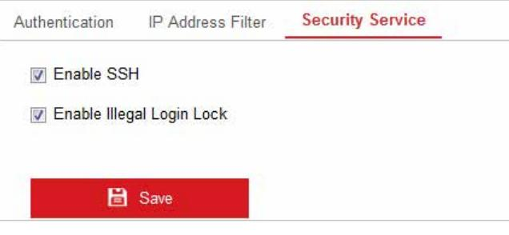

Figure 6-16 Security Service

- 2. Check the checkbox of **Enable SSH** to enable the data communication security, and uncheck the checkbox to disable the SSH.
- 3. Check the checkbox of **Enable Illegal Login Lock**, and then the IP address will be locked if the admin user performs 7 failed user name/password attempts (5 times for the operator/user).

*Note:* If the IP address is locked, you can try to login the device after 30 minutes.

### **6.2.11User Management**

### *Purpose:*

The admin user can add, delete or modify user accounts, and grant the accounts different permissions. We highly recommend you manage the user accounts and permissions properly.

The admin user can also view the users that are currently visiting the camera on the

### page of **Online Users**.

Enter the User Management interface:

### **Configuration > System > User Management**

| User Management |           |                         |
|-----------------|-----------|-------------------------|
| User List       |           | Modify<br>Delete<br>Add |
| No.             | User Name | Level                   |
| 1               | admin     | Administrator           |
| 2               | test      | Operator                |
|                 |           |                         |

### Figure 6-17 User Information

### **Adding a User**

The *admin* user has all permissions by default and can create/modify/delete other accounts.

The *admin* user cannot be deleted and you can only change the *admin* password.

### *Steps:*

- 1. Click **Add** to add a user.
- 2. Input the **User Name**, select **Level** and input **Password.**

### *Notes:*

- Up to 31 user accounts can be created.
- Different level user owns different permissions. Operator and user are selectable.
- **STRONG PASSWORD RECOMMENDED** We highly recommend you create a strong password of your own choosing (using a minimum of 8 characters, including at least three of the following categories: upper case letters, lower case letters, numbers, and special characters) in order to increase the security of your product. And we recommend you reset your password regularly, especially in the high security system, resetting the password monthly or weekly can better protect your product.
- 3. Check or uncheck the permissions for the new user.
- 4. Click **OK** to finish the user addition.

| Add user                                                                       |                                                                                                                                                                                        | ×      |
|--------------------------------------------------------------------------------|----------------------------------------------------------------------------------------------------------------------------------------------------------------------------------------|--------|
| User Name                                                                      | test                                                                                                                                                                                   |        |
| Level                                                                          | Operator                                                                                                                                                                               |        |
| Password                                                                       |                                                                                                                                                                                        |        |
|                                                                                | Valid password range [8-16]. You can<br>use a combination of numbers,<br>lowercase, uppercase and special<br>character for your password with at<br>least two kinds of them contained. | Strong |
| Confirm                                                                        |                                                                                                                                                                                        |        |
| Select All                                                                     |                                                                                                                                                                                        |        |
| Remote: Upgrade / Format<br>Remote: Two-way Audio<br>Remote: Shutdown / Reboot | Remote: Parameters Settings<br>V Remote: Log Search / Interrogate Wor                                                                                                                  |        |
|                                                                                | Remote: Notify Surveillance Center / T                                                                                                                                                 |        |
|                                                                                |                                                                                                                                                                                        |        |
| Remote: Video Output Control<br>Remote: Serial Port Control                    |                                                                                                                                                                                        |        |
| J Remote: Live View                                                            |                                                                                                                                                                                        |        |
| J Remote: Manual Record                                                        |                                                                                                                                                                                        |        |
| V Remote: PTZ Control                                                          |                                                                                                                                                                                        |        |

Figure 6-18 Add a User

### **Modifying a User**

### *Steps:*

- 1. Click the user from the user list and Click **Modify**.
- 2. Modify the **User Name**, **Level** or **Password**.
- 3. Check or uncheck the permissions for the user.
- 4. Click **OK** to finish the user modification.

| Modify user                                                                                                                                                                                                                                                                                                                                      |                                                                                                                                                                                        |              |
|--------------------------------------------------------------------------------------------------------------------------------------------------------------------------------------------------------------------------------------------------------------------------------------------------------------------------------------------------|----------------------------------------------------------------------------------------------------------------------------------------------------------------------------------------|--------------|
| User Name                                                                                                                                                                                                                                                                                                                                        | test                                                                                                                                                                                   |              |
| Level                                                                                                                                                                                                                                                                                                                                            | Operator                                                                                                                                                                               |              |
| Password                                                                                                                                                                                                                                                                                                                                         |                                                                                                                                                                                        |              |
|                                                                                                                                                                                                                                                                                                                                                  | Valid password range [8-16]. You can<br>use a combination of numbers,<br>lowercase, uppercase and special<br>character for your password with at<br>least two kinds of them contained. | Strong       |
| Confirm                                                                                                                                                                                                                                                                                                                                          |                                                                                                                                                                                        |              |
| J Select All                                                                                                                                                                                                                                                                                                                                     |                                                                                                                                                                                        |              |
| Remote: Parameters Settings<br>Remote: Log Search / Interrogate Wor<br>7 Remote: Upgrade / Format<br>7 Remote: Two-way Audio<br>Remote: Shutdown / Reboot<br>D<br>Remote: Notify Surveillance Center / T<br>Remote: Video Output Control<br>Remote: Serial Port Control<br>Remote: Live View<br>J Remote: Manual Record<br>V Remote: PTZ Control |                                                                                                                                                                                        |              |
|                                                                                                                                                                                                                                                                                                                                                  |                                                                                                                                                                                        | OK<br>Cancel |

Figure 6-19 Modify a User

### **Deleting a User**

### *Steps:*

- 1. Click to select the user you want to delete and click **Delete**.
- 2. Click **OK** on the pop-up dialogue box to delete the user.

### **View Online Users**

### *Steps:*

- 1. Click **Online Users** tab. User information of the visitor, such as user name, level,
IP address, and operation time, is displayed in the User List.

| User Management |           | Online Users |               |             |                     |
|-----------------|-----------|--------------|---------------|-------------|---------------------|
|                 |           |              |               |             |                     |
|                 | User List |              |               |             | Refresh             |
|                 | No.       | User Name    | Level         | IP Address  | User Operation Time |
|                 |           | admin        | Administrator | 10.16.2.101 | 2015-11-16 10:57:55 |
|                 |           |              |               |             |                     |

Figure 6-20 Online Users

- 2. Click **Refresh** to refresh the list.
## **6.3 Configuring Network Settings**

### **6.3.1 Configuring TCP/IP Settings**

#### *Purpose:*

TCP/IP settings must be properly configured before you operate the camera over network. The camera supports both the IPv4 and IPv6. Both versions may be configured simultaneously without conflicting to each other, and at least one IP version should be configured.

### *Steps:*

- 1. Enter TCP/IP Settings interface:

| NIC Type             | Auto<br>>                  |                          |
|----------------------|----------------------------|--------------------------|
|                      | DHCP                       |                          |
| IPv4 Address         | 10.33.3.158                | Test                     |
| IPv4 Subnet Mask     | 255.255.255.0              |                          |
| IPv4 Default Gateway | 10.33.3.254                |                          |
| IPv6 Mode            | Route Advertisement<br>>   | View Route Advertisement |
| IPv6 Address         |                            |                          |
| IPv6 Subnet Mask     | 0                          |                          |
| IPv6 Default Gateway |                            |                          |
| Mac Address          | 44:19:b6:11:11:24          |                          |
| MTU                  | 1500                       |                          |
| Multicast Address    |                            |                          |
|                      | Enable Multicast Discovery |                          |
| DNS Server           |                            |                          |
| Preferred DNS Server | 114.114.114.114            |                          |
| Alternate DNS Server |                            |                          |

### **Configuration > Network > Basic Settings > TCP/IP**

Figure 6-21 TCP/IP Settings

- 2. For the cameras support Wi-Fi, there are two NIC tabs selectable. One for LAN and other one for WLAN. Click the tab to configure the parameters of the selected NIC.
- 3. Click the Lan tab to configure the basic network settings, including the NIC Type, IPv4 or IPv6 Address, IPv4 or IPv6 Subnet Mask, IPv4 or IPv6 Default Gateway, IPv6 Mode, MTU and Multicast Address. Click the Wlan tab to configure the basic network settings, including IPv4 Address, IPv4 Subnet Mask and IPv4 Default Gateway.
- 4. (Optional) Check the checkbox of **Enable Multicast Discovery**, and then the online network camera can be automatically detected by client software via private multicast protocol in the LAN.
- 5. Configure the DNS server. Input the preferred DNS server, and alternate DNS server.
- 6. Click **Save** to save the settings.

### *Notes***:**

- The valid value range of MTU is 1280 to 1500.
- The Multicast sends a stream to the multicast group address and allows multiple clients to acquire the stream at the same time by requesting a copy from the multicast group address. Before utilizing this function, you have to enable the Multicast function of your router.
- A reboot is required for the settings to take effect.

### **6.3.2 Configuring Port Settings**

### *Purpose:*

You can set the port No. of the camera, e.g. HTTP port, RTSP port, HTTPS port and Server Port.

### *Steps:*

- 1. Enter the Port Settings interface:
#### **Configuration > Network > Basic Settings > Port**

| ТСРЛР       | PPPoE<br>DDNS |    | Port | NAT |
|-------------|---------------|----|------|-----|
| HTTP Port   |               | 80 |      |     |
|             | RTSP Port     |    |      |     |
| HTTPS Port  |               |    | 443  |     |
| Server Port |               |    | 8000 |     |
|             |               |    |      |     |
|             | 글 Save        |    |      |     |

Figure 6-22 Port Settings

- 2. Set the HTTP port, RTSP port and HTTPS port of the camera.
**HTTP Port**: The default port number is 80, and it can be changed to any port No. which is not occupied.

**RTSP Port:** The default port number is 554 and it can be changed to any port No. ranges from 1024 to 65535.

**HTTPS Port:** The default port number is 443, and it can be changed to any port No. which is not occupied.

**Server Port:** The default server port number is 8000, and it can be changed to any port No. ranges from 2000 to 65535.

- 3. Click **Save** to save the settings.
- *Note***:** A reboot is required for the settings to take effect.

### **6.3.3 Configuring PPPoE Settings**

### *Steps:*

- 1. Enter the PPPoE Settings interface:
**Configuration > Network > Basic Settings > PPPoE** 

| Dynamic IP<br>0.0.0.0<br>User Name<br>Password | Z Enable PPPoE |  |  |
|------------------------------------------------|----------------|--|--|
|                                                |                |  |  |
|                                                |                |  |  |
|                                                |                |  |  |
| Confirm                                        |                |  |  |

Figure 6-23 PPPoE Settings

- 2. Check the **Enable PPPoE** checkbox to enable this feature.
- 3. Enter **User Name**, **Password**, and **Confirm** password for PPPoE access. *Note:* The User Name and Password should be assigned by your ISP.


- *For your privacy and to better protect your system against security risks, we strongly recommend the use of strong passwords for all functions and network devices. The password should be something of your own choosing (using a minimum of 8 characters, including at least three of the following categories: upper case letters, lower case letters, numbers and special characters) in order to increase the security of your product.*
- *Proper configuration of all passwords and other security settings is the responsibility of the installer and/or end-user.*
- 4. Click **Save** to save and exit the interface.

*Note***:** A reboot is required for the settings to take effect.

### **6.3.4 Configuring DDNS Settings**

### *Purpose:*

If your camera is set to use PPPoE as its default network connection, you can use the Dynamic DNS (DDNS) for network access.

### *Before you start***:**

Registration on the DDNS server is required before configuring the DDNS settings of the camera.

### *Steps:*

- 1. Enter the DDNS Settings interface:
### **Configuration > Network > Basic Settings > DDNS**

- 2. Check the **Enable DDNS** checkbox to enable this feature.
- 3. Select **DDNS Type**. Two DDNS types are selectable: DynDNS and NO-IP.
	- DynDNS:

*Steps:* 

- (1)Enter **Server Address** of DynDNS (e.g. members.dyndns.org).
- (2)In the **Domain** text field, enter the domain name obtained from the DynDNS website.
- (3)Enter the **User Name** and **Password** registered on the DynDNS website.
- (4)Click **Save** to save the settings.

| DDNS Type      | DynDNS             |  |
|----------------|--------------------|--|
| Server Address | members.dyndns.org |  |
| Domain         | 123.dyndns.com     |  |
| User Name      | test               |  |
| Port           | 0                  |  |
| Password       |                    |  |
| Confirm        |                    |  |

Figure 6-24 DynDNS Settings

- NO-IP:
### *Steps:*

(1)Choose the DDNS Type as NO-IP.

| DDNS Type      | NO-IP        |
|----------------|--------------|
| Server Address | www.noip.com |
| Domain         |              |
| User Name      |              |
| Port           | 0            |
| Password       |              |
| Confirm        |              |

Figure 6-25 NO-IP DNS Settings

- (2)Enter the Server Address as www.noip.com
(3)Enter the Domain name you registered.

(4)Enter the User Name and Password.

- (5)Click **Save** and then you can view the camera with the domain name.
*Note***:** A reboot is required for the settings to take effect.

### **6.3.5 Configuring NAT (Network Address Translation) Settings**

#### *Purpose:*

NAT interface allows you to configure the UPnP™ parameters.

Universal Plug and Play (UPnP™) is a networking architecture that provides compatibility among networking equipment, software and other hardware devices. The UPnP protocol allows devices to connect seamlessly and to simplify the implementation of networks in the home and corporate environments.

With the function enabled, you don't need to configure the port mapping for each port, and the camera is connected to the Wide Area Network via the router.

### *Steps:*

- 1. Enter the NAT Settings interface.
#### **Configuration > Network > Basic Settings > NAT**

- 2. Check the checkbox to enable the UPnP™ function.
- 3. Choose a nickname for the camera, or you can use the default name.
- 4. Select the port mapping mode. Manual and Auto are selectable. And for manual port mapping, you can customize the value of the external port.

| TCP/IP<br>DDNS    | NAT<br>PPPoE<br>Port |                     |               |           |
|-------------------|----------------------|---------------------|---------------|-----------|
| Enable UPnP™<br>D |                      |                     |               |           |
| Nickname          | TEST                 | 0                   |               |           |
| Port Mapping Mode | Auto                 | ー                   |               |           |
| Port Type         | External Port        | External IP Address | Internal Port | Status    |
| нттр              | 80                   | 0.0.0.0             | 80            | Not Valid |
| RTSP              | 554                  | 0.0.0.0             | 554           | Not Valid |
| Server Port       | 8000                 | 0.0.0.0             | 8000          | Not Valid |

Figure 6-26 Configure NAT Settings

- 5. Click **Save** to save the settings.
### **6.3.6 Configuring SNMP Settings**

### *Purpose:*

You can set the SNMP function to get camera status, parameters and alarm related information and manage the camera remotely when it is connected to the network.

### *Before you start:*

Before setting the SNMP, please download the SNMP software and manage to receive the camera information via SNMP port. By setting the Trap Address, the camera can send the alarm event and exception messages to the surveillance center.

*Note:* The SNMP version you select should be the same as that of the SNMP software. And you also need to use the different version according to the security level you required. SNMP v1 provides no security and SNMP v2 requires password for access. And SNMP v3 provides encryption and if you use the third version, HTTPS protocol must be enabled.


*For your privacy and to better protect your system against security risks, we* 

*strongly recommend the use of strong passwords for all functions and network devices. The password should be something of your own choosing (using a minimum of 8 characters, including at least three of the following categories: upper case letters, lower case letters, numbers and special characters) in order to increase the security of your product.* 

- *Proper configuration of all passwords and other security settings is the responsibility of the installer and/or end-user.*
### *Steps:*

- 1. Enter the SNMP Settings interface:
**Configuration > Network > Advanced Settings > SNMP**

| SNMP v1/v2               |                  |
|--------------------------|------------------|
| Enable SNMPv1<br>E       |                  |
| Enable SNMP v2c<br>0     |                  |
| Read SNMP Community      | public           |
| Write SNMP Community     | private          |
| Trap Address             |                  |
| Trap Port                | 162              |
| Trap Community           | public           |
| SNMP v3                  |                  |
| Enable SNMPv3<br>E       |                  |
| Read UserName            |                  |
| Security Level           | no auth, no priv |
| Authentication Algorithm | @ MD5 C SHA      |
| Authentication Password  | 00000            |
| Private-key Algorithm    | @ DES AES        |
| Private-key password     |                  |
| Write UserName           |                  |
| Security Level           | no auth, no priv |
| Authentication Algorithm | @ MD5 SHA        |
| Authentication Password  | 000000           |
| Private-key Algorithm    | DES D AES        |
| Private-key password     |                  |
| SNMP Other Settings      |                  |
| SNMP Port                | 161              |

Figure 6-27 SNMP Settings

- 2. Check the checkbox of Enable SNMPv1, Enable SNMP v2c, or Enable SNMPv3 to enable the feature correspondingly.
- 3. Configure the SNMP settings.

*Note:* The settings of the SNMP software should be the same as the settings you configure here.

- 4. Click **Save** to save and finish the settings.
### *Notes***:**

- **•** A reboot is required for the settings to take effect.
- **•** To lower the risk of information leakage, you are suggested to enable SNMP v3 instead of SNMP v1 or v2.
### **6.3.7 Configuring FTP Settings**

#### *Purpose:*

You can configure the FTP server related information to enable the uploading of the captured pictures to the FTP server. The captured pictures can be triggered by events or a timing snapshot task.

### *Steps:*

- 1. Enter the FTP Settings interface: **Configuration > Network > Advanced Settings > FTP**.

| FTP<br>SNMP<br>Email    | QoS<br>802.1x<br>HITPS          |                |
|-------------------------|---------------------------------|----------------|
| Server Address          | 0.0.0.0                         |                |
| Port                    | 21                              |                |
| User Name               |                                 | Anonymous<br>m |
| Password                |                                 |                |
| Confirm                 |                                 |                |
| Directory Structure     | Save in the root directory<br>V |                |
| Picture Filing Interval | 7                               | Day(s)         |
| Picture Name            | Default                         |                |
|                         | Upload Picture                  |                |
|                         | Test                            |                |
|                         |                                 |                |
|                         |                                 |                |

Figure 6-28 FTP Settings

- 2. Input the FTP address and port.
- 3. Configure the FTP settings; and the user name and password are required for the FTP server login.


- *For your privacy and to better protect your system against security risks, we*
*strongly recommend the use of strong passwords for all functions and network devices. The password should be something of your own choosing (using a minimum of 8 characters, including at least three of the following categories: upper case letters, lower case letters, numbers and special characters) in order to increase the security of your product.* 

- *Proper configuration of all passwords and other security settings is the responsibility of the installer and/or end-user.*
- **4.** Set the directory structure and picture filing interval.

**Directory**: In the **Directory Structure** field, you can select the root directory, parent directory and child directory. When the parent directory is selected, you have the option to use the Device Name, Device Number or Device IP for the name of the directory; and when the Child Directory is selected, you can use the Camera Name or Camera No. as the name of the directory.

**Picture Filing Interval:** For better picture management, you can set the picture filing interval from 1 day to 30 days. Pictures captured in the same time interval will be saved in one folder named after the beginning date and ending date of the time interval.

**Picture Name:** Set the naming rule for captured picture files. You can choose **Default** in the drop-down list to use the default rule, that is,

*IP address_channel number_capture time_event type.jpg*  (e.g., *10.11.37.189_01_20150917094425492_FACE_DETECTION.jpg*).

Or you can customize it by adding a **Custom Prefix** to the default naming rule.

- 5. Check the Upload Picture checkbox to enable the function.
**Upload Picture:** To enable uploading the captured picture to the FTP server.

**Anonymous Access to the FTP Server (in which case the user name and password won't be required.):** Check the **Anonymous** checkbox to enable the anonymous access to the FTP server.

*Note:* The anonymous access function must be supported by the FTP server.

- 6. Click **Save** to save the settings.
### **6.3.8 Email Settings**

### *Purpose:*

The system can be configured to send an Email notification to all designated receivers if an alarm event is detected, e.g., motion detection event, video loss, video tampering, etc.

### *Before you start:*

Please configure the DNS Server settings under **Configuration > Network > Basic** 

**Settings > TCP/IP** before using the Email function.

### *Steps:*

- 1. Enter the TCP/IP Settings (**Configuration > Network > Basic Settings > TCP/IP**) to set the IPv4 Address, IPv4 Subnet Mask, IPv4 Default Gateway and the Preferred DNS Server.
*Note:* Please refer to *Section 6.3.1 Configuring TCP/IP Settings* for detailed information.

- 2. Enter the Email Settings interface: **Configuration** > **Network** >**Advanced Settings** > **Email**.
- 3. Configure the following settings:

**Sender:** The name of the email sender.

**Sender's Address:** The email address of the sender.

**SMTP Server:** IP address or host name (e.g., smtp.263xmail.com) of the SMTP Server.

**SMTP Port:** The SMTP port. The default TCP/IP port for SMTP is 25 (not secured). And the SSL SMTP port is 465.

**Email Encryption:** None, SSL, and TLS are selectable. When you select SSL or TLS and disable STARTTLS, e-mails will be sent after encrypted by SSL or TLS. The SMTP port should be set as 465 for this encryption method. When you select SSL or TLS and enable STARTTLS, emails will be sent after encrypted by STARTTLS, and the SMTP port should be set as 25.

*Note:* If you want to use STARTTLS, make sure that the protocol is supported by

your e-mail server. If you check the Enable STARTTLS checkbox when the protocol is not supported by your e-mail sever, your e-mail will not be encrypted. **Attached Image:** Check the checkbox of Attached Image if you want to send

emails with attached alarm images.

**Interval:** The interval refers to the time between two actions of sending attached pictures.

**Authentication** (optional): If your email server requires authentication, check this checkbox to use authentication to log in to this server and input the login user name and password.

- *For your privacy and to better protect your system against security risks, we strongly recommend the use of strong passwords for all functions and network devices. The password should be something of your own choosing (using a minimum of 8 characters, including at least three of the following categories: upper case letters, lower case letters, numbers and special characters) in order to increase the security of your product.*
- *Proper configuration of all passwords and other security settings is the responsibility of the installer and/or end-user.*

The **Receiver** table**:** Select the receiver to which the email is sent. Up to 3 receivers can be configured.

**Receiver:** The name of the user to be notified.

**Receiver's Address**: The email address of user to be notified.

|                   | test           | >                  |      |
|-------------------|----------------|--------------------|------|
| Sender's Address  | test@gmail.com | >                  |      |
| SMTP Server       |                |                    |      |
| SMTP Port         | 25             |                    |      |
| E-mail Encryption | None           | A                  |      |
| Attached Image    |                |                    |      |
| Interval          | 2              | + S                |      |
| Authentication    |                |                    |      |
| User Name         |                |                    |      |
| Password          |                |                    |      |
| Confirm           |                |                    |      |
|                   |                |                    |      |
| Receiver          |                |                    |      |
| No.               | Receiver       | Receiver's Address | Test |
| 1                 |                |                    | Test |
|                   |                |                    |      |
| 2                 |                |                    |      |
| 3                 |                |                    |      |
|                   |                |                    |      |

Figure 6-29 Email Settings

- 4. Click **Save** to save the settings.
### **6.3.9 Configuring HTTPS Settings**

### *Purpose:*

HTTPS provides authentication of the web site and associated web server that one is communicating with, which protects against Man-in-the-middle attacks. Perform the following steps to set the port number of https.

E.g., if you set the port number as 443 and the IP address is 192.168.1.64, you may access the device by inputting https://192.168.1.64:443 via the web browser.

### *Steps:*

- 1. Enter the HTTPS Settings interface.
### **Configuration > Network > Advanced Settings > HTTPS**

| Enable                        |                                                                                                                                                                                      |
|-------------------------------|--------------------------------------------------------------------------------------------------------------------------------------------------------------------------------------|
| Install Certificate           |                                                                                                                                                                                      |
| Installation Method           | Create Self-signed Certificate<br>Signed certificate is available, Start the installation directly.<br>C<br>Create the certificate request first and continue the installation.<br>0 |
| Create Certificate Request    | No file.<br>Create                                                                                                                                                                   |
| Download Certificate Request  | Download                                                                                                                                                                             |
| Delete Certificate Request    | Delete                                                                                                                                                                               |
| Install Generated Certificate | Install<br>Browse                                                                                                                                                                    |
| Save                          |                                                                                                                                                                                      |

Figure 6-30 HTTPS Settings

- 2. Check the checkbox of **Enable** to enable the function.
- 3. Install a certificate. There are three ways of installation available, choose one according to your actual need.
	- Create a self-signed certificate.
		- (1) Select **Create Self-signed Certificate** as the installation method.
		- (2) Click **Create** button to enter the creation interface.

| Enable                         |                                                                          |
|--------------------------------|--------------------------------------------------------------------------|
| Install Certificate            |                                                                          |
| Installation Method            | Create Self-signed Certificate<br>0                                      |
|                                | Signed certificate is available, Start the installation directly.<br>8   |
|                                | Create the certificate request first and continue the installation.<br>0 |
| Create Self-signed Certificate | Create                                                                   |

Figure 6-31 Create Self-signed Certificate

- (3) Enter the country, host name/IP, validity and other information.
- (4) Click **OK** to save the settings.

*Note:* If you already had a certificate installed, the Create Self-signed Certificate is grayed out.

- Signed certificate is available, start the installation directly.
If you already have had a signed certificate, select this installation method,

and start installation according to pop-up installation guides.

- Create the authorized certificate.

| Enable                        |          |                                |                                                                     |  |        |         |
|-------------------------------|----------|--------------------------------|---------------------------------------------------------------------|--|--------|---------|
| Install Certificate           |          |                                |                                                                     |  |        |         |
|                               |          |                                |                                                                     |  |        |         |
| Installation Method           | 20       | Create Self-signed Certificate |                                                                     |  |        |         |
|                               |          |                                |                                                                     |  |        |         |
|                               |          |                                | Signed certificate is available, Start the installation directly.   |  |        |         |
|                               | @        |                                | Create the certificate request first and continue the installation. |  |        |         |
| Create Certificate Request    | Create   | No file.                       |                                                                     |  |        |         |
| Download Certificate Request  | Download |                                |                                                                     |  |        |         |
| Delete Certificate Request    | Delete   |                                |                                                                     |  |        |         |
| Install Generated Certificate |          |                                |                                                                     |  | Browse | Install |

Figure 6-32 Create the Certificate Request and Continue Installation

- (1) Select **Create the certificate request first and continue the installation** as the installation method.
- (2) Click **Create** button to create the certificate request. Fill in the required information in the pop-up window.
- (3) Download the certificate request and submit it to the trusted certificate authority for signature.
- (4) After receiving the signed valid certificate, import the certificate to the device.
- 4. There will be the certificate information after you successfully create and install the certificate.

| Installed Certificate | C=CN. ST=ZJ. L=HZ, OU=embeddedsofteware, H/IP=10.                                                                                                                                                                                     |  | Delete |
|-----------------------|---------------------------------------------------------------------------------------------------------------------------------------------------------------------------------------------------------------------------------------|--|--------|
| Property              | Subject: C=CN, ST=ZJ, L=HZ,<br>OU=embeddedsofteware,<br>H/IP=10.13.33.209, EM=com.cn<br>Issuer: C=CN, ST=ZJ, L=HZ,<br>OU=embeddedsofteware,<br>H/IP=10.13.33.209, EM=com.cn<br>Walidity: 2015-04-29 14:25:24<br>~ 2018-04-28 14:25:24 |  |        |

Figure 6-33 Installed Certificate

- 5. Click the **Save** button to save the settings.
### **6.3.10Configuring QoS Settings**

### *Purpose:*

QoS (Quality of Service) can help solve the network delay and network congestion by configuring the priority of data sending.

### *Steps:*

- 1. Enter the QoS Settings interface:
### **Configuration > Network > Advanced Settings > QoS**

| Video/Audio DSCP      | 0 |  |
|-----------------------|---|--|
| Event/Alarm DSCP      | 0 |  |
| 13<br>Management DSCP | 0 |  |
|                       |   |  |
|                       |   |  |
|                       |   |  |

Figure 6-34 QoS Settings

- 2. Configure the QoS settings, including Video/Audio DSCP, Event/Alarm DSCP and Management DSCP.
The valid value range of the DSCP is 0 to 63. The bigger the DSCP value is, the higher the priority is.

*Note:* DSCP refers to the Differentiated Service Code Point. The DSCP value is used in the IP header to indicate the priority of the data.

- 3. Click **Save** to save the settings.
*Note***:** A reboot is required for the settings to take effect.

### **6.3.11Configuring 802.1X Settings**

### *Purpose:*

The IEEE 802.1X standard is supported by the network cameras, and when the feature is enabled, the camera data is secured and user authentication is needed when connecting the camera to the network protected by the IEEE 802.1X.

*Note:* 802.1X settings vary according to the camera model.

### *Before you start:*

The authentication server must be configured. Please apply and register a user name and password for 802.1X in the server.

- *For your privacy and to better protect your system against security risks, we strongly recommend the use of strong passwords for all functions and network devices. The password should be something of your own choosing (using a minimum of 8 characters, including at least three of the following categories: upper case letters, lower case letters, numbers and special characters) in order to increase the security of your product.*
- *Proper configuration of all passwords and other security settings is the responsibility of the installer and/or end-user.*

#### *Steps:*

- 1. Enter the 802.1X Settings interface:
**Configuration > Network > Advanced Settings > 802.1X**

| Enable IEEE 802.1X<br>> |         |  |
|-------------------------|---------|--|
| Protocol                | EAP-MD5 |  |
| EAPOL version           | 1<br>1  |  |
| User Name               |         |  |
| Password                |         |  |
| Confirm                 |         |  |
|                         |         |  |
| Save                    |         |  |

Figure 6-35 802.1X Settings

- 2. Check the **Enable IEEE 802.1X** checkbox to enable the feature.
- 3. Configure the 802.1X settings, including EAPOL version, user name and password.

*Note:* The EAPOL version must be the same with that of the router or the switch.

- 4. Enter the user name and password to access the server.
- 5. Click **Save** to finish the settings.

*Note***:** A reboot is required for the settings to take effect.

### **6.3.12Configuring Platform Access**

### *Purpose:*

Platform access provides you an option to manage the devices via platform.

### *Steps:*

- 1. Enter the Platform Access Settings interface:
**Configuration > Network > Advanced Settings > Platform Access** 

| Enable               |         |  |  |
|----------------------|---------|--|--|
|                      |         |  |  |
| Platform Access Mode |         |  |  |
| Register Status      | Offline |  |  |
|                      |         |  |  |
| a Save               |         |  |  |
|                      |         |  |  |

Figure 6-36 Platform Access Settings

- 2. Check the checkbox of **Enable** to enable the platform access function of the device.
- 3. Select the Platform Access Mode.

*Note:* Hik-Connect is an application for mobile devices. With the App, you can view live image of the camera, receive alarm notification and so on.

| Enable               |                     |                                                                                                  |
|----------------------|---------------------|--------------------------------------------------------------------------------------------------|
| Platform Access Mode | Hik-Connect         | >                                                                                                |
| Server IP            | dev.hik-connect.com | Custom                                                                                           |
| Register Status      | Offline             | >                                                                                                |
| Verification Code    | F<br>               |                                                                                                  |
|                      |                     | 6 to 12 letters (a to z, A to Z) or numbers (0 to 9), case sensitive. You are recommended to use |
|                      |                     |                                                                                                  |
| Save                 |                     |                                                                                                  |

Figure 6-37 Hik-Connect Setting

If you select Platform Access Mode as Hik-Connect,

- 1) Click and read "Terms of Service" and "Privacy Policy" in pop-up window.
- 2) Create a verification code or change the verification code for the camera.

### *Note:*

- **•** The verification code is required when you add the camera to Hik-Connect app.
- **•** For more information about the Hik-Connect app, refer to Hik-Connect Mobile Client User Manual.
- 4. You can use the default server address. Or you can check the Custom checkbox on the right and input a desired server address.
- 5. Click **Save** to save the settings.

## **6.4 Configuring Video and Audio Settings**

### **6.4.1 Configuring Video Settings**

### *Steps:*

- 1. Enter the Video Settings interface:
**Configuration > Video/Audio > Video** 

| Video        | Audio            | ROI  | Display Info. on Stream |                         |
|--------------|------------------|------|-------------------------|-------------------------|
|              | Stream Type      |      | Main Stream(Normal)     |                         |
| Video Type   |                  |      | Video&Audio             |                         |
| Resolution   |                  |      | 2560*1920               |                         |
|              | Bitrate Type     |      | Variable                |                         |
|              | Video Quality    |      | Medium                  |                         |
|              | Frame Rate       |      | 20<br>fps               |                         |
| Max. Bitrate |                  |      | 8192<br>Kbps            |                         |
|              | Video Encoding   |      | H.265                   |                         |
| H.265+       |                  |      | OFF                     |                         |
| Profile      |                  |      | Main Profile            |                         |
|              | I Frame Interval |      | 250                     |                         |
| SVC          |                  |      | OFF<br>œ                |                         |
| Smoothing    |                  |      |                         | 50 [ Clear <- >Smooth ] |
|              |                  |      |                         |                         |
|              |                  | Save |                         |                         |

Figure 6-38 Configure Video Settings

- 2. Select the **Stream Type** of the camera to main stream (normal) or sub-stream. The main stream is usually for recording and live view with good bandwidth, and the sub-stream can be used for live viewing when the bandwidth is limited.
- 3. You can customize the following parameters for the selected main stream or sub-stream.

### **Video Type**:

Select the stream type to video stream, or video & audio composite stream. The audio signal will be recorded only when the **Video Type** is **Video & Audio**.

### **Resolution:**

Select the resolution of the video output.

### **Bitrate Type:**

Select the bitrate type to constant or variable.

### **Video Quality:**

When bitrate type is selected as **Variable**, 6 levels of video quality are selectable.

#### **Frame Rate:**

Set the frame rate. The frame rate describes the frequency at which the video stream is updated and it is measured by frames per second (fps). A higher frame rate is advantageous when there is movement in the video stream, as it maintains image quality throughout.

#### **Max. Bitrate:**

Set the max. bitrate to from 256 to 12288 Kbps. The higher value corresponds to the higher video quality, but the higher bandwidth is required.

#### **Video Encoding:**

If the Stream Type is set to main stream, H.264 and H.265 are selectable, and if the stream type is set to sub stream, H.264, MJPEG, and H.265 are selectable. H.265 is a new encoding technology. Compared with H.264, it reduces the transmission bitrate under the same resolution, frame rate and image quality.

*Note:* Selectable video encoding types may vary according to different camera modes.

#### **H.264+ and H.265+:**

- **• H.264+:** If you set the main stream as the stream type, and H.264 as the video encoding, you can see H.264+ available. H.264+ is an improved compression coding technology based on H.264. By enabling H.264+, users can estimate the HDD consumption by its maximum average bitrate. Compared to H.264, H.264+ reduces storage by up to 50% with the same maximum bitrate in most scenes.
- **• H.265+:** If you set the main stream as the stream type, and H.265 as the video encoding, you can see H.265+ available. H.265+ is an improved compression coding technology based on H.265. By enabling H.265+, users can estimate the HDD consumption by its maximum average bitrate. Compared to H.265, H.265+ reduces storage by up to 50% with the same maximum bitrate in most scenes.

You need to reboot the camera if you want to turn on or turn off the

H.264+/H.265+. If you switch from H.264+ to H.265+ directly, and vice versa, a reboot is not required by the system.

#### *Notes:*

- **•** Upgrade your video player to the latest version if live view or playback does not work properly due to compatibility.
- **•** With H.264+/H.265+ enabled, the parameters such as profile, I frame interval, video quality, and SVC are greyed out if the bitrate type is variable.
- **•** With H.264+/H.265+ enabled, some functions are not supported. For those functions, corresponding interfaces will be hidden.
- **•** H.264+/H.265+ can spontaneously adjust the bitrate distribution according the requirements of the actual scene in order to realize the set maximum average bitrate in the long term. The camera needs at least 24 hours to adapt to a fixed monitoring scene.

#### **Max. Average Bitrate:**

When you set a maximum bitrate, its corresponding recommended maximum average bitrate will be shown in the Max. Average Bitrate box. You can also set the maximum average bitrate manually from 256 Kbps to the value of the set maximum bitrate.

#### **Profile:**

When you set the stream type as main stream, main profile, basic profile, and high profile are selectable; and set the stream type as sub stream, then basic profile and main profile are selectable.

#### **I Frame Interval:**

An I frame is a complete image while other frames only contain the differences from previous frames. I frame interval means the number of frames between two I frames. Bigger I frame interval means less bandwidth requirements in some case, but may also have an adverse affect on image quality.

#### **SVC:**

Scalable Video Coding is an extension of the H.264/AVC standard. Set it as OFF,

ON or Auto according to your actual needs.

### **Smoothing:**

It refers to the smoothness of the stream. The higher value of the smoothing, the better fluency of the stream is, though, the video quality may not be so satisfactory. The lower value of the smoothing, the higher quality of the stream is, though it may appear not fluent.

- 4. Click **Save** to save the settings.
### **6.4.2 Configuring Audio Settings**

### *Steps:*

- 1. Enter the Audio Settings interface:
#### **Configuration > Video/Audio > Audio**

| Video       | Audio                            | ROI | Display Info. on Stream |    |
|-------------|----------------------------------|-----|-------------------------|----|
|             | Audio Encoding                   |     | G.711ulaw               |    |
| Audio Input |                                  |     | Lineln                  |    |
|             | Input Volume                     |     |                         | 50 |
|             | Environmental Noise Filter   OFF |     |                         |    |
|             |                                  |     |                         |    |
|             | 10<br>Save                       |     |                         |    |

Figure 6-39 Audio Settings

- 2. Configure the following settings.
**Audio Encoding:** G.722.1, G.711ulaw, G.711alaw, MP2L2 and G.726 are selectable. For MP2L2, the Sampling Rate and Audio Stream Bitrate are configurable.

**Audio Input:** MicIn and LineIn are selectable for the connected microphone and pickup respectively.

**Input Volume**: 0 to 100.

**Environmental Noise Filter**: Set it as OFF or ON. When you turn on the

function, detected noise can be filtered out.

- 3. Click **Save** to save the settings.
*Note:* The audio settings vary according to the camera model.

## **6.4.3 Configuring ROI Encoding**

### *Purpose:*

ROI stands for the region of interest. And the ROI encoding enables you to discriminate between the ROI and background information in compression, that is to say, the technology assigns more encoding resource to the region of interest to increase the quality of the ROI whereas the background information is less focused. *Note:* ROI function varies according to different camera models.

### *Steps:*

- 1. Enter the ROI Settings interface:
**Configuration > Video/Audio > ROI** 

| Video      | ROI          |       | Display Info. on Stream |                     |  |  |
|------------|--------------|-------|-------------------------|---------------------|--|--|
|            |              |       |                         |                     |  |  |
|            | Draw Area    | Clear |                         |                     |  |  |
|            | Stream Type  |       |                         |                     |  |  |
|            | Stream Type  |       |                         | Main Stream(Normal) |  |  |
|            | Fixed Region |       |                         |                     |  |  |
| Enable     |              |       |                         |                     |  |  |
| Region No. |              |       | 1                       |                     |  |  |
| ROI Level  |              |       | 3                       |                     |  |  |

Figure 6-40 Region of Interest Settings

- 2. Select the stream type for this channel. Main stream and sub stream are selectable.
- 3. Set fixed regions for ROI.
	- 1) Select the Region No. from the drop-down list.
	- 2) Click **Drawing**. Click and drag the mouse on the view screen to draw a red rectangle as the ROI region. You can click **Clear** to cancel former drawing. Click **Stop Drawing** when you finish.
- 3) Check the **Enable** checkbox to enable ROI function for the chosen region.
- 4) Select the ROI level.
- 5) Enter a region name for the chosen region.
- 6) Click **Save** the save the settings of ROI settings for chosen fixed region.
- 7) Repeat steps 1) to 6) to setup other fixed regions if supported.
- 4. Click **Save** to save the settings.

*Note:* ROI level means the image quality enhancing level. The larger the value is, the better the image quality would be.

### **6.4.4 Display Info.on Stream**

#### *Steps:*

- 1. Enter the Display Info.on Stream Settings interface:
#### **Configuration > Video/Audio > Display Info.on Stream**

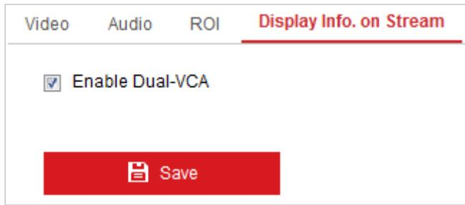

Figure 6-41 Display Info.on Stream Settings

- 2. Check the checkbox of Enable Dual-VCA, and the information of the objects (e.g., human, vehicle, etc.) will be marked in the video stream. And then you can set rules on the connected rear-end device to detect the events including line crossing, intrusion, etc.
## **6.5 Configuring Image Parameters**

### **6.5.1 Configuring Display Settings**

#### *Purpose:*

You can set the image quality of the camera, including brightness, contrast, saturation,

### sharpness, etc.

### *Steps:*

- 1. Enter the Display Settings interface:
### **Configuration > Image> Display Settings**

- 2. Set the image parameters of the camera.
*Note:* In order to guarantee the image quality in the different illumination, it provides two sets of parameters for user to configure.

### **Day/Night Auto-switch**

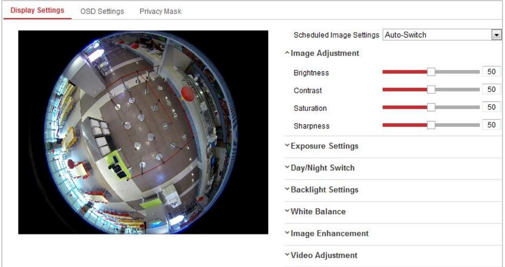

Figure 6-42 Display Settings of Day/night Auto-switch

### **Image Adjustment**

**Brightness** describes bright of the image, which ranges from 1 to 100, and the default value is 50.

**Contrast** describes the contrast of the image, which ranges from 1 to 100, and the default value is 50.

**Saturation** describes the colorfulness of the image color, which ranges from 1 to 100, and the default value is 50.

**Sharpness** describes the edge contrast of the image, which ranges from 1 to 100, and the default value is 50.

- **Exposure Settings**
**Iris Mode:** If the camera is equipped with the fixed lens, only **Manual** is selectable, and the iris mode is not configurable.

**Exposure Time:** It refers to the electronic shutter time, which ranges from 1/3 to 1/100,000s. Adjust it according to the actual luminance condition.

**Gain:** Gain of the image can also be manually configured from 0 to 100. The bigger the value is, the brighter would the image be, and the noise would also be amplified to a larger extent.

### **Day/Night Switch**

Select the day/night switch mode, and configure the smart supplement light settings from this option.

**Day:** the camera stays at day mode.

**Night:** the camera stays at night mode.

**Auto:** the camera switches between the day mode and the night mode according to the illumination automatically. The sensitivity ranges from 0 to 7, the higher the value is, the easier the mode switches. The **Filtering Time** refers to the time interval between the day/night switch. You can set it from 5s to 120s.

**Scheduled-Switch**: The camera switches between the day mode and the night mode according to the configured time period.

**Triggered by Alarm Input**: The camera switches to the day mode or the night mode after the alarm is triggered.

**Smart Supplement Light (Smart IR):** Smart Supplement Light function gives user an option to adjust the power of the IR LED, thus avoiding image over-exposure.

When the light is turned on, and Auto and Manual are selectable for IR mode. Select AUTO, and the IR LED changes according to the actual luminance. E.g., if the current scene is bright enough, then the IR LED adjusts itself to lower power; and if the scene is not bright enough, the IR LED adjusts itself to higher power.

Select Manual, and you can adjust the IR LED by adjusting the distance. The higher the value is, the higher the power of the light would be, and it can reach objects farther away.

#### **Backlight Settings**

**BLC:** If you focus on an object against strong backlight, the object will be too dark to be seen clearly. BLC compensates light to the object in the front to make it clear. OFF, Up, Down, Left, Right and Center are selectable.

**WDR:** Wide Dynamic Range can be used when there is a high contrast of the bright area and the dark area of the scene.

#### **White Balance**

White balance is the white rendition function of the camera used to adjust the color temperature according to the environment.

#### **Image Enhancement**

**Digital Noise Reduction:** DNR reduces the noise in the video stream. OFF, Normal Mode and Expert Mode are selectable. Under normal mode, set the DNR level from 0 to 100, and the default value is 50. Under expert mode, you can set Space DNR Level and Time DNR Level separately.

**Gray Scale:** You can choose the range of the grey scale as [0 to 255] or [16 to 235].

**Defog:** You can enable the defog function when the environment is foggy and the image is misty. It enhances the subtle details so that the image appears clearer.

#### **Video Adjustment**

**Mirror:** It mirrors the image so you can see it inversed. Left/Right, Up/Down, Center, and OFF are selectable.

**Video Standard**: 50 Hz and 60 Hz are selectable. Choose according to the different video standards. Normally, 50 Hz is for PAL standard and 60 Hz for NTSC standard.

*Note:* The display parameters vary according to the different camera model.

Please refer to the actual interface for details.

### **Day/Night Scheduled Switch**

Day/Night scheduled-switch configuration interface enables you to set the camera parameters for day and night separately, guaranteeing the image quality in different illumination.

| Start Time                                            | 06:00:00                                                           |              |
|-------------------------------------------------------|--------------------------------------------------------------------|--------------|
|                                                       |                                                                    | P            |
| End Time                                              | 18:00:00                                                           | 程            |
| ^ Day/Night Switch<br>Day/Night Switch<br>Sensitivity | Auto<br>4                                                          | ><br>><br>5  |
|                                                       |                                                                    | >            |
|                                                       | Common<br>Day<br>· Exposure Settings<br>Filtering Time<br>Smart IR | Night<br>OFF |

Figure 6-43 Day/Night Scheduled-Switch Setting

### *Steps:*

- 1. Click the calendar icon to select the start time and the end time of the switch.
### *Notes:*

- **•** The start time and end time refer to the valid time for day mode.
- **•** The time period can start and end on two days in a row. For example, if you set start time as 10:00 and end time as 1:00, the day mode will be activated at 10 o'clock in the morning and stopped at 1 o'clock early in the next morning.
- 2. Click Common tab to configure the common parameters applicable to the day mode and night mode.

*Note:* For the detailed information of each parameter, please refer to *Day/Night Auto-Switch* in *Section 6.5.1.*

- 3. Click Day tab to configure the parameters applicable for day mode.
- 4. Click Night tab to configure the parameters applicable for night mode.

*Note:* The settings saved automatically if any parameter is changed.

### **6.5.2 Configuring OSD Settings**

#### *Purpose:*

You can customize the camera name, time/date format, display mode, and OSD size displayed on the live view.

|                                        | OSD Settings | Privacy Mask                        |              |            |   |
|----------------------------------------|--------------|-------------------------------------|--------------|------------|---|
|                                        |              |                                     | Display Name |            |   |
|                                        |              |                                     | Display Date |            |   |
|                                        |              |                                     | Display Week |            |   |
|                                        |              |                                     | Camera Name  | Camera 01  |   |
|                                        |              |                                     | Time Format  | 24-hour    | > |
|                                        |              |                                     | Date Format  | MM-DD-YYYY |   |
|                                        |              |                                     | Text OverLay |            |   |
|                                        |              |                                     | ■ 1          | TEST 1     | S |
|                                        |              |                                     | ■ 2          | TEST 2     | 0 |
|                                        |              |                                     | ■ 3          | TEST 3     | 0 |
|                                        |              |                                     | 园 4          | TEST 4     | S |
|                                        |              |                                     |              |            |   |
|                                        |              | Not transparent & Not flashing<br>> |              |            |   |
|                                        | 32*32        | >                                   |              |            |   |
| Display Mode<br>OSD Size<br>Font Color |              | レ<br>Black&White Self-adaptive      |              |            |   |

Figure 6-44 OSD Settings

#### *Steps:*

- **1.** Enter the OSD Settings interface: **Configuration > Image > OSD Settings**.
- 2. Check the corresponding checkbox to select the display of camera name, date or week if required.
- 3. Edit the camera name in the text field of **Camera Name**.
- 4. Select from the drop-down list to set the time format and date format.
- 5. Select from the drop-down list to set the time format, date format, display mode, OSD size and OSD color.
- 6. Configure the text overlay settings.
	- (1) Check the checkbox in front of the textbox to enable the on-screen display.
- (2) Input the characters in the textbox.
- 7. Adjust the position and alignment of text frames.

Left align, right align and custom are selectable. If you select custom, you can use the mouse to click and drag text frames in the live view window to adjust their positions.

*Note:* The alignment adjustment is only applicable to Text Overlay items.

- 8. Click **Save** to save the settings.
*Note:* OSD function may vary from model to model.

### **6.5.3 Configuring Privacy Mask**

### *Purpose:*

Privacy mask enables you to cover certain areas on the live video to prevent certain spots in the surveillance area from being live viewed and recorded.

### *Steps:*

- 1. Enter the Privacy Mask Settings interface:
### **Configuration > Image > Privacy Mask**

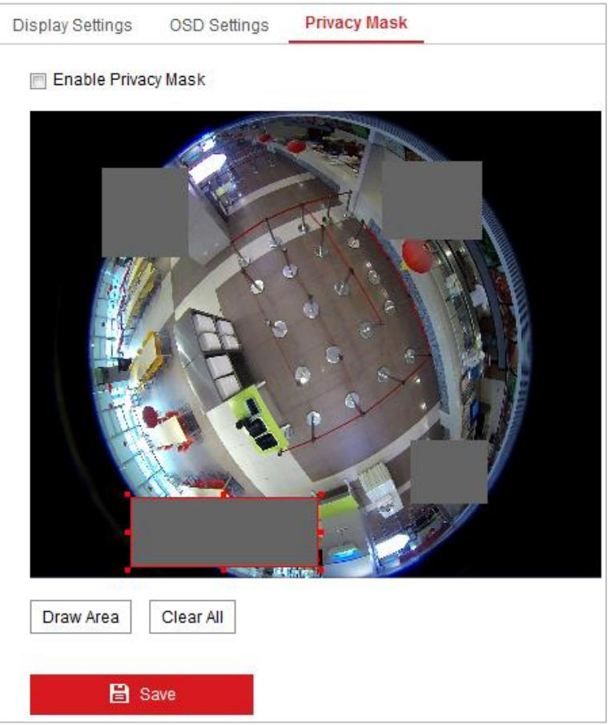

Figure 6-45 Privacy Mask Settings

- 2. Check the checkbox of **Enable Privacy Mask** to enable this function.
- 3. Click the **Draw Area** button to start drawing.
- 4. Click-and-drag the mouse in the live video window to draw the mask area.
- 5. Click **Stop Drawing** to finish drawing.
- 6. You can click **Clear All** to clear all the configured privacy masks.
- 7. Click **Save** to save the settings.

*Note:* Up to 4 privacy masks are configurable.

# **6.6 Configuring Event Settings**

This section explains how to configure the network camera to respond to alarm events, including motion detection, video tampering, alarm input, alarm output, exception, line crossing detection and intrusion detection, etc. These events can trigger the linkage methods, such as Notify Surveillance Center, Send Email, Trigger Alarm

Output, Trigger Recording/Trigger Channel, etc.

*Note:* Check the checkbox of **Notify Surveillance Center** if you want to push the alarm information to the surveillance client such as the mobile phone, computer, etc., as soon as the alarm is triggered.

### **6.6.1 Configuring Motion Detection**

### *Purpose:*

Motion detection detects the moving objects in the configured surveillance area, and a series of actions can be taken when the alarm is triggered.

In order to detect the moving objects accurately and reduce the false alarm rate, normal configuration and expert configuration are selectable for different motion detection environment.

### ● **Normal Configuration**

Normal configuration adopts the same set of motion detection parameters in the daytime and at night.

### *Tasks 1: Set the Motion Detection Area*

### *Steps:*

- 1. Enter the Motion Detection Settings interface.
**Configuration > Event > Basic Event > Motion Detection**

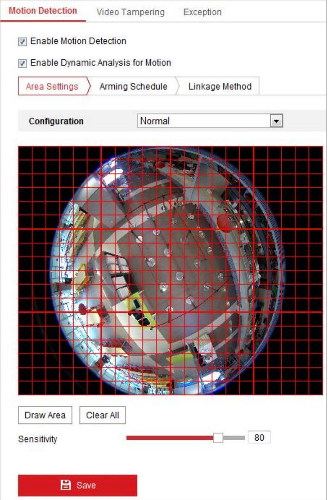

Figure 6-46 Motion Detection Settings

- 2. Check the checkbox of **Enable Motion Detection**.
- 3. (Optional) Check the checkbox of **Enable Dynamic Analysis for Motion** if you want to mark the detected objects with green rectangles on the live view window.

*Note:* You can go to **Configuration > Local Configuration > Live View Parameters**, and then select Disable for **Rules** if you don't want the detected objected displayed with the rectangles.

- 4. Click **Draw Area**. Click and drag the mouse on the live video to draw a motion detection area. Click **Stop Drawing** to finish drawing one area.
- 5. (Optional) Click **Clear All** to clear all of the areas.

- 6. (Optional) Move the slider to set the sensitivity of the detection.
## *Task 2: Set the Arming Schedule for Motion Detection Steps:*

- 1. Click **Arming Schedule** to edit the arming schedule.
Figure 6-47 Arming Schedule Setting

- 2. Click on the time bar and drag the mouse to select the time period. *Note:* Click on the selected time period, you can adjust the time period to the desired time by either moving the time bar or input the exact time period.
- 3. (Optional) Click **Delete** to delete the current arming schedule, or click **Save** to save the settings.
- 4. Move the mouse to end of each day, a green copy icon appears. You can click the icon to copy the current time schedule to other days.
- 5. Click **Save** to save the settings.

*Note:* The time of each period can't be overlapped. Up to 8 periods can be configured for each day.

### *Task 3: Set the Linkage Method for Motion Detection*

Click Linkage Method and check the checkbox to select the linkage method. Notify surveillance center, send email, upload to FTP/memory card/NAS, trigger channel (or trigger recording), and trigger alarm output are selectable. You can specify the linkage method when an event occurs.

| Arming Schedule<br>Area Settings<br>Linkage Method          |                      |                 |  |  |  |  |
|-------------------------------------------------------------|----------------------|-----------------|--|--|--|--|
| Normal Linkage                                              | Trigger Alarm Output | Trigger Channel |  |  |  |  |
| Send Email<br>Notify Surveillance Center<br>7 Upload to FTP | A->1                 | A1              |  |  |  |  |

Figure 6-48 Linkage Method Settings

- **Send Email:** Send an email with alarm information to a user or users when an event occurs.
*Note:* To send the Email when an event occurs, please refer to *Section 6.3.8*  to complete Email setup in advance.

- **Notify Surveillance Center:** Send an exception or alarm signal to remote management software when an event occurs.
- **Upload to FTP/Memory Card/NAS:** Capture the image when an alarm is triggered and upload the picture to a FTP server.

#### *Notes:*

- **•** Set the FTP address and the remote FTP server first. Refer to *Section 6.3.7 Configuring FTP Settings* for detailed information.
- **•** Go to **Configuration > Storage > Schedule Settings > Capture >**

**Capture Parameters** page, enable the event-triggered snapshot, and set the capture interval and capture number.

- **•** The captured image can also be uploaded to the available memory card or network disk.
### **Trigger Channel (or Trigger Recording)**

The video will be recorded when the motion is detected. You have to set the recording schedule to realize this function. Please refer to *Section 7.1* for detailed information.

### **Trigger Alarm Output**

Trigger one or more external alarm outputs when an event occurs.

*Note:* To trigger an alarm output when an event occurs, please refer to *Section 6.7.46.6.4 Configuring Alarm Output* to set the related parameters.

### ● **Expert Mode**

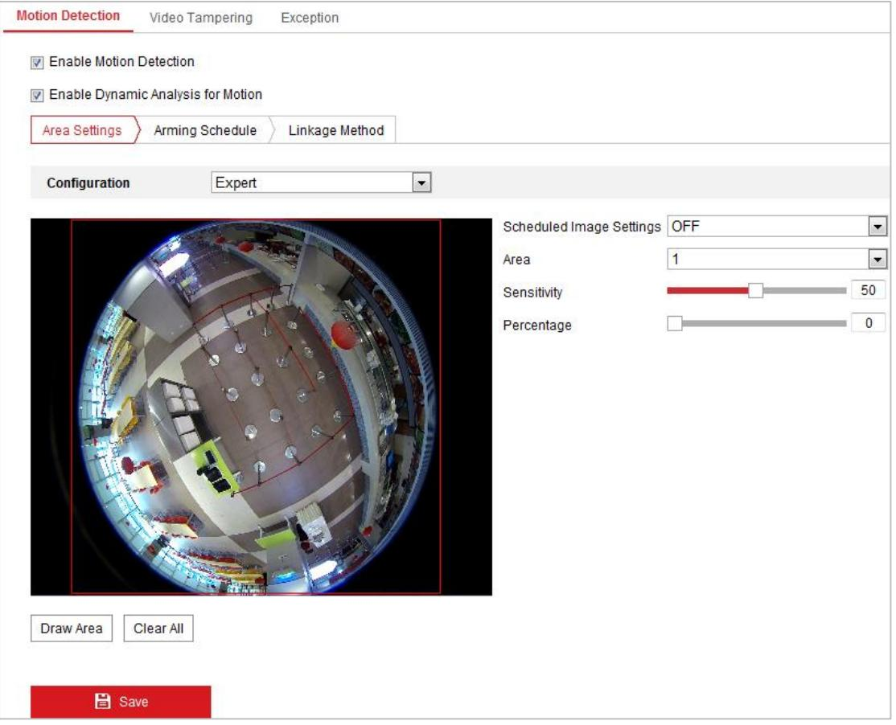

Figure 6-49 Motion Detection Settings-Expert Mode

If Expert is selected as the configuration mode, different sets of parameters are adopted for motion detection at day and night.

- Scheduled Image Settings: **OFF**
#### *Steps:*

- (1) Draw the detection area as in the normal configuration mode. The supported area number varies according to different camera models.
- (2) Select OFF for Scheduled Image Settings.
- (3) Select the area by clicking the area No..
- (4) Slide the cursor to adjust the sensitivity and proportion of object in the area for the selected area.

**Sensitivity:** The greater the value is, the easier the alarm will be triggered. **Percentage:** When the size of the moving object exceeds the set percentage of the predefined area, the alarm will be triggered. The smaller the percentage is, the easier the alarm will be triggered.

- (5) Set the arming schedule and linkage method as in the normal configuration mode.
- (6) Click **Save** to save the settings.
- Scheduled Image Settings: **Auto-Switch**

#### *Steps:*

- (1) Draw the detection area as in the normal configuration mode. The supported area varies according to the different camera models.
- (2) Select Auto-Switch for Scheduled Image Settings.
- (3) Select the area by clicking the area No..
- (4) Slide the cursor to adjust the sensitivity and proportion of object in the area for the selected area in the daytime.
- (5) Slide the cursor to adjust the sensitivity and proportion of object in the area for the selected area at night.
- (6) Set the arming schedule and linkage method as in the normal configuration mode..
- (7) Click **Save** to save the settings.
- Scheduled Image Settings: Scheduled-Switch

### *Steps:*

- (1) Draw the detection area as in the normal configuration mode. The supported area number varies according to different camera models.
- (2) Select Scheduled-Switch for Scheduled Image Settings.
- (3) Select the start time and end time for the switching timing.
- (4) Select the area by clicking the area No..
- (5) Slide the cursor to adjust the sensitivity and proportion of object in the area for the selected area in the daytime.
- (6) Slide the cursor to adjust the sensitivity and proportion of object in the area for the selected area at night.
- (7) Set the arming schedule and linkage method as in the normal configuration mode.
- (8) Click **Save** to save the settings.

### **6.6.2 Configuring Video Tampering Alarm**

#### *Purpose:*

You can configure the camera to trigger the alarm when the lens is covered and take alarm response action.

### *Steps:*

- 1. Enter the Video Tampering Settings interface:
#### **Configuration > Event > Basic Event > Video Tampering**

- 2. Check the checkbox of **Enable** to enable video tampering detection function.
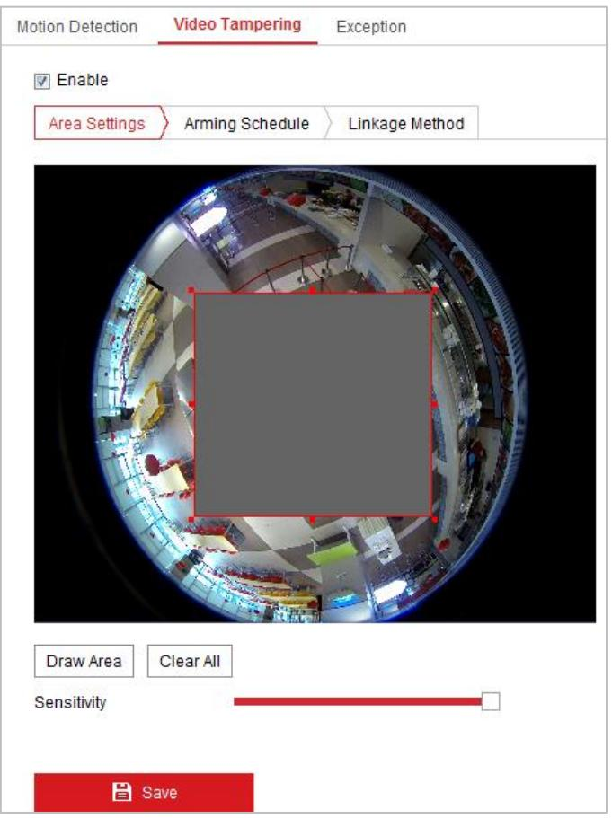

Figure 6-50 Video Tampering Detection Settings

- 3. Draw the detection area as in the normal configuration mode.
- 4. Move the slider to set the sensitivity.
- 5. Click **Arming Schedule** to set arming schedule as that in *Task 2 Set the Arming Schedule for Motion Detection in Section 6.6.1*.
- 6. Click **Linkage Method** to set linkage method as that in *Task 3 Set the Linkage Method for Motion Detection in Section 6.6.1*.
- 7. Click **Save** to save the settings.

### **6.6.3 Configuring Alarm Input**

### *Steps:*

- 1. Enter the Alarm Input Settings interface:
### **Configuration > Events > Basic Event > Alarm Input**

| Alarm Input No.<br>Alarm Type |                 | NO |                |   |    | レ  | IP Address<br>Alarm Name |    | Local |    |    | (cannot copy) |         |
|-------------------------------|-----------------|----|----------------|---|----|----|--------------------------|----|-------|----|----|---------------|---------|
| 7 Enable Alarm Input Handling |                 |    |                |   |    |    |                          |    |       |    |    |               |         |
|                               | Arming Schedule |    | Linkage Method |   |    |    |                          |    |       |    |    |               |         |
| ×                             | Delete          | 07 | Delete All     |   |    |    |                          |    |       |    |    |               |         |
|                               | 0               | 2  | 4              | 6 | 00 | 10 | 12                       | 14 | 16    | 18 | 20 | 22            | 24      |
| Mon                           | 0               | 2  | 4              | 6 | 00 | 10 | 12                       | 14 | 16    | 18 | 20 | 22            | 1<br>24 |
| Tue                           |                 |    |                |   |    |    |                          |    |       |    |    |               |         |
| Wed                           | 0               | 2  | 4              | 6 | 8  | 10 | 12                       | 14 | 16    | 18 | 20 | 22            | 24      |
|                               | 0               | 2  | 4              | 6 | 8  | 10 | 12                       | 14 | 16    | 18 | 20 | 22            | 24      |
| Thu                           |                 |    |                |   |    |    |                          |    |       |    |    |               |         |
| Fri                           | 0               | 2  | 4              | 6 | 00 | 10 | 12                       | 14 | 16    | 18 | 20 | 22            | 24      |
|                               | 0               | 2  | 4              | б | 00 | 10 | 12                       | 14 | 16    | 18 | 20 | 22            | 24      |
| Sat                           |                 |    |                |   |    |    |                          |    |       |    |    |               |         |
| Sun                           |                 |    |                |   |    |    |                          |    |       |    |    |               |         |
|                               | 0               | 2  | 4              | 6 | 00 | 10 | 12                       | 14 | 16    | 18 | 20 | 22            | 24      |

User Manual of Network Fisheye Camera

Figure 6-51 Alarm Input Settings

- 2. Choose the alarm input No. and the Alarm Type. The alarm type can be NO (Normally Open) and NC (Normally Closed). Edit the alarm name (optional).
- 3. Check the checkbox of **Enable Alarm Input Handling** to enable the function.
- 4. Set the arming schedule*.* Refer to *Task 2: Set Arming Schedule for Motion Detection in Section 6.6.1.*
- 5. Set the linkage method. Refer to *Task 3: Set Linkage Method for Motion Detection in Section 6.6.1.*
- 6. (Optional) You can copy your settings to other alarm inputs.
- 7. Click **Save** to save the settings.

*Note:* Alarm input is not supported by certain camera models.

### **6.6.4 Configuring Alarm Output**

### *Steps:*

- 1. Enter the Alarm Output Settings interface:
### **Configuration > Events > Basic Event > Alarm Output**

- 2. Select one alarm output channel in the Alarm Output drop-down list.
- 3. (Optional) Input the alarm output name in the text field.
- 4. The **Delay** time can be set to 5sec, 10sec, 30sec, 1min, 2min, 5min, 10min or Manual*.* The delay time refers to the time duration that the alarm output remains in effect after alarm occurs.
- 5. Set the arming schedule*.* Refer to *Task 2: Set Arming Schedule for Motion Detection in Section 6.6.1.*
- 6. (Optional) You can copy the settings to other alarm outputs.
- 7. Click Manual Alarm to trigger an alarm manually. Click Clear Alarm to cancel the alarm.
- 8. Click **Save** to save the settings.

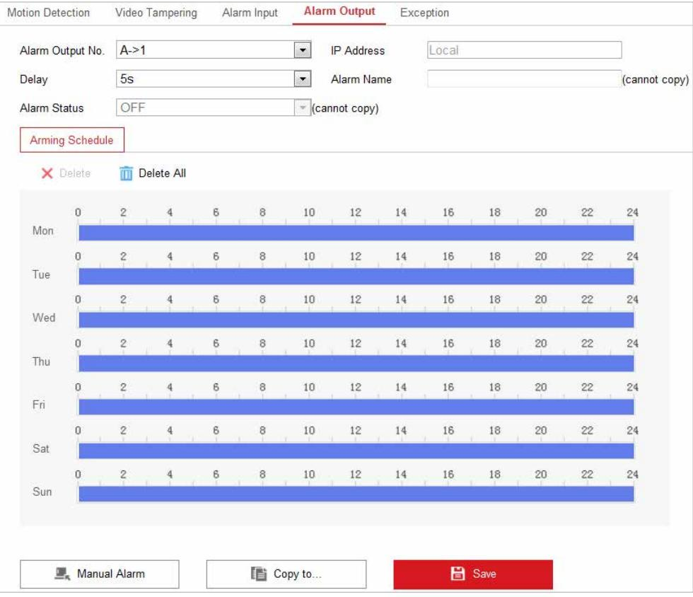

Figure 6-52 Alarm Output Settings

*Note:* Alarm output is not supported by certain camera models.

### **6.6.5 Handling Exception**

The exception type can be HDD full, HDD error, network disconnected, IP address conflicted and illegal login to the cameras.

### *Steps:*

- 1. Enter the Exception Settings interface:
### **Configuration > Event > Basic Event > Exception**

- 2. Check the checkbox to select the linkage method taken for exception. For details, refer to *Task 3: Set Linkage Method for Motion Detection* in *Section 6.6.1.*

| Motion Detection             | Video Tampering | Alarm Input | Alarm Output         | Exception |
|------------------------------|-----------------|-------------|----------------------|-----------|
| Exception Type               | HDD Full        |             | P                    |           |
| Normal Linkage               |                 | 1971        | Trigger Alarm Output |           |
| Send Email                   |                 | A->1        |                      |           |
| J Notify Surveillance Center |                 |             |                      |           |

Figure 6-53 Exception Settings

- 3. Click **Save** to save the settings.
### **6.6.6 Configuring Line Crossing Detection**

### *Purpose:*

Line crossing detection function detects people, vehicle or other objects which cross a pre-defined virtual line, and some certain actions can be taken when the alarm is triggered.

### *Steps:*

- 1. Enter the Line Crossing Detection settings interface:
### **Configuration > Events > Smart Event > Line Crossing Detection**

- 2. Check the checkbox of **Enable** to enable the function.
- 3. Select the line from the dropdown list for detection setting.
- 4. Click the **Draw Area** button, and a virtual line is displayed on the live video.

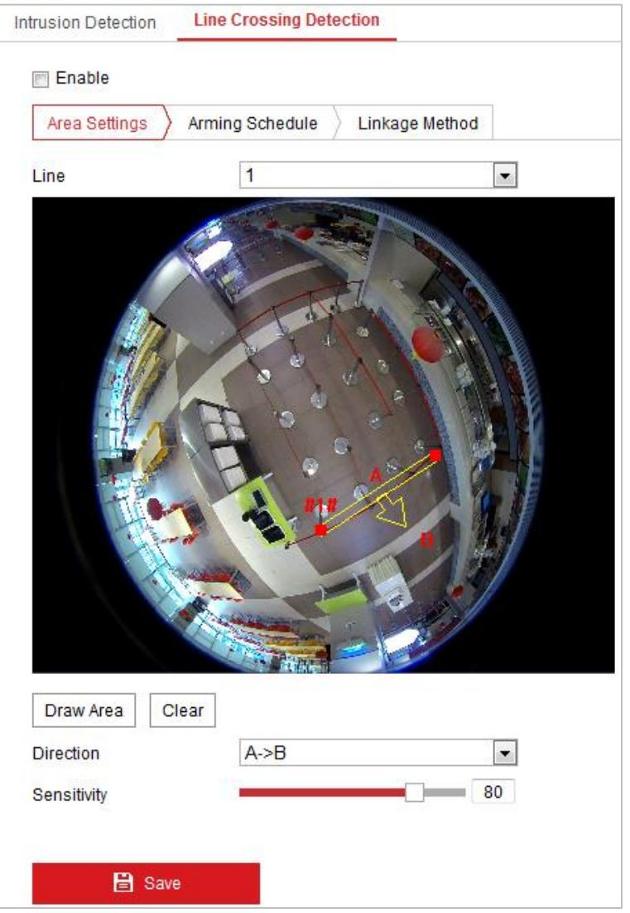

Figure 6-54 Line Crossing Detection Setting

- 5. Click-and-drag the line, and you can locate it on the live video as desired. Click on the line, two red squares are displayed on each end, and you can click-and-drag one of the red squares to define the shape and length of the line.
- 6. Select the direction for line crossing detection. And you can select the directions as A<->B, A ->B, and B->A.

**A<->B:** Only the arrow on the B side shows; when an object going across the plane with both direction can be detected and alarms are triggered.

**A->B:** Only the object crossing the configured line from the A side to the B side can be detected.

**B->A:** Only the object crossing the configured line from the B side to the A side

can be detected.

- 7. Click-and-drag the slider to set the detection sensitivity.
**Sensitivity:** Range [1 to 100]. The higher the value is, the more easily the line crossing action can be detected.

- 8. You can click the **Clear** button to clear the pre-defined line.
- 9. Set the arming schedule*.* Refer to *Task 2: Set Arming Schedule for Motion Detection in Section 6.6.1.*
- 10. Set the linkage method. Refer to *Task 3: Set Linkage Method for Motion Detection in Section 6.6.1.*
- 11. Click **Save** to save the settings.

### **6.6.7 Configuring Intrusion Detection**

### *Purpose:*

Intrusion detection function detects people, vehicle or other objects which enter and loiter in a pre-defined virtual region, and some certain actions can be taken when the alarm is triggered.

### **Steps:**

- 1. Enter the Intrusion Detection settings interface:
### **Configuration > Event > Smart Event > Intrusion Detection**

- 2. Check the checkbox of **Enable** to enable the function.
- 3. Select the region from the drop-down list for detection settings.
- 4. Click the **Draw Area** button to start the region drawing.
- 5. Click on the live video to specify the four vertexes of the detection region, and right click to complete drawing.

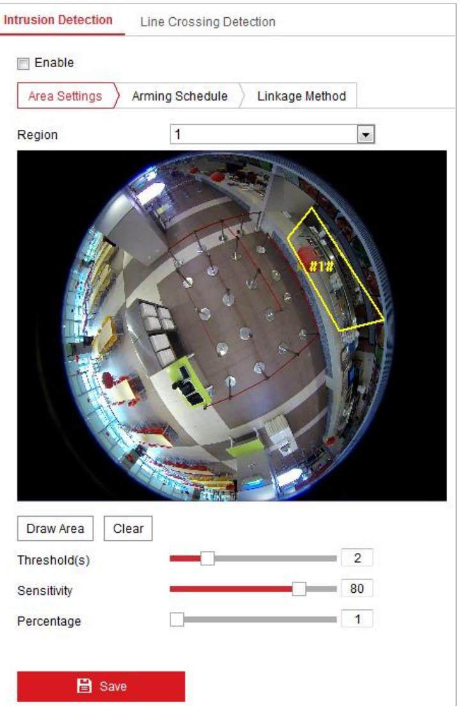

Figure 6-55 Intrusion Detection Settings

- 6. Set the time threshold, detection sensitivity and object percentage for intrusion detection.
**Threshold:** Range [0 to 10]s, the threshold for the time of the object loitering in the region. If you set the value as 0, alarm is triggered immediately after the object entering the region.

**Sensitivity:** Range [1 to 100]. The value of the sensitivity defines the size of the object which can trigger the alarm. When the sensitivity is high, a very small object can trigger the alarm.

**Percentage:** Range [1 to 100]. Percentage defines the ratio of the in-region part of the object which can trigger the alarm. For example, if the percentage is set as 50%, when the object enters the region and occupies half of the whole region, the alarm is triggered.

- 7. You can click the **Clear** button to clear the pre-defined region.
- 8. Set the arming schedule*.* Refer to *Task 2: Set Arming Schedule for Motion Detection in Section 6.6.1.*
- 9. Set the linkage method. Refer to *Task 3: Set Linkage Method for Motion Detection in Section 6.6.1.*
- 10. Click **Save** to save the settings.

# **Chapter 7 Storage Settings**

# **7.1 Configuring Recording Schedule**

### *Purpose:*

There are two kinds of recording for the cameras: manual recording and scheduled recording. For the manual recording, refer to *Section 5.3 Recording and Capturing Pictures Manually*. In this section, you can follow the instructions to configure the scheduled recording. By default, the record files of scheduled recording are stored in the memory card (if supported) or in the network disk.

### *Steps:*

- 1. Enter the Record Schedule Settings interface:
### **Configuration > Storage > Schedule Settings > Record Schedule**

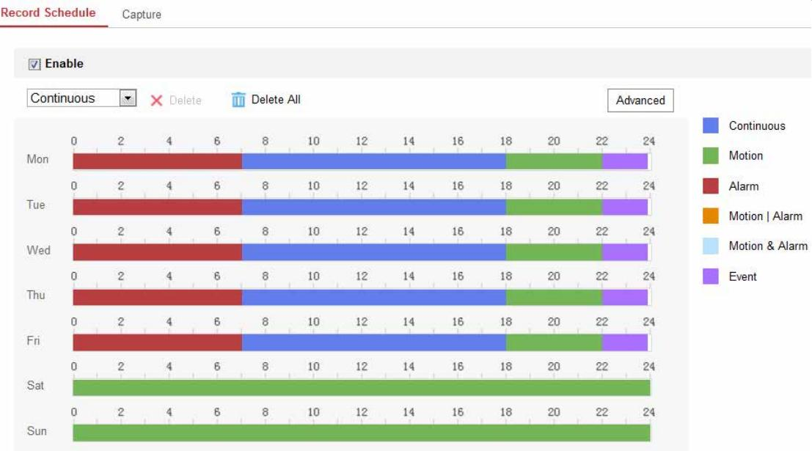

Figure 7-1 Recording Schedule Interface

- 2. Check the checkbox of **Enable** to enable scheduled recording.
- 3. Click **Advanced** to set the camera record parameters, including overwrite, pre-record, post-record and stream type.

| Advanced       |             |    | ×      |
|----------------|-------------|----|--------|
| Overwrite<br>ਹ |             |    |        |
| Pre-record     | 55          |    | >      |
| Post-record    | 55          |    |        |
| Stream Type    | Main Stream |    | V      |
|                |             | OK | Cancel |

Figure 7-2 Record Parameters

**Pre-record:** The time you set to start recording before the scheduled time or the event. For example, if an alarm triggers recording at 10:00, and the pre-record time is set as 5 seconds, the camera starts to record at 9:59:55.

The Pre-record time can be configured as No Pre-record, 5 s, 10 s, 15 s, 20 s, 25 s, 30 s or not limited.

**Post-record:** The time you set to stop recording after the scheduled time or the event. For example, if an alarm triggered recording ends at 11:00, and the post-record time is set as 5 seconds, the camera records until 11:00:05.

The Post-record time can be configured as 5 s, 10 s, 30 s, 1 min, 2 min, 5 min or 10 min.

**Overwrite:** Check the checkbox of **Overwrite**, and then the data will be overwritten when HDD or network disk becomes full. If you uncheck it, the recording will stop when HDD or network disk becomes full.

### *Note:*

The local storage (SD card/micro SD card) doesn't support overwrite function.

**Recording Stream:** Set the stream type for recording. Main Stream and Sub Stream are selectable.

- 4. Select record type from the drop-down list. Continuous, Motion, Alarm, Motion | Alarm, Motion & Alarm, and Event are selectable.
### **Continuous**

If you select **continuous**, the video will be recorded automatically according to the time of the schedule.

#### **Record Triggered by Motion Detection**

If you select **Motion**, the video will be recorded when the motion is detected. Besides configuring the recording schedule, you have to set the motion detection area and check the checkbox of **Trigger Channel** in the **Linkage Method** of Motion Detection Settings interface. For detailed information, please refer to *Section 6.6.1 Configuring Motion Detection.* 

#### **Record Triggered by Alarm**

If you select **Alarm**, the video will be recorded when the alarm is triggered via the external alarm input channels.

Besides configuring the recording schedule, you have to set the **Alarm Type** and check the checkbox of **Trigger Channel** in the **Linkage Method** of **Alarm Input Settings** interface. For detailed information, please refer to *Section 6.6.3 Configuring Alarm Input*.

#### **Record Triggered by Motion & Alarm**

If you select **Motion & Alarm**, the video will be recorded when the motion and alarm are triggered at the same time.

Besides configuring the recording schedule, you have to configure the settings on the **Motion Detection** and **Alarm Input Settings** interfaces. Please refer to *Section 6.6.1* and *Section 6.6.3* for detailed information*.* 

### **Record Triggered by Motion | Alarm**

If you select **Motion | Alarm**, the video will be recorded when the external alarm is triggered or the motion is detected.

Besides configuring the recording schedule, you have to configure the settings on the **Motion Detection** and **Alarm Input Settings** interfaces. Please refer to *Section 6.6.1* and *Section 6.6.3* for detailed information*.* 

### **Record Triggered by Line Crossing Detection**

If you select **Line Crossing Detection**, the video will be recorded when the line crossing event is detected.

Besides configuring the recording schedule, you have to set the detection line

and check the checkbox of **Trigger Channel** in the **Linkage Method** of Line Crossing Detection Settings interface. For detailed information, please refer to *Section 6.6.6 Configuring Line Crossing Detection.* 

### **Record Triggered by Intrusion Detection**

If you select **Intrusion Detection**, the video will be recorded when the intrusion event is detected.

Besides configuring the recording schedule, you have to set the intrusion detection area and check the checkbox of **Trigger Channel** in the **Linkage Method** of Intrusion Detection Settings interface. For detailed information, please refer to *Section 6.6.7 Configuring Intrusion Detection.* 

### **Record Triggered by Event**

If you select **Event**, the video will be recorded when **Line Crossing Detection** or **Intrusion Detection** is triggered.

Besides configuring the recording schedule, you have to set the Line Crossing Detection and Intrusion Detection and check the checkbox of **Trigger Channel** in the Linkage Method. Refer to *Section 6.6.6* and S*ection 6.6.7* for detailed information.

- 5. Click and drag the mouse on the time bar to set the record schedule. Up to 8 time segments can be set for each day.
- 6. Click the time segment, you can change the record type and edit the start and stop time of the time segment.

|    | Continuous |               |    |  |
|----|------------|---------------|----|--|
| 00 | 05         | 04            | 02 |  |
|    |            | Delete   Save |    |  |
|    |            |               |    |  |

Figure 7-3 Editing Time Schedule

- 7. Click and copy the time schedule to other days as desired.
- 8. Click **Save** to save the settings.

# **7.2 Configuring Capture Setting**

### *Purpose:*

You can configure the scheduled capture and event-triggered capture. The captured picture can be stored in the memory card (if supported) or in the network disk (For details, please refer to *Section 7.3 Configuring Net HDD*). The captured pictures can also be uploaded to a FTP server.

### *Steps:*

- 1. Enter **Capture** setting interface: **Configuration > Storage > Schedule Setting**
- 2. Go to **Capture Schedule** tab to configure the capture schedule by click-and-drag the mouse on the time bar.

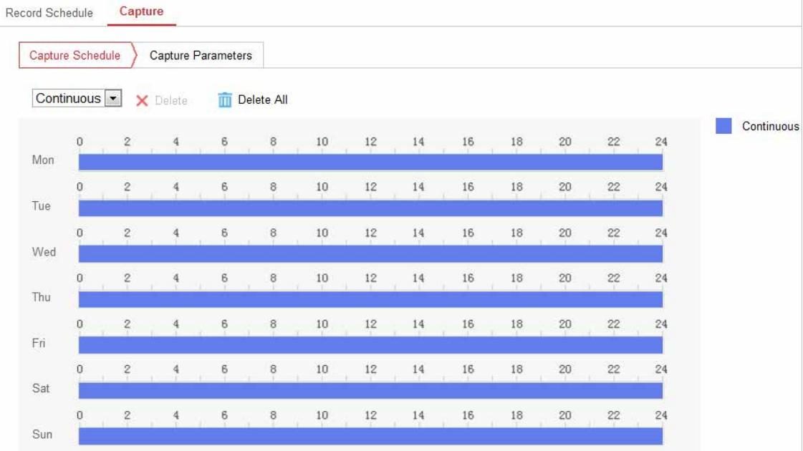

Figure 7-4 Capture Schedule Setting

- 3. Click **Save** to save the settings.
- 4. Go to **Capture Parameters** tab to configure the capture parameters.
	- 1) Check the **Enable Timing Snapshot** checkbox to enable continuous capture.
	- 2) Select the picture format, resolution, quality and capture interval.
	- 3) Check the **Enable Event-triggered Snapshot** checkbox to enable event-triggered capture.

*Note:* Select **Upload to FTP/Memory Card/NAS** as the linkage method for

the events, including motion detection, alarm input, line crossing detection and intrusion detection. For details, please refer to *Section 6.6*.

- 4) Select the picture format, resolution, quality, capture interval, and capture number.
- 5. Click **Save** to save the settings.
- 6. (Optional) To upload the captured pictures to the FTP server, configure the FTP parameters and check **Upload Picture** checkbox in FTP Settings interface. For details, please refer to *Section 6.3.7 Configuring FTP Settings*.

## **7.3 Configuring Net HDD**

#### *Before you start:*

The network disk should be available within the network and properly configured to store the recorded files, log files, etc.

#### *Steps:*

- 1. Add Net HDD.
	- (1) Enter the Net HDD settings interface, **Configuration** > **Storage** > **Storage**

#### **Management** > **Net HDD**.

| Net HDD<br>HDD Management   |                   |                 |      |        |  |
|-----------------------------|-------------------|-----------------|------|--------|--|
| Net HDD                     |                   |                 |      |        |  |
| HDD No.                     | Server Address    | File Path       | Type | Delete |  |
| 5                           | 10.10.36.61       | /cxy_1          | NAS  | ×      |  |
| SMB/CIFS -<br>Mounting Type | User Name<br>cxy1 | Password<br>    |      | Test   |  |
| 2                           | 10.10.36.252      | ldvrlyangjian_1 | nas  | ×      |  |
| 3                           |                   |                 | NAS  | ×      |  |

Figure 7-5 Add Network Disk

- (2) Enter the IP address of the network disk, and enter the file path.
- (3) Select the mounting type. NFS and SMB/CIFS are selectable. And you can set the user name and password to guarantee the security if SMB/CIFS is selected.

*Note:* Please refer to the *NAS User Manual* for creating the file path.


- *For your privacy and to better protect your system against security risks, we strongly recommend the use of strong passwords for all functions and network devices. The password should be something of your own choosing (using a minimum of 8 characters, including at least three of the following categories: upper case letters, lower case letters, numbers and special characters) in order to increase the security of your product.*
- *Proper configuration of all passwords and other security settings is the responsibility of the installer and/or end-user.*
- (4) Click **Save** to add the network disk.
- 2. Initialize the added network disk.
	- (1) Enter the HDD Settings interface, **Configuration > Storage > Storage Management > HDD Management**, in which you can view the capacity, free space, status, type and property of the disk.

|     | HDD Management        | Net HDD  |         |            |        |      |          |          |
|-----|-----------------------|----------|---------|------------|--------|------|----------|----------|
|     | HDD Management        |          |         |            |        |      |          | Format   |
| মি  | HDD No.               | Capacity |         | Free space | Status | Type | Property | Progress |
| তি  | 9                     | 9.84GB   |         | 0.00GB     | Normal | NAS  | RW       |          |
| । স | 10                    | 10.00GB  |         | 6.75GB     | Normal | NAS  | RW       |          |
|     |                       |          |         |            |        |      |          |          |
|     |                       |          |         |            |        |      |          |          |
|     |                       |          |         |            |        |      |          |          |
|     |                       |          |         |            |        |      |          |          |
|     |                       |          |         |            |        |      |          |          |
|     | Quota                 |          |         |            |        |      |          |          |
|     | Max.Picture Capacity  | 4 50GB   |         |            |        |      |          |          |
|     | Free Size for Picture |          | 0.00GB  |            |        |      |          |          |
|     | Max. Record Capacity  |          | 14.25GB |            |        |      |          |          |
|     | Free Size for Record  |          | 6.75GB  |            |        |      |          |          |

Figure 7-6 Storage Management Interface

- (2) If the status of the disk is **Uninitialized**, check the corresponding checkbox to select the disk and click **Format** to start initializing the disk.
When the initialization completed, the status of disk will become **Normal.**

| HDD Management |          |            |            |      |          | SB1 | Format   |
|----------------|----------|------------|------------|------|----------|-----|----------|
| HDD No.        | Capacity | Free space | Status     | Type | Property |     | Progress |
| 9              | 20.00GB  | 0.00GB     | Formatting | NAS  | RW       |     |          |

Figure 7-7 View Disk Status

- 3. Define the quota for record and pictures.
	- (1) Input the quota percentage for picture and for record.
	- (2) Click **Save** and refresh the browser page to activate the settings.

| Quota                 |         |   |
|-----------------------|---------|---|
| Max.Picture Capacity  | 4.75GB  |   |
| Free Size for Picture | 4.75GB  |   |
| Max. Record Capacity  | 14.50GB |   |
| Free Size for Record  | 14.50GB |   |
| Percentage of Picture | 25      | % |
| Percentage of Record  | 75      | % |
|                       |         |   |
| Save                  |         |   |

Figure 7-8 Quota Settings

### *Notes:*

- Up to 8 NAS disks can be connected to the camera.
- To initialize and use the memory card after insert it to the camera, please refer to the steps of NAS disk initialization.

## **7.4 Memory Card Detection**

#### *Purpose:*

With memory card detection, you can view the memory card status, lock your memory card, and receive notification when your memory card is detected abnormal. *Note:* Memory card detection function is only supported by certain types of memory cards and camera models. If this tab page doesn't show on your web page, it means either that your camera doesn't support the function, or your installed memory card is not supported for this function. You can contact the dealer or the retailer for the information of memory card that supports the function.

### *Steps:*

- 1. Enter Memory Card Detection configuration interface:
### **Configuration > Storage > Storage Management > Memory Card Detection**

| HDD Management     | Net HDD | Memory Card Detection             |        |
|--------------------|---------|-----------------------------------|--------|
| Status Detection   | RW Lock | Linkage Method<br>Arming Schedule |        |
| Remaining Lifespan |         |                                   | 99%    |
| Health Status      |         |                                   | Normal |
|                    |         |                                   |        |
| 글 Save             |         |                                   |        |

Figure 7-9 Memory Card Detection

- 2. View the memory card status on **Status Detection** tab.
**Remaining Lifespan:** It shows the percentage of the remaining lifespan. The lifespan of a memory card may be influenced by factors such as its capacity and the bitrate. You need to change the memory card if the remaining lifespan is not enough.

**Health Status:** It shows the condition of your memory card. There are thrree status descriptions, good, bad, and damaged. You will receive a notification if the health status is anything other than good when the **Arming Schedule** and **Linkage Method** are set.

*Note:* It is recommended that you change the memory card when the health status is not "good".

- 3. Click **R/W Lock** tab to add a lock to the memory card.
With the R/W lock added, the memory card can only be read and write when it is unlocked.

| HDD Management    | Net HDD | Memory Card Detection |                |
|-------------------|---------|-----------------------|----------------|
| Status Detection  | RW Lock | Arming Schedule       | Linkage Method |
| Lock Switch       | ON      |                       |                |
| Password Settings |         |                       |                |
|                   |         |                       |                |
| 글 Save            |         |                       |                |

### Figure 7-10 R/W Lock Setting

- Add a Lock
- (1) Select the **Lock Switch** as ON.
- (2) Input the password.
- (3) Click **Save** to save the settings.
- Unlock
- (1) If you use the memory card on the camera that locks it, unlocking will be done automatically and no unlocking procedures are required on the part of users.
- (2) If you use the memory card (with a lock) on a different camera, you can go to **HDD Management** interface to unlock the memory card manually. Select the memory card, and click the **Unlock** button shown next to the **Format** button. Then input the correct password to unlock it.

#### *Notes:*

- **•** The memory card can only be read and written in when it is unlocked.
- **•** If the camera, which adds a lock to a memory card, is restored to the factory settings, you can go to the HDD Management interface to unlock the memory card.
- Remove the Lock
- (1) Select the **Lock Switch** as **OFF**.
- (2) Input the correct password in **Password Settings** text field.
- (3) Click **Save** to save the settings.
- 4. Set the **Arming Schedule** and **Linkage Method**, if you want to receive a notification when the health status of the memory card is anything other than good. Refer to *Task 2: Set the Arming Schedule for Motion Detection* and *Task 3: Set the Linkage Method for Motion Detection* in *Section 6.6.1.*
- 5. Click **Save** to save the settings.

# **Chapter 8 Playback**

### *Purpose:*

This section explains how to view the remotely recorded video files stored in the network disks or memory card.

### *Note:*

You can also search the records files and play it back in different playback modes via iVMS-4200 client software. Please refer to the User Manual of iVMS-4200 Client Software for detailed instructions.

### *Steps:*

- 1. Click **Playback** on the menu bar to enter playback interface.
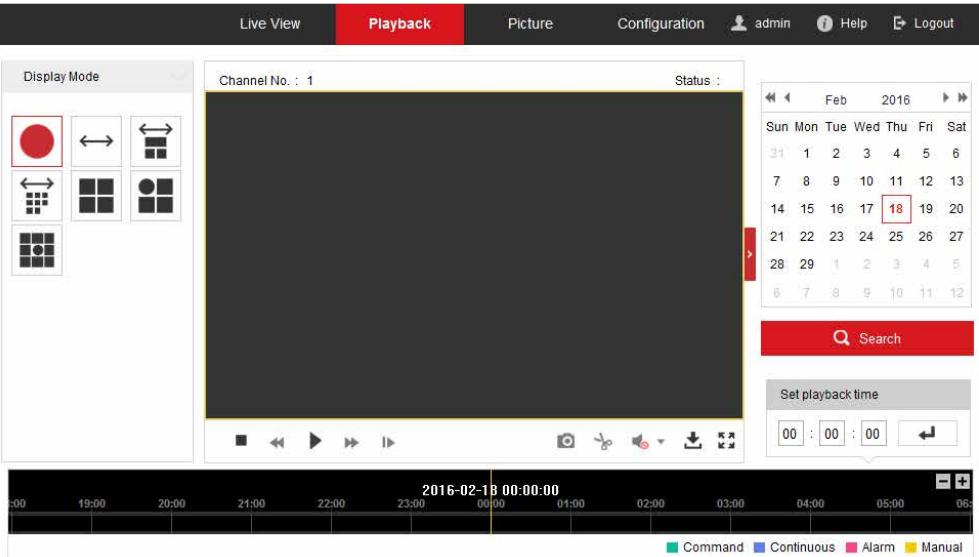

Figure 8-1 Playback Interface

- 2. Select the date and click **Search**.

|   |         |     | 4 4 Feb 2016                |            |   | - > >> |
|---|---------|-----|-----------------------------|------------|---|--------|
|   |         |     | Sun Mon Tue Wed Thu Fri Sat |            |   |        |
|   |         |     | 31 1 2 3 4                  |            |   | 5 6    |
|   | 7 8     |     | 9 10 11                     |            |   | 12 13  |
|   | 14 15   |     | 16 17                       | 18         | - | 19 20  |
|   |         |     | 21 22 23 24 25 26 27        |            |   |        |
|   | 28 29 1 |     | ୟ                           | 3 4        |   | 5      |
| ம |         | 7 8 |                             | 9 10 11 12 |   |        |

117 Figure 8-2 Search Video

- 3. Choose a display mode to play the video.
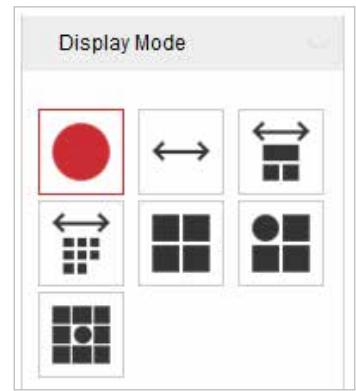

Figure 8-3 Playback Display Mode Setting

*Note:* For detailed description of each display mode, refer to *Section 5.1 Live View Page*.

- 4. Click to play the video files found on this date.
The toolbar on the bottom of Playback interface can be used to control playing process.

| > >><br>1 ►<br>র করে পারে পারে। বিশ্বকাপ বাংলাদেশের প্রকল্পিত হয়েছে বিশ্বকাপের প্রকল্প করে পারে পারে পারে পারে পারে পারে পারে পারে পারে পারে পারে পারে পারে পারে পারে পারে পারে পারে পারে পা | ******************************************************************************************************************************************************************************<br>图 ◎ |
|-----------------------------------------------------------------------------------------------------------------------------------------------------------------------------------------------|---------------------------------------------------------------------------------------------------------------------------------------------------------------------------------------|
|-----------------------------------------------------------------------------------------------------------------------------------------------------------------------------------------------|---------------------------------------------------------------------------------------------------------------------------------------------------------------------------------------|

Figure 8-4 Playback Toolbar

| Button | Operation                      | Button | Operation                             |
|--------|--------------------------------|--------|---------------------------------------|
|        | Play                           |        | Capture a picture                     |
|        | Pause                          | /      | Start/Stop<br>clipping video<br>files |
|        | Stop                           |        | Playback by frame                     |
|        | Slow Forward                   | /      | Audio on and adjust<br>volume/Mute    |
|        | Fast Forward                   |        | Download                              |
| /      | Enable/Disable digital<br>zoom |        | Stop all playback                     |
|        | Play with full screen          |        |                                       |

Table 8-1 Description of Playback Icons

*Notes:* 

- You can set the local file saving path for the downloaded video files and pictures in Local Configuration interface. For details, please refer to *Section 5.1*.
- The playback mode varies according to the different mount type.
- PTZ function is also supported in playback.
- 5. Drag the progress bar with the mouse to locate the exact playback point. You can also input the time and click to locate the playback point in the **Set playback time** field. You can also click to zoom out/in the progress bar.

| Set playback time  |    |  |  |
|--------------------|----|--|--|
| 00  <br>: 00<br>00 | ﻟﻠ |  |  |

Figure 8-5 Set Playback Time

|       | 2015-10-29 00:00:00 |       |       |         |                  |       | - +    |
|-------|---------------------|-------|-------|---------|------------------|-------|--------|
| 23:00 | 00 00               | 01:00 | 02:00 | 03:00   | 04:00            | 05:00 | 06:0   |
|       |                     |       |       |         |                  |       |        |
|       |                     |       |       | Command | Continuous Alarm |       | Manual |


Different video types are marked in different colors on the progress bar.

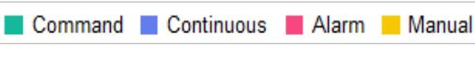

Figure 8-7 Video Types

# **Chapter 9 Picture**

Click Picture to enter the picture searching interface. You can search, view, and download the pictures stored in the local storage or network storage.

### *Notes:*

- Make sure HDD, NAS or memory card are properly configured before you process picture searching.
- Make sure the capture schedule is configured. Go to **Configuration > Storage > Schedule Settings > Capture** to set the capture schedule.

|                     |     |    | Live View | Playback                   | Picture             | Application | Configuration |                       |                     |
|---------------------|-----|----|-----------|----------------------------|---------------------|-------------|---------------|-----------------------|---------------------|
| Download by File    |     |    |           |                            |                     |             |               |                       |                     |
| Search Conditions   |     |    | File List |                            |                     |             |               | & Download            | La Stop Downloading |
| File Type           |     | E  | No.       | File Name                  | Time                |             | File Size     | Progress              | Live View           |
| Continuous          | >   | 1  | 1         | ch01_0801000000000000000   | 2015-06-15 10:05:29 |             | 89 KB         |                       | Live View           |
| Start Time          |     | 1  | 2         | ch01_08010000000000000100  | 2015-06-15 10:05:30 |             | 91 KB         |                       | Live View           |
| 2015-06-15 00:00:00 | 品   | 11 | ന         | ch01_0801000000000000200   | 2015-06-15 10:05:30 |             | 93 KB         |                       | 111<br>Live View    |
| End Time            |     | 1  | ব         | ch01 0801000000000000000   | 2015-06-15 10:05:31 |             | 92 KB         |                       | Live View           |
| 2015-06-15 23:59:59 | ಿವೆ | 11 | ട്        | ch01_08010000000000000400  | 2015-06-15 10:05:31 |             | 91 KB         |                       | Live View           |
|                     |     | 1  | 6         | ch01_08010000000000000000  | 2015-06-15 10:05:32 |             | 92 KB         |                       | Live View           |
| Q Search            |     | 1  | 7         | ch01_0801000000000000000   | 2015-06-15 10:05:32 |             | 92 KB         |                       | Live View           |
|                     |     | 1  | 8         | ch01_0801000000000000700   | 2015-06-15 10:05:33 |             | 92 KB         |                       | Live View           |
|                     |     | E  | 9         | ch01_08010000000000000000  | 2015-06-15 10:05:33 |             | 91 KB         |                       | Live View           |
|                     |     | 10 | 10        | ch01_080100000000000000000 | 2015-06-15 10:05:34 |             | 91 KB         |                       | Live View           |
|                     |     |    |           |                            |                     |             |               | Total 25 Items<br>್ಕಲ | 人<br>1/1<br>110     |

Figure 9-1 Picture Searching Interface

### *Steps:*

- 1. Select the file type from the dropdown list. Continuous, Motion, Alarm, Motion | Alarm, Motion & Alarm, Line Crossing, Intrusion Detection, and Scene Change Detection are selectable.
- 2. Select the start time and end time.
- 3. Click **Search** to start searching.
- 4. Click Live View to view the captured pictures.
- 5. Click Download to download the selected pictures.

*Note:* Up to 4000 pictures can be displayed at one time.

# **Appendix Appendix 1 SADP Software Introduction**

### **Description of SADP**

SADP (Search Active Devices Protocol) is a kind of user-friendly and installation-free online device search tool. It searches the active online devices within your subnet and displays the information of the devices. You can also modify the basic network information of the devices using this software.

### **Search active devices online**

### **Search online devices automatically**

After launch the SADP software, it automatically searches the online devices every 15 seconds from the subnet where your computer locates. It displays the total number and information of the searched devices in the Online Devices interface. Device information including the device type, IP address and port number, etc. will be displayed.

|                                                                                                                                                                              | SADP |                                                                                                                                                                                |          |                |      |                                                                                                                                                                                |     |                                                                                                                                                                                | 0<br>20 x                                   |
|------------------------------------------------------------------------------------------------------------------------------------------------------------------------------|------|--------------------------------------------------------------------------------------------------------------------------------------------------------------------------------|----------|----------------|------|--------------------------------------------------------------------------------------------------------------------------------------------------------------------------------|-----|--------------------------------------------------------------------------------------------------------------------------------------------------------------------------------|---------------------------------------------|
|                                                                                                                                                                              |      | 10<br>Total number of online devices:                                                                                                                                          |          |                |      |                                                                                                                                                                                |     | Refresh<br>Export                                                                                                                                                              | 1 Activate the Device                       |
|                                                                                                                                                                              | 0110 | · Device Type                                                                                                                                                                  | Security | 1 19v4 Address | Port | Software Vertion   IPvd Gatmay                                                                                                                                                 |     | HTTP Port     Device Serial No.                                                                                                                                                |                                             |
| 131                                                                                                                                                                          | 001  | RX - XXXXXXXXXXXXXXXXXXXXXXXXXXXXXXXXXXXXXXXXXXXXXXXXXXXXXXXXXXXXXXXXXXXXXXXXXXXXXXXXXXXXXXXXXXXXXXXXXXXXXXXXXXXXXXXXXXXXXXXXXXXXXXXXXXXXXXXXXXXXXXXXXXXXXXXXXXXXXXXXXXXXXXXXX | Active   | 10.16.6.21     | 0308 | Calmallal xxxxxxxxxxxxxxxxxxxxxxxxxxxxxxxxxxxxxxxxxxxxxxxxxxxxxxxxxxxxxxxxxxxxxxxxxxxxxxxxxxxxxxxxxxxxxxxxxxxxxxxxxxxxxxxxxxxxxxxxxxxxxxxxxxxxxxxxxxxxxxxxxxxxxxxxxxxxxxxxxxxx | 30  | 496-3000000 300000000000000000                                                                                                                                                 |                                             |
|                                                                                                                                                                              | 1002 | CARRENNER AN                                                                                                                                                                   | Active   | 10.16.6.20     | 8000 | Versibuild woon 10.16.6.254                                                                                                                                                    | 80  | We 30000000 300000000000000000                                                                                                                                                 |                                             |
| 91214                                                                                                                                                                        | 003  | IDE-XXXXXXXXXX-X                                                                                                                                                               | Active   | 10.16.6.171    | 8000 | 0.0000000000000000000000000000000000000000000000000000000000000000000000000000000000000000000000000000000000000000000000000000000000000000000000000000000000000000000000000000 | 180 | DOC: RECODERS: - SCODECCIOCK                                                                                                                                                   |                                             |
| 日                                                                                                                                                                            | 004  | ANG - SCOOOCCOCCCCCCCCCCCCCCCCCCCCCCCCCCCCCCCCCCCCCCCCCCCCCCCCCCCCCCCCCCCCCCCCCCCCCCCCCCCCCCCCCCCCCCCCCCCCCCCCCCCCCCCCCCCCCCCCCCCCCCCCCCCCCCCCCCCCCCCCCCCCCCCCCCCCCCCCCCCCCCCC | Active   | 10.16.6.22     | BOOD | VOLIdbuild wooor 10.16.6.254                                                                                                                                                   | NA  | Jack 3000000000000000000000000000000000000000000000000000000000000000000000000000000000000000000000000000000000000000000000000000000000000000000000000000000000000000000000000 | The device is not activated.                |
| 다                                                                                                                                                                            | 005  | XXXXXXXXXXXXXXXXXXXXXX                                                                                                                                                         | Active   | 10.16.6.127    | 0000 | VEJCI build xxxxxxx 10.16.6.254                                                                                                                                                | NA  | xxxxxxxxxxxxxxxxxxxxxxxxxxxxxxxxxxxxxxxxxxxxxxxxxxxxxxxxxxxxxxxxxxxxxxxxxxxxxxxxxxxxxxxxxxxxxxxxxxxxxxxxxxxxxxxxxxxxxxxxxxxxxxxxxxxxxxxxxxxxxxxxxxxxxxxxxxxxxxxxxxxxxxxxxxxxxx |                                             |
| 17                                                                                                                                                                           | 006  | 1 - 100000000000 - 10                                                                                                                                                          | Actron   | 10.16.6.179    | 8000 | 10.16.6.95 scooos 10.16.6.254                                                                                                                                                  | NA  | COCCOCCOCCCCCCCCCCCCCCCCCCCCCCCCCCCCCCCCCCCCCCCCCCCCCCCCCCCCCCCCCCCCCCCCCCCCCCCCCCCCCCCCCCCCCCCCCCCCCCCCCCCCCCCCCCCCCCCCCCCCCCCCCCCCCCCCCCCCCCCCCCCCCCCCCCCCCCCCCCCCCCCCCCCCCC |                                             |
| E                                                                                                                                                                            | 007  | KI - YOUTHOUD - I                                                                                                                                                              | Active   | 10.26.6.250    | 0008 | 10.00000000000000000000000000                                                                                                                                                  | 80  | 000 Januarial 1000000000000000000000000000000000000000000000000000000000000000000000000000000000000000000000000000000000000000000000000000000000000000000000000000000000000000 |                                             |
|                                                                                                                                                                              | DOG  | IC-2000 YE-1                                                                                                                                                                   | Inactive | 1921651.64     | 8000 | 192 a shiplid grooms 192.168.1.1                                                                                                                                               | 80  | 10-1000000 1000000000000000000000000000000000000000000000000000000000000000000000000000000000000000000000000000000000000000000000000000000000000000000000000000000000000000000 | You can modify the network parameters after |
| ा में बाद में बाद में कि में में में में में में में में में में में में में में में में में में में में में में में में में में में में में में में में में में में में में | 009  | XI = XXXXXXXXXXXXXXXXXXXXXXXXXXXXXXXXXXXXXXXXXXXXXXXXXXXXXXXXXXXXXXXXXXXXXXXXXXXXXXXXXXXXXXXXXXXXXXXXXXXXXXXXXXXXXXXXXXXXXXXXXXXXXXXXXXXXXXXXXXXXXXXXXXXXXXXXXXXXXXXXXXXXXXXXX | Actrix   | 10.16.6.111    | 8000 | 10.2555.01 #00000 friited rock 4                                                                                                                                               | 80  | xxxxxxxxxxxxxxxxxxxxxxxxxxxxxxxxxxxxxxxxxxxxxxxxxxxxxxxxxxxxxxxxxxxxxxxxxxxxxxxxxxxxxxxxxxxxxxxxxxxxxxxxxxxxxxxxxxxxxxxxxxxxxxxxxxxxxxxxxxxxxxxxxxxxxxxxxxxxxxxxxxxxxxxxxxxxxx | the device activation.                      |
|                                                                                                                                                                              | 010  | F-FERENERE - I                                                                                                                                                                 | Attria   | 10.16.6.177    | B000 | VE K X Bulla xxxxxxx 10.16.6.754                                                                                                                                               | 80  | 000000000000000 1000000000000                                                                                                                                                  | Schildrer Pidon                             |
|                                                                                                                                                                              |      |                                                                                                                                                                                |          |                |      |                                                                                                                                                                                |     |                                                                                                                                                                                | New Passwordi<br><br>Strong                 |
|                                                                                                                                                                              |      |                                                                                                                                                                                |          |                |      |                                                                                                                                                                                |     |                                                                                                                                                                                | Confirm Password:<br>                       |
|                                                                                                                                                                              |      |                                                                                                                                                                                |          |                |      |                                                                                                                                                                                |     |                                                                                                                                                                                |                                             |
|                                                                                                                                                                              |      |                                                                                                                                                                                |          |                |      |                                                                                                                                                                                |     |                                                                                                                                                                                | Activate                                    |
|                                                                                                                                                                              |      |                                                                                                                                                                                |          |                |      |                                                                                                                                                                                |     |                                                                                                                                                                                |                                             |

Figure A.1.1 Searching Online Devices

### *Note:*

Device can be searched and displayed in the list in 15 seconds after it went online; it will be removed from the list in 45 seconds after it went offline.

- **Search online devices manually**
You can also click to refresh the online device list manually. The newly searched devices will be added to the list.

You can click or on each column heading to order the information; you can click to expand the device table and hide the network parameter panel on the right side, or click to show the network parameter panel.

### **Modify network parameters**

### *Steps:*

- 1. Select the device to be modified in the device list and the network parameters of the device will be displayed in the **Modify Network Parameters** panel on the right side.
- 2. Edit the modifiable network parameters, e.g. IP address and port number.
- 3. Enter the password of the admin account of the device in the **Admin Password** field and click **Modify** to save the changes.


- *For your privacy and to better protect your system against security risks, we strongly recommend the use of strong passwords for all functions and network devices. The password should be something of your own choosing (using a minimum of 8 characters, including at least three of the following categories: upper case letters, lower case letters, numbers and special characters) in order to increase the security of your product.*
- *Proper configuration of all passwords and other security settings is the responsibility of the installer and/or end-user.*

| Enable DHCP         |                                                                                                    |
|---------------------|----------------------------------------------------------------------------------------------------|
|                     | Device Serial No .:   XX -XXXXXXXXXXXXXXXXXXXXXXXXXXXXXXXXXXXXXXXXXXXXXXXXXXXXXXXXXXXXXXXXXXXXXXXX |
| IP Address:         | 10.16.5.106                                                                                        |
| Port:               | 8003                                                                                               |
| Subnet Mask:        | 255.255.255.0                                                                                      |
| Gateway:            | 0.0.0.0                                                                                            |
| IPv6 Address:       |                                                                                                    |
| IPv6 Gateway:       |                                                                                                    |
| IPv6 Prefix Length: |                                                                                                    |
| HTTP Port: 0.       |                                                                                                    |
|                     | Socurity Verification                                                                              |
|                     | Admin Password:                                                                                    |
|                     | Modify                                                                                             |

Figure A.1.2 Modify Network Parameters

# **Appendix 2 Port Mapping**

The following settings are for TP-LINK router (TL-WR641G). The settings vary

depending on different models of routers.

### *Steps:*

- 1. Select the **WAN Connection Type**, as shown below:

| 108M<br>Wireless Router<br>Model No .:<br>TL-WR641G / TL-WR642G                      | WAN                     |                                                                                           |
|--------------------------------------------------------------------------------------|-------------------------|-------------------------------------------------------------------------------------------|
| · Status                                                                             | WAN Connection Type:    | PPPOE                                                                                     |
| · Quick Setup<br>-- Basic Settings ---<br>- Network<br>· LAN<br>· WAN<br>· MAC Clone | User Name:<br>Password: | Static IP<br>PPPOE<br>802.1X + Dynamic IP<br>802. 1X + Static IP<br>BigPond Cable<br>L2TP |

Figure A.2.1 Select the WAN Connection Type

- 2. Set the **LAN** parameters of the router as in the following figure, including IP address and subnet mask settings.

| 108M<br>Wireless Router<br>Model No .:<br>TL-WR641G / TL-WR642G | LAN          |                   |
|-----------------------------------------------------------------|--------------|-------------------|
| · Status                                                        | MAC Address: | 00-14-78-6A-DB-0C |
| · Quick Setup                                                   | IP Address:  | 192.168.10.1      |
| -- Basic Settings ---<br>- Network                              | Subnet Mask: | 255.255.255.0     |
| · LAN<br>· WAN<br>· MAC Clone                                   |              | Save              |

Figure A.2.2 Set the LAN parameters

- 3. Set the port mapping in the virtual severs of **Forwarding**. By default, camera uses port 80, 8000 and 554. You can change these ports value with web browser or client software.
### *Example:*

When the cameras are connected to the same router, you can configure the ports of a camera as 80, 8000, and 554 with IP address 192.168.1.23, and the ports of another camera as 81, 8001, 555, 8201 with IP 192.168.1.24. Refer to the steps as below:

*Steps:* 

- 1. As the settings mentioned above, map the port 80, 8000, 554 and 8200 for the network camera at 192.168.1.23
- 2. Map the port 81, 8001, 555 and 8201 for the network camera at 192.168.1.24.
- 3. Enable **ALL** or **TCP** protocols.
- 4. Check the **Enable** checkbox and click **Save**.

| Router<br>Model No .:<br>TL-WR641G / TL-WR642G         |    | Virtual Servers      |                   |               |        |
|--------------------------------------------------------|----|----------------------|-------------------|---------------|--------|
| · Status                                               | ID | Service Port         | IP Address        | Protocol      | Enable |
| · Quick Setup                                          | 1  | 80                   | 192.168.10.<br>23 | ALL           | >      |
| -- Basic Settings ---<br>+ Network                     | 2  | 8000                 | 192.168.10.<br>23 | ALL           | >      |
| + Wireless<br>--- Advanced Settings ---                | 3  | 554                  | 192.168.10.<br>23 | ALL           | र<br>2 |
| + DHCP                                                 | 4  | 8200                 | 192.168.10.<br>23 | ALL           | >      |
| - Forwarding<br>· Virtual Servers                      | 5  | 81                   | 192.168.10.<br>24 | ALL           | 2<br>> |
| · Port Triggering                                      | 6  | 8001                 | 192.168.10.<br>24 | ALL           | >      |
| · DMZ<br>· UPnP                                        | 7  | રકર                  | 24<br>192.168.10. | ALL           | K      |
| + Security                                             | 00 | 8201                 | 192.168.10.<br>24 | ALL           | >      |
| · Static Routing<br>· Dynamic DNS<br>-- Maintenance -- |    | Common Service Port: | DNS(53)<br>>      | ID<br>Copy to | 1      |
| + System Tools                                         |    |                      |                   |               |        |
|                                                        |    |                      | Previous<br>Next  | Clear All     | Save   |

Figure A.2.3 Port Mapping

*Note:* The port of the network camera cannot conflict with other ports. For example, some web management port of the router is 80. Change the camera port if it is the same as the management port.


**126**

User Manual of Network Fisheye Camera