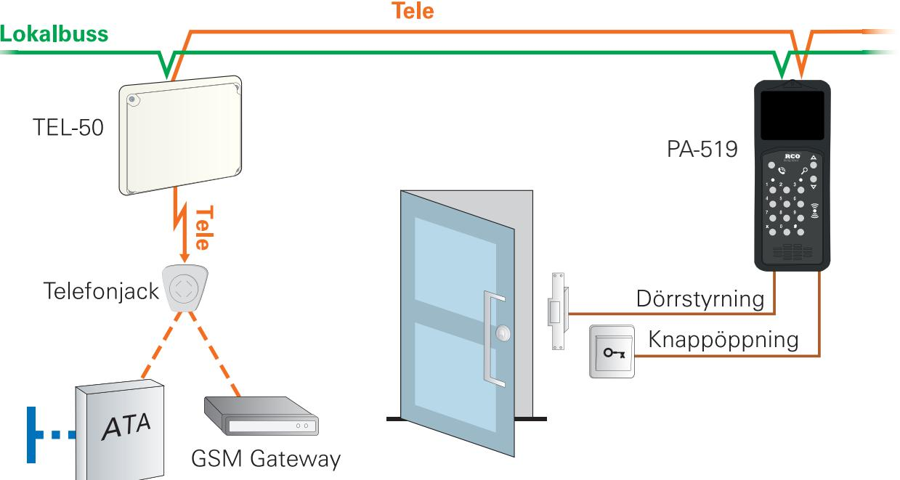

# **PA MIF/PROX-519**

## **SMIDIG PORTTELEFON MED KORTLÄSARE OCH INITIERING FÖR NOKEY OFFLINE**

PA MIF/PROX-519 är en porttelefon med tydlig display för digitalt boenderegister. Besökaren bläddrar enkelt med piltangenterna till rätt person/lägenhet/företag och trycker på ring så ringer den upp aktuellt nummer. Mottagaren svarar med sin fasta telefon eller mobil och öppnar dörren med en knapptryckning. Porttelefonen fungerar dessutom som en vanlig passerläsare med endast kod, kort+kod eller bara kort. Handhavandet kan även konfigureras så att besökare exempelvis på kvällar och nätter måste trycka hela telefonnumret.

Porttelefonen erbjuds i svart eller vitt utförande, är helt integrerad i R-CARD 5000-systemet och kan fritt kombineras med andra läsare, boknings- eller manöverpaneler. Programmering och administration görs enkelt och centralt från R-CARD M5-programmets klient. Porttelefonen erbjuds i både Prox- och Mifare-modell och ansluts direkt till undercentralen UC-50. Mifare-modellen erbjuder även initiering för offline-läsarna i NoKey offline-serien.

Artikelnummer: 24 050 060, E-nummer: 58 012 15 (PA MIF-519 S) Artikelnummer: 24 050 062, E-nummer: 58 012 16 (PA MIF-519 V) Artikelnummer: 24 050 070, E-nummer: 58 012 17 (PA PROX-519 S) Artikelnummer: 24 050 072, E-nummer: 58 012 18 (PA PROX-519 V) Artikelnummer: 24 050 080, E-nummer: 58 020 14 (infällnadslåda)

#### **TEKNISK DATA**

| Matningsspänning:                              | 18–30 V DC SELV                                                    | Temperaturområde:                                                                         | -30°C till +60°C                       |
|------------------------------------------------|--------------------------------------------------------------------|-------------------------------------------------------------------------------------------|----------------------------------------|
| Strömförbrukning: Standby: Under samtal: | (matas från UC-50) Max 105 mA @ 24 V DC Max 500 mA @ 24 V DC | Mått (mm, BxHxD): Utanpåliggande: Infällt montage, front: Infällt montage, låda: | 95x235x29,5 119x294 101x268x33,5 |
| Brytström relä:                                | 0,6 A                                                              | Namn i display:                                                                           | 500 stycken                            |

## **ELEKTRONISKA LÅS FÖR HEM OCH FÖRETAG**

### **ANSLUTNING AV PA MIF/PROX-519 SOM RINGER TILL BESÖKSMOTTAGARE**

#### **ELEKTRONISKA LÅS FÖR HEM OCH FÖRETAG** RCO Security AB | 08-546 560 00 | Order 08-546 560 10 | info@rco.se | www.rco.se