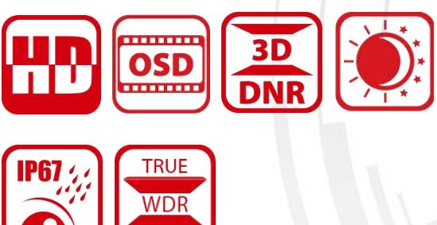
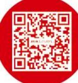
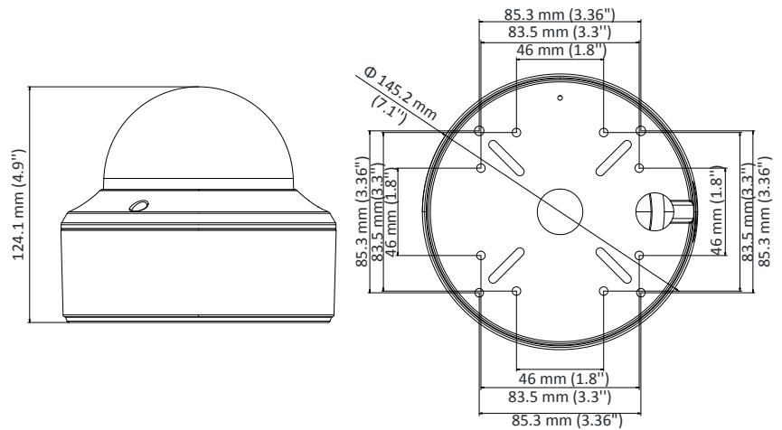
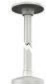
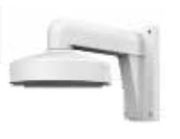
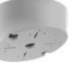

# **DS-2CC52D9T-AVPIT3ZE 2 MP Ultra-Low Light PoC Dome Camera**

## **Key Features**

- 2 MP high performance COMS
- Ultra-Low Light Pro
- 1920 × 1080 resolution
- Auto focus, 2.8 mm to 12 mm motorized vari-focal lens
- 120 dB true WDR, 3D DNR
- EXIR 2.0, smart IR, up to 40 m IR distance
- Dual outputs: 1 HD analog output/1 CVBS output
- PoC.at, smart voltage detection
- 1 alarm in/out
- IP67, IK10
- Up the Coax (HIKVISION-C)

#### **Specification**

| Camera                   |                                                                                                   |
|--------------------------|---------------------------------------------------------------------------------------------------|
| Image Sensor             | 2.0 megapixel progressive scan CMOS                                                               |
| Signal System            | PAL/NTSC                                                                                          |
| Effective Resolution     | 1920 (H) ×1080 (V)                                                                                |
| Frame Rate               | PAL: 1080p@25fps                                                                                  |
|                          | NTSC: 1080p@30fps                                                                                 |
| Min. Illumination        | 0.003 Lux@(F1.2, AGC ON), 0 Lux with IR PAL: 1/25 s to 1/50,000 s                              |
| Shutter Time             | NTSC: 1/30 s to 1/50,000 s                                                                        |
| Slow Shutter             | Max.: 30 times                                                                                    |
| Lens                     | 2.8 mm to 12 mm, motorized vari-focal lens                                                        |
| Horizontal Field of View | 32.1°to 98°                                                                                       |
| Lens Mount               | Φ14                                                                                               |
| Auto Iris                | Support                                                                                           |
| Day & Night              | IR cut filter                                                                                     |
| Angle Adjustment         | Pan: 0°to 355°, Tilt: 0°to 75°, Rotate: 0°to 355°                                                 |
| Synchronization          | Internal synchronization                                                                          |
| WDR                      | > 120 dB                                                                                          |
| Menu                     |                                                                                                   |
| AGC                      | Support                                                                                           |
| Day/Night Mode           | Auto/Color/BW (White & Black)                                                                     |
| White Balance            | ATW/AWC-SET/MANUAL                                                                                |
| Privacy Mask             | ON/OFF, 8 programmable privacy masks                                                              |
| Motion Detection         | 4 programmable motion areas                                                                       |
| Backlight Compensation   | WDR/BLC/HLC/OFF                                                                                   |
| 2D & 3D DNR              | ON/OFF                                                                                            |
| Voltage Detection        | Support                                                                                           |
| Scene                    | Indoor/outdoor/indoor 1/low light                                                                 |
| Functions                | Defog, Mirror, Defective Pixel Correction, Sharpness, Camera Title, LSC (Lens Shading Correction) |
| Interface                |                                                                                                   |
| Video Output             | 1 HD analog output/1 CVBS output (75Ω/BNC)                                                        |
| Alarm                    | 1 alarm in/out                                                                                    |
| General                  |                                                                                                   |
| Operating Conditions     | -40°C to 60°C (-40°F to 140°F), humidity: 90% or less (no condensation)                           |
| Power Supply             | 24 V AC/12 V DC ±30%/PoC.at                                                                       |
| Power Consumption        | Max.: 6 W                                                                                         |
| IR Distance              | Up to 40 m                                                                                        |
| Protection Level         | IP67, IK10                                                                                        |
| Material                 | Metal                                                                                             |
| Communication            | Up the coax, Protocol: HIKVISION-C                                                                |
| Dimensions               | Φ 145.2 mm × 124.1 mm (7.1" × 4.9")                                                               |
| Weight                   | Approx. 2000 g (4.4 lb.)                                                                          |

### **Order Model**

DS-2CC52D9T-AVPIT3ZE

#### **Dimensions**

#### **Accessories**

DS-1271ZJ-I40 Pendant Mounting Bracket DS-1273ZJ-I40 Wall Mounting Bracket

DS-1241ZJ In-Ceiling Mounting Bracket

DS-1240ZJ Inclined Base Mounting Bracket

0200001070720