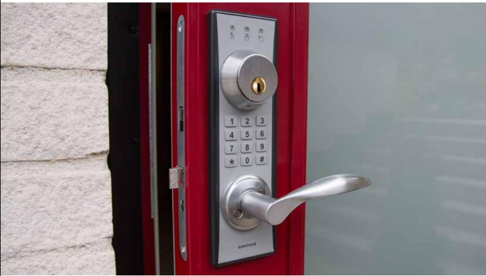
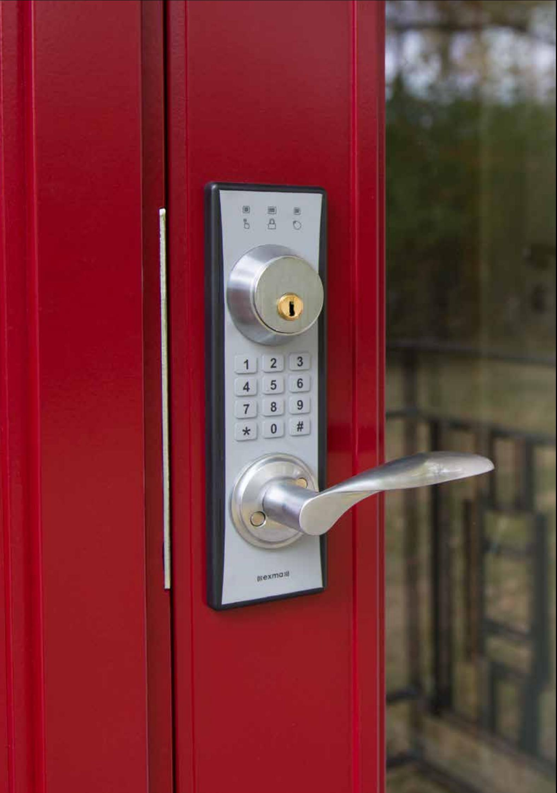
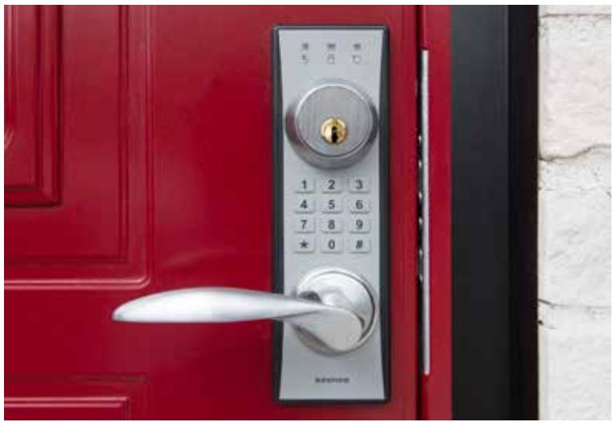
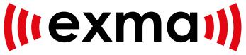

# Maximal säkerhet och flexibilitet

**Duo**

Det svensktillverkade låssystemet

## Exma DUO: Fristående låssystem med enkel installation och högsta säkerhet

### Snabb och enkel montering…

Exma DUO är en fristående lösning som är enkel att installera, ingen ytterligare kabeldragning eller håltagning i dörren krävs. Enheten monteras under dörrtrycke och cylinderring och fungerar med modullås av standardtyp.

#### … och användning

Systemet är också smidigt för själva användaren. Maximal säkerhet erbjuds, tillsammans med enkel hantering och möjligheter att skräddarsy skyddsnivån efter behov.

Du ställer enkelt in om du till exempel vill ha endast kodlås under vissa tider och kod samt bricka under andra. Att ta fram en temporär kod för hantverkaren är en enkel match.

## Tryggt och säkert

Alla passager som genomförs med brickor, kort och/eller kod loggas i enhetens minne.

Det är också lätt att administrera både kort och nycklar. Om en nyckelbricka tappas bort tas den enkelt ur systemet och därmed säkerställs att ingen obehörig kommer in.

### Flexibelt

Exma DUO låter användaren själv välja hur låset ska manövreras; antingen med kort/bricka eller kod.

Möjligheten att alltid kunna öppna och låsa med vanlig nyckel innebär en extra trygghet då låset alltid går att hantera – även vid strömbortfall.

- Nyckel
- Bricka
- Kod
- Bricka+kod
- Tidpunkt
- NFC*

Eftersom du som administratör har full kontroll på vilka koder, brickor och kort som ska fungera, samt under vilka tider, är Exma DUO en perfekt lösning för exempelvis äldreboenden.

** Närfältskommunikation, NFC, gör det möjligt att använda utvalda mobiltelefoner (Android) som nyckelbricka och administrationsverktyg.* 

| Specifikationer för Duo                                    |               |
|------------------------------------------------------------|---------------|
| Antal nyckelbrickor                                        | 999           |
| Händelselogg                                               | 500           |
| Nödkod                                                     | Ja, 8 siffror |
| Säkerhetsnivå Kodlås, Nyckelbricka, Nyckelbricka + PIN  | Ja            |
| Klocka                                                     | Ja            |
| Automatisk sommartidsomställning                           | Ja            |
| Unik kryptering                                            | Ja            |
| Kodberäkning                                               | Ja            |
| NFC                                                        | Ja            |
| Mifare Classic 13,56 MHz                                   | Ja            |
| Högsäkerhetsläge                                           | Ja            |
| Batterispänning. (4 st 1,5V AA standard batterier = 6V) | Ja            |
| Stand Alone                                                | Ja            |
| Spärrelement                                               | Motor         |
| Låst - Öppet och systemindikeringar                        | Ja            |
| Låsmanövrering med dörrtrycket                             | Ja            |
| Akustisk verifiering                                       | Ja            |
| Batteri livslängd vid normal användning                    | 12-24 månader |
| Batterivarning                                             | Ja            |
| App med NFC-stöd för administration. Android            | Ja            |
| App med NFC-stöd för administration. Iphone             | Nej           |
| Läsavstånd                                                 | 2-4 cm        |
| Storlek, yttre enhet, BxHxD                                | 70x230x mm    |
| Storlek, inre enhet, BxHxD                                 | 80x300x28 mm  |

