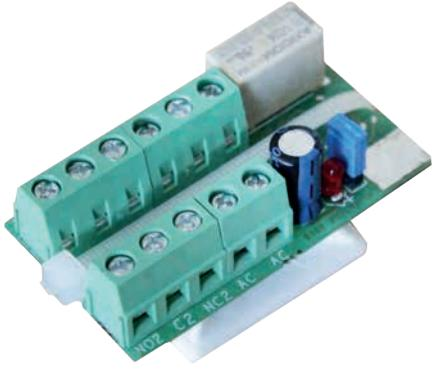
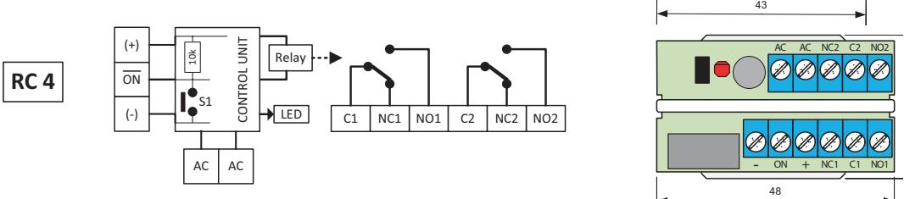

## **RC 4 RELÄKORT**

## **Fördelar**

- Universellt litet reläkort
- För AC-eller DC matning 10-30 V
- Dubbelt (2x) växlande (NC/NO) reläfunktion på 2 A

10k

LED

Relay

LED

NC C NO

- Inkoppling med skruvplint
**RC 2**

**RC 3**

- Aktivt relä indikeras med lysdiod 10k Relay (+)
(-)

(+) ON

ON

(-) S1

- Fästkuddar för enkel montering CONTROL UNITON **RC 1**

37

RC3 C1 NC1 NO1 C2 NC2 NO2

 C NO

NC C NO

21

21

29

29

+

- ON

- ON

RC 4 är ett litet och universellt reläkort för AC- eller DC-matning med dubbelt växlande (NC/NO) reläfunktion på 2A. Inkoppling sker via skruvplint med hissfunktion. Kortet har en högohmig ingång för att styra reläet. Om styringången är ansluten till minus aktiveras reläet och detta indikeras med LED. Levereras monterad på plastfot med dubbelhäftande tape. NCS1 37 - NO + S1 LED (-) S1 CONTROL UNITNC C NO 10k Relay (+) CONTROL UNIT

RED YELLOW BLACK

C1 NC1 NO1 C2 NC2 NO2

| Reläutgång2 x NC/NO                                  |
|------------------------------------------------------|
| Matningsspänning  11-30 V DC eller AC                |
| Strömförbrukning  16 mA vid 12 VAC /22 mA vid 30 VAC |
| Kontaktdata30 V / 2 A                                |
| AnslutningarSkruvplint med hissfunktion              |
| Arbetstemperatur-20 – +50°C                          |
| Mått (LxBxH) mm 48 x 26 x 16                         |

| Beställningsinformation |         |                                                             |       |
|-------------------------|---------|-------------------------------------------------------------|-------|
| Typ                     | E-nr    | Beskrivning                                                 | Paket |
| RC 4                    | 6309547 | Reläkort 10-30 V, dubbelt växlande för AC- eller DC-matning | 1 st  |