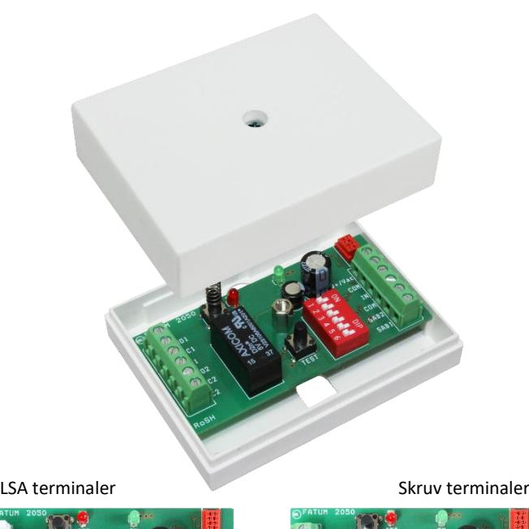
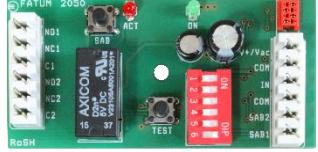
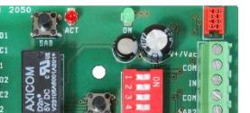
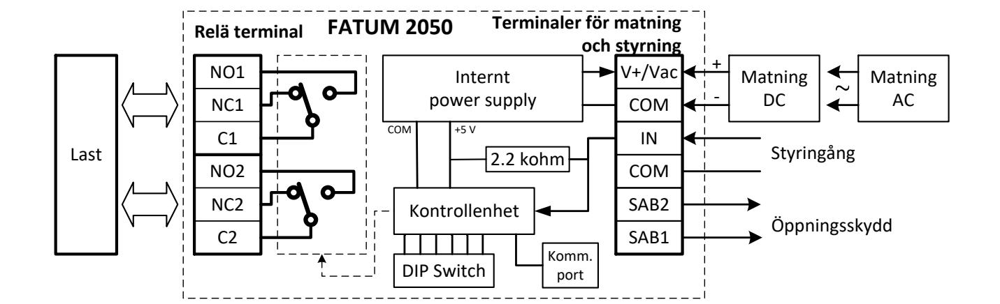
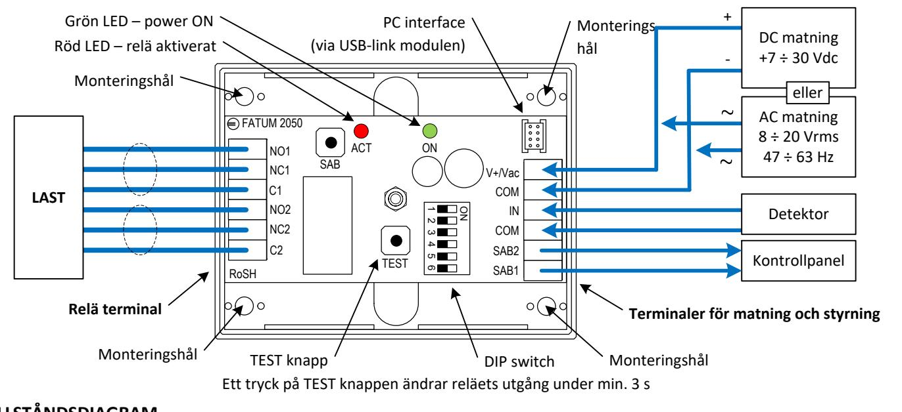

# **FATUM FATUM Relämoduler**

# **Datablad och monteringsinstruktion 28050.01, 28050.03**

#### **BESKRIVNING**

Relästyrenhet som möjliggör styrning av last upp till 2 A / 30 V med ett dubbelt växlande relä. Reläet kan styras av en magnetkontakt eller lågspänningsdetektor. Den har en inbyggd programmerbar timerfunktion för TILL- och FRÅN- slag. Timern ställs in med en DIP-switch. Styrenheten kan matas med AC eller DC. Kommer monterad i Fatum minibox som illustreras ovan.

#### **INSTÄLLNING AV DIP- SWITCH**

Timerfunktionen som aktiverar reläet programmeras med hjälp av DIP-switchen:

- DIP1 DIP5: Tidsinställningar
	- o Timer FRÅN relä följer ingångsstatus, DIP1 = DIP2 = DIP3 = DIP4 = DIP5 = OFF
	- o Timer TILL från 10 s till 8 h
	- o Timer FRÅN flip-flop funktion, relä byter status efter varje ändring av ingång,
		- DIP1 = DIP2 = DIP3 = DIP4 = DIP5 = ON
- DIP6: Tillstånd på ingång som triggar timer och relä

#### **BLOCKSCHEMA**

| DIP1 – DIP5: Tidsinställningar |      |      |      |      |               |                    |  |  |
|--------------------------------|------|------|------|------|---------------|--------------------|--|--|
|                                |      |      |      |      | DIP5          |                    |  |  |
| #                              | DIP1 | DIP2 | DIP3 | DIP4 | OFF           | ON                 |  |  |
| 0                              | OFF  | OFF  | OFF  | OFF  | Följer ingång | 3 min              |  |  |
| 1                              | ON   | OFF  | OFF  | OFF  | 10 s          | 4 min              |  |  |
| 2                              | OFF  | ON   | OFF  | OFF  | 20 s          | 5 min              |  |  |
| 3                              | ON   | ON   | OFF  | OFF  | 30 s          | 6 min              |  |  |
| 4                              | OFF  | OFF  | ON   | OFF  | 40 s          | 7 min              |  |  |
| 5                              | ON   | OFF  | ON   | OFF  | 50 s          | 8 min              |  |  |
| 6                              | OFF  | ON   | ON   | OFF  | 60 s          | 9 min              |  |  |
| 7                              | ON   | ON   | ON   | OFF  | 70 s          | 10 min             |  |  |
| 8                              | OFF  | OFF  | OFF  | ON   | 80 s          | 15 min             |  |  |
| 9                              | ON   | OFF  | OFF  | ON   | 90 s          | 20 min             |  |  |
| 10                             | OFF  | ON   | OFF  | ON   | 100 s         | 30 min             |  |  |
| 11                             | ON   | ON   | OFF  | ON   | 110 s         | 60 min (1 h)       |  |  |
| 12                             | OFF  | OFF  | ON   | ON   | 120 s         | 120 min (2 h)      |  |  |
| 13                             | ON   | OFF  | ON   | ON   | 130 s         | 240 min (4 h)      |  |  |
| 14                             | OFF  | ON   | ON   | ON   | 140 s         | 480 min (8 h)      |  |  |
| 15                             | ON   | ON   | ON   | ON   | 150 s         | Flip-flop funktion |  |  |

#### **DIP6: Inställning av trigger**

| # | DIP6 | Trigger för aktivering av relä och timer |
|---|------|------------------------------------------|
| 0 | OFF  | Ändring av ingång: ÖPPEN → STÄNGD        |
| 1 | ON   | Ändring av ingång: STÄNGD → ÖPPEN        |
|   |      |                                          |

#### **TEKNISKA SPECIFIKATIONER**

| Enhet               | 28050.01                                                                                 | 28050.03  |  |  |  |
|---------------------|------------------------------------------------------------------------------------------|-----------|--|--|--|
| Kapsling            | Plastlåda                                                                                | Plastlåda |  |  |  |
| Terminaler          | LSA                                                                                      | Skruv     |  |  |  |
| Relä                | DPDT relä                                                                                |           |  |  |  |
| Relä kontakt data   | 30 Vdc, 2 A                                                                              |           |  |  |  |
| Matningsspänning DC | 7 ÷ 30 V                                                                                 |           |  |  |  |
| Matningsspänning AC | 8 ÷ 20 Vrms, 47 ÷ 63 Hz                                                                  |           |  |  |  |
| Strömförbrukning    | 18 mA @ 12 Vdc,                                                                          |           |  |  |  |
| (relä aktiverat)    | 11 mA @ 24 Vdc                                                                           |           |  |  |  |
| Detektoringång      | NC/NO, polariserad till +5 V med 2.2 kohm                                                |           |  |  |  |
| Tidskontroll        | Tiden ställs in med en 6-polig DIP-omkopp lare för TILL/FRÅN eller från 10 s till 8 h |           |  |  |  |
| Miljöklass          | EN 50130-5, Klass II                                                                     |           |  |  |  |
| Dimensioner         | 77 x 59 x 27 mm                                                                          |           |  |  |  |
| Vikt                | 60 g                                                                                     |           |  |  |  |
| Arbetstemperatur    | -20 °C till +55 °C                                                                       |           |  |  |  |
| Överrensstämmelse   |                                                                                          |           |  |  |  |

## **I/O TERMINALER**

## **Relä terminaler**

| Märkning | Funktion               |                |
|----------|------------------------|----------------|
| NO1      | Normalt öppen kontakt  |                |
| C1       | Gemensam kontakt       | Relä switch #1 |
| NC1      | Normalt stängd kontakt |                |
| NO2      | Normalt öppen kontakt  |                |
| C2       | Gemensam kontakt       | Relä switch #2 |
| NC2      | Normalt stängd kontakt |                |

## **MONTERINGS- OCH KOPPLINGSSCHEMA**

### **Terminaler för matning och styrning**

| Märk   | Funktion       |                              |  |  |
|--------|----------------|------------------------------|--|--|
| ning   |                |                              |  |  |
| SAB1   | Sabotageutgång |                              |  |  |
| SAB2   | Sabotageutgång | Signal för öppningsskydd     |  |  |
| COM    | Gemensam jord  | Relästyrning och trigger för |  |  |
| IN     | Styringång     | timer                        |  |  |
| COM    | Gemensam jord  | DC eller AC matningsspän     |  |  |
| V+/Vac | Matning        | ning                         |  |  |

## **TILLSTÅNDSDIAGRAM**

|                               | FÖLJ funktion, relä aktiveras av STÄNGD ingång                                            |      |      |                   |      |      |      |
|-------------------------------|-------------------------------------------------------------------------------------------|------|------|-------------------|------|------|------|
| Ingång ÖPPEN                  |                                                                                           |      |      |                   |      |      |      |
| Ingång STÄNGD                 |                                                                                           | DIP1 | DIP2 | DIP3              | DIP4 | DIP5 | DIP6 |
| Relä aktiverat                |                                                                                           | OFF  | OFF  | OFF               | OFF  | OFF  | OFF  |
| Ingång ÖPPEN Ingång STÄNGD | FÖLJ funktion, relä aktiveras av ÖPPEN ingång                                             |      |      |                   |      |      |      |
|                               |                                                                                           | DIP1 | DIP2 | DIP3              | DIP4 | DIP5 | DIP6 |
| Relä aktiverat                |                                                                                           | OFF  | OFF  | OFF               | OFF  | OFF  | ON   |
| Ingång ÖPPEN Ingång STÄNGD | TIMER funktion, relä aktiveras av STÄNGD ingång + timer triggas av ÖPPEN STÄNGD ingång | DIP1 | DIP2 | DIP3              | DIP4 | DIP5 | DIP6 |
| Relä aktiverat                | timer timer                                                                            |      |      | Tidsinställningar |      |      | OFF  |
| Ingång ÖPPEN Ingång STÄNGD | TIMER funktion, relä aktiveras av ÖPPEN ingång + timer triggas av STÄNGD ÖPPEN ingång  |      |      |                   |      |      |      |
|                               |                                                                                           | DIP1 | DIP2 | DIP3              | DIP4 | DIP5 | DIP6 |
| Relä aktiverat                | timer timer timer                                                                   |      |      | Tidsinställningar |      |      | ON   |
| Ingång ÖPPEN                  | FLIP-FLOP funktion, reläutgång ändras av STÄNGD ingång                                    |      |      |                   |      |      |      |
| Ingång STÄNGD                 |                                                                                           | DIP1 | DIP2 | DIP3              | DIP4 | DIP5 | DIP6 |
| Relä aktiverat                |                                                                                           | ON   | ON   | ON                | ON   | ON   | OFF  |
| Ingång ÖPPEN Ingång STÄNGD | FLIP-FLOP funktion, reläutgång ändras av ÖPPEN ingång                                     | DIP1 | DIP2 | DIP3              | DIP4 | DIP5 | DIP6 |
| Relä aktiverat                |                                                                                           | ON   | ON   | ON                | ON   | ON   | ON   |
|                               |                                                                                           |      |      |                   |      |      |      |