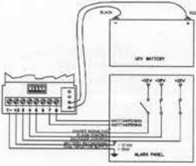
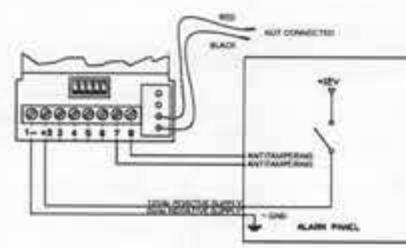

SYLCO

#### MOUNTING:

- 1. Fix the sounder to the wall and check correct functioning of tamper protection;
- 2. Insert connecting cables through the holes on base of the housing:
- 3. If required, modify the default settings and move dig-switches according to the charts below;
- 4. Connect battery (only in BATTERY-SUPPLY mode) and supplying to control panel;
- 5. Close internal and external covers using the screws given.

# CONNECTION:

## BATTERY-SUPPLY mode

## EXTERNAL-SUPPLY mode

| SET UP FOR EXTERNAL-SUPPLY MODE |                                    |
|---------------------------------|------------------------------------|
| DIP 1 - Sounder Timing          | OFF - 10 minutes; ON - infinite |
| DIP 2                           | OFF                                |
| DIP 3                           | OFF                                |
| DIP 4                           | OFF                                |
| DIP 5                           | OFF                                |

#### CONNECTIONS

| Screw Terminal | Connection                           |  |
|----------------|--------------------------------------|--|
| 1.             | Negative power supply OV          |  |
| +2             | Positive power supply +13.8V      |  |
|                | Sounder control (see DIP 1, 2 and 3) |  |
|                | Flash control (see DIP 4 and 5)      |  |
| 1 - 2 -        | Not used - do not touch              |  |
| 6              | Not used - do not touch              |  |
| 7              | TAMPER Self-protection, N.C.         |  |
| 8              | TAMPER Self-protection, N.C.         |  |

### SETTING

| DIP SWITCH | Function                 | OFF             | ON             |
|------------|--------------------------|-----------------|----------------|
| DIP 1      | Sounder Timing           | 10 minutes      | Infinite       |
| DIP 2      | Speaker Control Polarity | Positive (12V)  | Negative (OV)  |
| DIP 3      | Speaker trigger mode     | Missing trigger | Giving trigger |
| DIP 4      | Flash Control Polarity   | Positive (12V)  | Negative (0V)  |
| DIP 5      | Flash triager mode       | Missing trigger | Giving trigger |

# OUTDOOR OPTICAL ACOUSTIC ALARM DEVICE

TL 30

TL 30 is an optical-acoustic alarm device for outdoor use. It can be connected in self-supplied mode and with external supply source.

TL 30 is equipped with a high-brightness LED flashing device and a high-power speaker. Moreover, it features microprocessor controlled board and anti-removal tamper protection against any attempts of opening the sounder cover and detaching the device from the installation surface.

The 5-way dipswitch bar enables the selection and setting of different functions to suit any alarm systems and the board is protected against reverse polarity and tropicalized through a special resin treatment to resist even in very severe, humid or cold environments.

#### TECHNICAL DATA:

|                                                                   | BATTERY-SUPPLY mode                                   | EXTERNAL-SUPPLY mode           |
|-------------------------------------------------------------------|-------------------------------------------------------|--------------------------------|
| Cover, base material                                              | painted zinc-plated metal                             | painted zinc-plated metal      |
| Flash cover                                                       | polycarbonate                                         | polycarbonate                  |
| Supply voltage                                                    | 13.8 Vdc                                              | 12.5 Vdc                       |
| Voltage for battery recharge                                      | 13.2 Vdc                                              | :                              |
| Minimum operating voltage                                         | 9.0 Vdc (BATT.)                                       | 9.0 Vdc                        |
| Maximum operating voltage                                         | 14.5 Vdc                                              | 14.5 Vdc                       |
| Batteries                                                         | 12V 1.2Ah                                             |                                |
| Battery autonomy in stand-by                                      | 40 hours                                              |                                |
| Current consumption from control panel during battery recharge | 500 mA (1.3 A peak if battery is fully discharged) |                                |
| Current consumption during sounder alarm                       | 700 mA (1.3 A peak if battery is fully discharged) | 1.3 A peak                     |
| Current consumption of flashing unit                              | 46 mA from battery                                    | 46 mA                          |
| Current consumption of the control inputs (each)               | 770 UA (0.77 mA)                                      | 770 µA (0.77 mA)               |
| Alarm tension of sounder and flash                                | 3.8 Vdc                                               | 3.8 Vdc                        |
| Block tension of sounder and flash                                | 3.7 Vdc                                               | 3.7 Vdc                        |
| Open collector output                                             | 100 mA                                                | 100 mA                         |
| Sounder timing                                                    | 10 minutes or infinite                                | 10 minutes or infinite         |
| Modulation frequency                                              | 1.5 Hz                                                | 1.5 Hz                         |
| Sounds frequency                                                  | From 1600 Hz to 2250 Hz                               | From 1600 Hz to 2250 Hz        |
| Acoustic power (@ 1 m)                                            | 114dB (A)                                             | 114dB (A)                      |
| Duration of led flashing                                          | 1,000,000 flashes                                     | 1,000,000 flashes              |
| Size                                                              | 21.5 x 15 x 7 cm (HxWxD)                              | 21.5 x 15 x 7 cm (HxWxD)       |
| Weight                                                            | 1920 gr                                               | 1920 gr                        |
| Operating humidity range                                          | 20% = 100%                                            | 20% = 100%                     |
| Operating temperature                                             | -25°C = +70°C                                         | -25° C + +70° C                |
| IP protection                                                     | IP 34                                                 | IP 34                          |
| Anti-tamper protection                                            | cover opening, sounder removal                        | cover opening, sounder removal |

## WARRANTY

All Sylco products are guaranteed for manufacturing or material defects. With the aim of improving design and quality of its products, Sylco retains the right to modify the products without any warning. All defective or failed products have to be returned to the own supplier.

Hereby the nanufacturer declares that this product is in compliance with all relevant BU Directives on CE marking and with 2014/30/EU Directive (Electromagnetic Compatibility Directive) The full declaration of conformity is available upon request at info@sylco.com

SYLCO Società Uninominale srl Via del Lavoro, 14 - 30030 Salzono (VE) - Tel. (+39) 041 5740327 - Fax (+39) 041 574415 - Web: www.sykco.com