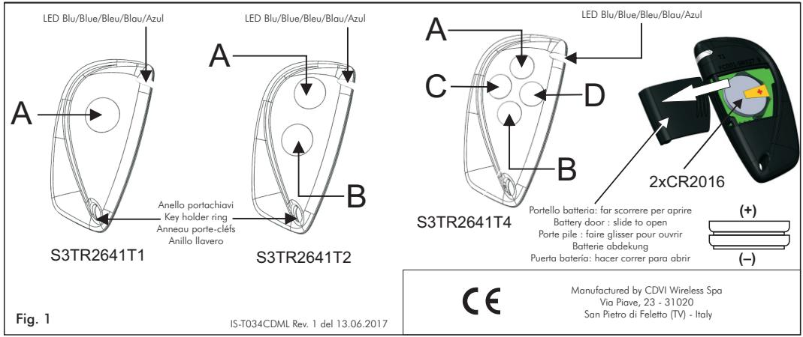

#### **IT Trasmettitore CDVI S3TR2641T1/T2/T4**

# 1 - Descrizione

Il trasmettitore CDVI serie 034A mod. S3TR2641T1/T2/T4 è concepito per comandare automatismi di chiusura e sistemi d'allarme grazie ad una codifica ad altissima sicurezza (KeeLoq® Hopping code). Il codice inviato dal trasmettitore cambia ad ogni attivazione, evitando così il rischio della copia e della sua successiva riproduzione. Ogni trasmettitore è prodotto e venduto con un codice seriale di fabbrica differente ed infalsificabile. Il codice effettivamente trasmesso è ottenuto da un algoritmo che combina il numero seriale, un codice costruttore ed un numero di sincronizzazione.

# 2 - Memorizzazione

Il trasmettitore deve essere memorizzato sul ricevitore o su tutti i ricevitori a disposizione dell'utente. Il Vs. rivenditore provvederà a tale operazione in sede di installazione o Vi darà le opportune istruzione durante la vendita. 6 - Diagnostica di guasto

# 3 - Sostituzione della batteria

Per accedere alla batteria far scorrere lo sportello posteriore nel senso della freccia. (Fig. 1) Utilizzare 2 batterie al litio CR2016 .

Rispettare la polarità come indicato in figura con il positivo verso l'alto.

*NOTE: Utilizzare gli appositi contenitori per lo smaltimento delle batterie usate*

# 4 - Dichiarazione di Conformità

Il fabbricante, CDVI Wireless Spa, dichiara che l'apparecchiatura radio S3TR2641T1/T2/T4 è conforme alla direttiva 2014/53/UE. Il testo completo della dichiarazione di conformità UE è disponibile al seguente indirizzo internet: www.erone.com.

| EN |
|----|
|    |
|    |

# **Transmitter CDVI S3TR2641T1/T2/T4**

# 1 - Description

The remote control CDVI series 034A type S3TR2641T1/T2/T4 has been designed for the control of automatic closing systems and anti-burglar systems thanks to its very high security coding system. (KeeLoq ® Hopping code).

The code sent by the transmitter changes at every activation, avoiding any scanning and copying risk. Each transmitter is manufactured and sold with a different univocal serial number set-in-factory. The real transmitted code is the result of a special algorithm which combines a serial number, a manufacturer key and a synchronization number.

2 - Memorization The transmitter security code has to be stored onto the receiver or the receivers memory available. Your own installer or reseller will perform this operation during the installation or will give you the necessaries instructions during the selling. Ask your installer the best suitable receiver.

# 3 - How to change the battery

To access the batteries slide out the battery door.

Place the 2xCR2016 lithium batteries with the positive polarity upword. *NOTE: Please dispose of the batteries correctly, they are hazardous waste.*

# 4 - Declaration of Conformity

Hereby, CDVI Wireless Spa, declares that the radio equipment type S3TR2641T1/T2/T4 is in compliance with directive 2014/53/EU. The full text of the EU declaration of conformity is available at the following internet address: www.erone.com.

#### **FR Emetteur CDVI S3TR2641T1/T2/T4**

# 1 - Description

Le contrôle radio CDVI serie 034A type S3TR2641T1/T2/T4 a été fabriqué pour le contrôle des systèmes automatiques de fermeture et systèmes Antivol. Cela grâce à un système d'encodage de haute sécurité (KeeLoq® Hopping code). Afin d'assurer une sécurité et une inviolabilité totale de la transmission entre émetteur et récepteur, le code émis par l'émetteur est changé à chaque transmission et reconnu seulement par le récepteur. Chaque émetteurs de la gamme sont fabriqués et vendus avec un numéro de série unique attribué en usine. Le code transmit est le résultat d'un algorithme qui combine le numéro de série, une clé de fabrication et numéro de synchronisation.

2 - Memorisation Le code sécurité de l'émetteur doit-être enregistré sur le récepteur ou la mémoire disponible des récepteurs. Votre installateur ou revendeur fera cette opération lors de l'installation ou vous donnera les instructions nécessaires lors de la vente.

# 3 - Access à la pile

Pour remplacer les piles, faire glisser la porte sur le fond de la boite comme indiqué et placer les piles lithium type CR2016 comme indiqué en fig. 1.

# 4 - Déclaration de Conformité Note : s.v.p placer le piles correctement afin d'éviter une éventuelle perte.

Le fabricant, CDVI Wireless Spa, déclare que le produit radio est conforme à la directive 2014/53/UE. Le texte intégral de la déclaration de conformité est disponible à l'adresse internet suivante: www.erone.com. S3TR2641T1/T2/T4

# 5 - Caratteristiche tecniche

| N° tasti:                         | 1, 2 o 4           |
|-----------------------------------|--------------------|
| Alimentazione :                   | 6 Vdc              |
| Durata della batteria:            | da 12 a 18 mesi    |
| Batterie:                         | 2 x CR2016 Litio   |
| Consumo di corrente :             | 15 mA              |
| Frequenza di trasmissione :       | 433.92 MHz         |
| Numero di combinazioni di codice: | 64 2            |
| Modulazione :                     | AM/ASK             |
| E.r.p. :                          | 100 ÷ 150 µW |
| Portata in spazio libero :        | 100 ÷ 150 m        |
| Temperatura di funzionamento :    | -10 °C ÷ +55 °C    |
| Dimensioni :                      | 72 x 36 x 12 mm    |
| Peso :                            | 30 g               |
|                                   |                    |

| Nessun segnale radio - Led del tx spento Portata ridotta - Led del tx lampeggiante | Sostituire la batteria   |
|---------------------------------------------------------------------------------------|--------------------------|
| Nessun segnale radio - Led del tx acceso                                              | Verificare il ricevitore |

### 7 - Garanzia

La garanzia è di 24 mesi dalla data di fabbricazione apposta all'interno. Durante tale periodo, se l'apparecchiatura non funziona correttamente, a causa di un componente difettoso, verrà riparata o sostituita a discrezione del fabbricante. La garanzia non copre l'integrità del contenitore plastico. La garanzia viene prestata presso la sede del fabbricante.

| 5 - Technical specifications       |                      |
|------------------------------------|----------------------|
| Number of keys:                    | 1 , 2 or 4           |
| Supply :                           | 6 Vdc                |
| Battery duration:                  | from 12 to 18 months |
| Battery type:                      | 2 x CR2016 Lithium   |
| Current consumption :              | 15 mA                |
| Operating frequency :              | 433.92 MHz           |
| Security Code combinations number: | 64 2              |
| Modulation :                       | AM/ASK               |
| E.r.p. :                           | 100 ÷ 150 µW   |
| Range in open space :              | 100 ÷ 150 m          |
| Operating temperature :            | -10 °C ÷ +55 °C      |
| Dimensions :                       | 72 x 36 x 12 mm      |
| Weight :                           | 30 g                 |

### 6 - Troubleshooting

| No radio signal - transmitter led OFF Low range - Transmitter led blinking | Low battery - Replace the battery |  |
|-------------------------------------------------------------------------------|-----------------------------------|--|
| No radio signal - transmitter led ON                                          | Check receiver                    |  |

# 7 - Guarantee

*The guarantee period of the product is 24 months, beginning from the manufacturer date. During this period, if the product does not work correctly, due to a defective component, the product will be repaired or substituted at the discretion of the producer. The guarantee does not cover the plastic container integrity. After-sale service is supplied at the producer's factory.*

### 5 - Characteristiques tecniques

| Nbre de clefs:                 | 1 / 2 / 4                |
|--------------------------------|--------------------------|
| Alimentation :                 | 2 Piles CR2016 Lithium   |
| Durée de vie de la pile:       | 12 - 18 moins            |
| Consommation courante :        | 15 mA                    |
| Code de sécurité:              | ® Hopping code Keeloq |
| Fréquence :                    | 433.92 MHz               |
| Nbre de combinaisons :         | 64 2                  |
| Modulation :                   | AM / ASK                 |
| Puissance e.r.p. émise :       | 100 ÷ 150 µW       |
| Portée en espace libre:        | 100 ÷ 150 m              |
| Température de fonctionnement: | -10 °C ÷ +55 °C          |
| Dimensions:                    | 72 x 36 x 12 mm          |
| Poids:                         | 30 gr.                   |
|                                |                          |

| 6 - Problémes                 |                                               |
|-------------------------------|-----------------------------------------------|
| Absence de signal radio;      | Remplacer les batteries                       |
| LED éteinte ou intermittente  | de l'émetteur                                 |
| Pas d'activation; LED allumée | Vérifier le récepteur Alimentation électrique |

### 7 - GARANTIE

La période de garantie de ce produit est de 24 mois à compter de la date de fabrication. Pendant cette période, si le produit ne fonctionne pas correctement en raison d'un composant défectueux, ce produit sera réparé ou remplacé à la discrétion du fabricant. La garantie ne couvre pas le contenant en plastique. Le service après-vente se fera chez le fabricant.

**DE**

# **Handsender CDVI S3TR2641T1/T2/T4**

## 1 - Allgemein

Attraktives ergonomisches Design vereint mit der Rolling Code Technologie von Keeloq, ergeben einen Handsender mit einem hohen Grad an Sicherheit und Zuverlässigkeit. 2 hoch 64 Kombinationsmöglichkeiten in Verbindung mit einer dynamischen Kodifizierung und höchster Unverletzlichkeit durch sich algorithmisch ändernde Codes. Jeder Handsender wird mit einem seriell unterschiedlichen und nicht reproduzierbaren Bau-Code erstellt und verkauft.

Der tatsächlich übertragene Code wird von einem Algorithmus erhalten, der sich aus Seriennummer, dem Bau-Code und einer Synchronisierungsnummer zusammenstellt.

# 2 - Speicherung des Handsenders im Empfänger

Der Handsender wird im Empfänger gespeichert oder in allen Empfänger des Benutzers. Die einzelnen Tasten werden entsprechend der Bedienungsanleitung Ihres Empfänger eingelernt.

# 3 - Zugang an die batterie

Um die Batterien umzutauschen, den Hinter Schalter öffnen, wie vom Pfeil geeignet CR2016 Batterien benutzen Polarität respektieren.

*Hinweise :Die alten Batterien in die besonderen Ben älter entsorgen*

## 4 - Konformitätserklärung

Der hersteller, CDVI Wireless Spa, behauptet dass das funkgerät entsprechend der vorschrift 2014/53/UE ist. Die komplete beschreibung UE befindet sich unter dieser internet adresse: www.erone.com. S3TR2641T1/T2/T4

# **ES**

# **Transmisor CDVI S3TR2641T1/T2/T4**

# 1 - Generalidades

El sistema de telemando CDVI serie 034A mod. S3TR2641T1/T2/T4 fue concebido para controlar automatismos de cierre y sistemas de alarma, gracias a una codificación de altísima seguridad (KeeLoq® Hopping code).

El código enviado por el transmisor cambia con cada activación, de este modo se evita el riesgo de que sea copiado y reproducido. Cada transmisor se produce y se vende con un código serial de fábrica diferente e infalsificable.

El código transmitido se obtiene a partir de un algoritmo que combina el número serial, un código constructor y un número de sincronización.

### 2 - Memorización del transmisor nel el receptor

El transmisor debe memorizarse en el receptor o en todos los receptores a disposición del usuario. Su revendedor se encargará de tal operación en el lugar de la instalación o le dará las instrucciones oportunas durante la venta.No olvide que los botones que queden libres de su transmisor pueden utilizarse para otras funciones de telemando solicitando a su revendedor el receptor más apropiado.

# 3 - Para cambiar la baterìa

Para acceder a las baterías hacer correr la taquilla posterior en el sentido de la flecha. (Fig. 1) Utilizar baterías del tipo CR2016 al litio. Respetar la polaridad como se muestra en la fig. 1.

*NOTA: Utilizar los adecuados contenedores por la liquidación de las baterías descargadas*

### 4 - Declaración de Conformidad

El fabricante, CDVI Wireless Spa, declara que el equipo radio cumple con la directiva 2014/53 / UE. El texto completo de la declaración de conformidad de la UE está disponible en el siguiente sitio internet: www.erone.com. S3TR2641T1/T2/T4

# 5 - Technische Eigenschaften

Anzahl der Funktionen: 1, 2 oder 4 Spannungsversorgung: 2 x Batterie CR2016 Lithium Vorgesehene Dauer der Batterie: 12 bis zu 18 Monaten Stromverbrauch: 15 mA Frequenz: 433,92 MHz Anzahl der Codes- Kombination : 2 hoch 64 Modulation: AM/ASK Nennleistung E.R.P.: ÷ Reichweite in freiem Raum: 100 ÷ 150 m Temperatur von Funktionieren: Abmessungen: Gewicht: 30 g

100 150 µW -10 °C ÷ +55 °C 72 x 36 x 12 mm

# 6 - Fehler - diagnose

| Die Aussendung ist nicht prüfbar. Die Led des Handsenders leuchtet nicht. Die Led des handsenders blinkt | Die Batterien des Handsenders ersetzen. |
|----------------------------------------------------------------------------------------------------------------|--------------------------------------------|
| Die Aussendung ist nicht prüfbar.                                                                              | Die Einspeisung des Empfängers             |
| Die Led des Handsenders leuchtet                                                                               | prüfen.                                    |

# 7 - GARANTIE

*Die Garantie beträgt 24 Monate vom Innen angezeigten Herstellungsdatum . Die Garantie umfasst die Funktion der elektronischen Bauteile unter Voraussetzung des korrekten Anschlusses. Die Garantie umfasst keine äußeren Beschädigungen am Gehäuse durch Fremdeinwirkung oder falsche Installation. Die Garantie wird beim Sitz des Herstellers geleistet.*

# 5 - Características técnicas

| Número de funciones:             | 1 , 2 ó 4                 |
|----------------------------------|---------------------------|
| Alimentación:                    | 2 x baterías CR2016 Litio |
| Duración de las baterías:        | de 12 a 18 meses          |
| Consumo:                         | 15 mA                     |
| Frecuencia:                      | 433,92 MHz                |
| Núm. de combinaciones de código: | 64 2                   |
| Modulación:                      | AM/ASK                    |
| Potencia e.r.p.:                 | 100 ÷ 150 µW        |
| Alcance en espacio abierto:      | 100 ÷ 150 m               |
| Temperatura de funcionamiento:   | -10 °C ÷ +55 °C           |
| Dimensiones:                     | 72 x 36 x 12 mm           |
| Peso:                            | 30 g                      |
|                                  |                           |

# 6 - Diagnóstico de guasto

| La emissión radio no es verifiable El led del transmisor no se enciende El led del transmisor parpadea | Sustituir la baterìa del transmisor    |
|--------------------------------------------------------------------------------------------------------------|----------------------------------------|
| La emissión radio no es verifiable El led del transmisor se enciende                                      | Verificar la alimentación del receptor |

# 7 - GARANTIA

La garantía es de 24 meses a partir de la fecha de fabricación indicada en el interior. Durante dicho periodo, si el aparato no funciona correctamente, a causa de un componente defectuoso, será reparado o sustituido a discreción del fabricante. La garantía no cubre la integridad de la caja de plástico. La garantía se presta en la sede del fabricante.

