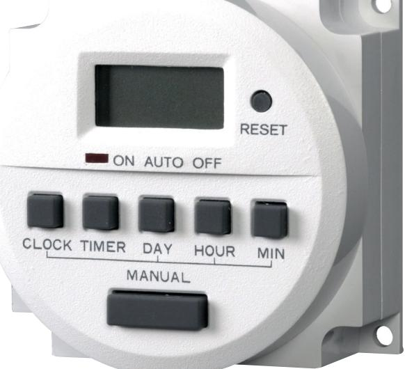
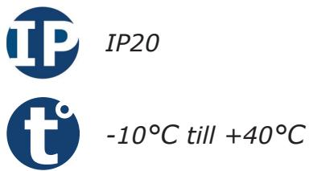
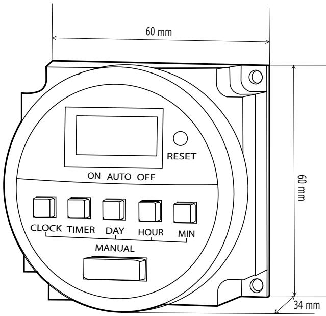

# **Produktblad**

## **Tidur - TH82724V**

### **Produktbeskrivning**

Tidur 24V. Tiduret gör det möjligt att aktivera flera scheman på vecka eller veckodag, detta gör det enkelt att ha ett lås uppställt dagtid vissa eller alla dagar i veckan.

Enkel programmering via LCD displayen. Programmera upp till 8st olika scheman för aktivering, förprogrammerade scheman för upplåsning t.ex. mån-fre finns.

Tiduret jobbar automatiskt och behöver ingen annan styrning, men möjligheten att aktivera reläutgången manuellt via en knapptryckning finns.

Tiduret har ett inbyggt backup batteri som klarar upp till 200h drift.

### **Funktioner**

- Digitalt 7-dagars tidur
- Ställ in 8 olika scheman
- Växlande kontakt (1 NO/NC)
- Perfekt för "Fritt tillträde" vissa tider
- Möjlighet att aktivera manuellt

#### **Teknisk information**

**Material:** Plast **Montering:** Utanpåliggande **LCD-display:** Ja **Ljusindikering:** Ja **Antal scheman:** Klarar upp till 8 olika scheman **Antal reläutgångar:** En reläutgång (1 NO/NC) **Max belastning:** 8A/250V~ **Kan aktiveras manuellt:** Ja **Mått (L x B x H ):** 60 x 60 x 34mm **Spänningsmatning:** 24V **Strömförbrukning:** 25mA till 30mA **Inbyggt backup batteri:** Ja **Kapslingsklass:** IP20 **Temperaturområde:** -10°C till +40°C

