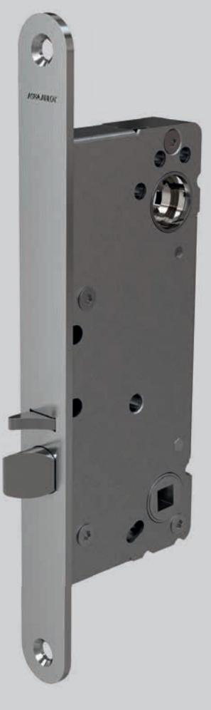
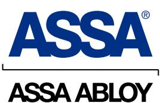
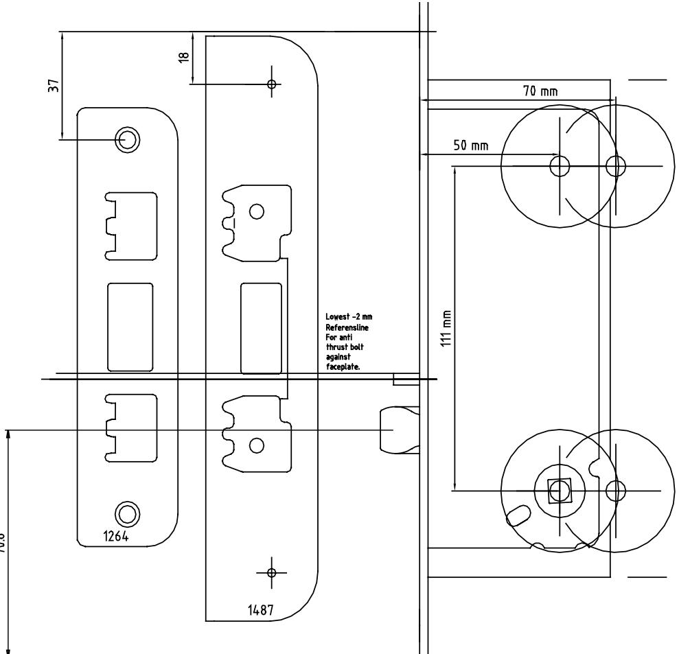
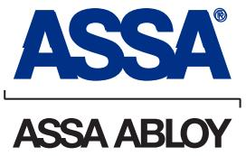

## ASSA Connect 216-50 Låshus ASSA Connect 216-50 Låshus

#### **Användningsområde Användningsområde**

Kontor/sjukhus och fastighetsapplikationer utan normgivna utrymningskrav! Kontor/sjukhus och fastighetsapplikationer utan normgivna utrymningskrav!

### **Egenskaper Egenskaper**

- Dorndjupsutförande; 50 mm • Dorndjupsutförande; 50 mm
- Med trycke- och förreglingsfall • Med trycke- och förreglingsfall
- Automatisk förregling av tryckesfallen vid 14 mm utlåsning och intryckt förreglingsfall • Kan kombineras med elektriska slutbleck • Automatisk förregling av tryckesfallen vid 14 mm utlåsning och intryckt förreglingsfall
- 216 är CE märkt och godkänd för att sitta • 216 är CE märkt och godkänd för att sitta i branddörr
- i branddörr • 216 kan kombineras med ASSA Smart Air och Aperio
- 216 kan kombineras med ASSA Smart Air • Kan kombineras med ASSA Elsutbleck • Kan kombineras med ASSA Elsutbleck

### **Funktion**

- **Funktion** • Trycke och förreglingsfall dras in med nyckel eller vred
- Trycke och förreglingsfall dras in med nyckel eller vred. • Trycke och förreglingsfall dras in med trycke

# ASSA Connect 216-50 Låshus ASSA Connect 216-50 Låshus

M2385.0910 Artnr 702409

ASSA ABLOY, the global leader in door opening solutions, dedicated to satisfying end-user needs for security, safety and convenience ASSA ABLOY, the global leader in door opening solutions, dedicated to satisfying end-user needs for security, safety and convenience. ASSA ABLOY, the global leader in door opening solutions, dedicated to satisfying end-user needs for security, safety and convenience.

ASSA OEM AB P.O. Box 371 SE-631 05 Eskilstuna Sweden ASSA OEM AB P.O. Box 371 SE-631 05 Eskilstuna Sweden ASSA AB P.O. Box 371 SE-631 05 Eskilstuna Sweden

phone +46 (0)16 17 70 00 phone +46 (0)16 17 70 00 phone +46 (0)16 17 70 00

fax +46 (0)16 17 73 72

fax +46 (0)16 17 73 72

fax +46 (0)16 17 72 10 Customer support: phone +46 (0)771 640 640 Customer support: phone +46 (0)771 888 008 e-mail: kundservice.gbg@assaabloy.com fax +46 (0)16 17 72 10 Customer support: phone +46 (0)771 640 640

e-mail: helpdesk@assa.se www.assaoem.se www.assaoem.se e-mail: helpdesk@assa.se www.assa.se