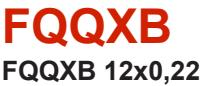
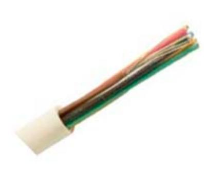
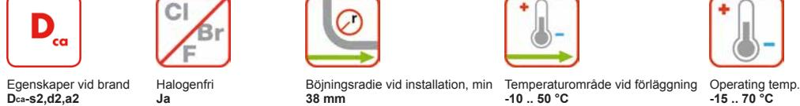
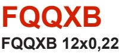

Kontaktuppgifter

Försäljning Tele/Datakabel Telefon: +46 325 80 000 telecomcable-pc.se@nexans.com

**Artikelnr:** 17527441 **E-nr:** 4890463 **EAN 13:** 7330000082762

Flexibel signal- och larmkabel med halogenfri, flamskyddad isolering och mantel.

# **BESKRIVNING**

## **Konstruktion**

Flexibel signal- och larmkabel med isolering och mantel av halogenfri, flamskyddad plastkompound. FQQXB används för kodlås, larminstallationer mm vid krav på vibrationstålighet. Uppfyller brandkrav enligt CPR klass Dcas2d2a2. Vid brand avger kabeln inga korrosiva gaser och har liten rökutveckling.

## **Leveransinformation**

FQQXB levereras i längder om 100m eller 500 m enligt tabellen Beställningsinformation. Förpackningen är märkt med tillverkare, kabeltyp och längd. Kabeländarna är förslutna.

### **Kvalitets- och miljöledningssystem**

Certifierade enligt ISO 9001, IRIS, ISO/TS 16949 och ISO 14001.

#### **PRESTANDADEKLARATION**

Egenskaper vid brand: Dcas2,d2,a2 enligt EN50575:2014+A1:2016

#### **STANDARDER**

**Internationell** IEC 60332-1

**Nationell** SS 424 16 42

Alla illustrationer, konstruktioner, specifikationer, ritningar och angivelser om vikt, storlek och dimensioner i Nexans tekniska eller kommersiella dokumentation är endast indikativa och kan inte förbinda Nexans eller anses vara representativa för Nexans. **Genererad 2019-04-30 www.nexans.se Sida 1 / 2**

Försäljning Tele/Datakabel Telefon: +46 325 80 000 telecomcable-pc.se@nexans.com

# **EGENSKAPER**

| Konstruktionsegenskaper             |                   |
|-------------------------------------|-------------------|
| Färg                                | Vit               |
| Ledare, tvärsnittstyp               | Glödgad, fåtrådig |
| Ledare, material                    | Förtent koppar    |
| Isolering, material                 | HFFR              |
| Skärm                               | Nej               |
| Mantel, material                    | HFFR (polyolefin) |
| Halogenfri                          | Ja                |
| Dimensionsegenskaper                |                   |
| Antal ledare                        | 12                |
| Mantel, tjocklek                    | 0,6 mm            |
| Ytterdiameter, nom                  | 5,4 mm            |
| Vikt                                | 4,5 kg/100m       |
| Ledare, area                        | 0,22 mm²          |
| Antal ledartrådar x tråddiameter    | 7 x 0.20 mm Ø     |
| Elektriska egenskaper               |                   |
| Ledarresistans vid 20° C, max       | 90 Ohm/km         |
| Isolationsresistans, min            | 500 MOhm.km       |
| Spänning vid drift, max             | 100 V             |
| Hanteringsinformation               |                   |
| Böjningsradie vid installation, min | 38 mm             |
| Längd                               | 100 m             |
| Förpackning                         | Bobin             |
| Temperaturområde vid förläggning    | -10  50 °C        |
| Drifttemperatur, område             | -15  70 °C        |

# **LEVERANSINFORMATION**

FQQXB levereras i längder om 100 eller 500 m enligt tabellen Beställningsinformation. Förpackningen är märkt med tillverkare, kabeltyp och längd. Kabeländarna är förslutna.

Alla illustrationer, konstruktioner, specifikationer, ritningar och angivelser om vikt, storlek och dimensioner i Nexans tekniska eller kommersiella dokumentation är endast indikativa och kan inte förbinda Nexans eller anses vara representativa för Nexans. **Genererad 2019-04-30 www.nexans.se Sida 2 / 2**

