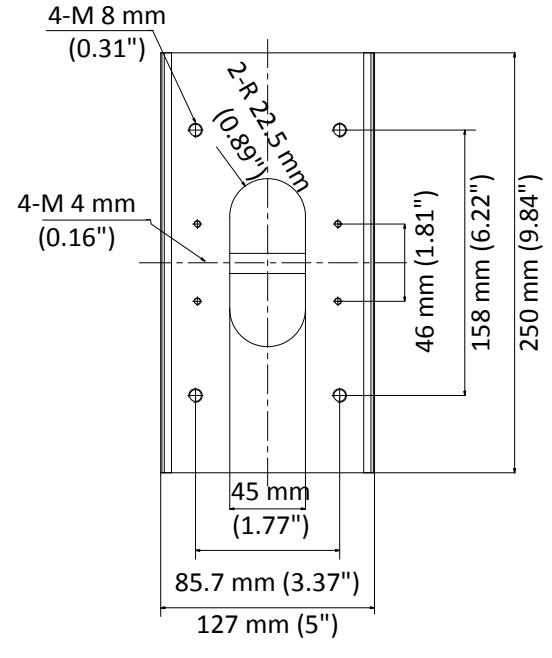
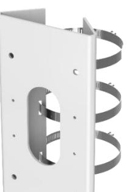
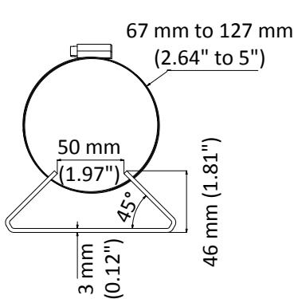

# **DS-1475ZJ-SUS**

**Vertical Pole Mount**

### **Feature**

- Stainless steel material with surface spray treatment
- Adjustable diameter from 67 mm to 127 mm

# **Dimension**

#### DS-1475ZJ-SUS

## **Parameter**

| Model      | DS-1475ZJ-SUS                                |
|------------|----------------------------------------------|
| Parameters | Vertical Pole Mount                          |
| Appearance | Hikvision White                              |
| Material   | Stainless Steel                              |
| Dimension  | 250 mm × 127 mm × 46 mm (9.84" × 5" × 1.81") |
| Weight     | 1205 g (2.66 lb.)                            |

## **Note**

- Waterproof rubber is necessary for the outdoor application.
- The wall must be capable of supporting at least 3 times as much as the total weight of the camera and the mount.
- The mount's maximum load capacity is 10 Kg (22 lb.).

