# **Video Door Phone Door Station and Indoor Station**

User Manual

UD05714B

### **User Manual**

© 2017 Hangzhou Hikvision Digital Technology Co., Ltd.

This user manual is intended for users of the models below:

| Series         | Model        |
|----------------|--------------|
| Door Station   | DS-KB2421-IM |
| Indoor Station | DS-KH2220    |

It includes instructions on how to use the Product. The software embodied in the Product is governed by the user license agreement covering that Product.

### **About this Manual**

This Manual is subject to domestic and international copyright protection. Hangzhou Hikvision Digital Technology Co., Ltd. ("Hikvision") reserves all rights to this manual. This manual cannot be reproduced, changed, translated, or distributed, partially or wholly, by any means, without the prior written permission of Hikvision.

### **Trademarks**

 and other Hikvision marks are the property of Hikvision and are registered trademarks or the subject of applications for the same by Hikvision and/or its affiliates. Other trademarks mentioned in this manual are the properties of their respective owners. No right of license is given to use such trademarks without express permission.

### **Disclaimer**

TO THE MAXIMUM EXTENT PERMITTED BY APPLICABLE LAW, HIKVISION MAKES NO WARRANTIES, EXPRESS OR IMPLIED, INCLUDING WITHOUT LIMITATION THE IMPLIED WARRANTIES OF MERCHANTABILITY AND FITNESS FOR A PARTICULAR PURPOSE, REGARDING THIS MANUAL. HIKVISION DOES NOT WARRANT, GUARANTEE, OR MAKE ANY REPRESENTATIONS REGARDING THE USE OF THE MANUAL, OR THE CORRECTNESS, ACCURACY, OR RELIABILITY OF INFORMATION CONTAINED HEREIN. YOUR USE OF THIS MANUAL AND ANY RELIANCE ON THIS MANUAL SHALL BE WHOLLY AT YOUR OWN RISK AND RESPONSIBILITY.

TO THE MAXIMUM EXTENT PERMITTED BY APPLICABLE LAW, IN NO EVENT WILL HIKVISION, ITS DIRECTORS, OFFICERS, EMPLOYEES, OR AGENTS BE LIABLE TO YOU FOR ANY SPECIAL, CONSEQUENTIAL, INCIDENTAL, OR INDIRECT DAMAGES, INCLUDING, AMONG OTHERS, DAMAGES FOR LOSS OF BUSINESS PROFITS, BUSINESS INTERRUPTION, SECURITY BREACHES, OR LOSS OF DATA OR DOCUMENTATION, IN CONNECTION WITH THE USE OF OR RELIANCE ON THIS MANUAL, EVEN IF HIKVISION HAS BEEN ADVISED OF THE POSSIBILITY OF SUCH DAMAGES.

SOME JURISDICTIONS DO NOT ALLOW THE EXCLUSION OR LIMITATION OF LIABILITY OR CERTAIN DAMAGES, SO SOME OR ALL OF THE ABOVE EXCLUSIONS OR LIMITATIONS MAY NOT APPLY TO YOU.

### **Support**

Should you have any questions, please do not hesitate to contact your local dealer.

## **Regulatory Information**

## **FCC Information**

Please take attention that changes or modification not expressly approved by the party responsible for compliance could void the user's authority to operate the equipment.

**FCC compliance:** This equipment has been tested and found to comply with the limits for a Class A digital device, pursuant to part 15 of the FCC Rules. These limits are designed to provide reasonable protection against harmful interference when the equipment is operated in a commercial environment. This equipment generates, uses, and can radiate radio frequency energy and, if not installed and used in accordance with the instruction manual, may cause harmful interference to radio communications. Operation of this equipment in a residential area is likely to cause harmful interference in which case the user will be required to correct the interference at his own expense.

### **FCC Conditions**

This device complies with part 15 of the FCC Rules. Operation is subject to the following two conditions:

1. This device may not cause harmful interference.

2. This device must accept any interference received, including interference that may cause undesired operation.

### **EU Conformity Statement**

This product and - if applicable - the supplied accessories too are marked with "CE" and comply therefore with the applicable harmonized European standards listed under the EMC Directive 2014/30/EU, the RoHS Directive 2011/65/EU.

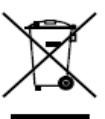

2012/19/EU (WEEE directive): Products marked with this symbol cannot be disposed of as unsorted municipal waste in the European Union. For proper recycling, return this product to your local supplier upon the purchase of equivalent new equipment, or dispose of it at designated collection points. For more information see: www.recyclethis.info

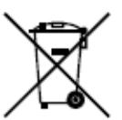

2006/66/EC (battery directive): This product contains a battery that cannot be disposed of as unsorted municipal waste in the European Union. See the product documentation for specific battery information. The battery is marked with this symbol, which may include lettering to indicate cadmium (Cd), lead (Pb), or mercury (Hg). For proper recycling, return the battery to your supplier or to a designated collection point. For more information see: www.recyclethis.info

### **Industry Canada ICES-003 Compliance**

This device meets the CAN ICES-3 (A)/NMB-3(A) standards requirements.

## **Symbol Conventions**

The symbols that may be found in this document are defined as follows.

| Symbol  | Description                                                                                                                                                                          |
|---------|--------------------------------------------------------------------------------------------------------------------------------------------------------------------------------------|
| NOTE    | Provides additional information to emphasize or supplement important points of the main text.                                                                                     |
| CAUTION | Indicates a potentially hazardous situation, which if not avoided, could result in equipment damage, data loss, performance degradation, or unexpected results. |
| DANGER  | Indicates a hazard with a high level of risk, which if not avoided, will result in death or serious injury.                                                                    |

### **Safety Instruction**

- All the electronic operation should be strictly compliance with the electrical safety regulations, fire prevention regulations and other related regulations in your local region.
- Please use the power adapter, which is provided by normal company. The power consumption cannot be less than the required value.
- Do not connect several devices to one power adapter as adapter overload may cause over-heat or fire hazard.
- Please make sure that the power has been disconnected before you wire, install or dismantle the device.
- When the product is installed on wall or ceiling, the device shall be firmly fixed.
- If smoke, odors or noise rise from the device, turn off the power at once and unplug the power cable, and then please contact the service center.
- If the product does not work properly, please contact your dealer or the nearest service center. Never attempt to disassemble the device yourself. (We shall not assume any responsibility for problems caused by unauthorized repair or maintenance.)
- Do not drop the device or subject it to physical shock, and do not expose it to high electromagnetism radiation. Avoid the equipment installation on vibrations surface or places subject to shock (ignorance can cause equipment damage).
- Do not place the device in extremely hot (refer to the specification of the device for the detailed operating temperature), cold, dusty or damp locations, and do not expose it to high electromagnetic radiation.
- The device cover for indoor use shall be kept from rain and moisture.
- Exposing the equipment to direct sun light, low ventilation or heat source such as heater or radiator is forbidden (ignorance can cause fire danger).
- Do not aim the device at the sun or extra bright places. A blooming or smear may occur otherwise (which is not a malfunction however), and affecting the endurance of sensor at the same time.

## **Preventive and Cautionary Tips**

- Please use the provided glove when open up the device cover, avoid direct contact with the device cover, because the acidic sweat of the fingers may erode the surface coating of the device cover.
- Please use a soft and dry cloth when clean inside and outside surfaces of the device cover, do not use alkaline detergents.
- Please keep all wrappers after unpack them for future use. In case of any failure occurred, you need to return the device to the factory with the original wrapper. Transportation without the original wrapper may result in damage on the device and lead to additional costs.
- Do not expose the device to the explosive situation.
- Do not expose the device to the corrosive gas. Otherwise the equipment damage may occur.
- Please wire the power cable according to the instruction as wrong wiring may cause equipment damage.
- Do not allow the child to push the device from the bottom just in case the device drops and hits the child.
- Do not splash the water on the device. Device short circuit or other damages may occur if the water enters into the device.
- Do not expose the device to the sun bright for a long time, otherwise the screen of the device may fall off.
- Please watch out for the glass fragments if the device drops. Avoid scratched or damaged by the glass fragments and do not allow the child to touch the glass fragments.
- It is suggested that you should smear the glass glue around the device after installation.
- Please make sure no child stands under the device when installing the device. The device may hit the child in case the device drops in the installation process.
- Do not expose the device to high electromagnetism radiation.

| 1 Introduction  1                                                                                                                                                                                                                                                                                                              |  |
|--------------------------------------------------------------------------------------------------------------------------------------------------------------------------------------------------------------------------------------------------------------------------------------------------------------------------------|--|
| 1.1 Overview  1 1.2 Features  1                                                                                                                                                                                                                                                                                             |  |
| 2 Appearance Description  2                                                                                                                                                                                                                                                                                                    |  |
| 2.1 Indoor Station  2 2.2 Door Station  2                                                                                                                                                                                                                                                                                   |  |
| 3 Terminals and Wirings  3                                                                                                                                                                                                                                                                                                     |  |
| 3.1 Terminals and Interfaces  3 3.1.1 Terminals of Indoor Station  3 3.1.2 Terminals of Door Station  3 3.2 Wiring Description  4 3.2.1 Wiring 1 (1 Door Station and 1 Indoor Station)  6 3.2.2 Wiring 2 (1 Door Station and 3 Indoor Stations)  7 3.2.3 Wiring 3 (2 Door Stations and 3 Indoor Stations)  8 |  |
| 4 Installation  9                                                                                                                                                                                                                                                                                                              |  |
| 4.1 Indoor Station Installation  9 4.2 Door Station Installation 10                                                                                                                                                                                                                                                         |  |
| 5 Local Operation 12                                                                                                                                                                                                                                                                                                           |  |
| 5.1 Door Station Local Operation 12 5.2 Indoor Station Local Operation 12                                                                                                                                                                                                                                                   |  |
| Appendix13                                                                                                                                                                                                                                                                                                                     |  |
| Installation Notice 13                                                                                                                                                                                                                                                                                                         |  |

# **1 Introduction**

## **1.1 Overview**

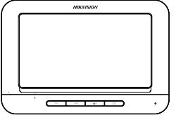

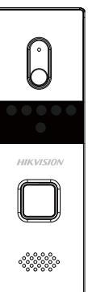

The video door phone is composed of a four-wire indoor station and a four-wire door station. Featuring in the convenient installation and easy operation, it is mainly applied in the buildings for improving the living security.

## **1.2 Features**

### **Indoor Station Features**

- Hands-free video intercom communication
- Supports three indoor stations simultaneously in the intercom system
- Supports monitoring the door station and the external analog camera
- Remote unlocking
- Convenient installation and easy operation

### **Door Station Features**

- Hands-free video intercom communication
- Supports two door stations simultaneously in the intercom system
- Self-adaptive IR supplement (with photoresistor)
- One-touch calling
- Pinhole camera with 720 x 576 @ 25 fps
- Unlock controlling
- Anti-oxidant aluminium alloy
- Convenient installation and easy operation

# **Appearance Description**

## **2.1 Indoor Station**

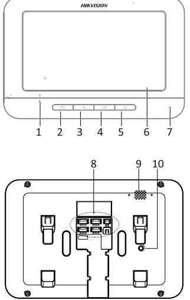

Table 2-1 Components Description

| No. | Description              |
|-----|--------------------------|
| 1   | Power Supply Indicator   |
| 2   | Call Accept/Decline Key  |
| 3   | Unlock Key               |
| 4   | Live View Key            |
| 5   | Switch Key               |
| 6   | LCD Screen               |
| 7   | Microphone               |
| 8   | Terminals and Interfaces |
| 9   | Loudspeaker              |
| 10  | Volume Control Knob      |

Figure 2-1 Indoor Station Appearance

## **2.2 Door Station**

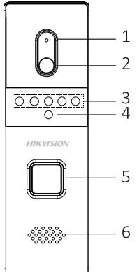

Figure 2-2 Door Station Appearance

| No. | Description          |
|-----|----------------------|
| 1   | Microphone           |
| 2   | Built-in Camera      |
| 3   | IR Supplement Lights |
| 4   | Photoresistor        |
| 5   | Call Button          |
| 6   | Loudspeaker          |

# **3 Terminals and Wirings**

## **3.1 Terminals and Interfaces**

## **3.1.1 Terminals of Indoor Station**

On the rear panel of the indoor station, there are 4 groups of four-wire terminals for connecting indoor station or door station, 1 terminal for accessing the camera, and 1 terminal for power supply.

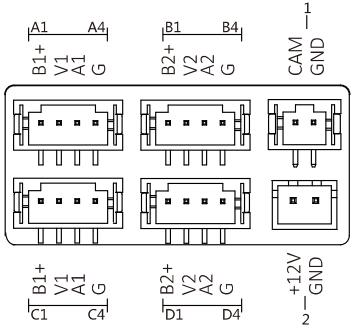

Figure 3-1 Terminals of Indoor Station

| Name                   | No.         | Interface | Description                   |
|------------------------|-------------|-----------|-------------------------------|
| Camera                 | 1           | CAM       | Analog Camera Access          |
| Power Supply           | 2           | 12 VDC    | 12 VDC Power Supply Input  |
| Four-Wire Interface | A1/B1/C1/D1 | B1+/B2+   | Power Supply for Door Station |
|                        | A2/B2/C2/D2 | V1/V2     | Video Input                   |
|                        | A3/B3/C3/D3 | A1/A2     | Audio Input/Output            |
|                        | A4/B4/C4/D4 | G         | Grounding Signal              |

Table 3-1 Descriptions of Terminals (Indoor Station)

## **3.1.2 Terminals of Door Station**

On the rear panel of the door station, there are 2 wire groups. 1 wire group is used to connect the indoor station, and another wire group is used to connect the lock.

### **Video Door Phone**·User Manual

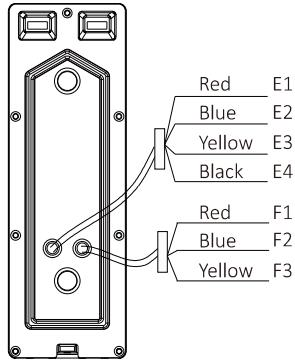

Figure 3-2 Wire of Door Station

Table 3-2 Descriptions of Terminals and Interfaces (Door Station)

| Name                             | No. | Color  | Interface | Description                            |
|----------------------------------|-----|--------|-----------|----------------------------------------|
| Wire Group (Four-Wir e) | E1  | Red    | 5V        | Power Supply (from Indoor Station)     |
|                                  | E2  | Blue   | CVBS      | Video Output                           |
|                                  | E3  | Yellow | AUIDO     | Audio Input/Output                     |
|                                  | E4  | Black  | GND       | Grounding Signal                       |
| Wire Group (Lock)          | F1  | Red    | NO        | Door Lock Relay Output/Normally Open   |
|                                  | F2  | Blue   | COM       | Door Lock Relay Output/Common       |
|                                  | F3  | Yellow | NC        | Door Lock Relay Output/Normally Closed |

## **3.2 Wiring Description**

### *Purpose:*

The four-wire indoor station and the four-wire door station are 2 basic but major components in a four-wire video intercom system. As for extended components, the analog camera and the electric bolt can be connected to the indoor station and the door station respectively in a four-wire video intercom system.

Up to 2 door stations are supported simultaneously in the intercom system.

Up to 3 indoor stations are supported simultaneously in the intercom system.

Here take 3 wirings as example.

- According to different transmission distances among door stations and indoor stations, different RVV4 cable specifications are demanded.

| NOTE    | According to different transmission distances among door stations and indoor stations, different RVV4 cable specifications                                                                                                                                                                                                                                                                | are demanded.            |
|---------|----------------------------------------------------------------------------------------------------------------------------------------------------------------------------------------------------------------------------------------------------------------------------------------------------------------------------------------------------------------------------------------------|--------------------------|
|         | Transmission Distance (TD)                                                                                                                                                                                                                                                                                                                                                                   | RVV4 Cable Specification |
|         | TD ≤ 10 m                                                                                                                                                                                                                                                                                                                                                                                 | RVV4 * 0.2 mm ^2         |
|         | 10 m < TD ≤ 30 m                                                                                                                                                                                                                                                                                                                                                                       | RVV4 * 0.5 mm ^2         |
|         | 30 m < TD ≤ 50 m                                                                                                                                                                                                                                                                                                                                                                       | RVV4 * 0.75 mm ^2        |
|         | 50 m < TD ≤ 100 m                                                                                                                                                                                                                                                                                                                                                                      | RVV4 * 1.5 mm ^2         |
| CAUTION | On the rear panel of the indoor station, four-wire interface A and four-wire interface C compose a cascading group; and four-wire interface B and four-wire interface C compose a cascading group. The communication between A and B/D cannot be realized. The communication between C and B/D cannot be realized. (audio wire) of the four-wire interface. |                          |
|         |                                                                                                                                                                                                                                                                                                                                                                                              | 5                        |

- On the rear panel of the indoor station, four-wire interface A and four-wire interface C compose a cascading group; and four-wire interface B and four-wire interface C compose a cascading group.
- The communication between A and B/D cannot be realized.
- The communication between C and B/D cannot be realized.

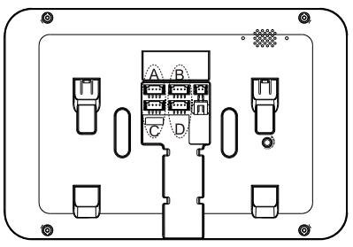

## **CAUTION**

Do not connect the power wire of the four-core cable to the V pin (video wire) or A pin (audio wire) of the four-wire interface.

## **3.2.1 Wiring 1 (1 Door Station and 1 Indoor Station)**

## **CAUTION**

- Do not pull power cables on the rear panel of the door station hard to avoid the disconnection of power cables.
- Use the insulated tape to tape the bare wires, so as to avoid the short circuit.

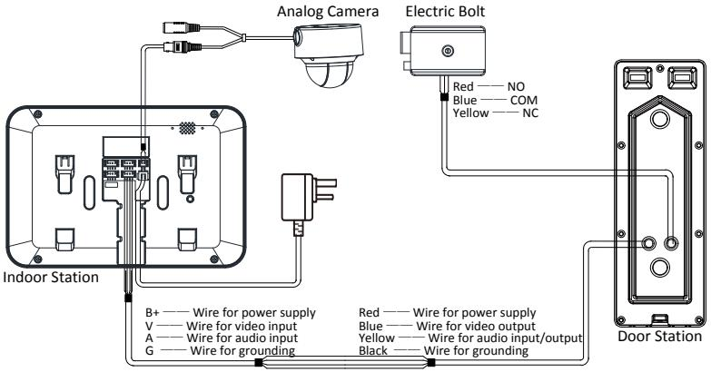

Figure 3-3 Wiring 1 (1 Door Station and 1 Indoor Station)

## **3.2.2 Wiring 2 (1 Door Station and 3 Indoor Stations)**

## **CAUTION**

- Do not pull power cables on the rear panel of the door station hard to avoid the disconnection of power cables.
- Use the insulated tape to tape the bare wires, so as to avoid the short circuit.

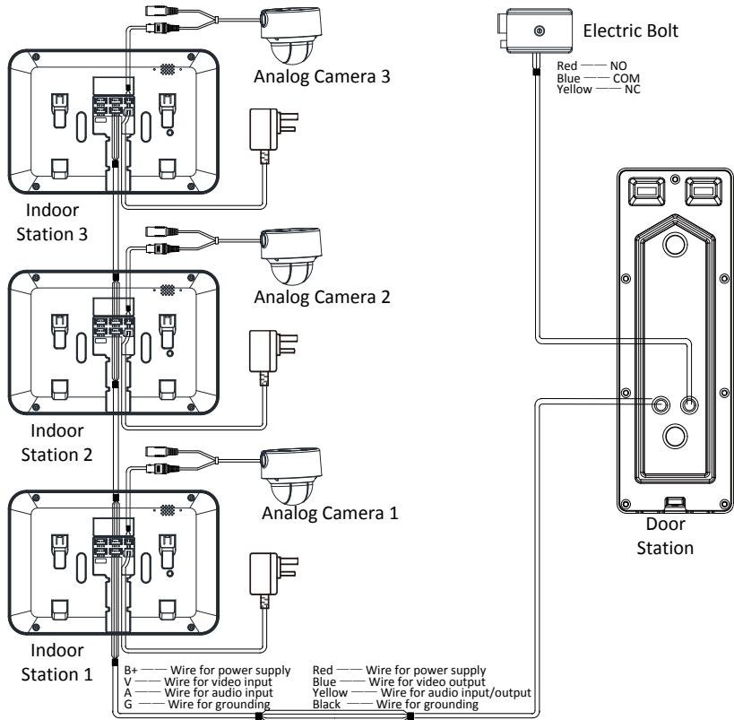

Figure 3-4 Wiring 2 (1 Door Station and 3 Indoor Stations)

## **3.2.3 Wiring 3 (2 Door Stations and 3 Indoor Stations)**

## **CAUTION**

- Do not pull power cables on the rear panel of the door station hard to avoid the disconnection of power cables.
- Use the insulated tape to tape the bare wires, so as to avoid the short circuit.

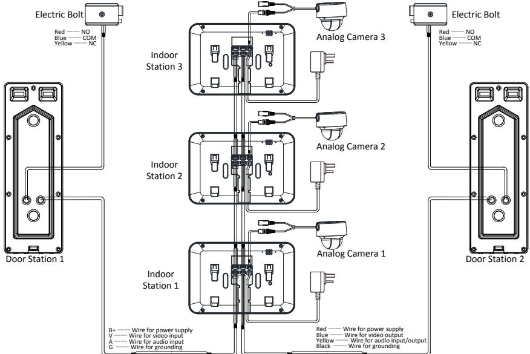

Figure 3-5 Wiring 3 (2 Door Stations and 3 Indoor Stations)

# **4 Installation**

## *Before you start:*

- Make sure the device in the package is in good condition and all the assembly parts are included.
- The power supply the indoor station supports is 12 VDC. Please make sure your power supply matches your indoor station.
- Make sure all the related equipment is power-off during the installation.
- Check the specification of the product for the installation environment.

## **4.1 Indoor Station Installation**

The indoor station supports the wall mounting, including the wall mounting with the junction box, and the wall mounting without the junction box.

For the wall mounting with junction box, the wall mounting plate and the junction box are required. And for the wall mounting without junction box, only the wall mounting plate is required.

(Optional) The dimension of the junction box is 75 mm (width) x 75 mm (length) x 50 mm (depth).

The dimension of the wall mounting plate is shown in Figure 4-1.

## **Wall Mounting Plate (Indoor Station)**

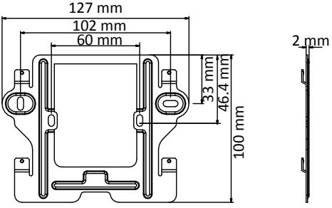

Figure 4-1 Wall Mounting Plate

## **Wall Mounting (Indoor Station)**

You can follow the following steps to install the indoor station.

Here we take the wall mounting with the junction box as example.

## *Steps:*

- 1. Insert the junction box to the hole chiseled on the wall.
- 2. Fix the wall mounting plate to the junction box with 2 screws.

## **Video Door Phone**·User Manual

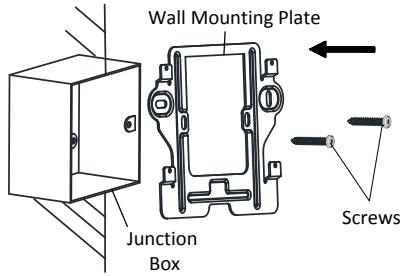

Figure 4-2 Installing the Plate

- 3. Hook the indoor station to the wall mounting plate tightly by inserting the plate hooks into the slots on the rear panel of the indoor station, during which the lock catch will be locked automatically.
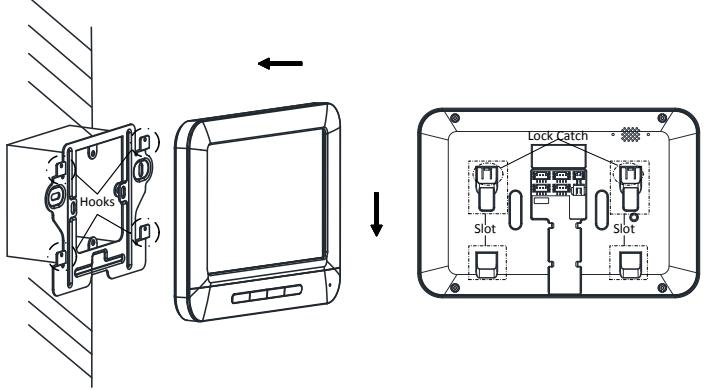

Figure 4-3 Hooking the Indoor Station to the Plate

## **NOTE**

For the installation without the junction box, you should fix the wall mounting plate to the wall with 2 expansion screws first, and then hook the indoor station.

## **4.2 Door Station Installation**

### **Accessoris (Door Station)**

To install the door station, the wall mounting shield and the wall mounting plate are required.

## **Wall Mounting (Door Station)**

You can follow the following steps to install the door station. *Steps:* 

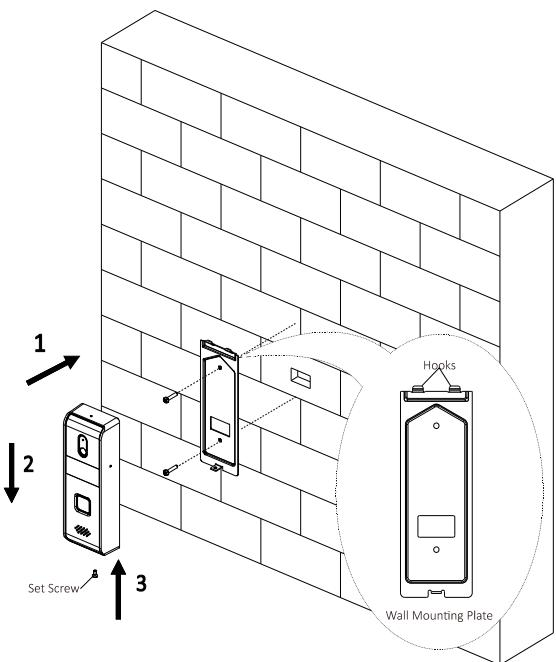

Figure 4-4 Install the Door Station

- 1. Fix the wall mounting plate to the wall with 2 screws.
- 2. Hook the door station to the shield tightly by inserting the hooks of shield panel into the slots on the rear panel of the door station.
- 3. Secure the door station with the mounting shield with the set screw.
- 4. Use 3 screws to secure the wall mounting shield with the door station.

Figure 4-5 Secure Wall Mounting Shield

# **5 Local Operation**

## **5.1 Door Station Local Operation**

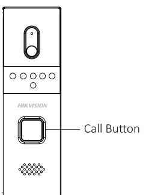

*Steps:* Press the call button to call the resident.

When press the call button to call the resident, the maximum ring duration of the indoor station is 30s.

Figure 5-1 Call Button of Door Station

## **5.2 Indoor Station Local Operation**

Table 5-1 Indoor Station Local Operation Description

| Keys | Description                                                                                              |                      |  |
|------|----------------------------------------------------------------------------------------------------------|----------------------|--|
|      | Accept or decline the incoming call.                                                                     |                      |  |
|      | Unlock the door.                                                                                         |                      |  |
|      | Open or close the live view.                                                                             |                      |  |
|      | Switch the live view among the first door station, the second door station, and the analog camera. |                      |  |
|      | Counterclockwise rotation                                                                                | Increase the volume. |  |
|      | Clockwise rotation                                                                                       | Decrease the volume. |  |

## **NOTE**

- The maximum live view duration is 60s; and the maximum speaking duration is 60s.
- During the ring duration, speaking duration, or live view duration, the resident can unlock the door. The unlocking status can maintain 5 seconds after pressing the Unlock key.
- To achieve the optimal pickup effect, the recommended distance range between the speaker and the microphone of the indoor station or the door station is 30 to 40 cm.

# **Appendix**

## **Installation Notice**

While installing the indoor station, make sure that the distance between any two devices is far enough to avoid the howling and echo. The distance between two devices is recommended to be longer than 10 meters.

## **NOTE**

Here devices refer to indoor stations, and door stations.

0100001070504

**Video Door Phone**·User Manual