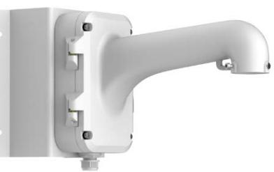
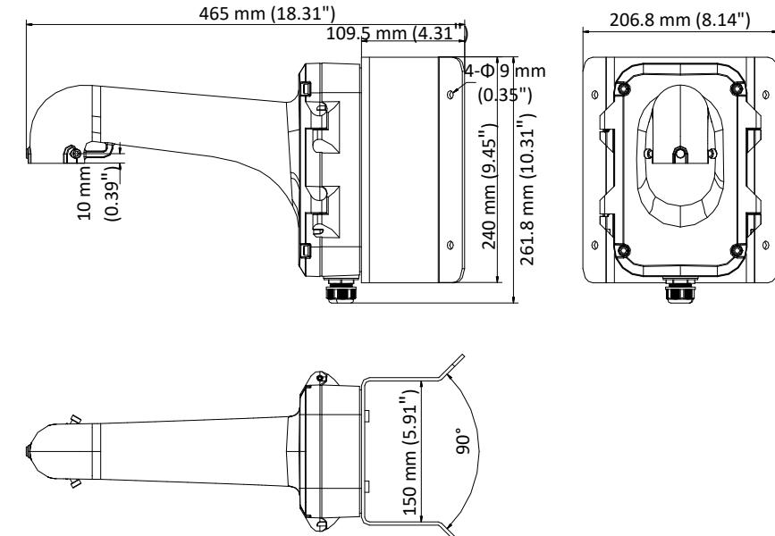

# **DS-1604ZJ-Corner**

# **Corner Mounting Bracket for Speed Dome**

#### **Feature**

- Corner mounting bracket with the junction box
- Aluminum alloy and steel material with surface spray treatment
- Waterproof design
- Supports bottom outlet and back outlet
- The hook for safety rope facilitates speed dome's installation

# **Dimension**

# **Available Model**

#### DS-1604ZJ-Corner

## **Parameter**

| Model      | DS-1604ZJ-Corner                                       |
|------------|--------------------------------------------------------|
| Parameters | Corner Mounting Bracket for Speed Dome                 |
| Appearance | Hikvision White                                        |
| Material   | Aluminum Alloy and Steel                               |
| Dimension  | 465 mm × 206.8 mm × 261.8 mm (18.31" × 8.14" × 10.31") |
| Weight     | 4.3 Kg (9.48 lb.)                                      |

#### **Note**

- The bracket should be installed on the flat surface.
- Waterproof rubber is necessary for the outdoor application.
- The wall must be capable of supporting at least 3 times as much as the total weight of the speed dome and the bracket.
- The bracket's maximum load capacity is 10 Kg (22 lb.).