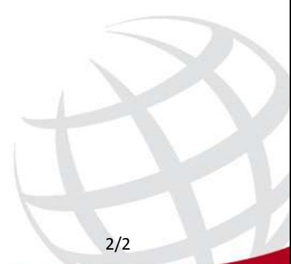

# **5-56**

## 1. Allmän beskrivning

Universalspray som smörjer, rengör, löser upp och skyddar mot rost, tränger undan fukt och mycket mer. En snabb och värdefull hjälp i vardagen.

#### 2. Egenskaper

- Allmänt korrosionsskydd.
- Temporärt skydd av metalldelar under förvaring.
- Skyddar metaller och legeringar.
- Tränger undan och stänger ute vatten och fukt.
- Säker på alla metallytor, utan missfärgning.
- Säker på de flesta plaster, gummimaterial och beläggningar. Testa före användningen på material som är känsliga eller utsatta för påfrestning.
- Praktisk 360 graders (upp och ned) sprayventil för aerosoler.
- Mycket ren drivgas av CO2 vilket ger ett aktivt produktinnehåll på 95 %.
- Lossar metalldelar som har kärvat ihop på grund av smuts, korrosion eller torkat fett.
- Tränger in snabbt.

## 3. Användningsområden

- Ytbehandling.
- Kärvande och korroderade delar.
- För avlägsnande av fukt från tändningssystem.

 Ett modernt, mångsidigt hjälpmedel för hundratals reparationsjobb i alla arbetsmiljöer: bilar, hem, fritid...

#### 4. Anvisningar

- Applicera ett tunt och jämnt skikt.
- Använd förlängningsröret för exakt applicering.
- Vänta några minuter för god inträngning.
- Upprepa vid behov.
- Använd något av CRC-rengöringsmedlen för att avlägsna rester eller överskott av produkten.
- Använd inte på spänningssatt utrustning.

 **Säkerhetsdatablad i enlighet med EG:s förordning 1907/2006 art. 31 och efterföljande tillägg finns för alla CRC-produkter.**

#### 5. Typiska produktdata (utan drivgas)

| Utseende                    | Vätska.                                                  |
|-----------------------------|----------------------------------------------------------|
| Färg                        | Bärnstensfärgad / Bärnstensfärgat / Bärnstensfärgade. |
| Lukt                        | Salicylat.                                               |
| Densitet                    | 0.82 g/cm3 (@ 20°C).                                     |
| Flampunkt                   | 78 °C (sluten degel)                                     |
| Självantändningstemperatur, | > 200 °C                                                 |

Färg Bärnstensfärgad / Bärnstensfärgat / Bärnstensfärgade.

1/2

# **Technical Data Sheet**

**5-56**

tändpunkt Densitet, aktiv produkt 0.88 g/cm3 (@ 20°C). Typisk skikttjocklek 1 --> 2 µm

# Anmärkningar

Alla uppgifter i detta dokument är baserade på driftserfarenhet och/eller laboratorietester. På grund av den stora variationen i utrustning och förhållanden och de oförutsägbara mänskliga faktorer som är inblandade, rekommenderar vi att våra produkter testas på plats före användning. All information ges i god tro, men utan garanti, varken uttryckt eller underförstådd. Detta tekniska datablad kan redan ha reviderats vid denna tidpunkt, på grund av exempelvis lagstiftning, tillgänglighet på komponenter och nyligen förvärvade erfarenheter. Den senaste och enda giltiga versionen av detta tekniska datablad kan skickas till dig på begäran eller hittas på vår webbplats: www.crcind.com Vi rekommenderar att du registrerar dig på denna webbplats för denna produkt, så att du kan få eventuella framtida reviderade versioner skickade till dig automatiskt.

| Version | CRC_RED-5_56_CONS-20180809 |
|---------|----------------------------|
| Datum   | 22/08/2018                 |

