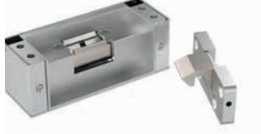
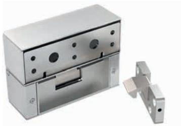
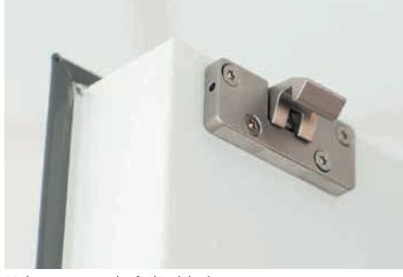
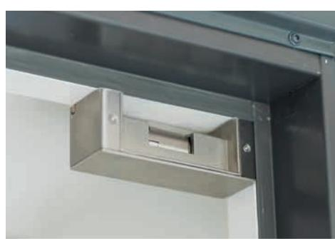
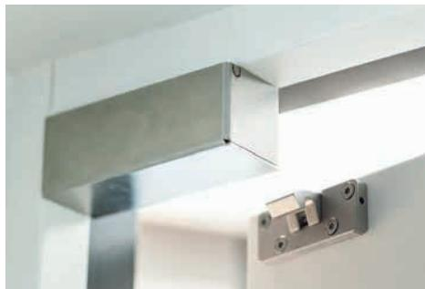
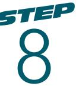

8

# Utanpåliggande lås i minimal design

STEP 8 är ett utanpåliggande lås som snabbt monteras direkt på karmen. STEPs unika listtrycksteknik i kombination med minimala mått och rostfritt stål ger STEP 8 en driftsäker funktion med stilren design.

STEP 8 är en perfekt lösning för dörrmiljöer där ett lås ska monteras i efterhand eller där du inte vill eller kan montera ett infällt lås, exempelvis på grund av utrymmesskäl, i dörrar där det förekommer asbest eller i dörrar med högt kulturvärde.

Låset kan användas som ersättare till magnetlås samt kombineras med dörrautomatik och/eller brandlarm. Det kan monteras stående eller liggande i både enkel- och pardörrar.

### Snabb och enkel montering

Ett utanpåliggande montage är mycket enkelt att installera. Inga förändringar behöver göras i det befintliga urtaget.

### STEPs unika listtrycksteknik

Ett vanligt problem är att dörren utsätts för tryck, exempelvis på grund av att dörren hänger lite snett eller att det samlats grus eller snö vid tröskeln. STEP 8 är utrustad med STEPs unika listtrycksteknik som gör att dörren kan låsa upp, även om den utsätts för tryck.

STEP 8 för montering under karmen.

STEP 8 med vinkelkonsol för montering i dörrar där karmen ligger i liv med dörrbladet.

Hake monterad på dörrbladet.

Elslutbleck monterat på karmens undersida.

Haken låser i elslutblecket när dörren stängs.

## STEP 8 med eller utan vinkelkonsol

STEP 8 består av två rejäla delar, en hake som monteras på dörrbladet och ett elslutbleck i en konsol som monteras direkt på karmens undersida. För dörrar där elslutblecket ska monteras där karmen ligger i liv med dörrbladet kompletteras STEP 8 med en vinkelkonsol.

### Omvänd funktion för dörrar med utrymningskrav

I omvänd funktion är STEP 8 anpassad till utrymningsdörrar med utrymningsterminal eller nödöppningsknapp. Låset klarar ett högt listtryck på upp till 1500N (≈150 kg), vilket möjliggör en säker utrymning.

STEP 8 finns även i rättvänd funktion.

### Tekniska data

#### Strömförbrukning*

|                                                                             | Rättvänd/omvänd funktion |                    |  |
|-----------------------------------------------------------------------------|--------------------------|--------------------|--|
|                                                                             | 24V DC +15% -10%         | 12V DC +15% -10%   |  |
|                                                                             | 110mAh / max 300mA       | 220mAh / max 600mA |  |
| *Strömförbrukning 0mA för vridfall i vila (rättvänd = låst, omvänd = olåst) |                          |                    |  |

### Artikelnummer

| STEP 8                  |                          |  |
|-------------------------|--------------------------|--|
| ST880                   | Rättvänd funktion 24V DC |  |
| ST880-12                | Rättvänd funktion 12V DC |  |
| ST881                   | Omvänd funktion 24V DC   |  |
| ST881-12                | Omvänd funktion 12V DC   |  |
| STEP 8 med vinkelkonsol |                          |  |
| ST890                   | Rättvänd funktion 24V DC |  |
| ST890-12                | Rättvänd funktion 12V DC |  |
| ST891                   | Omvänd funktion 24V DC   |  |
| ST891-12                | Omvänd funktion 12V DC   |  |
| Tillbehör vinkelkonsol  |                          |  |
| ST860                   | Endast vinkelkonsol      |  |
|                         |                          |  |

- Durability: Grade X enligt SS-EN 14846
- Corrosion: Grade M enligt SS-EN 14846
- Omvänd funktion anpassad till krav enligt SS-EN 13637
- Mikrobrytare enpoligt växlande, max. 30V DC, 1A
- Skyddsdiod finns inbyggd
- Inbyggd indikering för avkänning att dörren är stängd/öppen (kolvkontakt)
- Brythållfasthet 9kN (900kg)
- Garanterar öppning trots listtryck på 400 N (≈ 40 kg) i rättvänd funktion och 1500 N (≈ 150 kg) i omvänd funktion.
- i rättvänd och omvänd funktionKnacksäkrad
- Vändbar för att passa höger- och vänsterdörrar

