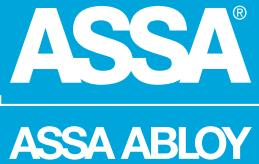
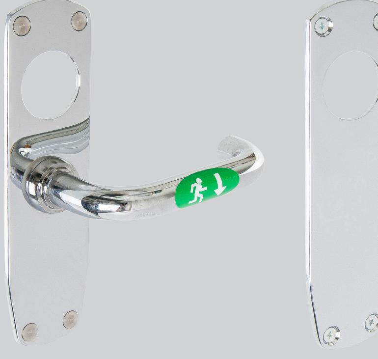
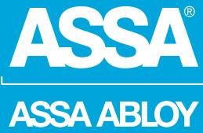
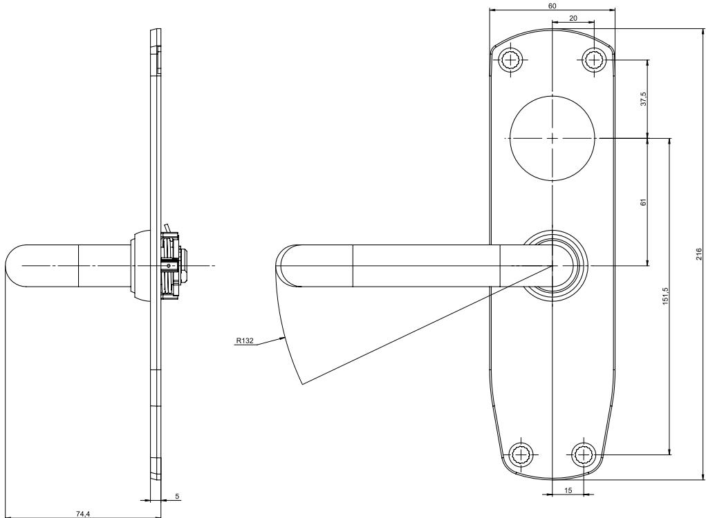

## ASSA 179G

ASSA ABLOY, the global leader in door opening solutions

### Nödutrymningsbeslag

**ASSA 179G, dörrtjocklek 42-90 mm, för låshus ASSA 711 eller 732 med dorndjup 50 eller 70 mm**

#### **Användningsområde**

ASSA 179G är avsett för slagdörrar i modulutförande i utrymningsvägar där särskilda krav på panikutrymning ej föreligger. Låset öppnas med ett handgrepp, vilket ger en säker utrymning.

Slutbleck och elslutbleck enligt tabell nedan rekommenderas (X). Dörrspringa 3 ±1 mm.

|        | Slutbleck |      | Elslutbleck             |
|--------|-----------|------|-------------------------|
| Låshus | 1487      | 2530 | 900, 910, 911, 920, 960 |
| 711-50 | X         |      |                         |
| 711-70 | X         |      |                         |
| 732-50 | X         | X    | X                       |
| 732-70 | X         | X    |                         |

### **Egenskaper**

- Lämplig för montage i passersystem
- ASSA 179G är certifierat och CE-märkt enligt kraven i europastandarden SS-EN 179:2008
- Finns i ASSAs ytbehandlingar 001, 002, 011 och 013

#### **Funktion**

- Monteras tillsammans med låshus ASSA 711 eller 732 med dorndjup 50 eller 70 mm
- Dörren kan alltid öppnas från insidan via utrymningshandtaget
- Vid användning av låshus 711 är återinrymning möjlig via utsidas draghandtag efter utrymning
- För dörrar med mindre C-mått än 25 mm rekommenderas minst en 3 mm distansskylt 179

# ASSA 179G

ASSA ABLOY, the global leader in door opening solutions

#### **Artikelnummer**

| Utrymningsbeslag 179G HÖ PR MP  | 706681101001 |
|---------------------------------|--------------|
| Utrymningsbeslag 179G VÄ PR MP  | 706681102001 |
| Utrymningsbeslag 179G HÖ NI MP  | 706681101002 |
| Utrymningsbeslag 179G VÄ NI MP  | 706681102002 |
| Utrymningsbeslag 179G HÖ KR MP  | 706681101011 |
| Utrymningsbeslag 179G VÄ KR MP  | 706681102011 |
| Utrymningsbeslag 179G HÖ MKR MP | 706681101013 |
| Utrymningsbeslag 179G VÄ MKR MP | 706681102013 |
|                                 |              |

ASSA ABLOY is the global leader in door opening solutions, dedicated to satisfying end-user needs for security, safety and convenience

ASSA AB P.O. Box 371 SE-631 05 Eskilstuna Sweden Phone +46 (0)16 17 70 00

Fax +46 (0)16 17 70 49 Customer support: Phone intl. +46 (0)16 17 71 00 Phone nat. 0771-640 640 Fax +46 (0)16 17 73 72 e-mail: helpdesk.marknad@assaabloy.com

www.assa.se