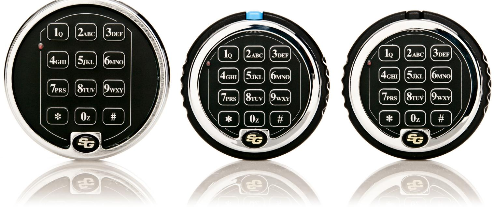

# Programmeringsguide Sargent & Greenleaf

Titan Pivot Bolt/Titan Direct Drive & 6124/6125

**LÄS IGENOM HELA PROGRAMMERINGSGUIDEN INNAN PROGRAMMERING PÅBÖRJAS.**

# **PROVA ALLTID NY KOD 3 GÅNGER INNAN DU STÄNGER/LÅSER SKÅPDÖRREN.**

## **Allmänt**

Varje gång en siffra, bokstav eller andra tecken slås in på knappsatsen hörs ett "pip" och den röda LED-lampan blinkar. Om inte, kontrollera att batteriet är OK och korrekt anslutet, försök sedan igen.

Låset svarar med olika signalsekvenser ( ) för att ange olika förhållanden. I exemplen visar symbolen det antal signaler Du hör.

#### OBS! SKYDDA DIN KOD FRÅN ATT AVLÄSAS VID INMATNING

Ditt lås har en fabriksprogrammerad huvudkod, 1 2 3 4 5 6. Du kan själv programmera in ytterligare nio (9) koder. För utom att öppna låset kan de olika koderna utföra följande:

#### **Huvudkod (Master Code):**

- 
- Förändra egen kod. Skapa och radera gruppkod samt användarkoder.
- 
- Skapa och radera väktarkod Skapa, förändra och radera tidsfördröjning samt öppningsbar tid.
- Aktivera/Deaktivera låset.
- Aktivera tyst larm funktion

# **Gruppkod (Supervisor Code):**

- Förändra egen kod.
- Skapa och radera användarkoder. Aktivera/Deaktivera låset.
- 

### **Användarkoder (User Codes):**

- Förändr,ra låset (endast version 2)
#### **Väktarkod (Time Delay Override Code):**

- Om funktionen Väktarkod är aktiverad kommer denna kod att gå förbi tidsfördröjningen och öppna låset. Är funktionen Tidsfördröjning ej aktiverad kommer koden att fungera som en användarkod.
När Du skapar nya koder skall dessa alltid slås in två gånger för att bekräfta dess korrekthet.

Alla koder avslutas med #.

Om Du hör en lång signal under någon programmerings sekvens har en felslagning gjorts. Starta om från början med programmeringssekvensen, genom att slå * alternativt vänta 10 sekunder.

OBS! Vänta inte mer än 10 sekunder mellan tryckningarna vid programmering eller inslagning av kod, då avbryts sekvensen och Du får börja om från början. Vänta alltid tills hela signalföljden är slut innan nästa siffra eller bokstav slås in, annars kommer Du att avbryta sekvensen.

#### **Felslagsräknare**

Vid inslagning av 5 felaktiga koder eller felaktig program mering i rad, kommer låset att stängas av i 10 minuter. Om ytterligare felaktiga koder slås in under denna 10-minuters period, kommer låset att ge ifrån sig två långa signaler. Vänta minst 10 minuter och slå sedan korrekt kod.

#### **PIN-positioner (Adresser)**

Varje skapad kod för användning i låset tilldelas en adress på knappsatsen, PIN-position. Huvudkoden har PIN-position 0 (noll), gruppkoden har PIN-position 1 och användarkoderna PIN-position 2–8. Om du använder funktionen Tyst Larm, kommer PIN-positionerna 4–8 automatiskt att raderas och deaktiveras. Om funktionen Väktarkod är aktiverad används PIN-position 9 för Väktarkoden. Är funktionen Väktarkod deaktiverad kan PIN-position 9 användas som en vanlig Användarkod.

### **Identifiering av aktiva PIN-positioner**

Du kan identifiera aktiva PIN-positioner (PIN-position 0–9) för de koder som finns programmerade. Varje siffra på knappsatsen motsvarar en PIN-position, slå: 7 7 * PIN-position (0–9)

Om låset "piper" en låg kort signal när någon siffra slås in på knappsatsen så är denna PIN-position aktiv, dvs. det finns en kod på denna position. Om det hörs en hög lång signal är positionen inte aktiv, dvs. det finns ingen kod på denna position.

# **Ställa knappsatsens signalvolym. OBS! ENDAST TITAN-LÅS**

7 8 * Huvudkod # ( ) 0 # ( ) 0 # 0 # för "AV" eller 1 # 1 # för "LÅG" eller 2 # 2 # för "HÖG" ( )

## **Öppna låset:**

#### Titan Pivot Bolt 2006

Slå giltig kod följt av #. Vrid sedan skåpets handtag till öppet läge och öppna dörren. Vridning av skåpets handtag till öp pet läge skall göras max 6 sekunder efter att giltig kod slagits in. Dröjer det mer än 6 sekunder ställer sig låset i låst läge och kod måste slås in igen.

För att låsa: Vrid skåpets handtag till låst läge. Låset låser automatiskt. När låset är låst hörs en hög/låg-signal och LEDlampan blinkar. Om signalen inte ljuder är inte låsets regel i låst position

#### Titan D-Drive 2007

Säkerställ att knappsatsen är vriden motsols tills det tar stopp. Den blå knappen på knappsatsen skall stå klockan 12. Slå giltig kod följt av # och vrid sedan knappsatsens ring medsols ca. 70 grader tills det tar stopp. Vrid sedan skåpets handtag till öppet läge. Vridning av knappsatsens ring skall göras max 6 sekunder efter att giltig kod slagits in. Dröjer det mer än 6 sekunder förblir låset låst och kod måste slås in igen.

För att låsa: Vrid knappsatsens ring motsols tills det tar stopp. Den blå knappen på knappsatsen skall stå klockan 12. När låsets regel har låst ut hörs en hög/låg-signal och LEDlampan blinkar. Om signalen inte ljuder är inte låsets regel i låst position

# 6124 & 6125

För att öppna låset slår Du Din 6-siffriga kod följt av #. Vänta en sekund, vrid sedan skåpets handtag till olåst läge, Vridning måste ske inom 6 sekunder för modell 6124 och 15 sekunder för modell 6125.

För att låsa: Vrid skåpets handtag till låst läge. När låsets regel har låst ut hörs en hög/låg-signal och LED-lampan blinkar. Om signalen inte ljuder är inte låsets regel i låst position

### **Referenslista signaler**

| Fel kod inslagen                               | en lång signal                       |
|------------------------------------------------|--------------------------------------|
| Felslagsräknare                                | två långa signaler                   |
| Kod inslagen för att starta tidsfördröjning | tre korta signaler                   |
| Nedräkning av tidsfördröjning                  | en kort signal var 10:e sekund    |
| Tidsfördröjningsperioden slut                  | tio korta signaler                   |
| Signal för öppningsbar tid                     | två korta signaler var 6:e sekund |
| Indikering svaga batterier                     | fem dubbelsignaler                   |
| Batterivarning/avstängning                     | tjugo korta signaler                 |
| Indikering av utlåst regel                     | en låg/hög signalsekvens             |
| Aktivering av lås                              | fyra signaler                        |
| Deaktivering av lås                            | två signaler                         |

#### **Batteribyte**

Om Du slår en kod och hör 5 dubbelsignaler när låset öppnar, indikerar låset att batterierna är svaga. Byt batterier så snart som möjligt. Om batterierna är så svaga att låset inte kan fungera kommer låset att pipa 20 gånger när Du slår en kod. Byt batterier omedelbart. OBS! Duracell Alkaline 9V-batterier rekommenderas. An-

vändning av andra typer av batterier kan påverka driftsäkerheten.

Inga koder eller programmeringar går förlorade under batteribytet.

Titan Pivot Bolt & Titan Direct Drive:

- Dra ut den fjäderbelastade knappen på toppen av knappsatsen mot dig och vrid knappsatsens ring försiktigt motsols tills det tar stopp. Dra sedan ringen mot dig och batteriet blir synligt
- Ta ur batteriet och lossa det från batterihållaren
- Fäst det nya batteriet på batterihållaren
- Sätt i batteriet i knappsatsen
- Se till att kablarna inte hamnar mellan monteringsplattan och knappsatsens ring
- Tryck försiktigt tillbaka ringen mot monteringsplattan och vrid ringen medsols tillbaka till sitt ursprungsläge

#### 6124 & 6125

Låset registrerar varje gång knappsatsen tas bort (vid t.ex. ett batteribyte). Om knappsatsen varit borttagen, så kommer en SOS-signal att höras nästa gång Du slår en giltig kod. Låset kommer inte att kunna öppnas,

Det signalerar SOS: 3 korta/höga signaler, 3 långa/låga signaler, 3 korta/höga signaler.

Denna signal repeteras 2 gånger. När den slutar, slå giltig kod inom en minut och knappsatsens indikering kommer att återställas. Låset går nu att öppna.

- Lossa S&G-logotypen som sitter placerad längst ned (klockan 6) på knappsatsen Lossa eventuell skruv under logotypen
- Tag försiktigt bort knappsatsen genom att först lyfta bottenkanten (närmast S&G logotypen) och sedan lossa den från montageplattan.
- Lösgör de gamla batterierna från deras fästen
- För att förhindra böjning eller brytning av batteriernas fästen, stöd toppen på varje batterifäste när Du sätter in ett nytt batteri
- När sedan knappsatsens kåpa återplaceras, se till att kablarna inte kommer i kläm

#### **Enkelkommando/Dubbelkommando**

Ditt lås kan användas med Enkelkommando (en giltig kod krävs för att öppna låset) alternativt Dubbelkommando (två giltiga koder krävs för att öppna låset). OBS! Ej att förväxla med Väktarkod.

Låset levereras från fabrik med Enkelkommando, men kan enkelt programmeras till Dubbelkommando.

OBS! Programmering till Dubbelkommando måste göras innan den fabriksinställda Huvudkoden ändras för första gången. När programmering till Dubbelkommando väl är gjord, går det inte att programmera tillbaka till Enkelkommando (en eventuell MRC-kod kommer också att för alltid raderas)

För programmering till Dubbelkommando, se sid. 6 Programmeringsguide Dubbelkommando Titan Pivot Bolt 2006/Titan D-Drive 2007/6124/6125

# **Programmeringsguide Enkelkommando**

# **Titan Pivot Bolt 2006/Titan D-Drive 2007/6124/6125**

Öppna låset (med fabriksinställd huvudkod) Huvudkoden (Master Code) används för programmering av låset.

Fabriksinställd huvudkod är 1 2 3 4 5 6. För att öppna låset, slå 1 2 3 4 5 6 # och vrid skåpets handtag till öppet läge om du har ett Titan Pivot Bolt-lås (Svart knapp), eller vrid knapp satsen ring åt höger om du har ett

D-Drive lås (blå knapp), vrid sedan skåpets handtag till öppet läge. 6124-6125: Slå din kod, vänta

en sekund, vrid sedan skåpets handtag till olåst läge, vridning måste ske inom 6 sekunder för modell 6124 och 15 sekun der för modell 6125.

# **Avaktivera Väktarkoden (Time Delay Override) OBS! ENDAST TITAN-LÅS**

Denna programmering tar för alltid bort Väktarkodfunktionen. 8 3 * 1 2 3 4 5 6 # ( ) 1 # ( ) 1 # ( )

OBS: Denna programmering måste göras innan Huvudkoden ändras första gången.

# **Ändra kod**

Innehavare av Huvudkod, Gruppkod, Användarkod eller Väk tarkod kan ändra sin egen 6-siffriga kod genom att slå: 2 2 * Befintlig kod # ( ) Ny kod # ( ) Ny kod # ( ) OBS! Prova alltid den nya koden minst 3 gånger med öppen dörr.

# **Skapa Gruppkod (Supervisor Code)**

Med hjälp av Huvudkoden kan Du skapa en Gruppkod (PINposition 1). Gruppkoden kan användas för att bl.a. lägga till och ta bort Användarkoder samt aktivera/deaktivera låset (management/employer access). Bestäm en 6-siffrig grupp kod och slå:

7 4 * Huvudkod # ( ) 1 # ( ) Gruppkod # ( ) Gruppkod # ( )

# **Skapa Användarkoder (User Codes)**

Använd Huvud- eller Gruppkod för att skapa nya Användar koder. Skapa för varje användare en unik 6-siffrig kod och bestäm en PIN-position (2–8). I exemplet används PINposition 3, slå:

7 4 * Huvudkod eller Gruppkod # ( ) 3 # ( ) Användarkod # ( ) Användarkod # ( ) En Användarkod på PIN-position 3 är nu skapad.

# **Radera koder**

För att ta bort Gruppkoden eller specifika Användarkoder behöver Du endast veta dess PIN-position (Huvudkod kan ändras men ej raderas). Exemplet visar radering av Använ darkod med PIN-position 3. Slå:

7 4 * Huvudkod eller Gruppkod # ( ) 3 # ( ) # ( ) # ( )

Om låset är programmerat med Tidsfördröjning, kan Väktarkoden endast raderas under Öppningsbar Tid. Se Väktarkod.

# **Öppningsbar Tid (Open Window)**

Öppningsbar tid är den period under vilken Du kan öppna låset efter tidsfördröjningsperiodens slut.

Vid tidsfördröjningsperiodens slut hörs en sekvens med 10 snabba signaler, öppningsbar tid är nu aktiverad och två signaler hörs var 6:e sekund. Slå återigen Din 6-siffriga kod följt av #, och öppna sedan låset.

Perioden är från fabrik programmerad till 2 minuter, men kan programmeras från 1 till 15 minuter.

För att ändra fabriksinställd Öppningsbar Tid, slå:

7 4 * Huvudkod # ( ) 0 1 # ( ) Öppningsbar Tid i min. # ( ) Öppningsbar Tid i min. # ( ) OBS! När tidsfördröjning är programmerad kan ändring av öppningsbar tid endast göras under perioden öppningsbar tid.

# **Tidsfördröjning (Time Delay)**

Tidsfördröjning är en säkerhetsfunktion som skapar en tids period mellan inslagning av giltig kod och möjligheten att öppna låset. Tidsfördröjningsperioden kan programmeras från 1–99 minuter. Under tidsfördröjningsperioden kommer en signal att höras var 10:e sekund. För att programmera en tidsfördröjningsperiod slå:

7 4 * Huvudkod # ( ) 0 0 # ( ) Tidsfördröjning i min. # ( ) Tidsfördröjning i min. # ( )

För att radera tidsfördröjning, slå 0 (noll) vid antal minuter. OBS! När tidsfördröjning är programmerad kan ändring eller radering av tidsfördröjningsperioden endast göras under perioden Öppningsbar Tid.

# **Skapa Väktarkod (Time Delay Override)**

Ditt lås är förberett med Väktarkod så att t.ex. en värdetran sportör kan "gå förbi" tidsfördröjningen, antingen med hjälp av dubbelkommando (användarkod + väktarkod) eller med enkelkommando (endast väktarkod). Väktarkodens adress plats är PIN-position 9 och ändras eller raderas på samma sätt som användarkoderna. (Är funktionen Tidsfördröjning ej aktiverad kommer denna kod att fungera som en vanlig användarkod).

7 4 * Huvudkod eller Gruppkod # ( ) 9 # ( ) Väk tarkod # ( ) Väktarkod # ( )

Väktarkoden fungerar endast om Väktarkodfunktionen är aktiverad och låset har Tidsfördröjning programmerad. Om låset är programmerat med Tidsfördröjning, kan Väktar koden endast skapas under perioden Öppningsbar Tid.

# **Aktivera Väktarkodfunktion**

4 6 * Huvudkod # ( ) slå 1 för Dubbelkommando eller 2 för Enkelkod # ( ) slå 1 for Dubbelkommando eller 2 för Enkelkod # ( )

OBS! 1 Dubbelkommando, kräver att man slår en giltig kod för att starta tidsfördröjningen, följt av väktarkoden inom en minut för att öppna låset. 2 Enkelkommando kräver endast väktarkod för att öppna direkt.

OBS! När tidsfördröjning är programmerad kan val av kommando endast göras under perioden öppningsbar tid.

#### **Deaktivera Väktarkodfunktion**

VIKTIGT! Väktarkoden (PIN-position 9) raderas automatiskt när Väktarkodfunktionen avaktiveras.

Denna kod kan återigen programmeras in och fungerar då som Användarkod.

För att stänga av Väktarkodfunktionen, slå:

4 6 * Huvudkod # ( ) 0 # ( ) 0 # ( )

#### **Tyst Larm (Duress) kompletteras med larmbox**

Med Ditt lås kan Du sända ett Tyst larm. Komplettera Ditt lås med larmbox för vidarekoppling till larmsystem. När låset är kopplat till larmboxen måste funktionen Tyst Larm aktiveras för att fungera. OBS! När funktionen Tyst Larm aktiveras kommer PIN-positionerna och koderna 4–8 automatiskt raderas och deaktiveras.

Använd instruktionerna som medföljer larmboxen för att säkerställa rätt installation.

För att aktivera funktionen tyst larm, slå: 3 8 * Huvudkod # ( ) 1 # ( ) 1 # ( ) Du sänder ett tyst larm genom att ändra sista siffran i Din kod, öka sista siffran med 1. T.ex. om Din kod är 2 4 6 8 1 2, slår Du 2 4 6 8 1 3. Låset kommer att öppnas samtidigt som ett tyst larm sänds till larmboxen.

#### **Deaktivera funktionen Tyst larm:**

När funktionen Tyst Larm deaktiveras kommer PIN-positionerna 4–8 åter att aktiveras. Nu ges möjlighet att lägga in nya koder på dessa PIN-posistioner.

För att deaktivera funktionen Tyst Larm, slå: 3 8 * Huvudkod # ( ) 0 # ( ) 0 # ( ) **Aktivering/deaktivering av lås (Manager/Employee Access). OBS! Denna funktion är endast tillgänglig om låset är programmerat i Enkelkommando, ej i Dubbelkommando.** 

Låset kan genom en enkel programmeringssekvens deaktiveras/stängas av. Detta innebär att ingen kod kommer att kunna öppna förrän låset är aktiverat av giltig huvudkod eller gruppkod. Denna funktion är användbar om man under vissa perioder vill säkerställa att inga användarkoder skall kunna användas för att öppna. Det finns följande två versioner av aktivering/deaktivering.

Version 1: Endast huvudkod eller gruppkod kan aktivera/ deaktivera låset.

Version 2: Huvudkod, gruppkod eller användarkoder kan deaktivera låset, men endast huvudkod eller gruppkod kan aktivera låset.

För att ställa låset i "aktivering/deaktiveringsläge", slå: 3 2 * Huvudkod # ( ) 2 # ( ) 2 # ( ) Efter detta steg är låset deaktiverat, dvs. inga koder kommer att kunna öppna.

#### För att aktivera låset, slå:

5 5 * Huvudkod eller Gruppkod # ( ) I detta läge är låset aktiverat och alla giltiga koder kan öppna (huvud-, grupp- eller användarkoder)

#### För att deaktivera låset, slå:

5 5 * Huvudkod eller Gruppkod # ( ) I detta läge kan ingen kod öppna. Försök att slå en giltig kod resulterar i att 2 signaler hörs, vilket indikerar att låset är deaktiverat.

Programmering till version 2, slå: 5 6 * Huvudkod # ( ) 1 # ( ) 1 # ( ) I detta läge kan vilken giltig kod som helst deaktivera låset.

Deaktivera låset med Användarkod 5 5 * Giltig användarkod # ( ) I detta läge kan ingen kod öppna. Försök att slå en giltig kod resulterar i att 2 signaler hörs, vilket indikerar att låset är deaktiverat.

För att återgå till verion 1, slå 5 6 * Huvudkod # ( ) 0 # ( ) 0 # ( ) I detta läge kan endast huvudkod eller gruppkod aktivera/ deaktivera låset.

För att gå ur "aktivering/deaktiveringsläge", slå: 3 2 * Huvudkod # ( ) 1 # ( ) 1 # ( )

# **Programmeringsguide Dubbelkommando**

# **Titan Pivot Bolt 2006/Titan D-Drive 2007/6124/6125**

OBS! Programmering till Dubbelkommando måste göras innan den fabriksinställda Huvudkoden ändras för första gången. När programmering till Dubbelkommando väl är gjord, går det inte att programmera tillbaka till Enkelkommando (eventuell MRC-kod kommer att för alltid raderas)

# **Avaktivera Tidsfördröjningsfunktionen. OBS! ENDAST TITAN-LÅS**

Denna programmering tar för alltid bort Väktarkodfunktionen.

(Programmera detta innan programmering till Dubbelkommando)

4 6 * 1 2 3 4 5 6 # ( ) 1 # ( ) 1 # ( ) OBS: Denna programmering MÅSTE göras innan Huvudkoden ändras för första gången.

# **Programmering till Dubbelkommando:**

7 6 * 1 2 3 4 5 6 # ( ) 1 # ( ) 1 # ( ) PIN-position 2 har nu tilldelats Användarkod 222222 och låset är nu programmerat till Dubbelkommando. För öppning av låset och all programmering (utom ändring av kod) krävs nu dubbla koder.

## **Öppna låset (med fabriksinställda koder):**

Huvudkod: 123456 Användarkod: 222222 Slå: 1 2 3 4 5 6 # ( ) 2 2 2 2 2 2 # (denna sekvens måste slås inom 60 sekunder)

# **Ändra kod**

Innehavare av Huvudkod, Gruppkod, Användarkod eller Väktarkod kan ändra sin egen 6-siffriga kod genom att slå: 2 2 * Befintlig kod # ( ) Ny kod # ( ) Ny kod # ( ) OBS! Prova alltid den nya koden minst 3 gånger med öppen dörr.

# **Skapa Gruppkod (Supervisor Code)**

Med hjälp av Huvudkoden kan Du skapa en Gruppkod (PINposition 1). Bestäm en 6-siffrig grupp¬kod och slå: 7 4 * Huvudkod # ( ) Användarkod # ( ) 1 # ( ) Gruppkod # ( ) Gruppkod # ( )

# **Skapa Användarkoder (User Codes)**

Använd Huvud- eller Gruppkod för att skapa nya Användarkoder. Skapa för varje användare en unik 6-siffrig kod och bestäm en PIN-position (2–8). I exemplet används PINposition 3, slå:

7 4 * Huvudkod eller Gruppkod # ( ) Gruppkod eller Användarkod # ( ) 3 # ( ) Användarkod # ( ) Användarkod # ( )

En Användarkod på PIN-position 3 är nu skapad.

# **Radera koder**

För att ta bort Gruppkoden eller specifika Användarkoder behöver Du endast veta dess PIN-position (Huvudkod kan ändras men ej raderas). Exemplet visar radering av Användarkod med PIN-position 3. Slå:

7 4 * Huvudkod eller Gruppkod # ( ) Gruppkod eller Användarkod # ( ) 3 # ( ) # ( ) # ( ) Om låset är programmerat med Tidsfördröjning, kan Väktarkoden endast raderas under Öppningsbar Tid. Se Väktarkod. Gruppkoden kan inte radera sig själv.

# **Öppningsbar Tid (Open Window)**

Öppningsbar tid är den period under vilken Du kan öppna låset efter tidsfördröjningsperiodens slut. Vid tidsfördröjningsperiodens slut hörs en sekvens med 10 snabba signaler, öppningsbar tid är nu aktiverad och två signaler hörs var 6:e sekund. Slå återigen Din 6-siffriga kod följt av #, och öppna sedan låset.

Perioden är från fabrik programmerad till 2 minuter, men kan programmeras från 1 till 15 minuter.

För att ändra fabriksinställd Öppningsbar Tid, slå:

7 4 * Huvudkod # ( ) Gruppkod eller Användarkod # ( ) 0 1 # ( ) Öppningsbar Tid i min. # ( ) Öppningsbar Tid i min. # ( )

OBS! När tidsfördröjning är programmerad kan ändring av öppningsbar tid endast göras under perioden öppningsbar tid.

# **Tidsfördröjning (Time Delay)**

Tidsfördröjning är en säkerhetsfunktion som skapar en tids¬period mellan inslagning av giltig kod och möjligheten att öppna låset. Tidsfördröjningsperioden kan programmeras från 1-99 minuter. Under tidsfördröjningsperioden kommer en signal att höras var 10:e sekund. För att programmera en tidsfördröjningsperiod slå:

7 4 * Huvudkod # ( ) Gruppkod eller Användarkod # ( ) 0 0 # ( ) Tidsfördröjning i min. # ( ) Tidsfördröjning i min. # ( )

För att radera tidsfördröjning, slå 0 (noll) vid antal minuter. OBS! När tidsfördröjning är programmerad kan ändring eller radering av tidsfördröjningsperioden endast göras under perioden Öppningsbar Tid.

#### **Skapa Väktarkod (Time Delay Override)**

Ditt lås är förberett med Väktarkod så att t.ex. en värde transportör kan "gå förbi" tidsfördröjningen, med hjälp av dubbelkommando (användarkod + väktarkod). Väktarko dens adressplats är PIN-position 9 och ändras eller raderas på samma sätt som användarkoderna. (Är funktionen Tidsför¬dröjning ej aktiverad kommer denna kod att fungera som en vanlig användarkod).

7 4 * Huvudkod eller Gruppkod # ( ) Gruppkod eller Användarkod # ( ) 9 # ( ) Väktarkod # ( ) Väktarkod # ( )

Väktarkoden fungerar endast om Väktarkodfunktionen är aktiverad och låset har Tidsfördröjning programmerad. Om låset är programmerat med Tidsfördröjning, kan Väktarko den endast skapas under perioden Öppningsbar Tid.

#### **Aktivera Väktarkodfunktion**

4 6 * Huvudkod # ( ) 1 # ( ) 1 # ( )

#### **Deaktivera Väktarkodfunktion**

VIKTIGT! Väktarkoden (PIN-position 9) raderas automatiskt när Väktarkodfunktionen avaktiveras. Denna kod kan återigen programmeras in och fungerar då som Användarkod. För att stänga av Väktarkodfunktionen, slå:

)

# **Tyst Larm (Duress) kompletteras med larmbox**

4 6 * Huvudkod # ( ) 0 # ( ) 0 # (

Med Ditt lås kan Du sända ett Tyst larm. Komplettera Ditt lås med larmbox för vidarekoppling till larmsystem. När låset är kopplat till larmboxen måste funktionen Tyst Larm aktiveras för att fungera. OBS! När funktionen Tyst Larm aktiveras kommer PIN-positionerna och koderna 4–8 automatiskt raderas och deaktiveras. Använd instruktionerna som medföljer larmboxen för att säkerställa rätt installation. För att aktivera funktionen tyst larm, slå: 3 8 * Huvudkod # ( ) 1 # ( ) 1 # ( ) Du sänder ett tyst larm genom att ändra sista siffran i Din kod, öka sista siffran med 1. T.ex. om Din kod är 2 4 6 8 1 2, slår Du 2 4 6 8 1 3. Låset kommer att öppnas samtidigt som ett tyst larm sänds till larmboxen.

#### **Deaktivera funktionen Tyst larm:**

När funktionen Tyst Larm deaktiveras kommer PIN-positio nerna 4–8 åter att aktiveras. Nu ges möjlighet att lägga in nya koder på dessa PIN-posistioner. För att deaktivera funktionen Tyst Larm, slå: 3 8 * Huvudkod # ( ) 0 # ( ) 0 # ( )

ASSA ABLOY Opening Solutions Sweden P.O. Box 371 SE-631 05 Eskilstuna Sweden Phone +46 (0)16 17 70 00 Fax +46 (0)16 17 70 49

Customer support: Phone intl. +46 (0)16 17 71 00 Phone nat. 0771-640 640 Fax +46 (0)16 17 73 72 e-mail: helpdesk.se.openingsolutions@assaabloy.com www.assaabloyopeningsolutions.se