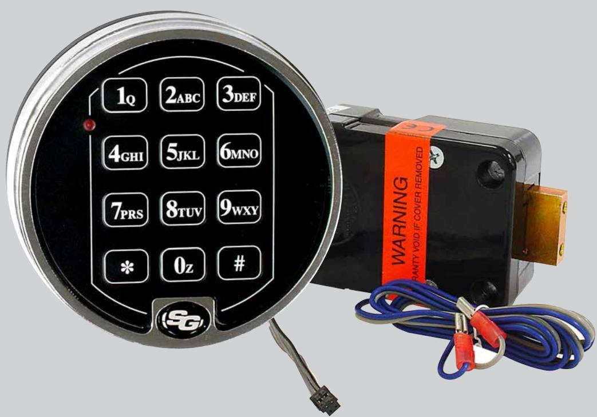
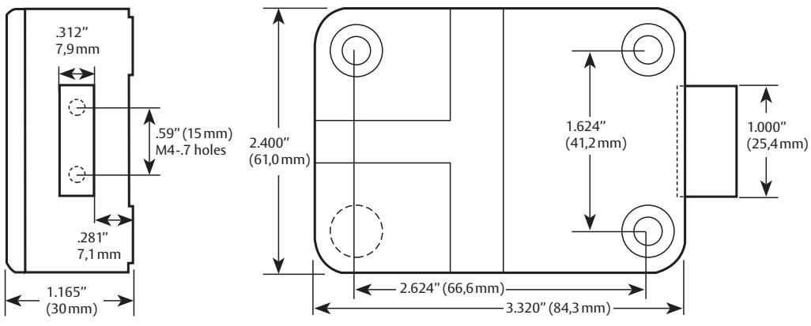

## Sargent & Greenleaf 6124/6125

Elektroniskt kombinationslås för värdeförvaringsenheter

6124/6125 är framtaget för att möta marknadens behov av ett användarvänligt och flexibelt högsäkerhetslås.

6124/6125 är ett motorlås och har endast kabel mellan knappsats och lås. Detta medger flexibel placering av knappsatsen.

Låset drivs med två 9-volt batterier placerade i knappsatsen. 6125 har gängade hål i regeländen vilket medger montering av förlängningsdelar på regeln. (6124 har ej gängade hål i regeländen).

6124/6125 kan användas som 1-kodlås men kan också programmeras med upp till 10 koder (personer/användare).

Låset kan användas med Enkelkommando alternativt Dubbelkommando.

Enkelkommando = en giltig kod krävs för att öppna låset.

Tidsfördröjning, Väktarkod och Tyst Larm kan enkelt programmeras.

All programmering av låset sker via knappsatsen.

## **Funktioner**

- • Öppning
- Slå kod Vrid skåpdörrens handtag till öppet läge. • Låsning
- Vrid skåpdörrens handtag till stängt läge. Låset låser automatiskt.

Låset kan programmeras med upp till 10 koder (personer/ användare). Detta ger olika behörighetsnivåer.

1 Huvudkod, 1 Gruppkod, 7 användarkoder, 1 Väktarkod. Vid användning av Tidsfördröjning kan Väktarkoden gå förbi Tidsfördröjningen och öppna låset direkt.

Låset kan även enkelt programmeras till dubbelkommando. Vid dubbelkommando krävs två koder (användare) för att låsa upp.

*Tidsfördröjning* – 1-99 minuter, förhindrar omedelbar tillgång till skåpets innehåll vid en rånsituation.

*Tyst Larm* – Ger möjlighet att skicka ett larm vid rån eller andra hotsituationer (kompletteras med larmbox).

# Sargent & Greenleaf 6124/6125

Elektroniskt kombinationslås för värdeförvaringsenheter

*Felslagsräknare* – Vid inslagning av 5 felaktiga koder i rad blockeras låset i 10 minuter.

*Avstängning av koder* – Låset kan stängas av så att inga giltiga koder kan öppna. Kan med fördel användas när verksamheten stängs för dagen och ingen behörig skall kunna öppna låset.

Styrning via kortläsare, larm eller annan extern styrning (kompletteras med larmbox)

Godkännanden: SS3492, EN1300 B, VdS 2 med flera.

### **Tillval**

Mikrobrytare för regelindikering låst/olåst. Låset beställes med mikrobrytare.

| Låshus 6124         | Art.nr 861241 |
|---------------------|---------------|
| Låshus 6125         | Art.nr 861251 |
| Knappsats 6124/6125 | Art.nr 861205 |
| Insynsskydd         | Art.nr 861300 |

## Måttskiss

ASSA ABLOY, the global leader in door opening solutions, dedicated to satisfying end-user needs for security, safety and convenience.

ASSA OEM AB P.O. Box 371 SE-631 05 Eskilstuna Sweden

phone +46 (0)16 17 70 00 fax +46 (0)16 17 70 49

Customer support: phone intl. +46 (0)16 17 70 00 kundservice.etuna@assaoem.se

www.assaoem.se