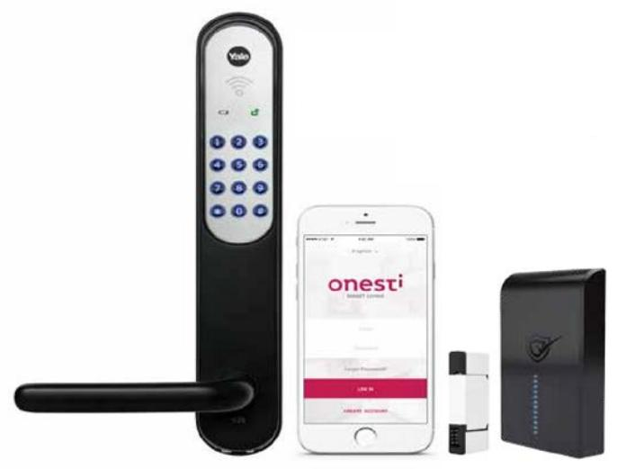

## Manual for aktivering av Yale Doorman mot Onesti

Gäller radiomodul typ 1.5

- **1. Installera låset och sätt i batterierna i enlighet med Yale Doorman Installation Guide.**
- **2. Ange en huvudkod med användarhandboken för Yale Doorman.**
- **3. Ta bort ett batteri och sätt i modulen (modulen är installerad under batterierna på egen plats). Sätt i batteriet igen.**
- **4. Håll HomeGate nära låset (max 1,5m avstånd under parning) och ställ in Homegate i par läge. Detta görs i appen under Device List plus tecknet. Diod # 1 blinkar på HomeGate.**
- **5. Tryck och håll nollställningsknappen på modulen i 10 sekunder. Release. Homegate kommer nu att pulsera på diod 1-8. Detta indikerar att parning initieras. Kan ta upp till 2-3 min.**
- **6. Följ proceduren i appen när initialiseringen är klar. Lägg till namn, rum och golv. (Obs! Du kan inte styra låset ännu.) Låset finns på DashBoard i appen, i det "rum" du har valt.**
- **7. Med dörren i öppen position, tryck # huvudkod (från punkt 2) och #. Exempel: # 123456 # Låsen ska nu säga "Integration Activated" Det innebär att modulen nu är integrerad med Yale Doorman.**
- **8. I appmenyn "Användare" kan du nu lägga till dörrlås åtkomst till installerat lås.**
- **9. Yale Doorman måste nu registreras korrekt och vara tillgänglig via Onesti app.**
- **10. Placera HomeGate på önskad plats i hemmet och kontrollera att låset kan styras från Onesti app m.t.p. några problem med räckvidden.**