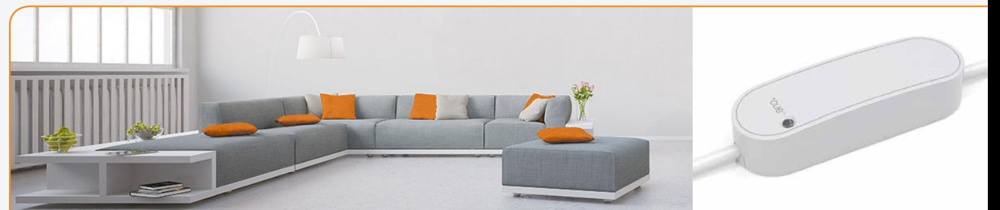
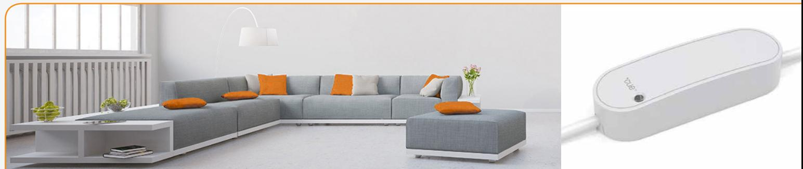
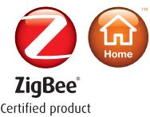

# **Smart Cable Monitor energy consumption and control electrical devices**

The Smart Cable converts conventional power cables to a remotely controlled unit, which allows users to monitor their power consumption. The Smart Cable enables the user to control plugged in electrical devices, with the option to switch electronical equipment on or off.

Key features are:

- Accurate power consumption measurement
- Remote on/off control
- Flexible cable connection
- ZigBee Home Automation 1.2 certification

### **Flexible and smart**

The Smart Cable can be used where there is no space for a smart plug or where a higher load (up to 16 Amp) is required. The Smart Cable is independent of plug types, meaning that it works in most countries. The Smart Cable is sold ready-to-assemble or as a preassembled cable extension.

### **Power measurement Secure communication Flexible plug type usage**

The Smart Cable comes with ZigBee communication and is easily integrated with other ZigBee products or smart control solutions. The Smart Cable is OTA upgradable, which increases the longevity of the product.

# **Smart Cable - Technical Specifications**

#### **General**

| Dimensions (W x D x H) | 108 x 36 x 24 mm                                       |                |
|------------------------|--------------------------------------------------------|----------------|
| Color                  | White                                                  |                |
| Acceptable cable size  | Max. outside diameter 11,8 mm                          |                |
| Power supply           | 230V +/-10%                                            |                |
| Power consumption      | 0.4 W                                                  |                |
| Radio                  | Sensitivity: -100 dBm @ 1% PER Output power: +8 dBm |                |
|                        |                                                        |                |
| Environment            | Operation temperature 0 to +40°C IP class: IP30     |                |
|                        |                                                        |                |
| Functions              |                                                        |                |
| Power meter            | Voltage range:                                         | 207 to 253 VAC |
|                        | Accuracy:                                              | Typ +/- 2 %    |
|                        | Reported resolution: 1W                             |                |
| Remote control         | Max. switch voltage:                                   | 250 VAC        |
|                        | Max. continuous load:                                  | 16 A           |
|                        | Overload and over temperature protection               |                |
| Communication          |                                                        |                |
| Wireless protocol      | ZigBee Home Automation 1.2 ZigBee router            |                |
|                        |                                                        |                |
| Certifications         | Conforming to CE, RoHS and REACH directives            |                |
|                        | ZigBee Home Automation 1.2 certified                   |                |

