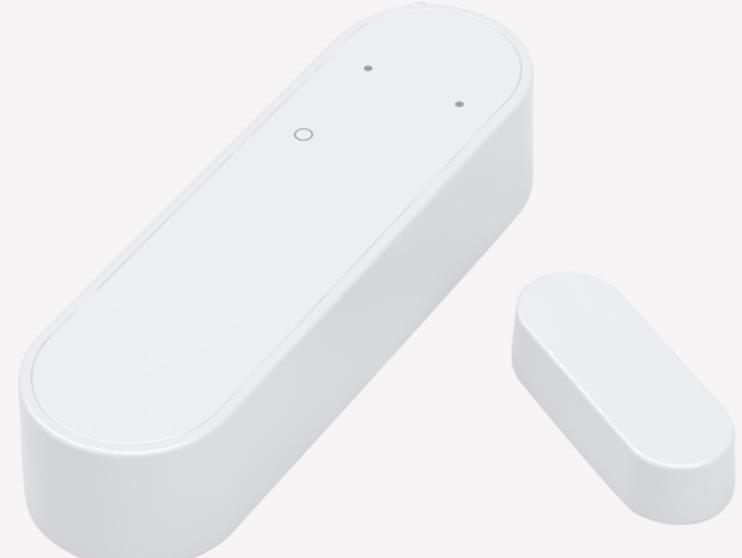
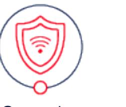

#### Tags: **[HEALTHCARE](https://onestiproducts.io/tag/healthcare/)**, **[IN-HOME DELIVERY](https://onestiproducts.io/tag/in-home-delivery/)**, **[SECURITY](https://onestiproducts.io/tag/security/)**

## **Door / Window Sensor**

Alerting intrusion

Download Dorr/window product sheet !

### **Key Features**

- Magnetic sensor
- ZigBee Home Automation 1.2 certified

### **Additional Services**

- Monitoring and Alarm Receiving Services from certified ARC
- In door delivery services if offered by your service provider
- App push notifications and alerts
- Healthcare services if offered by your service provider

**Monitor entrances and windows of buildings**

This Door / Window Sensor detects and reports the opening and closing of doors and windows. Easily installed on any door or window, the sensors trigger a signal when parted, notifying the user when a room is entered. The sensor operates under the ZigBee standard, ensuring compatibility with other ZigBee certified products. A battery life average of 6 years ensures minimal maintenance.

#### Download Door/window product sheet !

Security Healthcare

!OR GO BACK TO ALL PRODUCTS

# **Door / Window Sensor**

