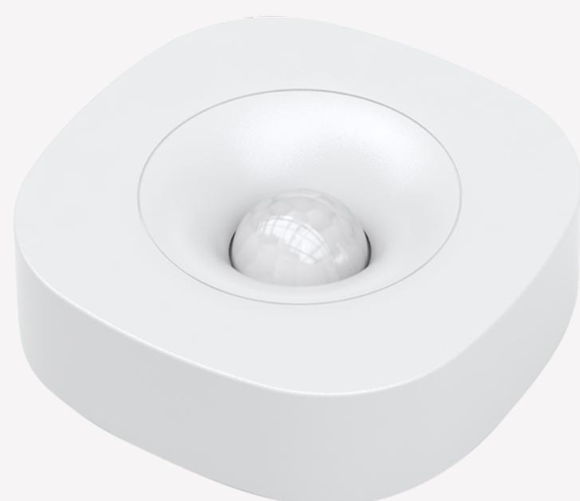

Safe4 Security Group AS © 2020. All rights reserved. | Policy

Tags: **[HEALTHCARE](https://onestiproducts.io/tag/healthcare/)**, **[IN-HOME DELIVERY](https://onestiproducts.io/tag/in-home-delivery/)**, **[SECURITY](https://onestiproducts.io/tag/security/)**

# **Mini Motion Sensor**

Detects all movements

Download Motion Sensor product sheet !

#### **Key Features**

- Alarm sensor
- Temperature sensor
- ZigBee Home Automation certified

### **Additional Services**

- Monitoring and Alarm Receiving Services from certified ARC.
- App alerts and push notifications
- Manned security services if offered by your service provider
- Smart Living/In home delivery services, Healthcare services if offered by your service provider.

You will know of all movements in your home with this mini motion sensor. The provided

mounting screws can be used to mount the Motion Sensor flat on the wall, ceiling, or in the corner.

#### **Detection**

The occupancy sensor is PIR based and able to sense movement up to 9 meters from where the sensor is placed. The wireless protocol is ZigBee, meaning that the Motion Sensor can be integrated with other ZigBee based systems for smart homes.

This motion sensor can be a part of a burglary alarm directly connected to certified Alarm Receiving Centre. Here, a team of professional operators ensure your safety, 24 hours a day / 365 days a year.

Movements trigger the mini motion sensor and sets off the burglary alarm. The Alarm Receiving Centre and the home owners are alerted. The residents receive alarm notifications to their smartphone. In addition, the burglars are scared off by local sirens that also are activated. You are in control of your home security from anywhere with your app. Furthermore, the app allows you to activate and deactivate the alarm. In other words, you have full overview of what goes on in your home.

In addition, receive alerts also on non-movements as part of your healthcare solution by programming the sensor to react on non movements.

#### **Area of use**

Homes, holiday homes and businesses, garages etc

Included in the safe4 eco system.

## Download Motion Sensor product sheet !

Security Healthcare

!OR GO BACK TO ALL PRODUCTS

# **Mini Motion Sensor**

