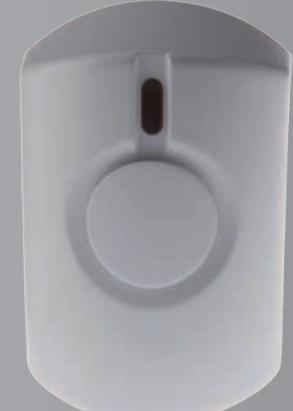

# **SRAC-23ZBS AC-Powered Indoor Siren Series**

Uninterrupted Power, Uncompromising Protection

- **AC-powered**
- **Rechargeable battery backup**
- **Repeater capability for the extension of wireless range**
- **Entry and exit delay beeps**

The SRAC-23ZBS Series introduces AC-powered indoor sirens that plug into any standard power outlets for quick and simple installation. This series employs reliable power supply to ensure the sirens deliver uncompromising protection at all times and blare alarm sound more than 95dB when intrusions occur. The SRAC-23B-ZBS and SRAC-23B-ZBSR models provide rechargeable battery backup.

The SRAC-23B-ZBSR also functions as a repeater to extend a ZigBee security system's wireless communication range. When doubling as a repeater, the SRAC-23B-ZBSR can be associated with up to 20 end devices to allow a ZigBee network to operate efficiently in hard-to-reach areas.

This multipurpose siren series can be further configured to emit entry/exit delay beeps. If your control panel is distant from the front door and you have difficulty hearing its entry/exit delay beeps, any model in the SRAC-23ZBS Series can serve as a useful reminder device, emitting entry/exit delay beeps that urge you to disarm your security system or leave quickly. Two selectable volume levels are designed for the sirens' entry/exit delay beeps

### *Features*

- AC-powered
- Plugs into any standard power outlet for quick and simple installation
- Rechargeable battery backup (SRAC-23B-ZBS and SRAC-23B-ZBSR)
- Capability to double as a ZigBee repeater associated with up to 20 end devices (SRAC-23B-ZBSR)
- Receives signals from the control panel to activate the alarm sound or to emit entry/exit delay beeps
- Two selectable volume levels for entry and exit delay beeps
- Transmits AC power failure, low battery and supervisory signals
- LED as an indicator of system status
- Compatible with other manufacturers' ZigBee systems and devices
- Completely wire-free

### **SRAC-23ZBS AC-Powered Indoor Siren Series**

## *Specifications*

#### **SRAC-23-ZBS**

| Communication Protocol | ZigBee Pro Home Automation 1.2 |
|------------------------|--------------------------------|
| Frequency              | 2.4 GHz                        |
| Power Input            | 90-230VAC                      |
| Siren Output           | 95dB @ 1 meter                 |
| Operating Temperature  | -10°C to 45°C (14°F to 113°F)  |
| Operating Humidity     | Up to 85% non-condensing       |
| Dimensions             | 95mm x 63mm x 83mm             |

#### **SRAC-23B-ZBS**

| Communication Protocol | ZigBee Pro Home Automation 1.2 |
|------------------------|--------------------------------|
| Frequency              | 2.4 GHz                        |
| Power Input            | 90-230VAC                      |
| Backup Battery         | Ni-MH AAA Battery x 4          |
| Battery Life           | 20 hrs*                        |
| Siren Output           | 95dB @ 1 meter                 |
| Operating Temperature  | -10°C to 45°C (14°F to 113°F)  |
| Operating Humidity     | Up to 85% non-condensing       |
| Dimensions             | 95mm x 63mm x 83mm             |

#### **SRAC-23B-ZBSR**

| Communication Protocol | ZigBee Pro Home Automation 1.2 |
|------------------------|--------------------------------|
| Frequency              | 2.4 GHz                        |
| Power Input            | 90-230VAC                      |
| Backup Battery         | Ni-MH AAA Battery x 4          |
| Battery Life           | 20 hrs*                        |
| Siren Output           | 95dB @ 1 meter                 |
| Operating Temperature  | -10°C to 45°C (14°F to 113°F)  |
| Operating Humidity     | Up to 85% non-condensing       |
| Dimensions             | 95mm x 63mm x 83mm             |

** Note: The actual battery life may vary with product settings, usage patterns and operating environment.*

### *Ordering Information*

| SRAC-23-ZBS   | AC-powered                                                       |
|---------------|------------------------------------------------------------------|
| SRAC-23B-ZBS  | AC-powered and rechargeable battery backup                       |
| SRAC-23B-ZBSR | AC-powered, rechargeable battery backup, and repeater capability |

