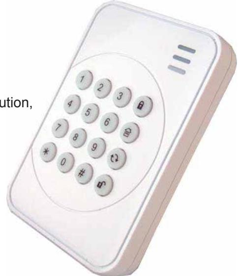

## *ZigBee Remote Keypad KP-23ZB*

## *easy to install, simple to use, and operate the system at your fingertips!*

The KP-23ZB is an intelligent wireless ZigBee keypad designed to work with Climax's HPGWL, ML, MZ, and VL Series. Offering an easy-to-install solution, it is easier than ever for users to use their security system feature. With low profile and stylish look, KP-23ZB matches and blends with any decoration, which is an ideal choice for any application!

Safeguarded by a Tamper Proof Switch, protects the enclosure from being opened or removed from the mounting surface. The Remote Keypad is powered by Lithium battery and consumes power only when in operation, thus ensuring long battery life.

## **Features:**

- A 16-button backlit keypad for easier night use
- Power conservation that consumes power only when in operation
- Low Battery detection
- Tamper protection protects the enclosure from being opened or removed from it's mounting surface
- Compact & low profile
- Comply with CE requirements

## **Specifications:**

- Communication protocol: ZigBee Pro HA
- Power: CR2 3V lithium battery x 1
- Battery life: 4.5 years or over *
- Frequency: 2.4 GHz ISM band
- Operating temperature: -10° to 50°C
- Humidity: up to 85% non-condensing
- Dimensions: 80 X 116 X 20.5 mm

**Battery life varies by use and configuration.* 

