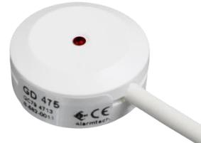
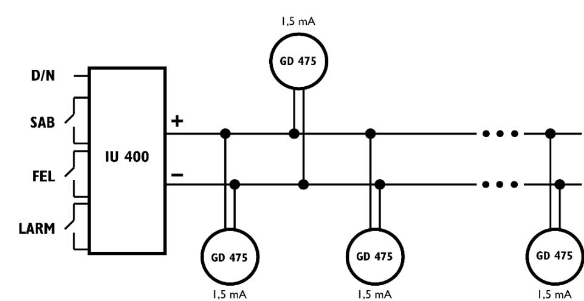
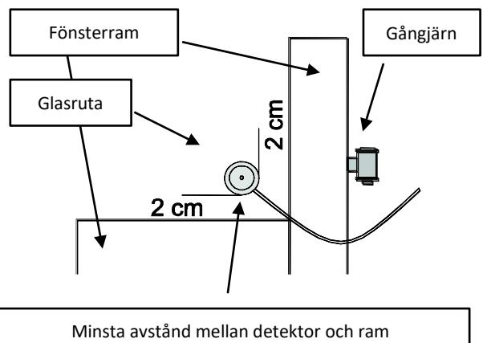
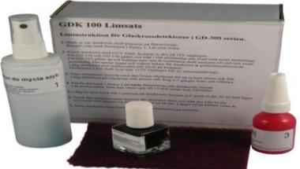

## **Passiv glaskrossdetektor**

## **DATABLAD OCH INSTALLATIONSMANUAL GD 475**

## **BESKRIVNING**

GD 475 är en universell passiv glaskrossdetektor i Larmklass 3 som kan limmas på alla sorters glas som fönsterglas, härdat glas eller laminerat glas. Den detekterar larm då glaset krossas eller att man skär med olika skärverktyg genom glaset. Vid larm ökar strömförbrukningen i detektorn vilket analysatorn IU400 känner av och ger larm.

## **GD 475 uppfyller kraven:**

- EN 50131-2-7-2:2012+A1:2013 Grad 3
- EN 50130-5:2011 miljöklass IIIA
- SSF1014:5 2016-03, SBSC Larmklass 3

## **EGENSKAPER**

**INKOPPLING**

- Två tråd polaritetsoberoende ger enkel anslutning
- Detekterar angrepp mot alla typer av glas
- Detekterar krossning av glas
- Detekterar skärning genom glas med verktyg
- Täckningsradie ca.2m
- Motståndskraftig mot störningar i glaset
- Ingen känslighetsinställning
- Lämplig för 24 timmars övervakning
- Låg strömförbrukning
- DAG och NATT kontroll av LED
- Ingjuten elektronik med klassning IP 67

## **FUNKTION**

GD 475 har en piezoelektrisk sensor som detekterar de speciella vibrationer i glasrutan som uppstår då den krossas eller när man skär med verktyg. Signalen har en speciell signatur med ett brett spektrum och stor amplitud som elektroniken känner av och styr ut en strömökning och tänder upp en lysdiod. GD 475 har en inbyggd självkontroll och spänningsövervakning. Fel indikeras med en blinkande LED och en pulserande strömökning. Indikeringen styrs med en DAG och NATT funktion. Med 8Vdc på spänningsingången indikeras DAG och LED lyser med fast sken vid larm och med pulserande sken vid fel. Vid 6Vdc råder NATT och LED är släckt vid larm eller fel.

Återställning av detektorn efter larm kan ske på två olika sätt:

- Bryta spänningen till detektorn
- Omkoppling från DAG till NATT

# # Ledare Färg på ledare Funktion Beskrivning 1 A Vit Ledare a: (-) eller (+) Två vita ledare, polaritetsoberoende 2 B Vit Ledare b: (-) eller (+)

### **INSTALLATION**

#### **OBS #1:**

**Limningen är mycket viktig för detektorns funktion. Följ noggrant limanvisningarna.**

### **OBS #2:**

**GDK 100 Limsats måste användas för säker funktion samt godkännande. Använd aldrig superlim eftersom det är fuktkänsligt, detektorn kommer då så småningom att lossna från rutan.**

Anvisningar:

**TEKNISKA DATA**

- 1. Innan limning testa detektorn med testaren GVT 500 eller GVT 5000. Använd 12V utgången på GVT 5000 eller annan strömkälla för att strömförsörja detektorn.
- 2. Välj ut ett område på fönsterrutan som ligger ca 5cm från ramen men inte mindre än 2 cm.

- 3. Rengör området med innehållet I Flaska nr. 1.
- 4. Använd den vita klisterlappen I förbackningen för att komma ihåg var detektorn skall placeras och spara tid för rengöringen av limrester efteråt.
- 5. Vid behov slipa bort fettrester och smuts på detektorns baksida med den bruna sliplappen.
- 6. Viktigt! Lägg på aktivatorn på både detektor och glasyta med penseln i Flaska nr. 2. Den vita paperslappen hjälper nu till att visa var aktivatorn skall anbringas och hindrar spill från att spridas. Låt aktivatorn torka 1-2 minuter.
- 7. Placera en liten droppe lim ur flaska nr. 3 i mitten på detektorns baksida och sprid ut det till ett jämt lager över hela ytan med den medföljande triangelformade spateln. Ett tunt lager är viktigt för att detektorn skall limmas bra och snabbt.
- 8. Placera detektorn på rutan och tryck hårt för att pressa ut luften i limfogen. Limmet härdar med hjälp av avktivatorn i frånvaro av syre. Pressa och håll fast i ca 10 sek. Vicka lite svagt så känns det när härdningen skett.
- 9. Ta bort eventuellt överflödigt lim runt detektorn som uppstått när detektorn pressats mot glaset. Använd spateln. Därefter ta bort den vita klisterlappen (nu märks det att man sparat tid för det blir rent direkt). Se även

https://www.youtube.com/watch?v=fZd4SlEXbHI&t=13s

| Typ av glas                                                   | Laminerat glas, fönsterglas, härdat glas, trådförstärkt brandglas |
|---------------------------------------------------------------|-------------------------------------------------------------------|
| Glastjocklek                                                  | Upp till 6mm                                                      |
| Detektionsradie                                               | 2 m                                                               |
| Inspänning                                                    | 5– 15 VDC                                                         |
| Max. rippel                                                   | 2 Vpp vid 12 V                                                    |
| Strömförbrukning i vila                                       | 1,5mA                                                             |
| Strömförbrukning vid larm                                     | 3 mA                                                              |
| Larmutgång                                                    | Transistor                                                        |
| Larmindikering                                                | LED, DAG/NATT kontrollerad                                        |
| DAG och NATT styrning                                         | DAG=8V, NATT=6V på slingan                                        |
| Larmtid                                                       | Låser i larmläge                                                  |
| Återställning av larm                                         | Bryt spänningen på slingan (< 1V)                                 |
| Felindikering vid för låg inspänning eller fel i elektroniken | <5V indikeras med blinkande LED                                   |
| Kabel                                                         | Längd 6m eller 10m                                                |
| Miljöklass (EN50130-5:2011), VdS 2110                         | IIIA                                                              |
| Temperaturområde                                              | -40°C till +55°C                                                  |
| Fukttålighet                                                  | max. 95% RH                                                       |
| Material i höljet                                             | ABS Plast i vit, brun eller svart färg                            |
| Storlek                                                       | Ф 27 mm, H 11 mm                                                  |
| Godkänd enligt SSF 1014:5-2016                                | SBSC 17-132 (Larmklass 3)                                         |
| EN 50131-2-7-2:2012+A1:2013                                   | VdS EN-ST-000243 (Miljöklass IIIA, Grad 3)                        |

## **BESTÄLLNINGS INFORMATION**

| GD 475-6 meter kabel  | E nr. 63 097 77 |
|-----------------------|-----------------|
| GD 475-10 meter kabel | E nr. 63 097 78 |
| IU 400 Analysator     | E nr. 63 097 79 |
| GDK 100 limsats       | E nr. 16 472 00 |
| Byglingsplint 3041.03 | E nr. 50 153 00 |
| Kopplingsbox 4101.02  | E nr. 50 155 28 |

© 2018 Alarmtech www.alarmtech.se Alarmtech förbehåller sig rätten till ändringar GD 475 manual 1804se Sid **2** av **2**