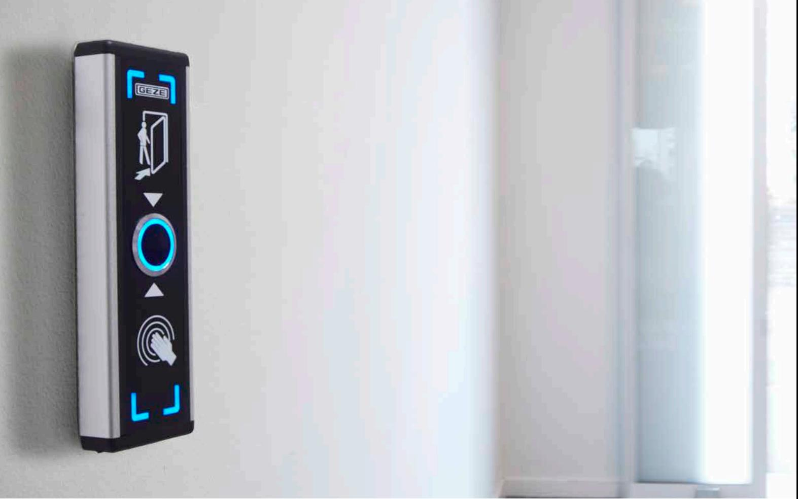
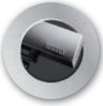
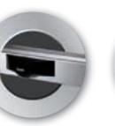
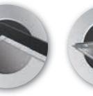
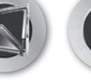
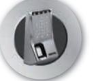
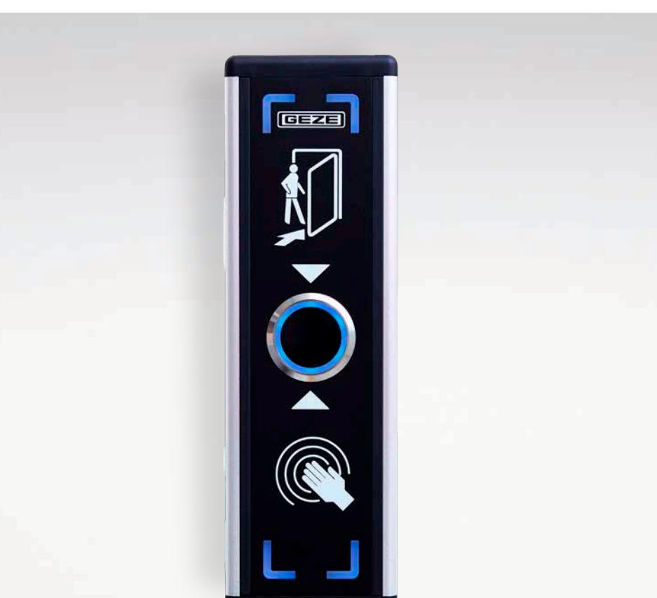
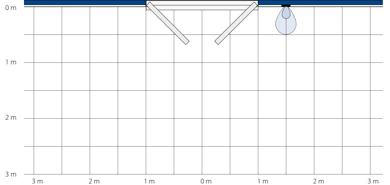
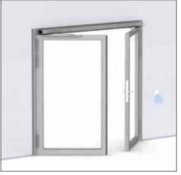

# GEZE ARMBÅGSKONTAKT ES 80 FÖR AKTIVERING AV AUTOMATISKA DÖRRAR

Dørteknik

Dørsystemer

**DØRTEKNIK AUTOMATISKE DÖRRTEKNIK AUTOMATISKA** 

**DØRSYSTEMER DÖRRSYSTEM**

logoer 1 09/03/10 14.29

**Glassystemer**

> Røgventilation

> > **VENTILATION OG RØGVENTILATION FÖNSTERTEKNIK OCH BRANDVENTILATION**

Sikkerhedsteknik

**GLASSYSTEMER SIKKERHEDSTEKNIK GLASSYSTEM SÄKERHETSTEKNIK**

Glassystemer

BEWEGUNG MIT SYSTEM

#### **GEZE ES 80**

GEZE ES 80 används på automatiska inner- och ytterdörrar. Sensorns radarfält är tydligt definierat (smalt fält, brett fält) och garanterar pålitlig detektion. Den integrerade rörelsespårningsfunktionen registrerar även långsamma rörelser, vilket är till fördel för personer med nedsatt rörlighet.

GEZE ES 80 infraröd beröringsfri armbågskontakt med blå LED i standby och grön LED vid aktivering. Aktiveras genom att röra handen framför den beröringsfria sensorn.

#### **ANVÄNDNINGSOMRÅDE**

- Styrning av automatiska slag-, skjut-, vik-, karusell- och runda skjutdörrar
- Hem för rörelsehindrade
- **PRODUKTEGENSKAPER**
- Inbyggnadsmått: 260 mm × 80 mm × 28 mm (Höjd × bredd × djup)
- IR-ögats ytterdiameter är 38 mm
- Strömförsörjning: 12 VDC 24 VDC +-5 %
- Förbrukning: 12 VDC standby 30 mA, i drift 45mA, 24 VDC standby 20 mA, i drift 30 mA
- Utgångar: NO & NO / NC & NC (max 1 A / 30 VDC. 0,3 A / 125 VAC)

- 
Sjukhus, sjukhem

Hotell och restauranger

- Öppningstid: 0,5 sekunder 20 sekunder.
- Sensoravstånd 4 15 cm
- Inbyggd summer: AV eller PÅ med brytare (levereras som PÅ som standard)
- Skyddsklass: Kan monteras invändigt eller utvändigt under tak, IP47

#### Automatiske dørsystemer **TEKNISKA DATA**

| Produktdetaljer Automatiske dørsystemer                | GEZE ES 80                                                                                           |  |
|-----------------------------------------------------------|------------------------------------------------------------------------------------------------------|--|
| Strömförsörjning GEZE AKTIVERING Tekniske data      | 12 VDC – 24 VDC +-5 %                                                                                |  |
| Förbrukning                                               | 12 VDC standby 30 mA, i drift 45mA, 24 VDC standby 20 mA, i drift 30 mA                              |  |
| Produktdetaljer Utgångar Tekniske data Teknologi | GEZE GC 306 NO & NO / NC & NC (max 1A / 30 VDC. 0,3 A / 125 VAC) Elektromagnetiske radarbølger |  |
| Driftsspænding                                            | 12-24 V DC/AC                                                                                        |  |
| IP-klass                                                  | IP 47                                                                                                |  |
| Produktdetaljer                                           | GEZE GC 306                                                                                          |  |
| Udgang                                                    | Potentialfri relæudgang, 48 V AC / DC, 1 A AC / DC, 60 VA / 30 W                                     |  |
| Teknologi                                                 | Elektromagnetiske radarbølger                                                                        |  |
| Öppningstid                                               | 0,5 sekunder – 20 sekunder                                                                           |  |
| Tilslutningstype                                          | Skrueklemme                                                                                          |  |
| Driftsspænding IR-ögats ytterdiameter Udgang        | 12-24 V DC/AC 84 mm Potentialfri relæudgang, 48 V AC / DC, 1 A AC / DC, 60 VA / 30 W 38 mm  |  |
| Bredde                                                    | 84 mm                                                                                                |  |
| Tilslutningstype                                          | Skrueklemme                                                                                          |  |
| Sensoravstånd                                             | 4 – 15 cm                                                                                            |  |
| Dybde                                                     | 32 cm                                                                                                |  |
| Højde                                                     | 84 mm                                                                                                |  |
| Bredde                                                    | 84 mm                                                                                                |  |
| Monteringshøjde                                           | i håndhøjde                                                                                          |  |
| Inbyggd summer                                            | AV eller PÅ med brytare (levereras som PÅ som standard)                                              |  |
| Dybde                                                     | 32 cm                                                                                                |  |
| Beskyttelsesklasse                                        | IP30                                                                                                 |  |
| Monteringshøjde                                           | i håndhøjde                                                                                          |  |
| Inbyggnadsmått                                            | 260 mm × 80 mm × 28 mm (höjd × bredd × djup)                                                         |  |
| Driftstemperatur                                          | -20 – 55 °C                                                                                          |  |

Luftfugtighed < 90% relativ, ikke kondenserende Godkendelser R&TTE 1999/5/EC, EMC 2004/108/EEC

Driftstemperatur -20 – 55 °C

Luftfugtighed < 90% relativ, ikke kondenserende Godkendelser R&TTE 1999/5/EC, EMC 2004/108/EEC

### **REGISTRERINGSOMRÅDE OCH ANVÄNDNINGSEXEMPEL Registreringsområde og anvendelseseksempel**

**Registreringsområde og anvendelseseksempel**

**Räckvidd:** 10 - 50 cm

**Registreringsrækkevidde:** 10 - 50 cm

**14** GEZE AUTOMATISKE DØRSYSTEMER

#### **GEZE GC 306 – BESTÄLLNINGSINFORMATION GEZE GC 306 - Bestillingsinformation** GEZE GC 306 (med GEZE-piktogram) Berøringsfri kontakt til aktivering af automatiske døre alpinhvid 163028

**14** GEZE AUTOMATISKE DØRSYSTEMER

**GEZE GC 306 - Bestillingsinformation**

**Registreringsrækkevidde:** 10 - 50 cm

| GEZE GC 306 (med hånd-piktogram) Betegnelse Beteckning Berøringsfri kontakt til aktivering af automatiske døre                                                                                               | Udførelse alpinhvid Egenskap                                          | Id.nr. 163029 ID nr.           |
|-----------------------------------------------------------------------------------------------------------------------------------------------------------------------------------------------------------------------|-----------------------------------------------------------------------------|--------------------------------------|
| GEZE GC 306 (med GEZE-piktogram) Montagekasse for GC 306 GEZE ES 80 Berøringsfri kontakt til aktivering af automatiske døre Beröringsfri armbågskontakt för automatik GEZE GC 306 (med hånd-piktogram) | alpinhvid alpinhvid Natureloxerat och svart aluminium alpinhvid | 164059 163028 180259 163029 |

**Betegnelse Udførelse Id.nr.**

Montagekasse for GC 306 alpinhvid 164059

#### **GEZE SCANDINAVIA GEZE Sverige**

Mallslingan 10 Box 7060 S-187 11 Täby Tel. +46 (0) 8-732 34 00 E-mail: sverige.se@geze.com www.geze.se

#### **GEZE Danmark**

Mårkærvej 13 J-K DK-2630 Taastrup Tel. +45 46 32 33 24 E-mail: danmark.se@geze.com www.geze.dk

#### **GEZE Norge**

Industrivegen 34B NO-2072 Dal Tel. +47 63 95 72 00 E-mail: norge.se@geze.com www.geze.no

## BEWEGUNG MIT SYSTEM