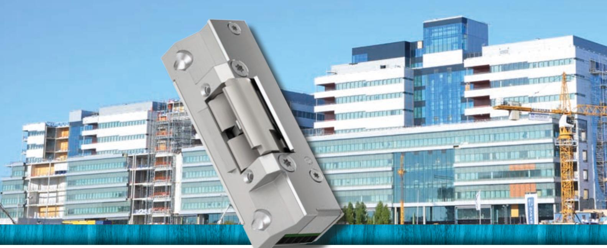
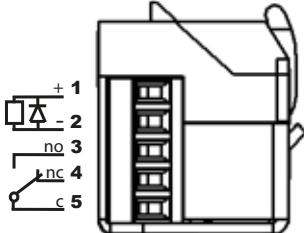
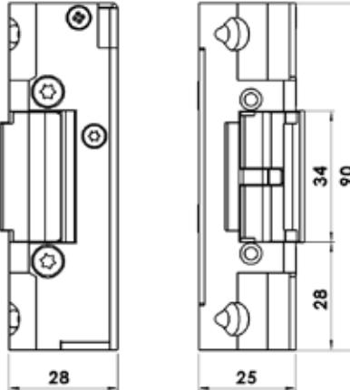
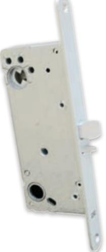

# Elslutbleck anpassade för dörrar med utrymningsterminal

RELEASE STEP 90 ReleaseTM är anpassad till utrymningsdörrar där brandkrav ska kombineras med utrymningsterminal/nödöppningsknapp enligt SS-EN 13637. Elslutblecket öppnar vid en utrymningssituation trots högt tryck på dörren och hanterar en belastning på 1500N (≈150kg) vid upplåsning. Brandklass upp till E/EI 120.

### Driftsäkerhet med minimala mått och listtrycksteknik

Release-serien kombinerar minimala mått med en enastående prestanda. STEP 90 ReleaseTM har en mycket hög driftsäkerhet, är utprovad för hög öppningsfrekvens och hanterar ett högt listtryck.

### Estetiskt montage och enkel installation

STEP 90 ReleaseTM delar montagesstolpar med STEP 40 PreloadTM och STEP 90 PreloadTM och har därmed ett stort urval montagestolpar i rostfritt stål. Med sina små mått passar elslutblecket med liten justering in i urtaget för dörrkarmens standardslutbleck.

Inkoppling sker med skruvplint. Skyddsdiod finns inbyggd.

Mininimala mått gör att elslutblecket lätt får plats i karmen.

Dörrlåset ska vara enligt skandinavisk standard med enkelfall eller dubbelfall

### Anpassar utrymningsvägen till nödöppningsterminal, brandlarm och brandkrav

STEP 90 ReleaseTM är i omvänd funktion anpassad till nödöppning via utrymningsterminal eller nödöppningsknapp enligt SS-EN 13637.

- Brandlarm säkerställer att en nödöppningsterminal eller ett brandlarm kan frilägga låsningen, trots tryck mot dörren av folkmassa, tätningslister, tryckskillnader eller sneda dörrar.
- Listtryck hanterar en belastning på 1500N (≈150kg) vid upplåsning
- Brandkrav brandklassat i E/EI 120. Vid omvänd funktion ska dubbelfallås användas.

## Tekniska data

Brandgodkänd i brandteknisk klass upp till E/EI 120 med dubbelfall-lås

### Strömförbrukning*

| 24V Dc +15% -10% 12V Dc +15% -10%     | Rättvänd/omvänd funktion |
|------------------------------------------|--------------------------|
|                                          |                          |
| 110mAh / max 300mA 220mAh / max 600mA |                          |

*Strömförbrukning 0mA för vridfall i vila (rättvänd = låst, omvänd = olåst)

### Artikelnummer

| ST91HP     | Omvänd funktion 24V DC                                       |
|------------|--------------------------------------------------------------|
| ST91HP-12  | Omvänd funktion 12V DC                                       |
| ST95HP     | Omställbar rättvänd-omvänd funktion 24V DC                   |
| ST95HP-12  | Omställbar rättvänd-omvänd funktion 12V DC                   |
| ST901HP    | Omvänd funktion 24V DC inkl. kolvkontakt                     |
| ST901HP-12 | Omvänd funktion 12V DC inkl. kolvkontakt                     |
| ST905HP    | Omställbar rättvänd-omvänd funktion 24V DC inkl. kolvkontakt |
| ST905HP-12 | Omställbar rättvänd-omvänd funktion 12V DC inkl. kolvkontakt |

- Durability: Grade X enligt SS-EN 14846
- Corrosion: Grade M enligt SS-EN 14846
- Security: Grade 3 enligt SS-EN 14846
- Security electrical manipulation: Grade 1 enligt SS-EN 14846
- Omvänd funktion anpassad till krav enligt SS-EN 13637
- Mikrobrytare enpoligt växlande, max. 30V Dc, 1A
- Skyddsdiod finns inbyggd
- Inbyggd indikering för avkänning att dörren är stängd/öppen (kolvkontakt)
- Brythållfasthet 9kN (900kg)
- Garanterar öppning trots listtryck i rättvänd och omvänd funktion
- Knacksäkrad
- Vändbar för att passa höger- och vänsterdörrar
- Skruvhål för snedställda skruvar i elslutbleckets bakkant

#### Passande låshus

Enkel- och dubbelfallås i Kaba 1400-serien Enkel- och dubbelfallås i Connect-serien Enkel- och dubbelfallås i Modul-serien Enkel- och dubbelfallås i Smalprofil-serien

