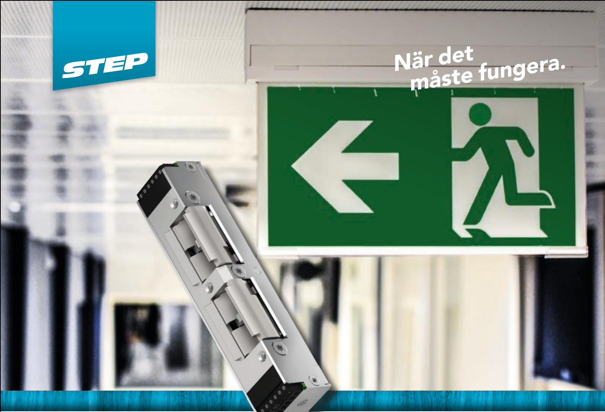
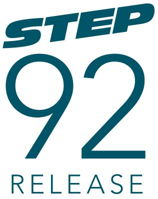
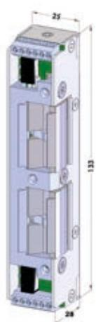
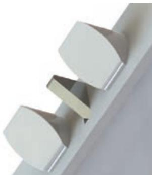

# Dubbelt elslutbleck för dörrar med utrymningsterminal

STEP 92 ReleaseTM är anpassad till utrymningsdörrar där dörrautomatik och brandkrav ska kombineras med utrymningsterminal eller nödöppningsknapp enligt SS-EN 13637. Elslutblecket öppnar vid en utrymningssituation trots tryck på upp till 1500N (≈150kg) på dörren. Elslutblecket har två vridfall anpassade för tryckesfall och cylinderfall i ett dubbelfallås. Brandklass upp till E/EI 120.

Elslutbleck i omvänd funktion trots brandkrav och dörrautomatik Dörren behåller sina brandtillhållande egenskaper trots upplåsning via utrymningsterminal eller brandlarm.

### Listtrycksteknik

Både vridfallet för tryckesfall och cylinderfall hanterar listtryck, vilket ger en driftsäker öppning med automatiska dörröppnare.

Inkoppling sker med skruvplintar. Skyddsdiod finns inbyggd.

Mycket kompakt och grund för enkel installation

Dörrlåset ska vara dubbelfallås enligt skandinavisk standard.

### Anpassar utrymningsvägen till automatiska dörröppnare

- Utrymningsterminal nnpassad till nödöppning via utrymningsterminal/nödöppningsknapp enligt SS-EN 13637.
- Brandlarm säkerställer att en nödöppningsterminal eller ett brandlarm kan frilägga låsningen, trots tryck mot dörren av folkmassa, tätningslister, tryckskillnader eller sneda dörrar.
- Brandkrav brandklassat i E/EI 120. Brandtillhållningen kvarstår även efter nödöppning eller upplåsning via brandlarmet.
- Tätningslister och tryckskillnader listtrycksfunktionen gör att dörren alltid kan låsas upp, trots att dörrlåset spänner mot elslutblecket.
- Dörrautomatik listtrycksfunktionen i kombination med den snabba upplåsningen gör att dörren öppnas snabbt och utan risk för att fastna.

## Tekniska data

Brandgodkänd i brandteknisk klass upp till E/EI 120

### Strömförbrukning per vridfall separat*

|                    | Rättvänd/omvänd funktion |
|--------------------|--------------------------|
| 24V Dc +15% -10%   | 12V Dc +15% -10%         |
| 110mAh / max 300mA | 220mAh / max 600mA       |

*Strömförbrukning 0mA för vridfall i vila (rättvänd = låst, omvänd = olåst)

#### Artikelnummer

| ST925HP    | Omställbar rättvänd-omvänd funktion 24V Dc inkl. kolvkontakt |
|------------|--------------------------------------------------------------|
| ST925HP-12 | Omställbar rättvänd-omvänd funktion 12V Dc inkl. kolvkontakt |

- Durability: Grade X enligt SS-EN 14846
- Corrosion: Grade M enligt SS-EN 14846
- Security: Grade 3 enligt SS-EN 14846
- Security electrical manipulation: Grade 1 enligt SS-EN 14846
- Anpassad till krav enligt SS-EN 13637
- Mikrobrytare enpoligt växlande, max. 30V Dc, 1 A
- Skyddsdiod finns inbyggd
- Inbyggd indikering i båda vridfallen för avkänning att dörren är stängd/öppen (kolvkontakt)
- Brythållfasthet 9 kN (900kg)
- Garanterar öppning trots listtryck i rättvänd och omvänd funktion
- Knacksäkrad
- Vändbar för att passa höger- och vänsterdörrar

### Passande låshus

Dubbelfallås i Kaba 1400-serien Dubbelfallås i Connect-serien Dubbelfallås i Modul-serien Dubbelfallås i Smalprofil-serien

