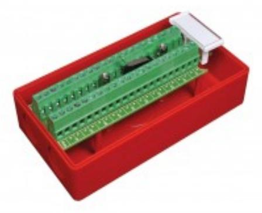
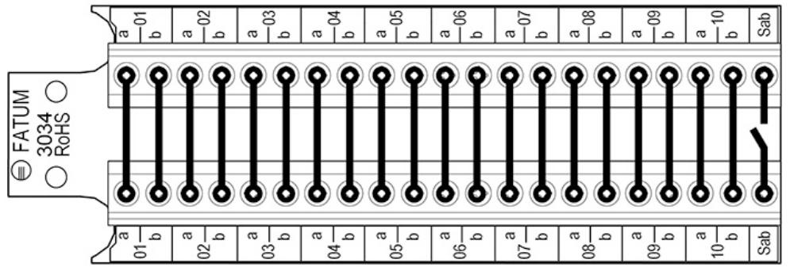

# 4101.3403R

## LARMBOX 21 PAR, BRANDRÖD

## **Produktdetajler:**

| Mått (L x B x H) mm            | 133 x 72 x 50 |
|--------------------------------|---------------|
| Ledaranslutning - SKRUV (mm)   | 0,2 - 2,5 mm2 |
| Max. belastning - matning      | 60 V / 2 A    |
| Max. belastning - sab. kontakt | 50 mA         |

### **Sabotageskyddad kopplingsbox för 21 ledarpar.**

Lämplig för brandinstallationer. Kopplingsplinten har 21 ledarpar varav 2 används för sabotagekontakten. Plinten har upp till 2,5 mm2 skruvanslutning med hissfunktion för exempelvis grövre brandkablar.

Dosan är brandklassad enligt UL 94 V-0.

### **BESTÄLLINGSINFORMATION**

Powered by TCPDF (www.tcpdf.org)

| Typ        | E-nr    | Beskrivning                                                         |
|------------|---------|---------------------------------------------------------------------|
| 4101.3403R | 6301739 | Kopplingsbox Brand Röd; 21 par 2.5mm2; Sabotageskyddad; Skruv/Skruv |