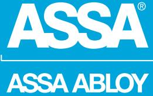
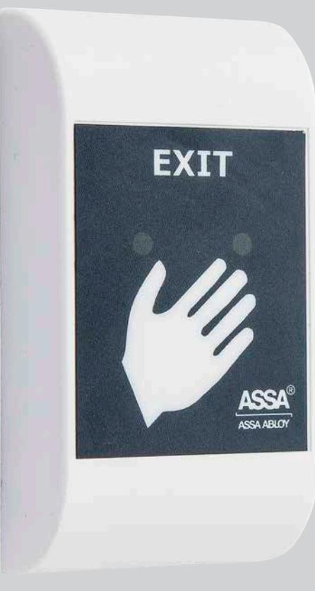
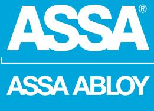
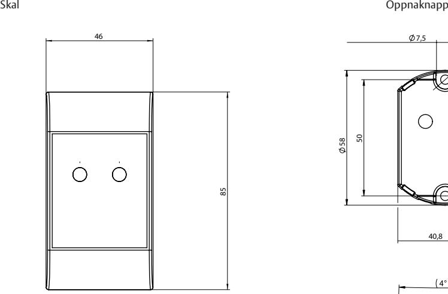
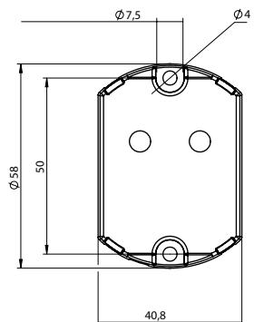
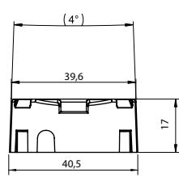

## ASSA Pando Touch Hi-O™

ASSA ABLOY, the global leader in door opening solutions

### Beröringsknapp för smidig upplåsning

Pando Touch Hi-O™ är en beröringsöppnarknapp med det lilla extra för smidig upplåsning av dörren från insidan samt informera om dörrens läge. Pando Touch Hi-O har inbyggd kvittrande-ljud samt ljus för att indikera att knappen berörs. Ljudindikeringen kan väljas bort vid installation om så önskas.

Pando Touch Hi-O har även möjlighet att indikera *dörr öppen för länge* samt *dörr forcerad* med ett summerljud på insidan av dörren för att exempelvis uppmärksamma att dörren inte gick igen ordentligt efter en passage. Pando Touch Hi-O har även en grön indikering som följer olåstfunktionen på dörren. Den gröna indikeringen tänder när dörren låser upp, antigen efter att man har berört knappen eller att dörren är olåst via ett tidsschema.

Pando Touch Hi-O-knappens funktion är mycket lämplig i högfrekventa dörrmiljöer i och med att det inte finns några rörliga delar, det räcker med att placera handen på öppnaknappen så sänds en öppningsbegäran via Hi-Obussen för att låsa upp dörren. Öppnarknappen ansluts enkelt till dörrmiljön via Hi-O-bussen till DAC eller LCU i ARX system. Pando Touch Hi-O har blå indikering för att indikera berörd/påverkad knapp. Pando Touch Hi-O är enkel att installera då alla signaler hanteras via Hi-O-bussen, det är endast två par som ansluts till systemet, spänning och busskommunikation.

# ASSA Pando Touch Hi-O™

ASSA ABLOY, the global leader in door opening solutions

19

40,5

4

50

58

40,8

7,5

#### **Indikeringar**

- Knapptryck, öppen dörr/olåst samt dörr forcerad/öppen för länge
- (val via DIP även ljudinkering)

#### **Data**

- Matniningsspänning: 12-24 V DC
- Strömförbrukning mätt vid 24V: 25mA
- Vikt 35 g
- Temperaturområde: -15ºC till +70ºC
- Uppfyller kraven för IP 44
- Halon/Halogenfri

#### **Artikelnummer**

- S515000185 Vit
ASSA ABLOY is the global leader in door opening solutions, dedicated to satisfying end-user needs for security, safety and convenience

ASSA AB P.O. Box 371 SE-631 05 Eskilstuna Sweden Phone +46 (0)16 17 70 00

Fax +46 (0)16 17 70 49 Customer support:

Phone intl. +46 (0)16 17 71 00 Phone nat. 0771-640 640 Fax +46 (0)16 17 73 72 e-mail: helpdesk.marknad@assaabloy.com

www.assa.se