## **DS-2CD7126G0/L-IZS 2 MP VF Dome Network Camera**

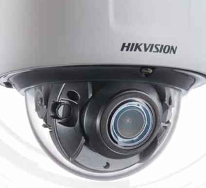

- 1/1.8" Progressive Scan CMOS
- 1920 × 1080 @ 30fps
- 2.8 to 12 mm motor-driven lens
- Color: 0.002 Lux @ (F1.2, AGC ON)
- H.265, H.265+, H.264, H.264+
- 140 dB WDR
- IR range up to 30 m
- Alarm I/O, Audio I/O, RS-485
- IK10
- Queue management, powered by deep learning technology, supports queueing-up people number and wĂŝƟnŐ ƟmĞ ĚĞƚĞĐƟŽn
- Five ĚĞĮnĞĚ streams and up to ĮvĞ custom streams
- Built-in microSD/SDHC/SDXC card slot, up to 256 GB

### **^ƉĞĐŝĮĐĂƟŽŶƐ**

| Camera                 |                                                                                                                                                                                                                                       |  |
|------------------------|---------------------------------------------------------------------------------------------------------------------------------------------------------------------------------------------------------------------------------------|--|
| Image Sensor           | 1/1.8ʺ Progressive Scan CMOS                                                                                                                                                                                                          |  |
| Min. /ůůƵmŝnĂƟŽn       | Color: 0.002 Lux @ (F1.2, AGC ON), 0 Lux with IR                                                                                                                                                                                      |  |
| ^ŚƵƩĞƌ Speed           | 1 s to 1/100,000 s                                                                                                                                                                                                                    |  |
| Slow ^ŚƵƩĞƌ            | Yes                                                                                                                                                                                                                                   |  |
| Day & Night            | IR Cut Filter                                                                                                                                                                                                                         |  |
| Digital Noise ZĞĚƵĐƟŽn | 3D DNR                                                                                                                                                                                                                                |  |
| WDR                    | 140 dB                                                                                                                                                                                                                                |  |
| Angle Adjustment       | Pan: 0° to 355°, Ɵůƚ͗ 0° to 75°, rotate: 0° to 355°                                                                                                                                                                                   |  |
| Lens                   |                                                                                                                                                                                                                                       |  |
| Focal length           | 2.8 to 12 mm                                                                                                                                                                                                                          |  |
| Aperture               | F1.2                                                                                                                                                                                                                                  |  |
| Focus                  | Auto, semi-auto, manual                                                                                                                                                                                                               |  |
| FOV                    | 2.8 to 12 mm, horizontal FOV 103.3° to 38.6°, vĞƌƟĐĂů FOV 54.2° to 21.9°, diagonal FOV 124.2° to 44.3°                                                                                                                             |  |
| Lens Mount             | No                                                                                                                                                                                                                                    |  |
| IR                     |                                                                                                                                                                                                                                       |  |
| IR Range               | Up to 30 m                                                                                                                                                                                                                            |  |
| Wavelength             | 850 nm                                                                                                                                                                                                                                |  |
| Compression Standard   |                                                                                                                                                                                                                                       |  |
| Video Compression      | Main stream: H.265/H.264 Sub stream/third stream/fourth ƐƚƌĞĂmͬലĮŌŚ stream/custom stream: H.265/H.264/ MJPEG                                                                                                                    |  |
| H.264 Type             | Baseline WƌŽĮůĞͬലDĂŝn WƌŽĮůĞͬല,ŝŐŚ WƌŽĮůĞ                                                                                                                                                                                             |  |
| H.264+                 | Main stream support                                                                                                                                                                                                                   |  |
| H.265 Type             | Main WƌŽĮůĞ                                                                                                                                                                                                                           |  |
| H.265+                 | Main stream support                                                                                                                                                                                                                   |  |
| Video Bit Rate         | 32 Kbps to 16 Mbps                                                                                                                                                                                                                    |  |
| Audio Compression      | G.711/G.722.1/G.726/MP2L2/PCM                                                                                                                                                                                                         |  |
| Audio Bit Rate         | 64Kbps(G.711)/16Kbps(G.722.1)/16Kbps(G.726)/32-192Kbps(MP2L2)/32Kbps(PCM)                                                                                                                                                             |  |
| Smart Feature-Set      |                                                                                                                                                                                                                                       |  |
| Queue Management       | Detects queuing-up people number, and wĂŝƟnŐ ƟmĞ of each person Generates reports to compare the ĞĸĐŝĞnĐy of ĚŝīĞƌĞnƚ queuing-ups and display the changing status of one queue Supports raw data export for further analysis |  |
| Region of Interest     | Main stream/sub stream/third stream/fourth ƐƚƌĞĂmͬലĮŌŚ stream: 4 ĮxĞĚ regions for each stream                                                                                                                                      |  |

**Image**

| Max. ZĞƐŽůƵƟŽn         | 1920 × 1080                                                                                                                                                                                      |
|------------------------|--------------------------------------------------------------------------------------------------------------------------------------------------------------------------------------------------|
| Main Stream            | 50Hz: 25fps (1920 × 1080, 1280 × 960, 1280 × 720) 60Hz: 30fps (1920 × 1080, 1280 × 960, 1280 × 720)                                                                                           |
| Sub Stream             | 50Hz: 25fps (704 × 576, 640 × 480) 60Hz: 30fps (704 × 480, 640 × 480)                                                                                                                         |
| Third Stream           | 50Hz: 25fps (1920 × 1080, 1280 × 960, 1280 × 720, 704 × 576, 640 × 480) 60Hz: 30fps (1920 × 1080, 1280 × 960, 1280 × 720, 704 × 480, 640 × 480)                                               |
| Fourth Stream          | 50Hz: 25fps (1920 × 1080, 1280 × 720, 704 × 576, 640 × 480) 60Hz: 30fps (1920 × 1080, 1280 × 720, 704 × 480, 640 × 480)                                                                       |
| &ŝŌŚ Stream            | 50Hz: 25fps (704 × 576, 640 × 480) 60Hz: 30fps (704 × 480, 640 × 480)                                                                                                                         |
| Custom Stream          | 50Hz: 25fps (1920 × 1080, 1280 × 720, 704 × 576, 640 × 480) 60Hz: 30fps (1920 × 1080, 1280 × 720, 704 × 480, 640 × 480) Up to 5 custom streams are supported                               |
| Image Enhancement      | BLC, HLC, 3D DNR, Defog, EIS                                                                                                                                                                     |
| Image ^ĞƫnŐ            | ^ĂƚƵƌĂƟŽn͕ brightness, contrast, sharpness, AGC, and white balance are adjustable by client ƐŽŌwĂƌĞ or web browser                                                                            |
| Target Cropping        | Yes                                                                                                                                                                                              |
| SVC                    | H.264 and H.265 encoding                                                                                                                                                                         |
| Day/Night Switch       | Day/Night/Auto/Schedule/Triggered by Alarm In                                                                                                                                                    |
| Picture Overlay        | LOGO picture can be overlaid on video with 128 × 128 24bit bmp format                                                                                                                            |
| Network                |                                                                                                                                                                                                  |
| Network Storage        | microSD/SDHC/SDXC card (256 GB), local storage and NAS (NFS,SMB/CIFS), ANR                                                                                                                       |
| Alarm Trigger          | DŽƟŽn ĚĞƚĞĐƟŽn͕ video tampering alarm, network disconnected, IP address ĐŽnŇŝĐƚ͕ illegal login, HDD full, HDD error                                                                           |
| Protocols              | TCP/IP, ICMP, HTTP, HTTPS, FTP, DHCP, DNS, DDNS, RTP, RTSP, RTCP, PPPoE, NTP, UPnP, SMTP, SNMP, IGMP, 802.1X, QoS, IPv6, UDP, Bonjour                                                         |
| Security Measures      | Password ƉƌŽƚĞĐƟŽn͕ HTTPS ĞnĐƌyƉƟŽn͕ IEEE 802.1x port-based network access control, IP address ĮůƚĞƌ͕ basic and digest ĂƵƚŚĞnƟĐĂƟŽn for HTTP/HTTPS, WSSE and digest ĂƵƚŚĞnƟĐĂƟŽn for ONVIF |
| General &ƵnĐƟŽn        | One-key reset, ĂnƟͲലŇŝĐŬĞƌ͕ ĮvĞ streams, custom streams, heartbeat, password ƉƌŽƚĞĐƟŽn͕ privacy mask, watermark, IP address ĮůƚĞƌ                                                             |
| API                    | ONVIF (PROFILE S, PROFILE G), ISAPI, SDK                                                                                                                                                         |
| Simultaneous Live View | Up to 20 channels                                                                                                                                                                                |
| User/Host              | Up to 32 users. 3 user levels, administrator, operator and user                                                                                                                                  |
| Client                 | iVMS-4200, Hik-Connect, iVMS-5200, Hik-Central                                                                                                                                                   |
| Web Browser            | IE8+, Mozilla Firefox 30.0+, Google Chrome 31.0+, Safari 8.0+ Plug-in free live view supported                                                                                                |

| Interface                    |                                                                                                                     |  |
|------------------------------|---------------------------------------------------------------------------------------------------------------------|--|
| Audio                        | 1-ch 3.5 mm input (line in), 1-ch 3.5 mm output (line out), mono sound                                              |  |
| CŽmmƵnŝĐĂƟŽn Interface       | 1 RJ45 10M/100M/1000M Ethernet port 1 RS-485 interface (half duplex, HIKVISION, Pelco-P, Pelco-D, ƐĞůĨͲലĂĚĂƉƟvĞͿ |  |
| Alarm                        | 1 input, 1 output (up to 24 VDC 1A or 110 VAC 500 mA)                                                               |  |
| Video Output                 | 1Vp-p composite output (75 Ω/CVBS)                                                                                  |  |
| Power Output                 | 12 VDC, max. 200mA                                                                                                  |  |
| On-board storage             | Built-in micro SD/SDHC/SDXC slot, up to 256 GB                                                                      |  |
| BNC                          | CVBS analog output (4CIF ƌĞƐŽůƵƟŽnͿ͕ internal                                                                       |  |
| Reset BƵƩŽn                  | Yes                                                                                                                 |  |
| Audio                        |                                                                                                                     |  |
| Environment Noise Filtering  | Yes                                                                                                                 |  |
| Audio Sampling Rate          | 8 kHz/16 kHz/32 kHz/44.1 kHz/48 kHz                                                                                 |  |
| General                      |                                                                                                                     |  |
| Firmware Version             | 5.5.5                                                                                                               |  |
| KƉĞƌĂƟnŐ CŽnĚŝƟŽnƐ           | -30 °C to 60 °C (-22 °F to 140 °F), humidity 95% or less (non-condensing)                                           |  |
| Power Supply                 | 12 VDC ± 20%, three-core terminal block; PoE (802.3af, class 3)                                                     |  |
| Power CŽnƐƵmƉƟŽn and Current | 12 VDC ± 20%, 0.7 A, max. 8 W; PoE (802.3af, 36 V to 57 V), 0.3 A to 0.2 A                                          |  |
| WƌŽƚĞĐƟŽn Level              | IK10                                                                                                                |  |
| Material                     | Aluminum Alloy                                                                                                      |  |
| Dimensions                   | Camera: Φ140.5 × 122.6 mm (Φ5.5ʺ × 4.8ʺ) With package: 244 × 174 × 173 mm (9.6ʺ × 6.9ʺ × 6.8ʺ)                   |  |
| Weight                       | Camera: approx. 950 g (2.09 lb.) With Package: approx. 1300 g (2.87 lb.)                                         |  |

** Listed ƌĞƐŽůƵƟŽnƐ are only selectable ŽƉƟŽnƐ͘ It does not mean that all streams can work at their maximum ƌĞƐŽůƵƟŽn at the same ƟmĞ͘*

#### **Available Model**

DS-2CD7126G0/L-IZS(2.8–12 mm)

** /L: Queue management supported.*

#### **Dimension**

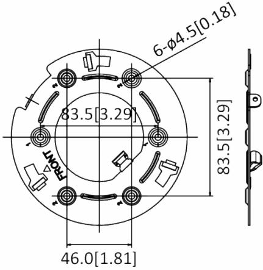

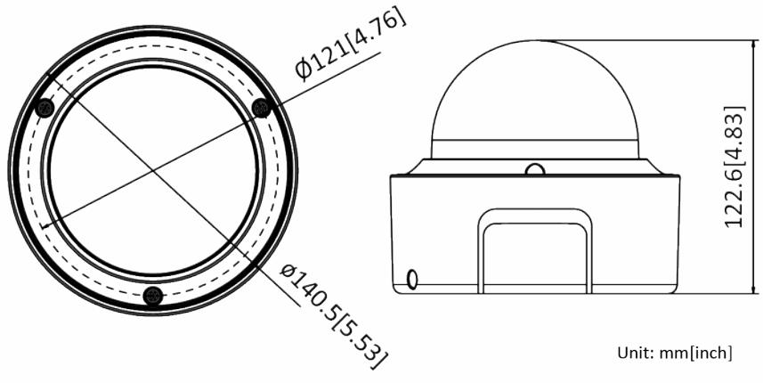

**Accessory**

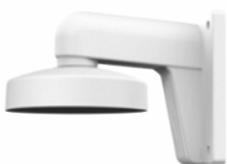

**DS-1273ZJ-130 Wall Mount**

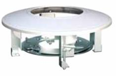

**DS-1227ZJ In-ceiling Mount**

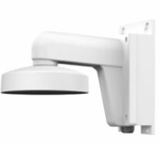

**DS-1273ZJ-130B Wall Mount**

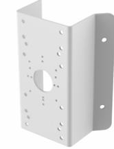

**DS-1276ZJ-SUS Corner Mount**

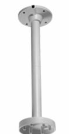

**DS-1271ZJ-130 Pendant Mount**

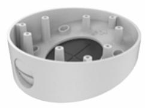

**DS-1281ZJ-DM23 Inclined Ceiling Mount**

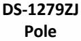

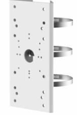

**DS-1275ZJ-SUS sĞƌƟĐĂů Pole Mount**

Distributed by

# HIKVISION

#### Headquarters

No.555 Qianmo Road, Binjiang District, Hangzhou 310051, China T +86-571-8807-5998 overseasbusiness@hikvision.com

Hikvision USA T +1-909-895-0400 sales.usa@hikvision.com

HIkvision Australia 1 +61-2-8599-4233 salesau@hikvision.com

Hikvision India T +91-22-28469900 sales@pramahikvision.com

Hikvision Canada T +1-866-200-6690 sales.canada@hikvision.com

Hikvision Thailand T +662-275-9949 sales.thailand@hikvision.com Hikvision Europe T +31-23-5542770 sales.eu@hikvision.com

Hikvision Italy T +39-0438-6902 info.it@hikvision.com

Hikvision Brazil T +55 11 3318-0050 Latam.support@hikvision.com

Hikvision Turkey T +90 (216)521 7070- 7074 sales.tr@hikvision.com

Hikvision Malaysla T +601-7652-2413 sales.my@hikvision.com Hikvision UK & Ireland T +01628-902140 sales.uk@hikvision.com

Hikvision South Africa Tel: +27 (10) 0351172 sale.africa@hikvision.com

Hikvision France 1 +33(0)1-85-330-450 info.tr@hikvision.com

Hikvision Kazakhstan T +7-727-9730667 nikia.panfilov@hikvision.ru

Hikvision Vietnam T +84-974270888 sales.vt@hikvision.com HIkvision UAE T +971-4-4432090 salesme@hikvision.com

Hikvision Singapore T +65-6684-4718 sg@hikvision.com

Hikvision Spain T +34-91-737-16-55 info.es@hikvision.com

Hikvision Tashkent T +99-87-1238-9438 uzb@hikvision.ru

Hikvision Hong Kong
T +852-2151-1761 info.hk@hikvision.com Hikvision Russia 1 +7-495-669-67-99 saleru@hikvision.com

Hikvision Korea T +82-10 31-731-8817 sales.korea@hikvision.com

Hikvision Poland T +48-22-460-01-50 info.pl@hikvision.com

Hikvision Indonesia T +62-21-2933759 Sales.Indonesia@hikvision.com

Hikvision Colombia sales.colombia@hikvision.com

@ Hikvision Digital Technology Co., Ltd. 2018 | Data subject to change without notice |