## Tre enkla steg för Smart Living

## Tillbehör till Smartphone Alarm

### Tillbehör till Standard Alarm

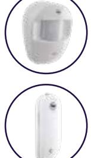

**Passiv IR-detektor.** Trådlös och batteridriven. Minst 2 års batteritid.

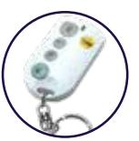

**Magnetkontakt** för bevakning av dörrar

och fönster. Batteridriven och trådlös.

**Fjärrkontroll** för styrning av larmet. Larm till/från, hemlarm och överfallslarm går att styra från fjärrkontrollen. Nyckelringsmodell.

**Husdjursanpassad** passiv IR-detektor. Trådlös och batteridriven. Minst 2 års batteritid.

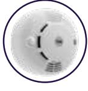

**Rökdetektor.** Optisk trådlös nätverksdetektor. Aktiverar alla rökvarnare och larmet vid brand.

### **Smartphone Alarm-paketet**

**innehåller** 

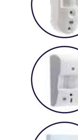

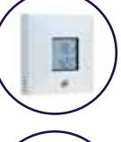

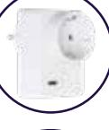

Centralenhet med inbyggd sirén IR-detektor med kamera Magnetkontakt Knappsats

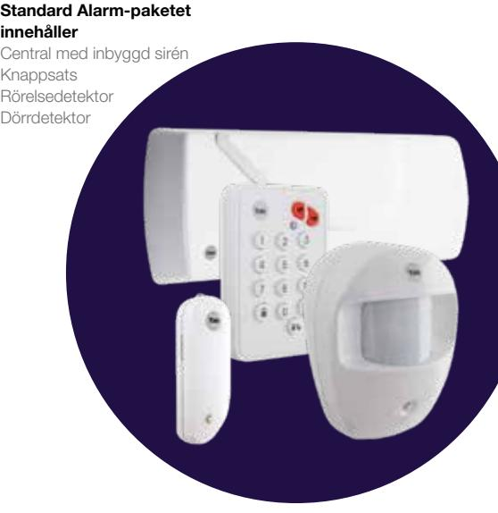

#### **Välj tillbehör**

För att anpassa larmet för din lägenhet eller ditt hus, kan du lägga till komponenter (upp till 40 stycken) för att skapa den lösning som passar just dig. Du hittar översikt på alla tillbehören här till höger.

#### **Enkel installation**

Alla komponenter är förprogrammerade för enklast möjliga installation. Följ manualen steg för steg för plug-and-play installation av ditt Yale Smart Living system.

#### **Välj alarm**

Välj mellan Standard Alarm eller Smartphone Alarm startpaket.

- Standard Alarm styr du via panelen.
- Smartphone Alarm kan du även styra med app. En IR-detektor med stillbildskamera ingår .
- Smart Phone alarm kan kopplas ihop med Yale Doorman.

**Anpassa ditt Yale Smart Living system efter dina behov IR-detektor med stillbildskamera.** 

Trådlös, batteridriven detektor med kamera som tar en sekvens om 3 bilder vid larm eller enskilda bilder styrt från appen. Endast för Smartphone Alarm.

**Utomhussirén.** 104 dB ljudstyrka. Trådlös och batteridriven för enkel installation.

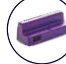

**Låsmodul.** Modulen används för att koppla ditt Yale Doorman till larmet.

**Rumssensor.** Trådlös termometer som mäter temperatur och luftfuktighet och

skickar information till appen. Endast för Smartphone Alarm.

**Powerplug.** Fjärrstyr en apparat via ditt eluttag med hjälp av appen. Upp till 16A.

Endast för Smartphone Alarm.

**Passiv IR-detektor.** Trådlös och batteridriven. Finns även i en husdjursanpassad variant.

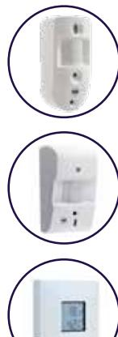

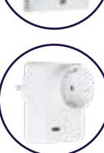

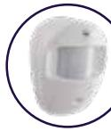

**IR-detektor** med videokamera. Trådlös, batteridriven detektor med kamera som tar en 10 sek sekvens vid larm eller styrt från appen. Endast för Smartphone Alarm.

Den enkla vägen till ett tryggt hem Den enkla vägen till ett tryggt hem

# Smart alarm för ditt hem

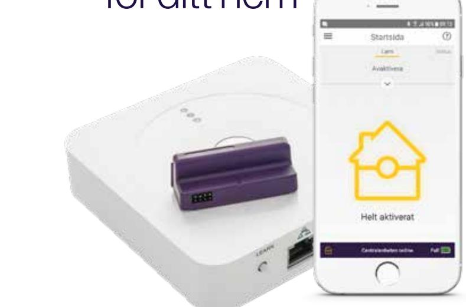

www.yale.se

*Samtliga tillbehör kan anslutas till Smartphone Alarm.*

# Yale Smart Living – alltid kontroll över ditt hem var du än är

Oavsett var du befinner dig ska du kunna lita på att ditt hem är säkert. Idag är vi människor rörligare än någonsin. Vår mobila livsstil ställer allt högre krav på att vi ska kunna hantera vardagen, jobbet och hålla koll på vad som händer ute i världen från mobilen eller surfplattan. Med Yale Smart Alarm får du koll på din bostad direkt i mobilen, var du än befinner dig.

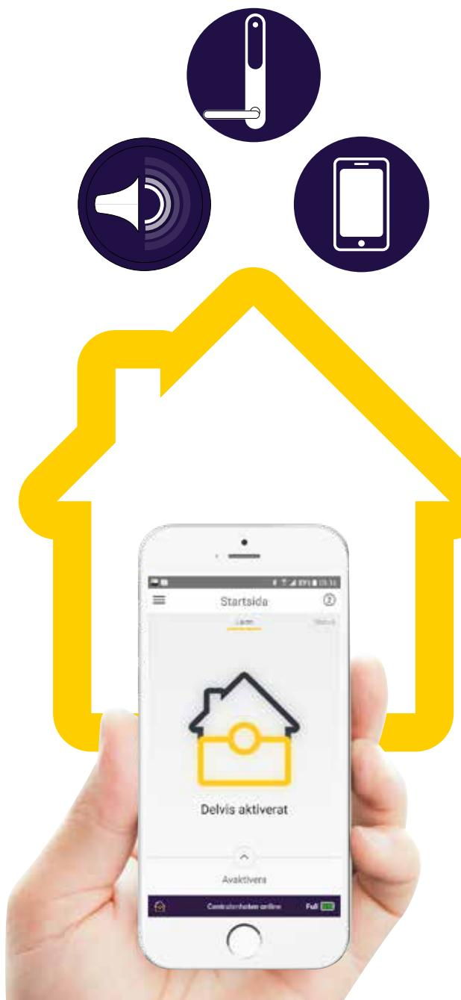

### Yale Smart Living Intelligent trygghetssystem som ger dig överblick av ditt hem

### Yale Smartphone Alarm

**Skydda ditt hem med ett smart larmsystem som passar dig**

### **Enkelt att installera**

Alla delarna i systemet är redan förberedda för enklaste möjliga plug-n-play-installation.

### **Anpassningsbart**

Yale Smart Alarm är flexibelt. Med olika tillbehör kan du skapa ett system som är anpassat för just din bostad.

### **Integration med Yale Doorman**

Håll koll på ditt lås! Gör inställningar och ändringar av till exempel koder och nyckelbrickor i appen. Med ett uppkopplat lås, en så kallad integration, styr du Smart Living-larmet via ditt Yale Doorman. Inga fler falsklarm.

### **Full kontroll**

Se status på alla dina komponenter och styr systemet från mobilen via Yale Smart Living-app. Du kan också välja att få notiser om någonting händer hemma.

Till exempel kan du få bilder skickat till din e-mail om IR-detektor aktiveras av en rörelse och få en notis om brandlarmet går – allt i realtid.

Du kan skapa flera användarkonton så att alla i familjen kan få samma översikt av hemmet om du vill.

( ( ! ) )

*Det smarta alarmet utan abonnemang. Med Yale Smart Living äger du ditt system och slipper återkommande månadskostnader.*

