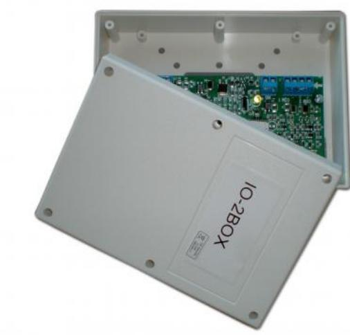

# IU2055C

Produktblad

Adressmodul för konventionella detektorer

### IU2055C

IU2055C är en modul för anslutning av konventionella branddetektorer till UTC Fire & Security analoga adresserbara brandlarmsystem. Med IU2055C kan upp till 20 konventionella branddetektorer och larmknappar anslutas. Enheten är ett utmärkt hjälpmedel för att kombinera äldre konventionella detektorslingor med ett modernt analogt adresserbart brandlarm. Larm och fel rapporteras till centralapparaten och det finns även lysdiodsindikeringar på enheten.

#### Larmverifikation

Signaler från detektorerna i UTC Fire & Security 700-serie rapporteras till centralapparaten. Med IU2055C kan funktioner som larmverifikation och återställning av detektorer erhållas.

#### Säker kommunikation

IU2055C kommunicerar med centralapparaten via ett digitalt protokoll. Kommunikationen är tack vare avancerade algoritmer mycket stabilt och okänsligt för yttre störningar. Spänningsmatning sker via adresslingan. Enheten adresseras

enkelt med hjälp av två roterande switchar. Totalt kan varje slinga omfatta 128 adresser.

### Standardprestanda

- EUpp till 20 konventionella detektorer
- EÖppen eller sluten slinga
- EVerifierat larm och återställning
- E Slingmatad

- EEnkel adressering
# IU2055C

Adressmodul för konventionella detektorer

## Tekniska data

| Drivspänning                               | 17-28 V via kommunikationsslingan      |
|--------------------------------------------|----------------------------------------|
|                                            | 18-26 V vid utgång för sektionsslingan |
| Total strömförbrukning vid normal drift | < 15mA                                 |
| Utan detektorer                            | normalt 4,5 mA                         |
| Maximal strömförbrukning vid larm       | < 35mA                                 |
| Maximal belastning per sektion          | 3,5 mA, cirka 30 detektorer            |
| Maximal sektionskapacitans                 | Inte över 1mA                          |
| Temperaturområde i drift                   | -10° till +70° C                       |
| Luftfuktighet i drift                      | 0-95 %, icke kondenserande             |
| Ändmotstånd                                | 10 K, 1/4 W, 5%                        |
| Sektionsmotstånd vid 24 V                  |                                        |
| Sluten slinga                              | < 120 ohm                              |
| Brandlarm                                  | 120 - 1 Kohm                           |
| I vila                                     | 1 Kohm - 27 Kohm                       |
| Öppen                                      | > 27 Kohm                              |

Order data

Artikelnummer Beskrivning IU2055C Adressmodul för konventionella detektorer

