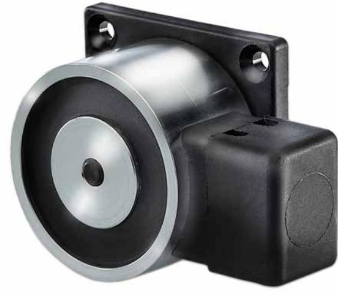

## FE235

**Dörrhållarmagnet 400N hållkraft.Ingen. IP42 kabelingång från sidan (HxBxD) 55x55x33 inkl ankarplatta**

#### **Allmänt**

FE235 är en dörrhållarmagnet för utanpåliggande montage på vägg eller konsol i en Bayblend kapsling med 400N hållkraft.

### **Magnetkonstruktion**

Magneten är konstruerad med en pressad spole och antiremanensstift. Kapslingsklass IP54. Skyddsdiod är integrerad i konstruktionen.

#### **Kapsling**

Plastkapslingen är tillverkad av Bayblend och innehåller 30 % PA6 glasfiber vilket gör den mycket starkare än standard ABS. Bayblend ger hög värmetålighet hög effekt hög slagtålighet och styvhet samt dimensionsstabilitet.

#### **Installationsvänlig**

- För praktisk enkel installation, dörrhållarmagneten levereras komplett med elektriska skruvplintar.

- Fästplattan är förborrad i ett praktiskt standard format för snabb montering.
- Dörrmagneten levereras komplett med en ledad ankarplatta för inställning i olika vinklar.

#### **Godkännanden**

FE235 är fullt godkänd enligt EN1155.

### **Details**

- Låg effekt 1,6 W
- 400 N hållkraft
- Anti-remanensstift
- Skyddsdiod och skydd för omvänd polarietet
- EN1155-godkänd
- Ankarplatta ingår

# FE235

**Dörrhållarmagnet 400N hållkraft.Ingen. IP42 kabelingång från sidan (HxBxD) 55x55x33 inkl ankarplatta**

**Technical specifications**

| General                        |                   |
|--------------------------------|-------------------|
| Holding force N (Newton)400    |                   |
| Release button                 | No                |
| Spark supression diode         | Yes               |
| Reverse polarity protection | Yes               |
| Electrical                     |                   |
| Power supply type              | 24 VDC            |
| Power consumption              | 1.6 W             |
| Duty cycle                     | 100%              |
| Physical                       |                   |
| Physical dimensions            | 55 x 55 x 33 mm   |
| Environmental                  |                   |
| IP rating                      | IP54 (magnet)     |
|                                | IP42 (connection) |
| Regulatory                     |                   |
| Standards                      | EN1155            |

Powered by TCPDF (www.tcpdf.org)

Carrier Fire & Security förbehåller sig rätten att ändra produktspecifikationer utan föregående meddelande. För de senaste produktspecifikationerna, besök se.firesecurityproducts.com online eller kontakta din försäljningsrepresentant.