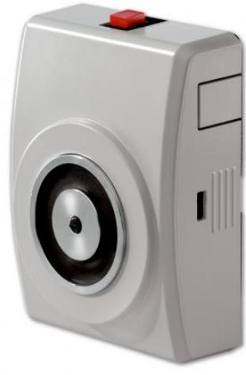

# FE230

Produktblad

Dörrhållarmagnet, utanpåliggande montage, 400N, med

## Allmänt

FE230 är en dörrhållarmagnet för utanpåliggande montage på vägg eller konsol. Enheten ger en hållkraft på 400N och är försedd med en dörrstängningsknapp som kan monteras på ovansidan eller på sidan av enheten. Kabelgenomföring kan göras från sidan, ovansidan eller från baksidan.

#### Magnetkonstruktion

Dörrmagneten är kontruerad med en pressad spole och är försedd med ett anti-remanensstift för hantering av eventuell restmagnetism. FE230 har integrerade skyddsdioder för att motverka strömspikar. Kapslingsklassen för dörrmagneten är IP54.

### Kapsling

Plasthöljet är tillverkat i materialet Bayblend och innehåller 30 % PA6 glasfiber, vilket gör den mycket starkare än standard ABS. Bayblend ger hög värmebeständighet, slagtålighet och styvhet.

#### Installationsvänlig

- För praktisk och enkel installation levereras dörrhållarmagneten med skruvanslutningar för kabeln. - Kapslingen är förborrad för enkelt och snabbt montage.

- FE230 levereras med ankarplatta med justerbar vinkel.
- Dörrstängningsknappen kan monteras på tre olika ställen; på ovansidan eller på höger eller vänster sida om enheten.
- Kabelgenomföring kan ske från vänster eller höger sida, baksidan eller från ovansidan.

#### Godkännanden

FE230 är godkänd enligt EN1155.

## Standardprestanda

- ELåg effekt, 1,6 W
- E 400 N hållkraft

- EAnti-remanensstift
- ESkyddsdiod och skydd för omvänd polaritet
- EInbyggd dörrstängningsknapp
- EEN1155-godkänd
- E Ankarplatta ingår

# FE230

Dörrhållarmagnet, utanpåliggande montage, 400N, med

# Tekniska data

| Spänningsmatning                        | 24 VDC        |
|-----------------------------------------|---------------|
| Effekt                                  | 1,6 W         |
| Hållkraft (N)                           | 400           |
| Kapslingsklass                          |               |
| Magnet                                  | IP54          |
| Anslutning                              | IP42          |
| Dimensioner (mm)                        |               |
| (H x B x D)                             | 110 x 85 x 38 |
| Dörrstängningsknapp                     | Ja            |
| Skyddsdioder                            | Ja            |
| Polaritetsskydd mot omvänd polaritet | Ja            |
| EN1155                                  | Ja            |
| Driftcykel                              | 100 %         |

Order data

| Artikelnummer | Beskrivning                                                                |
|---------------|----------------------------------------------------------------------------|
| FE230         | Dörrhållarmagnet, utanpåliggande montage, 400N, med dörrstängningsknapp |

