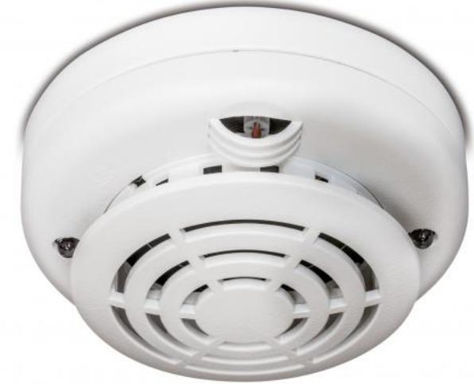

# DT2063N

Produktblad

2000 Series Intelligent Heat Detector with Remote LED Output

#### General

The DT2063N is a 2000 series protocol, addressable temperature detector. It provides good looks as well as top features, including a rate-of-rise algorithm that allows the device to raise the alarm before the fixed temperature trigger point is reached. Dual fire LEDs indicate an alarm visible from all directions, eliminating the need for special detector orientation on installation, whilst a remote indicator output is provided as standard on every device.

#### Installation Friendly

The DT2063N is individually identified by setting an address through two rotary switches. The address is a straight numerical value and does not require binary or hexadecimal conversions, significantly reducing the risk of incorrect addressing. All 2000 series sensors are compatible with a standard base, which makes them easily interchangeable.

#### State of the Art Communication

Panel to device communication is provided through a powerful SIA protocol featuring multiple bus cycle codes and CRC error checking and ensuring reliable communications between the device and the control panel.

This enhanced protocol ensures the overall integrity and error free operation of the full system, without compromising speed.

#### Extended Applications

A comprehensive line of complimentary devices accompanies the 2000 series optical detectors:

- · common use detector bases
- · temperature and multi-sensors
- · stand alone and base isolators
- · sounder circuit controllers
- · conventional zone monitoring units
- · various I/0 modules
- · a comprehensive line of manual call points · loop powered sounders & sounder beacons

#### Standardprestanda

- EDual thermistors
- E Remote test capabilities
- ERemote signaling capabilities
- E Easy numeric addressing (1-128)
- EEnhanced communication protocol
- EFull diagnostic self testing
- EFull range including optical and multi sensors
- EFull range of I/0 units and accessories
- EOptional isolator base
- EEN54:5 approved and CPR certified

# DT2063N

2000 Series Intelligent Heat Detector with Remote LED Output

### Tekniska data

| Operating voltage     | 17 - 28 VDC           |
|-----------------------|-----------------------|
| Current consumption   |                       |
| Quiescent @ 24 VDC    | < 270 µA              |
| Alarm @ 24 VDC        | 4.7 mA                |
| Alarm indication      | Dual LED              |
| Remote alarm output   | 4.7 mA                |
| Environmental         |                       |
| Humidity (noncond.)   | 10 - 95%              |
| Storage temperature   | -10°C to +70°C        |
| Operating temperature | -10°C to +60°C        |
| IP rating             | IP23                  |
| Physical              |                       |
| Dimensions (Ø x h)    | 10 x 5 cm             |
| Colour                | Cloud White (RAL9001) |
| Weight                | 83 g                  |
| Coverage              |                       |
| Area                  | < 80 m²               |
| Compliance            | EN54-5                |

Order data

| Artikelnummer | Beskrivning                                                  |
|---------------|--------------------------------------------------------------|
| DT2063N       | 2000 Series Intelligent Heat Detector with Remote LED Output |

