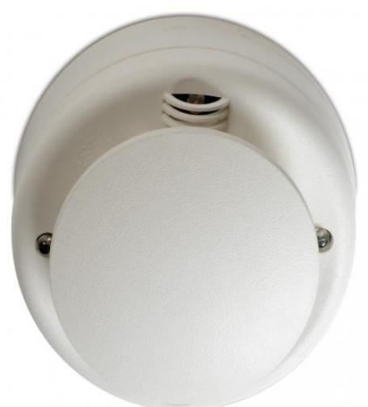

## DP2061T

Produktblad

Analog adresserbar rök- och värmedetektor

## DP2061T

DP2061T är en mulitsensor som kombinerar känsligheten för detektering av rök från en optisk rökdetektor tillsammans med detektering av värme. DP2051T kan arbeta i fem olika driftslägen. Som optisk rökdetektor förstärkt med värmedetektering (med två olika känsligheter för rökdetektering), som dubbel rök- och värmedetektor – varje sensor arbetar självständigt, endast optisk detektor eller endast differential värmedetektor med max temperaturgräns.

#### Multiläge

De fem olika driftslägena kan kontrolleras via dag-/nattläge för varje sensor, detektorn kan till exempel fungera som en värmedetektor på dagen och rökdetektor under natten. Varje sensor kan styras självständigt.

#### Säker kommunikation

Kommunikationen mellan detektor och centralapparat sker via ett driftsäkert kodat protokoll. Förutom snabb kommunikation är protokollet mycket stabilt och okänsligt för störningar.

#### Unik mätkammare

DP2061T arbetar efter principen med en reflekterat ljuspatenterad mätkammare vilket ger en säker detektering redan i ett tidigt stadium av ett brandförlopp.

## Servicevänlig

Tack vare att mätkammaren i detektorn är utbytbar på plats utan att detektorn behöver om kalibreras, kan service och underhåll effektiviseras. Detektorn är även försedd med självtestfunktion, driftkompensering och övervakning av nedsmutsning.

#### Godkännande

Detektorn uppfyller kraven enligt EN54 och SBF1011:1 samt är intygad av SBSC samt CPD-certifierad.

### Standardprestanda

- EOptisk rök- och värmedetektor
- EFem driftlägen: - Multisensor med två olika känsligheter för rökdetektering
	- Dubbeldetektor (oberoende optisk rök- och A2R värmedetektor)
	- Endast rökdetektering
	- Endast värmedetektering (A2R 60 °C differential)
- E Utbytbar optisk kammare
- EFullständiga diagnosiska självtester
- E Enkel numerisk adressering (1-128)
- E Fjärrtestmöjligheter
- EEN 54:5/7-godkänd, SBSC-intygad, CDR-certifierad

# DP2061T

Analog adresserbar rök- och värmedetektor

## Tekniska data

| Drivspänning               | 17-28 VDC                   |
|----------------------------|-----------------------------|
| Strömförbrukning           |                             |
| I vila vid 24 V            | < 350 uA                    |
| Vid larm vid 24 V          | 4 mA                        |
| Larmindikering             | Dubbla LED                  |
| Utgång för fjärrindikering | 4 mA                        |
| Luftfuktighet              | 0-95 % (icke kondenserande) |
| Temperaturområde           | -10 till +60 °C             |
|                            | IP23                        |
| Mått                       |                             |
| Höjd                       | 5 cm                        |
| Diameter                   | 10 cm                       |

Order data

Artikelnummer Beskrivning DP2061T Analog adresserbar rök- och värmedetektor

