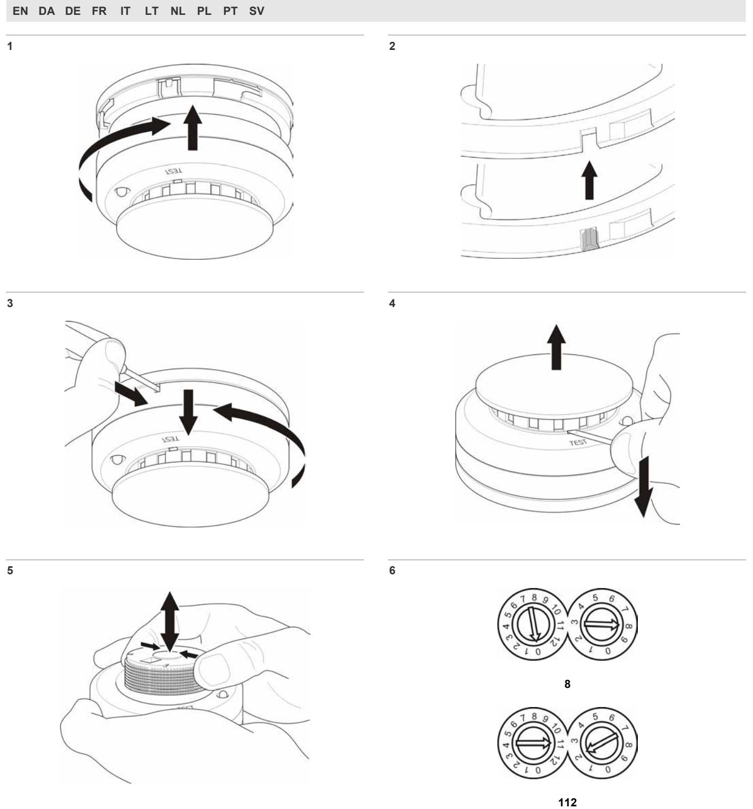
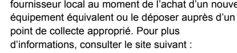
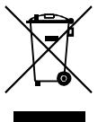
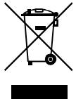
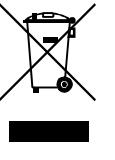

# 2000 Series Addressable Point Detectors Installation Sheet

# **EN: Installation instructions**

## **Installation**

**Caution:** For general guidelines on system planning, design, installation, commissioning, use and maintenance, refer to the EN 54-14 standard and local regulations.

## **To install a detector:**

**Caution:** Polarity requirements for detectors vary. See individual detector specifications for more information.

Insert the detector head into the mounting base and rotate it clockwise until it clicks into place (Figure 1).

The detector may be locked into the mounting base if required. To do this, remove the locking tab before installation (Figure 2).

After installation, ensure that the detector communicates with the control panel. If the detector does not communicate with the control panel, check that duplicate addresses have not been assigned.

Always test detectors after installation.

**To remove a locked detector:** 

- 1. Insert a small screwdriver into the locking tab slot (Figure 3).
- 2. Press and rotate the detector anticlockwise.

#### **Addressing**

Each detector must be assigned an address from 1 to 128. Use the rotary dial marked 0 to 12 to set the tens and hundreds part of the address, and the rotary dial marked 0 to 9 for the remaining digits. See Figure 6 for sample address settings.

**Note:** To overcome the mechanical effects of shipping and storage, we recommend that you first rotate each dial counterclockwise (to the 0 position) and then clockwise (to the dial's maximum position) before setting the required address.

## **Status indications**

### **LED indicator**

Each detector includes 1 or 2 red LEDs for alarm indication, as shown in the table below.

| Detector                               | LEDs | Alarm indication |
|----------------------------------------|------|------------------|
| DP2061N DP2061T DP2061 DT2063 | 2    | Constant LED     |
| DP2071 DT2073                       | 1    | Constant LED     |

#### **Seven-segment display**

In addition to the standard LED alarm indication, the DP2071 and DT2073 detectors include a seven-segment display with the following status indications:

| Indication | Description                             |
|------------|-----------------------------------------|
| A          | Alarm                                   |
| P          | Pre-alarm                               |
| C          | Detector maintenance                    |
| F          | Detector fault                          |
| E          | Error (for example, duplicated address) |
| O          | Soak test                               |
| o          | Detector disabled                       |

## **Maintenance**

Basic maintenance consists of a yearly inspection. Do not modify internal wiring or circuitry.

#### **Diagnostic and sensitivity test**

On detectors with a seven-segment display, a diagnostic and sensitivity test is available.

The test is initiated by holding a magnet to the integral reed switch, marked by the word TEST on the detector housing. The test results (device address and current analogue value) are indicated on the seven-segment display.

#### **Replacing the optical chamber**

**To replace the optical chamber:** 

- 1. Remove the detector head from the mounting base.
- 2. Remove the detector cap by inserting a screwdriver and lifting (Figure 4).
- 3. Remove the used optical chamber from the detector.
- 4. Clean the replacement optical chamber using compressed air and insert it into the detector (Figure 5).
- 5. Replace the detector cap and install the detector head into the mounting base.
- 6. Test the detector according to local regulations and verify that it signals an alarm at the control panel.

To clean the optical chamber, follow the above instructions for removal and use compressed air to clear the dust.

**Caution:** After replacing or cleaning the optical chamber, check that the analogue value of the detector at the control panel is within normal limits for the detector type and environmental conditions.

## **Specifications**

|                                   | DP2061N DP2061T | DP2071 DT2073 | DP2061 DT2063 |
|-----------------------------------|--------------------|------------------|------------------|
| Operating voltage                 | 17 to 28 VDC       | 17 to 28 VDC     | 17 to 28 VDC     |
| Current consumption in standby | 350 µA             | < 150 µA         | < 150 µA         |
| Current consumption in alarm   | 4 mA               | 4 mA             | 2 mA             |
| Remote alarm output               | 4 mA               | 4 mA             | 4 mA             |
| Seven-segment LED                 | No                 | Yes              | No               |
| Coverage                          | 60 to 80 m2        | 60 to 80 m2      | 60 to 80 m2      |
| Polarity sensitive                | Yes                | No               | No               |

|                                                 | DP2061N DP2061T             | DP2071 DT2073              | DP2061 DT2063              |
|-------------------------------------------------|--------------------------------|-------------------------------|-------------------------------|
| IP rating                                       | DP2061N: IP43 DP2061T: IP23 | IP43                          | IP43                          |
| Compatible mounting base                     | DB2002 DB2004 DB2016     | DB2002 DB2004 DB2016    | DB2002 DB2004 DB2016    |
| Operating temperature Storage temperature | −10 to +60ºC −10 to +70ºC   | −10 to +60ºC −10 to +70ºC  | −10 to +60ºC −10 to +70ºC  |
| Relative humidity (noncondensing)            | 10 to 95%                      | 10 to 95%                     | 10 to 95%                     |
| Colour                                          | White                          | White                         | White                         |
| Dimensions                                      |                                | Ø 100 × 50 mm Ø 100 × 50 mm   | Ø 100 × 50 mm                 |
| Weight                                          | 115 g                          | DP2071: 118 g DT2073: 91 g | DP2061: 115 g DT2063: 91 g |

# **Certification and compliance**

|                     | DP2061 DP2061N DP2071    | DP2061T                                                                                                                                                                                                                                                  | DT2063 DT2073                                                                                             |
|---------------------|--------------------------------|----------------------------------------------------------------------------------------------------------------------------------------------------------------------------------------------------------------------------------------------------------|--------------------------------------------------------------------------------------------------------------|
| Detector type       | Optical smoke detector      | Multisensor (optical/heat)                                                                                                                                                                                                                            | Heat detector                                                                                                |
| Certification       |                                |                                                                                                                                                                                                                                                          |                                                                                                              |
| CPD certificate     |                                | 1134-CPD-010 1134-CPD-023 1134-CPD-006                                                                                                                                                                                                                   |                                                                                                              |
| Year of manufacture | product identification label). |                                                                                                                                                                                                                                                          | The year of manufacture is included in the first two digits of your product serial number (located on the |
| EN 54               | EN 54-7                        | EN 54-7                                                                                                                                                                                                                                                  | EN 54-5 Class A2                                                                                          |
| CEA                 | ---                            | CEA4021 Type B                                                                                                                                                                                                                                        | ---                                                                                                          |
| EMC                 | EN 50130-4 EN 61000-6-3     | EN 50130-4 EN 61000-6-3                                                                                                                                                                                                                               | EN 50130-4 EN 61000-6-3                                                                                   |
| Manufacturer        | 201206, Shanghai, China        | Shanghai UTC Fire & Security Electronics, 1st Export Processing Zone, Pudong New Area                                                                                                                                                                 | Floor No. 2 Building No. 211, Qinqiao Road Jinqiao                                                           |
|                     | Fire & Security B.V.           | Kelvinstraat 7, 6003 DH Weert, Netherlands                                                                                                                                                                                                               | Authorized EU manufacturing representative: UTC                                                              |
|                     | see: www.recyclethis.info.     | Products marked with this symbol cannot be disposed of as unsorted municipal waste in the European Union. For proper recycling, return this equivalent new equipment, or dispose of it at designated collection points. For more information | product to your local supplier upon the purchase of                                                          |

# **DA: Installationsvejledning**

# **Installation**

**Advarsel !** Vær opmærksom på de generelle retningslinjer for systemplanlægning og -udformning, installation, ibrugtagning, anvendelse og vedligeholdelse i henhold til EN54-14 samt de lokale bestemmelser.

#### **Sådan installeres en detektor**

**Advarsel !** Der findes forskellige polaritetskrav for detektorer. Se specifikationerne for den pågældende detektor for at få flere oplysninger.

Indsæt detektorhovedet i soklen, og drej den med uret, indtil den klikker på plads (figur 1).

Detektoren kan låses fast i soklen, hvis det er nødvendigt. For at gøre dette skal låsemekanismen fjernes før installation (figur 2).

Når installationen er udført, skal du sikre, at detektoren kommunikerer med brandcentralen. Hvis detektoren ikke kommunikerer med centralen, skal du kontrollere, at der ikke er blevet tildelt identiske adresser.

Test altid detektorer efter installation.

### **Sådan fjernes en låst detektor**

- 1. Indsæt en lille skruetrækker i låsemekanismen (figur 3).
- 2. Tryk let og drej detektoren mod uret.

## **Adressering**

Hver detektor skal tildeles en adresse fra 1 til 128. Brug drejeskiven, der er mærket 0 til 12 til at indstille hundrede og tiere af adressen og drejeskiven, der er mærket 0 til 9 for de resterende cifre. Se figur 6 for at se eksempel på adresseindstillinger.

**Bemærk !** For at afhjælpe de mekaniske påvirkninger ved levering og opbevaring anbefaler vi, at du først drejer hver drejeskive mod uret (til 0-stillingen) og derefter med uret (til drejeskivens maksimale stilling), før indstilling af den relevante adresse.

## **Statusindikatorer**

## **LED-indikator**

Hver detektor indeholder 1 eller 2 røde lysdioder, der fungerer som alarmindikatorer. Se tabellen nedenfor.

| Detektor                               | LED'er | Alarmindikation |
|----------------------------------------|--------|-----------------|
| DP2061N DP2061T DP2061 DT2063 | 2      | Konstant LED    |
| DP2071 DT2073                       | 1      | Konstant LED    |

## **Syvsegmentsvisning**

Udover standard-LED-alarmindikatoren, indeholder detektorerne DP2071 og DT2073 en syvsegment-LED med følgende statusindikatorer:

| Indikering | Beskrivelse                      |
|------------|----------------------------------|
| A          | Alarm                            |
| P          | Forvarsel alarm                  |
| C          | Detektorvedligeholdelse          |
| F          | Detektorfejl                     |
| E          | Fejl (f.eks. identiske adresser) |
| O          | Drift test                       |

| Indikering | Beskrivelse        |
|------------|--------------------|
| o          | Detektor frakoblet |

## **Vedligeholdelse**

Grundlæggende vedligeholdelse omfatter en årlig inspektion. Der må ikke ændres på de indvendige ledningsforbindelser eller strømkredse.

## **Diagnosticerings- og følsomhedstest**

For detektorer med syvsegment display er det muligt at foretage en diagnosticering og følsomhedstest.

Testen startes ved at holde en magnet op imod den interne reed-kontakt, som er markeret med ordet TEST på detektoren. Test resultaterne (enhedens adresse og den analoge værdi) bliver nu indikeret på syvsegment displayet.

## **Udskiftning af det optiske kammer**

Sådan udskiftes det optiske kammer:

- 1. Fjern detektorhovedet fra soklen.
- 2. Fjern detektordækslet ved at indsætte en skruetrækker og løfte (figur 4).
- 3. Fjern det brugte optiske kammer fra detektoren.
- 4. Rengør det nye optiske kammer vha. trykluft, og indsæt det i detektoren (figur 5).
- 5. Monter detektordækslet igen, og installer detektorhovedet i soklen.
- 6. Test detektoren i henhold til lokale regler, og kontroller, at der vises en alarm på kontrolpanelet.

For at rengøre det optiske kammer skal du følge vejledningen ovenfor, for fjernelse og brug af trykluft til fjernelse af støv.

**Advarsel !** efter udskiftning eller rengøring af det optiske kammer, skal du kontrollere, at den analoge værdi for detektoren på centralen ligger inden for de normale grænser for den pågældende detektortype og de pågældende miljøforhold.

# **Specifikationer**

|                             | DP2061N DP2061T                   | DP2071 DT2073           | DP2061 DT2063           |
|-----------------------------|--------------------------------------|----------------------------|----------------------------|
| Driftsspænding              | 17 til 28 VDC                        | 17 til 28 VDC              | 17 til 28 VDC              |
| Strømforbrug ved standby | 350 µA                               | < 150 µA                   | < 150 µA                   |
| Strømforbrug ved alarm      | 4 mA                                 | 4 mA                       | 2 mA                       |
| Output for fjernalarm       | 4 mA                                 | 4 mA                       | 4 mA                       |
| Syvsegment-LED              | Nej                                  | Ja                         | Nej                        |
| Dækning                     | 60 til 80 m2                         | 60 til 80 m2               | 60 til 80 m2               |
| Polaritetsfølsom            | Ja                                   | Nej                        | Nej                        |
| Beskyttelsesklasse          | DP2061N: IP43 DP2061T: IP23 | IP43                       | IP43                       |
| Detektorsokkel              | DB2002 DB2004 DB2016           | DB2002 DB2004 DB2016 | DB2002 DB2004 DB2016 |

|                                               | DP2061N       | DP2071                        | DP2061                        |
|-----------------------------------------------|---------------|-------------------------------|-------------------------------|
|                                               | DP2061T       | DT2073                        | DT2063                        |
| Driftstemperatur                              | −10 til +60ºC | −10 til +60ºC                 | −10 til +60ºC                 |
| Opbevaringstemperatur                         | −10 til +70ºC | −10 til +70ºC                 | −10 til +70ºC                 |
| Relativ luftfugtighed (ikke-kondenserende) | 10 til 95%    | 10 til 95%                    | 10 til 95%                    |
| Farve                                         | Hvid          | Hvid                          | Hvid                          |
| Dimensioner                                   | Ø 100 × 50    | Ø 100 × 50                    | Ø 100 × 50                    |
|                                               | mm            | mm                            | mm                            |
| Vægt                                          | 115 g         | DP2071: 118 g DT2073: 91 g | DP2061: 115 g DT2063: 91 g |

## **Certificering og overholdelse**

|                | DP2061 DP2061N DP2071                                                                                                                                                                                                                                                                                                                                                                   | DP2061T                                                                                                          | DT2063 DT2073                                                                                           |  |
|----------------|-----------------------------------------------------------------------------------------------------------------------------------------------------------------------------------------------------------------------------------------------------------------------------------------------------------------------------------------------------------------------------------------------|------------------------------------------------------------------------------------------------------------------|------------------------------------------------------------------------------------------------------------|--|
| Detektortype   | Optisk røgdetektor                                                                                                                                                                                                                                                                                                                                                                         | Multiføler (optisk/varme)                                                                                     | Termodetektor                                                                                              |  |
| Certificering  |                                                                                                                                                                                                                                                                                                                                                                                               |                                                                                                                  |                                                                                                            |  |
| CPD-certifikat | 1134-CPD-010                                                                                                                                                                                                                                                                                                                                                                                  | 1134-CPD-023                                                                                                     | 1134-CPD-006                                                                                               |  |
| Produktionsår  |                                                                                                                                                                                                                                                                                                                                                                                               | Produktionsåret er de første to tal i produktets serienummer (placeret på produktidentifikationsetiketten) |                                                                                                            |  |
| EN 54          | EN 54-7                                                                                                                                                                                                                                                                                                                                                                                       | EN 54-7                                                                                                          | EN 54-5 Klasse A2                                                                                       |  |
| CEA            | ---                                                                                                                                                                                                                                                                                                                                                                                           | CEA4021 Type B                                                                                                | ---                                                                                                        |  |
| EMC            | EN 50130-4 EN 61000-6-3                                                                                                                                                                                                                                                                                                                                                                    | EN 50130-4 EN 61000-6-3                                                                                       | EN 50130-4 EN 61000-6-3                                                                                 |  |
| Producent      | Shanghai, China                                                                                                                                                                                                                                                                                                                                                                               | Processing Zone, Pudong New Area 201206,                                                                         | Shanghai UTC Fire & Security Electronics, 1st Floor No. 2 Building No. 211, Qinqiao Road Jinqiao Export |  |
|                | Virksomhedens autoriserede repræsentant i EU: UTC Fire & Security B.V. Kelvinstraat 7, 6003 DH Weert, Holland                                                                                                                                                                                                                                                                           |                                                                                                                  |                                                                                                            |  |
|                | 2002/96/EC (WEEE-direktiv): Produkter mærket med dette symbol må ikke bortskaffes som usorteret kommunalt affald i den Europæiske Union. For at opnå korrekt genbrug af dette produkt, skal det afleveres til din lokale leverandør, når du køber tilsvarende nyt udstyr. Det kan også bortskaffes på en genbrugsstation. Se mere information her: www.recyclethis.info. |                                                                                                                  |                                                                                                            |  |

# **DE: Installationsanweisungen**

# **Installation**

**Warnung:** Allgemeine Richtlinien zu Planung, Projektierung, Montage, Inbetriebsetzung, Betrieb und Instandhaltung von Brandmeldeanlagen können Sie der Norm EN 54-14 und den örtlich geltenden Vorschriften entnehmen.

### **So installieren Sie einen Rauchmelder**

**Achtung:** Die erforderliche Polarität kann unterschiedlich sein. Genaue Informationen hierzu finden Sie in den technischen Daten des jeweiligen Rauchmelders.

Setzen Sie den Rauchmelder in den Sockel ein, und drehen Sie ihn im Uhrzeigersinn, bis er hörbar einrastet (Abbildung 1).

Sie können den Rauchmelder bei Bedarf im Sockel verriegeln. Brechen Sie hierfür vor der Installation die Sperrlasche heraus (Abbildung 2).

Vergewissern Sie sich im Anschluss an die Installation, dass die Kommunikation zwischen dem Rauchmelder und der Meldezentrale funktioniert. Falls dies nicht der Fall ist, überprüfen Sie, ob die Adresse doppelt vergeben wurde.

Sie sollten den Rauchmelder nach der Installation unbedingt testen.

#### **So entfernen Sie einen verriegelten Rauchmelder**

- 1. Schieben Sie einen schmalen Schraubenzieher in die Sperrlaschenöffnung (Abbildung 3).
- 2. Drücken Sie ihn hinein, und drehen Sie den Rauchmelder gegen den Urzeigersinn.

### **Adressierung**

Jedem Rauchmelder muss eine Adresse von 1 bis 128 zugewiesen werden. Verwenden Sie den mit 0 bis 12 gekennzeichneten Drehwähler, um die Zehner- und Hunderterstellen der Adresse einzustellen, und den mit 0 bis 9 gekennzeichneten Drehwähler für die Einerstellen. Abbildung 6 zeigt die Einstellungen für eine Beispieladresse.

**Hinweis:** Um den Drehwähler gängig zu machen, empfehlen wir, ihn zunächst gegen den Uhrzeigersinn (auf die Nullposition) und dann im Uhrzeigersinn (bis zum maximalen Wert des Drehwählers) zu drehen, bevor Sie die erforderliche Adresse einstellen.

## **Statusanzeigen**

### **LED-Anzeige**

An jedem Rauchmelder sind ein oder zwei LEDs zur Alarmanzeige angebracht, wie in der folgenden Tabelle aufgeführt.

| Rauchmelder                            | LEDs | Alarmanzeige          |
|----------------------------------------|------|-----------------------|
| DP2061N DP2061T DP2061 DT2063 | 2    | LED leuchtet konstant |
| DP2071 DT2073                       | 1    | LED leuchtet konstant |

#### **7-Segment-Anzeige**

Neben den Standard-LED-Alarmanzeigen bieten die Rauchmelder DP2071 und DT2073 zusätzlich eine 7-Segment-Anzeige, die Folgendes angibt:

| Anzeige | Bedeutung                                |  |
|---------|------------------------------------------|--|
| A       | Alarm                                    |  |
| P       | Voralarm                                 |  |
| r       | Melderwartung                            |  |
| S       | Melderstörung                            |  |
| E       | Fehler (z. B. doppelt vergebene Adresse) |  |
| O       | MG-Test                                  |  |
| o       | Melder deaktiviert                       |  |

## **Wartung**

Der Rauchmelder muss lediglich einmal pro Jahr inspiziert werden. Verändern Sie weder die internen Leitungen noch die Schaltkreise.

#### **Diagnose- und Empfindlichkeitstest**

An Rauchmeldern mit einer 7-Segment-Anzeige steht ein Diagnose- und Sensibilität Test zur Verfügung.

Der Test wird gestartet, indem ein Magnet an den eingebauten Reedschalter gehalten wird, der auf dem Meldergehäuse mit TEST gekennzeichnet ist. Die Testergebnisse (Geräteadresse und aktueller analoger Wert) werden auf der 7-Segment-Anzeige dargestellt.

#### **Auswechseln der optischen Kammer**

So wechseln Sie die optische Kammer aus:

- 1. Entfernen Sie den Rauchmelder aus dem Montagesockel.
- 2. Entfernen Sie die Abdeckung des Melders, indem Sie einen Schraubendreher unter die Abdeckung schieben und diese damit abheben (Abbildung 4).
- 3. Entfernen Sie die ausgediente optische Kammer aus dem Rauchmelder.
- 4. Reinigen Sie die neue optische Kammer mit Druckluft, und setzen Sie sie in den Rauchmelder ein (Abbildung 5).
- 5. Bringen Sie die Abdeckung wieder an, und installieren Sie den Rauchmelder wieder im Montagesockel.
- 6. Testen Sie den Rauchmelder gemäß den örtlichen Bestimmungen, und vergewissern Sie sich, dass der Alarm in der Zentrale angezeigt wird.

Wenn Sie die optische Kammer reinigen möchten, befolgen Sie die oben aufgeführten Anweisungen zum Ausbau, und entfernen Sie den Staub mit Druckluft.

**Achtung:** Überprüfen Sie nach dem Auswechseln oder Reinigen der optischen Kammer, dass der Analogwert des Rauchmelders in der Meldezentrale im Normalbereich für den Meldertyp und die Umgebungsbedingungen liegt.

# **Technische Daten**

|                                        | DP2061N DP2061T                | DP2071 DT2073              | DP2061 DT2063                  |
|----------------------------------------|-----------------------------------|-------------------------------|-----------------------------------|
| Betriebsspannung                       | 17 bis 28 V Gleichspannun g | 17 bis 28 V Gleichspannung | 17 bis 28 V Gleichspannun g |
| Stromaufnahme im Bereitschaftsmodus | 350 µA                            | < 150 µA                      | < 150 µA                          |
| Stromaufnahme im Alarmmodus         | 4 mA                              | 4 mA                          | 2 mA                              |
| Remote Alarmausgabe                 | 4 mA                              | 4 mA                          | 4 mA                              |
| 7-Segment-LED                          | Nein                              | Ja                            | Nein                              |
| Erfassungsbereich                      | 60 bis 80 m2                      | 60 bis 80 m2                  | 60 bis 80 m2                      |
| Polaritätsempfindlich keit          | Ja                                | Nein                          | Nein                              |
| IP-Schutzklasse                        | DP2061N: IP43 DP2061T: IP23    | IP43                          | IP43                              |

|                                                       | DP2061N DP2061T             | DP2071 DT2073               | DP2061 DT2063               |
|-------------------------------------------------------|--------------------------------|--------------------------------|--------------------------------|
| Kompatibler Montagesockel                          | DB2002 DB2004 DB2016     | DB2002 DB2004 DB2016     | DB2002 DB2004 DB2016     |
| Betriebstemperatur Lagerungstemperatur             | −10 bis +60ºC −10 bis +70ºC | −10 bis +60ºC −10 bis +70ºC | −10 bis +60ºC −10 bis +70ºC |
| Relative Luftfeuchtigkeit (nicht kondensierend) | 10 bis 95 %                    | 10 bis 95 %                    | 10 bis 95 %                    |
| Farbe                                                 | Weiß                           | Weiß                           | Weiß                           |
| Maße                                                  |                                | Ø 100 × 50 mm Ø 100 × 50 mm    | Ø 100 × 50 mm                  |
| Gewicht                                               | 115 g                          | DP2071: 118 g DT2073: 91 g  | DP2061: 115 g DT2063: 91 g  |

# **Zertifikate und Einhaltung von Bestimmungen**

|                  | DP2061 DP2061N DP2071                                                                                                                                                                                                                                                                                                                                                                                                                                                                                         | DP2061T                                                                              | DT2063 DT2073           |
|------------------|---------------------------------------------------------------------------------------------------------------------------------------------------------------------------------------------------------------------------------------------------------------------------------------------------------------------------------------------------------------------------------------------------------------------------------------------------------------------------------------------------------------------|--------------------------------------------------------------------------------------|----------------------------|
| Meldertyp        | Optischer Rauchmelder                                                                                                                                                                                                                                                                                                                                                                                                                                                                                            | Mehrfachsensor (optisch / Temperatur)                                          | Temperaturmelder           |
| Zertifikate      |                                                                                                                                                                                                                                                                                                                                                                                                                                                                                                                     |                                                                                      |                            |
| CPD-Zertifikat   | 1134-CPD-010                                                                                                                                                                                                                                                                                                                                                                                                                                                                                                        | 1134-CPD-023                                                                         | 1134-CPD-006               |
| Herstellungsjahr | Das Herstellungsjahr wird durch die ersten beiden Stellen der Produktseriennummer angegeben (auf dem Produktbezeichnungsetikett).                                                                                                                                                                                                                                                                                                                                                                             |                                                                                      |                            |
| EN 54            | EN 54-7                                                                                                                                                                                                                                                                                                                                                                                                                                                                                                             | EN 54-7                                                                              | EN 54-5 Klasse A2       |
| CEA              | ---                                                                                                                                                                                                                                                                                                                                                                                                                                                                                                                 | CEA4021 Typ B                                                                     | ---                        |
| EMC              | EN 50130-4 EN 61000-6-3                                                                                                                                                                                                                                                                                                                                                                                                                                                                                          | EN 50130-4 EN 61000-6-3                                                           | EN 50130-4 EN 61000-6-3 |
| Hersteller       | Shanghai UTC Fire & Security Electronics, 1st Floor No. 2 Building No. 211, Qinqiao Road Jinqiao Export Processing Zone, Pudong New Area 201206, Shanghai, China                                                                                                                                                                                                                                                                                                                                           |                                                                                      |                            |
|                  | UTC Fire & Security B.V.                                                                                                                                                                                                                                                                                                                                                                                                                                                                                            | Autorisierter EU-Produktionsvertreter: Kelvinstraat 7, 6003 DH Weert, Niederlande |                            |
|                  | 2002/96/EG (EEAG-Richtlinie): Innerhalb der Europäischen Union dürfen mit dem EEAG-Logo gekennzeichnete Produkte nicht als unsortierter Hausmüll entsorgt werden. Um eine ordnungsgemäße Wiederverwertung zu gewährleisten, können Sie Produkte, die mit diesem Symbol versehen sind, beim Kauf eines gleichartigen neuen Produktes zu Ihrem Händler vor Ort bringen oder diese an den geeigneten Sammelstellen entsorgen. Weitere Informationen finden Sie unter: www.recyclethis.info. |                                                                                      |                            |

# **FR: Instructions d'installations**

# **Installation**

**Attention :** pour obtenir des instructions générales sur la planification, la conception, l'installation, le commissionnement, l'utilisation et la maintenance des systèmes, se reporter à la norme EN54-14 et aux réglementations locales en vigueur.

## **Installation d'un détecteur**

**Attention :** les exigences en matière de polarité des détecteurs varient selon les modèles. Pour plus d'informations, consulter les spécifications relatives à chaque modèle.

Insérez la tête du détecteur dans le socle et faites-la tourner dans le sens des aiguilles d'une montre jusqu'à ce que vous entendiez un clic indiquant qu'elle est correctement placée (fig. 1).

Si nécessaire, le détecteur peut être verrouillé au niveau du socle. Pour ce faire, retirez la languette de verrouillage avant l'installation (fig. 2).

Après l'installation, veillez à ce que le détecteur communique avec la centrale de détection incendie. Si ce n'est pas le cas, assurez-vous qu'une seule adresse a été attribuée.

Vous devez toujours tester les détecteurs après leur installation.

## **Retrait d'un détecteur verrouillé**

- 1. Insérez un petit tournevis dans le logement de la languette de verrouillage (fig. 3).
- 2. Appuyez, puis faites tourner le détecteur dans le sens contraire des aiguilles d'une montre.

### **Configuration de l'adresse**

Une adresse de 1 à 128 doit être attribuée à chaque détecteur. Utilisez la roue codeuse marquée de 0 à 12 pour régler les dizaines et les centaines de l'adresse, puis celle marquée de 0 à 9 pour les chiffres restants. Pour accéder à des exemples de configuration de l'adresse, voir la figure 6.

**Remarque :** pour lutter contre les effets mécaniques de l'expédition et du stockage, il est recommandé de commencer par faire pivoter chaque roue dans le sens inverse des aiguilles d'une montre (vers la position 0), puis inversement (vers la position maximale de la roue) avant de configurer l'adresse requise.

## **Indications de l'état**

### **LED**

Chaque détecteur inclut 1 ou 2 LED rouges pour l'indication d'alarme, tel qu'indiqué dans le tableau ci-dessous.

| Détecteur                              | LED | Indication d'alarme       |
|----------------------------------------|-----|---------------------------|
| DP2061N DP2061T DP2061 DT2063 | 2   | LED allumée en permanence |
| DP2071 DT2073                       | 1   | LED allumée en permanence |

### **Affichage à sept niveaux**

Outre la LED d'indication d'alarme standard, les détecteurs DP2071 et DT2073 incluent un affichage à sept niveaux présentant les sept indications de l'état suivantes :

| Indication | Description                |
|------------|----------------------------|
| A          | Alarme                     |
| P          | Pré-alarme                 |
| S          | Maintenance des détecteurs |

| Indication | Description                             |
|------------|-----------------------------------------|
| d          | Défaut du détecteur                     |
| E          | Erreur (par exemple, adresse en double) |
| t          | Test de l'imprégnation                  |
| h          | Détecteur désactivé                     |

## **Maintenance**

La maintenance normale est constituée d'une inspection annuelle. Ne modifiez pas les circuits ou le câblage internes.

### **Diagnostic et test de la sensibilité**

Les modes Diagnostic et Test de la sensibilité sont disponibles pour l'ensemble des détecteurs de la série 2000.

Pour démarrer le test, positionnez un aimant sur le contact en ampoule, indiqué par le mot TEST sur le boîtier du détecteur.

Pour les détecteurs DP2071 et DT2073, les résultats des tests (adresse du dispositif et obscurcissement en temps réel ou valeur de température) sont indiqués via l'affichage à sept niveaux. Concernant les autres détecteurs, les résultats des tests s'affichent au niveau de la centrale de détection incendie.

#### **Remplacement de la chambre optique**

Pour remplacer la chambre optique :

- 1. Retirez la tête du détecteur du socle.
- 2. Retirez le couvercle du détecteur en y insérant un tournevis et en le soulevant (fig. 4).
- 3. Retirez la chambre optique du détecteur.
- 4. Nettoyez la chambre optique de remplacement à l'aide d'air comprimé et insérez-la dans le détecteur (fig. 5)
- 5. Replacez le couvercle du détecteur et installez la tête du détecteur dans le socle.
- 6. Testez le détecteur conformément aux réglementations locales et vérifiez qu'une alarme se déclenche au niveau de la centrale de détection incendie.

Pour nettoyer la chambre optique, suivez les instructions cidessus relatives au remplacement, puis utilisez de l'air comprimé pour enlever la poussière.

**Attention :** après le remplacement ou le nettoyage de la chambre optique, vérifiez que la valeur analogique du détecteur au niveau de la centrale de détection incendie est comprise dans les limites normales associées à ce type de détecteur et aux conditions environnementales.

## **Spécifications**

|                                              | DP2061N DP2061T | DP2071 DT2073 | DP2061 DT2063 |
|----------------------------------------------|--------------------|------------------|------------------|
| Tension nominale                             | 17 à 28 V CC       | 17 à 28 V CC     | 17 à 28 V CC     |
| Consommation électrique au repos          | 350 µA             | < 150 µA         | < 150 µA         |
| Consommation électrique en état Alarme | 4 mA               | 4 mA             | 2 mA             |
| Sortie d'alarme à distance                | 4 mA               | 4 mA             | 4 mA             |
| LED à sept niveaux                           | Non                | Oui              | Non              |

|                                                      | DP2061N DP2061T             | DP2071 DT2073              | DP2061 DT2063              |
|------------------------------------------------------|--------------------------------|-------------------------------|-------------------------------|
| Portée                                               | 60 à 80 m2                     | 60 à 80 m2                    | 60 à 80 m2                    |
| Sensible à la polarité                               | Oui                            | Non                           | Non                           |
| Indice IP                                            | DP2061N: IP43 DP2061T: IP23 | IP43                          | IP43                          |
| Socle compatible                                     | DB2002 DB2004 DB2016     | DB2002 DB2004 DB2016    | DB2002 DB2004 DB2016    |
| Température d'exploitation Température de      | −10 à +60 ºC                   | −10 à +60 ºC                  | −10 à +60 ºC                  |
| stockage Humidité relative (sans condensation) | −10 à +70 ºC 10 à 95 %      | −10 à +70 ºC 10 à 95 %     | −10 à +70 ºC 10 à 95 %     |
| Couleur                                              | Blanc                          | Blanc                         | Blanc                         |
| Dimensions                                           |                                | Ø 100 × 50 mm Ø 100 × 50 mm   | Ø 100 × 50 mm                 |
| Poids                                                | 115 g                          | DP2071: 118 g DT2073: 91 g | DP2061: 115 g DT2063: 91 g |

# **Certification et conformité**

|                      | DP2061 DP2061N DP2071   | DP2061T                                                                                                                                                                                                       | DT2063 DT2073                                                                                         |
|----------------------|-------------------------------|---------------------------------------------------------------------------------------------------------------------------------------------------------------------------------------------------------------|----------------------------------------------------------------------------------------------------------|
| Type de détecteur    | Détecteur de fumée optique | Multi-critères (optique/chale ur)                                                                                                                                                                       | Détecteur de chaleur                                                                                  |
| Certification        |                               |                                                                                                                                                                                                               |                                                                                                          |
| Certificat CPD       |                               | 1134-CPD-010 1134-CPD-023 1134-CPD-006                                                                                                                                                                        |                                                                                                          |
| Année de fabrication |                               | L'année de fabrication est indiquée par les deux premiers chiffres du numéro de série du produit (situé sur l'étiquette d'identification du produit)                                                    |                                                                                                          |
| EN54                 | EN 54-7                       | EN 54-7                                                                                                                                                                                                       | EN 54-5 Classe A2                                                                                     |
| CEA                  | ---                           | CEA4021 Type B                                                                                                                                                                                             | ---                                                                                                      |
| CEM                  | EN 50130-4 EN 61000-6-3    | EN 50130-4 EN 61000-6-3                                                                                                                                                                                    | EN 50130-4 EN 61000-6-3                                                                               |
| Fabricant            | 201206, Shanghai, China       | Shanghai UTC Fire & Security Electronics, 1st Export Processing Zone, Pudong New Area                                                                                                                      | Floor No. 2 Building No. 211, Qinqiao Road Jinqiao                                                       |
|                      | UTC Fire & Security B.V.      | Représentant européen du fabricant : Kelvinstraat 7, 6003 DH Weert, Pays-Bas                                                                                                                               |                                                                                                          |
|                      |                               | ce symbole ne peuvent pas être mis au rebut avec les déchets municipaux non assujettis au tri sélectif au sein de l'Union européenne. Le remettre au équipement équivalent ou le déposer auprès d'un | 2002/96/CE (directive DEEE) : Les produits portant fournisseur local au moment de l'achat d'un nouvel |

www.recyclethis.info.

# **IT: Istruzioni per l'installazione**

## **Installazione**

**Attenzione:** per istruzioni generali su organizzazione, progettazione, installazione, messa in servizio, uso e manutenzione del sistema, fare riferimento alla norma EN54- 14 e alle normative locali.

## **Installazione di un rivelatore**

**Attenzione:** a seconda del modello, i rivelatori possono richiedere il rispetto delle polarità oppure no. Per ulteriori informazioni, fare riferimento alle specifiche dei singoli modelli.

Inserire il rivelatore nella base di montaggio e ruotarlo in senso orario fino alla posizione di scatto (Figura 1).

Se necessario, il rivelatore può essere bloccato nella base di montaggio. A tal fine, rimuovere la linguetta di blocco prima dell'installazione (Figura 2).

Dopo l'installazione, accertarsi che il rivelatore comunichi con la centrale. Se il rivelatore non comunica con la centrale, verificare che non siano stati assegnati doppi indirizzi.

Testare sempre i rivelatori dopo l'installazione.

#### **Rimozione di un rivelatore bloccato**

- 1. Inserire un cacciavite di piccole dimensioni nell'apposita fessura di blocco (Figura 3).
- 2. Premere col cacciavite la linguetta interna e ruotare il rivelatore in senso antiorario.

#### **Indirizzamento**

Ad ogni rivelatore deve essere assegnato un indirizzo compreso tra 1 e 128. Utilizzare il selettore girevole contrassegnato con cifre da 0 a 12 per impostare le decine e le centinaia dell'indirizzo ed il selettore girevole contrassegnato con cifre da 0 a 9 per i numeri rimanenti. Per un esempio di impostazione di indirizzo, vedere la figura 6.

**Nota:** per annullare gli effetti meccanici derivanti dalla spedizione e dallo stoccaggio, prima di impostare l'indirizzo richiesto si consiglia di ruotare ciascun selettore in senso antiorario (sulla posizione 0), quindi in senso orario (fino a raggiungere la posizione massima del selettore).

## **Indicazioni di stato**

#### **Indicatore LED**

Ciascun rivelatore include 1 o 2 LED rossi per l'indicazione degli allarmi, come mostrato nella tabella sottostante.

| Rivelatore                             | LED | Indicazione di allarme |  |
|----------------------------------------|-----|------------------------|--|
| DP2061N DP2061T DP2061 DT2063 | 2   | LED acceso fisso       |  |
| DP2071 DT2073                       | 1   | LED acceso fisso       |  |

#### **Display a sette segmenti**

Oltre alle indicazioni di allarme tramite LED standard, i rivelatori DP2071 e DT2073 includono un display a sette segmenti con le seguenti indicazioni di stato:

| Indicazione | Descrizione                          |
|-------------|--------------------------------------|
| A           | Allarme                              |
| P           | Preallarme                           |
| S           | Manutenzione rivelatore              |
| 6           | Guasto rivelatore                    |
| E           | Errore (ad esempio indirizzo doppio) |
| O           | Soak test                            |
| o           | Rivelatore disattivato               |

## **Manutenzione**

La manutenzione di base è costituita da un'ispezione annuale. Non modificare/manipolare il cablaggio o i circuiti interni.

#### **Diagnostica e verifica della sensibilità**

Sui rivelatori con a bordo un display a sette segmenti è disponibile un test di diagnostica e sensibilità attivabile dall'esterno del sensore.

Per effettuare tale test è necessario mantenere un magnete accanto alla scritta TEST presente sull'involucro del rivelatore; verrà così attivato un contatto reed interno. I risultati del test (indirizzo dell'apparato e valore analogico del momento) vengono visualizzati sul display a sette segmenti.

#### **Sostituzione della camera ottica**

Per sostituire la camera ottica:

- 1. Rimuovere il rivelatore dalla base di montaggio.
- 2. Rimuovere il coperchio del rivelatore inserendovi un cacciavite e sollevandolo (Figura 4).
- 3. Rimuovere la camera ottica usata dal rivelatore.
- 4. Pulire la camera ottica sostitutiva utilizzando aria compressa e inserirla nel rivelatore (Figura 5).
- 5. Riposizionare al suo posto il coperchio del rivelatore e installare quest'ultimo nella base di montaggio.
- 6. Testare il rivelatore conformemente alle normative locali e verificare che segnali un allarme alla centrale.

Per pulire la camera ottica, seguire le istruzioni riportate sopra per la rimozione ed utilizzare aria compressa per rimuovere la polvere.

**Attenzione:** dopo avere sostituito o pulito la camera ottica, verificare che il valore analogico del rivelatore sulla centrale sia compreso entro i limiti normali previsti per il tipo di rivelatore e le condizioni ambientali.

## **Specifiche**

|                                 | DP2061N DP2061T | DP2071 DT2073              | DP2061 DT2063 |
|---------------------------------|--------------------|-------------------------------|------------------|
| Tensione di funzionamento    |                    | da 17 a 28 Vcc da 17 a 28 Vcc | da 17 a 28 Vcc   |
| Consumo di corrente a riposo | 350 µA             | < 150 µA                      | < 150 µA         |

|                                                                 | DP2061N DP2061T               | DP2071 DT2073                 | DP2061 DT2063                 |
|-----------------------------------------------------------------|----------------------------------|----------------------------------|----------------------------------|
| Consumo corrente in allarme                                  | 4 mA                             | 4 mA                             | 2 mA                             |
| Uscita allarme remoto                                        | 4 mA                             | 4 mA                             | 4 mA                             |
| LED a sette segmenti                                         | No                               | Sì                               | No                               |
| Copertura                                                       | da 60 a 80 m2                    | da 60 a 80 m2                    | da 60 a 80 m2                    |
| Sensibile alla polarità Sì                                      |                                  | No                               | No                               |
| Grado di protezione IP                                       | DP2061N: IP43 DP2061T: IP23   | IP43                             | IP43                             |
| Base di montaggio compatibile                                | DB2002 DB2004 DB2016       | DB2002 DB2004 DB2016       | DB2002 DB2004 DB2016       |
| Temperatura di funzionamento Temperatura di stoccaggio | da −10 a +60ºC da −10 a +70ºC | da −10 a +60ºC da −10 a +70ºC | da −10 a +60ºC da −10 a +70ºC |
| Umidità relativa (senza condensa)                            | da 10 a 95%                      | da 10 a 95%                      | da 10 a 95%                      |
| Colore                                                          | Bianco                           | Bianco                           | Bianco                           |
| Dimensioni                                                      |                                  | Ø 100 × 50 mm Ø 100 × 50 mm      | Ø 100 × 50 mm                    |
| Peso                                                            | 115 g                            | DP2071: 118 g DT2073: 91 g    | DP2061: 115 g DT2063: 91 g    |

# **Certificazione e conformità**

|                          | DP2061 DP2061N DP2071                                                                                                                                                                                                                                                                                                                                                                                                                                                         | DP2061T                                | DT2063 DT2073           |
|--------------------------|-------------------------------------------------------------------------------------------------------------------------------------------------------------------------------------------------------------------------------------------------------------------------------------------------------------------------------------------------------------------------------------------------------------------------------------------------------------------------------------|----------------------------------------|----------------------------|
| Tipo di rivelatore    | Rivelatore ottico di fumo                                                                                                                                                                                                                                                                                                                                                                                                                                                        | Multicriterio (ottico/termico)      | Rivelatore termico         |
| Certificazione           |                                                                                                                                                                                                                                                                                                                                                                                                                                                                                     |                                        |                            |
| Certificato CPD          |                                                                                                                                                                                                                                                                                                                                                                                                                                                                                     | 1134-CPD-010 1134-CPD-023 1134-CPD-006 |                            |
| Anno di fabbricazione | L'anno di fabbricazione corrisponde alle prime due cifre del numero di serie del prodotto (riportato sull'etichetta identificativa del prodotto).                                                                                                                                                                                                                                                                                                                             |                                        |                            |
| EN54                     | EN 54-7                                                                                                                                                                                                                                                                                                                                                                                                                                                                             | EN 54-7                                | EN 54-5, Classe A2         |
| CEA                      | ---                                                                                                                                                                                                                                                                                                                                                                                                                                                                                 | CEA4021 Tipo B                      | ---                        |
| EMC                      | EN 50130-4 EN 61000-6-3                                                                                                                                                                                                                                                                                                                                                                                                                                                          | EN 50130-4 EN 61000-6-3             | EN 50130-4 EN 61000-6-3 |
| Produttore               | Shanghai UTC Fire & Security Electronics, 1st Floor No. 2 Building No. 211, Qinqiao Road Jinqiao Export Processing Zone, Pudong New Area 201206, Shanghai, Cina Rappresentante di produzione autorizzato per EU: UTC Fire & Security B.V. Kelvinstraat 7, 6003 DH Weert, Paesi Bassi                                                                                                                                                                              |                                        |                            |
|                          |                                                                                                                                                                                                                                                                                                                                                                                                                                                                                     |                                        |                            |
|                          | 2002/96/CE (Direttiva WEEE): all'interno dell'Unione europea, i prodotti contrassegnati da questo simbolo non possono essere smaltiti come rifiuti domestici indifferenziati. Ai fini di un adeguato riciclaggio, al momento dell'acquisto di un'apparecchiatura analoga nuova restituire il prodotto al fornitore locale o smaltirlo consegnandolo presso gli appositi punti di raccolta. Per ulteriori informazioni, visitare il sito: www.recyclethis.info. |                                        |                            |

# **LT: Montavimo instrukcijos**

## **Montavimas**

**Dėmesio:** planavimo, projektavimo, įrengimo, priėmimo eksploatuoti, naudojimo ir techninės priežiūros rekomendacijas rasite EN 54-14 standarte ir vietos teisės aktuose.

## **Detektoriaus montavimas**

**Dėmesio:** detektorių poliškumo reikalavimai būna įvairūs. Daugiau informacijos rasite atskirose detektorių specifikacijose.

Įstatykite detektorių į montavimo pagrindą ir pasukite jį pagal laikrodžio rodyklę, kol ji spragtelėjusi užsifiksuos (1 pav.).

Jei reikia, detektorių galima užrakinti montavimo pagrinde. Norėdami tai padaryti, prieš montavimą išlaužkite detalę pažymėtoje vietoje (2 pav.).

Sumontavę įsitikinkite, kad tarp detektoriaus ir valdymo pulto yra ryšys. Jei tarp detektoriaus ir valdymo pulto ryšio nėra, patikrinkite, ar nebuvo priskirti identiški adresai.

Po sumontavimo visada išbandykite detektorius.

## **Užrakinto detektoriaus išmontavimas**

- 1. Mažu atsuktuvu paspauskite detektorių fiksuojančiąją pagrindo detalę (3 pav.).
- 2. Detektorių paspauskite ir pasukite prieš laikrodžio rodyklę.

## **Adreso nustatymas**

Kiekvienam detektoriui turi būti priskirtas adresas nuo 1 iki 128. Sukamąjį perjungiklį su skaitmenimis nuo 0 iki 12 naudokite adreso dešimčių ir šimtų nustatymui, o sukamuoju perjungikliu su skaitmenimis nuo 0 iki 9 nustatykite likusius adreso skaitmenis. 6 pav. pateikti adresų nustatymo pavyzdžiai.

**Pastaba:** Norėdami išvengti mechaninio poveikio, atsirandusio siunčiant ir saugant prietaisus, prieš nustatydami reikiamą adresą, kiekvieną sukamąjį perjungiklį pasukite prieš laikrodžio rodyklę (iki 0 padėties), po to pagal laikrodžio rodyklę (iki maksimalios perjungikliui leistinos padėties). Po to, kai pasuksite sukamąjį perjungiklį prie reikiamo adreso skaitmens, papildomais lengvais pasukimais nustatykite ribines dėl mechaninio laisvumo esančias perjungiklio padėtis ir galutiniai nustatykite adresą, pasukdami jungiklį į vidurinę padėtį tarp jų.

# **Būsenos indikacijos**

## **Šviesdiodiniai indikatorius**

Kiekviename detektoriuje yra 1 arba 2 raudoni šviesdiodžiai, skirti pavojaus signalo indikacijai, kaip nurodyta lentelėje žemiau.

| Detektorius                            | Šviesdiodži ai (LED) | Pavojaus signalo indikacija |
|----------------------------------------|-------------------------|-----------------------------|
| DP2061N DP2061T DP2061 DT2063 | 2                       | Nuolat šviečiantis diodas   |
| DP2071 DT2073                       | 1                       | Nuolat šviečiantis diodas   |

#### **Septynių segmentų rodiklis**

Be standartinio šviesdiodinio pavojaus indikacijos, DP2071 ir DT2073 detektoriuose yra septynių segmentų indikatorius, galintis parodyti tokias detektoriaus būsenas:

| Indikacija | Aprašymas                               |
|------------|-----------------------------------------|
| A          | Suveikimas                              |
| P          | Išankstinis perspėjimas                 |
| C          | Detektorius užtsiteršęs                 |
| F          | Detektoriaus gedimas                    |
| E          | Klaida (pavyzdžiui, identiškas adresas) |
| O          | Patikros testas                         |
| o          | Detektorius išjungtas                   |

# **Priežiūra**

Pagrindinę priežiūrą sudaro kasmetinė patikra. Nekeiskite vidinių laidų arba grandinių sujungimų.

## **Diagnostika ir jautrumo bandymas**

Detektorius su septynių segmentų indikatoriumi gali būti patikrintas, nustatant jo būseną ir jautrumą.

Testas aktyvuojamas, priartinus magnetą prie integruoto liežuvėlinio jungiklio, pažymėto žodžiu TEST ("bandymas") ant detektoriaus korpuso. Testo rezultatai (detektoriaus adresas ir esama analoginė vertė) pateikiami septynių segmentų indikatoriuje.

## **Optinio bloko pakeitimas**

Norėdami pakeisti optinį bloką:

- 1. Nuimkite detektorių nuo montavimo pagrindo.
- 2. Nuimkite detektoriaus dangtelį įkišę atsuktuvą ir kilstelėdami (4 pav.).
- 3. Nuimkite naudojamą optinį bloką nuo detektoriaus.
- 4. Išvalykite pakaitinį optinį bloką suslėgtu oru ir įstatykite jį į detektorių (5 pav.).
- 5. Uždėkite detektoriaus dangtelį ir sumontuokite detektorių montavimo pagrinde.
- 6. Išbandykite detektorių pagal vietoje galiojančias taisykles ir patikrinkite, ar pulte yra registruojamas detektoriaus suveikimas.

Norėdami išvalyti optinį bloką laikykitės aukščiau išdėstytų nurodymų dėl nuėmimo, o dulkėms nuvalyti naudokite suslėgtą orą.

**Dėmesio:** pakeitę arba išvalę optinį bloką, patikrinkite, ar detektoriaus analoginė vertė valdymo pulte neviršija ribų, nustatytų to tipo detektoriui, ir atitinka aplinkos sąlygas.

# **Specifikacijos**

|                                        | DP2061N DP2061T | DP2071 DT2073  | DP2061 DT2063  |
|----------------------------------------|--------------------|-------------------|-------------------|
| Eksploatacinė įtampa                | nuo 17 iki 28 VDC  | nuo 17 iki 28 VDC | nuo 17 iki 28 VDC |
| Naudojama srovė: rimties režimas | 350 µA             | < 150 µA          | < 150 µA          |

|                                                       | DP2061N DP2061T                     | DP2071 DT2073                       | DP2061 DT2063                       |
|-------------------------------------------------------|----------------------------------------|----------------------------------------|----------------------------------------|
| Naudojama srovė: suveikimas                     | 4 mA                                   | 4 mA                                   | 2 mA                                   |
| Nuotolinis pavojaus signalo išėjimas         | 4 mA                                   | 4 mA                                   | 4 mA                                   |
| Septynių segmentų šviesdiodinis indikatorius | Ne                                     | Taip                                   | Ne                                     |
| Aprėptis                                              | nuo 60 iki 80 m2                       | nuo 60 iki 80 m2                       | nuo 60 iki 80 m2                       |
| Jautrus poliarumui                                 | Taip                                   | Ne                                     | Ne                                     |
| IP rodiklis                                           | DP2061N: IP43 DP2061T: IP23         | IP43                                   | IP43                                   |
| Tinkamas montavimo pagrindas                    | DB2002 DB2004 DB2016             | DB2002 DB2004 DB2016             | DB2002 DB2004 DB2016             |
| Darbinė temperatūra Laikymo temperatūra      | nuo −10 iki +60ºC nuo −10 iki +70ºC | nuo −10 iki +60ºC nuo −10 iki +70ºC | nuo −10 iki +60ºC nuo −10 iki +70ºC |
| Santykinė drėgmė (be kondensacijos)             | nuo 10 % iki 95 %                      |                                        | nuo 10 % iki 95 % nuo 10 % iki 95 %    |
| Spalva                                                | Balta                                  | Balta                                  | Balta                                  |
| Matmenys                                              | Ø 100 × 50 mm                          | Ø 100 × 50 mm                          | Ø 100 × 50 mm                          |

## Svoris 115 g DP2071: 118 g DT2073: 91 g DP2061: 115 g DT2063: 91 g

# **Sertifikavimas ir atitiktis**

| DP2061 DP2061N DP2071                                                                                                                                                             | DP2061T                                     | DT2063 DT2073           |
|-----------------------------------------------------------------------------------------------------------------------------------------------------------------------------------------|---------------------------------------------|----------------------------|
| Optinis dūmų detektorius                                                                                                                                                             | Multidetektorius (optinis/ šiluminis) | Šilumos detektorius     |
|                                                                                                                                                                                         |                                             |                            |
| 1134-CPD-010                                                                                                                                                                            | 1134-CPD-023                                | 1134-CPD-006               |
| Pagaminimo metai įrašyti kaip jūsų gaminio serijos numerio (ant gaminio identifikavimo etiketės) du pirmieji skaitmenys                                                           |                                             |                            |
| EN 54-7                                                                                                                                                                                 | EN 54-7                                     | EN 54-5 A2 klasė        |
| ---                                                                                                                                                                                     | CEA4021 B tipas                          | ---                        |
| EN 50130-4 EN 61000-6-3                                                                                                                                                              | EN 50130-4 EN 61000-6-3                  | EN 50130-4 EN 61000-6-3 |
| Gamintojas Shanghai UTC Fire & Security Electronics, 1st Floor No. 2 Building No. 211, Qinqiao Road Jinqiao Export Processing Zone, Pudong New Area 201206, Shanghai, China |                                             |                            |
| Gamintojo atstovas (Europoje) UTC Fire & Security B.V. Kelvinstraat 7, 6003 DH Weert, Pays-Bas                                                                                    |                                             |                            |
|                                                                                                                                                                                         |                                             |                            |

2002/96/EB (EEĮA direktyva): gaminių, kurie yra paženklinti šiuo simboliu, Europos Sąjungoje negalima išmesti kaip nerūšiuotų buitinių atliekų. Šis gaminys bus tinkamai perdirbtas tik tuo atveju, jei grąžinsite jį savo vietiniam tiekėjui, kai įsigyjate lygiavertį naują įrenginį, arba atiduosite jį tam skirtose surinkimo vietose. Daugiau informacijos rasite www.recyclethis.info.

# **NL: Installatie-instructies**

## **Installatie**

**Waarschuwing:** Raadpleeg de standaardregelgeving en de lokale regelgeving volgens EN54-14 voor informatie over algemene richtlijnen met betrekking tot systeemplanning, systeemontwerp, installatie, ingebruikname, gebruik en onderhoud.

## **Een detector installeren**

**Waarschuwing:** De polariteitsvereisten verschillen per detector. Zie de afzonderlijke detectorspecificaties voor meer informatie.

Plaats de detector in de montagevoet en draai de detector rechtsom tot de detector vastklikt (Afbeelding 1).

Indien gewenst, kan de detector in de montagevoet worden vergrendeld. U kunt dit doen door het vergrendelingslipje voor de installatie te verwijderen (Afbeelding 2).

Controleer na de installatie of de detector met het bedieningspaneel communiceert. Als de detector niet met het bedieningspaneel communiceert, controleer dan of er geen dubbele adressen zijn toegewezen.

Test de detectoren na de installatie altijd.

#### **Een vergrendelde detector verwijderen**

- 1. Steek een kleine schroevendraaier in de sleuf van het vergrendelingslipje (Afbeelding 3).
- 2. Druk de detector in en draai de detector linksom.

### **Adres toewijzen**

Aan elke detector moet een adres van 1 t/m 128 zijn toegewezen. Gebruik de met 0 tot 12 gemarkeerde draaiknop om de tien- en honderdtallen van het adres in te stellen en gebruik de met 0 tot 9 gemarkeerde draaiknop voor de overgebleven cijfers. Zie Afbeelding 6 voor informatie over het instellen van voorbeeldadressen.

**Opmerking:** Om mechanische problemen als gevolg van transport en opslag te voorkomen, raden wij aan elke draaiknop voor het instellen van het vereiste adres eerst linksom (tot de 0-stand) en vervolgens rechtsom (tot de maximum stand van de draaiknop) te draaien.

## **Statusmeldingen**

### **LED-melding**

Elke detector bevat 1 of 2 rode LED´s voor alarmmeldingen, zoals in onderstaande tabel wordt aangeduid.

| Detector                               | LED´s | Alarmmelding           |
|----------------------------------------|-------|------------------------|
| DP2061N DP2061T DP2061 DT2063 | 2     | Constant brandende LED |
| DP2071 DT2073                       | 1     | Constant brandende LED |

#### **Display bestaande uit zeven segmenten**

Naast de standaard LED-alarmmelding bevatten de DP2071 en DT2073-detectoren een display die bestaat uit zeven segmenten en die de volgende statusmeldingen weergeven:

| Melding | Omschrijving                           |
|---------|----------------------------------------|
| A       | Alarm                                  |
| P       | Vooralarm                              |
| r       | Onderhoud detector                     |
| F       | Detectorstoring                        |
| E       | Fout (bijvoorbeeld gedupliceerd adres) |
| O       | Dompeltest                             |
| o       | Detector uitgeschakeld                 |

# **Onderhoud**

Het basisonderhoud blijft beperkt tot een jaarlijkse inspectie. Wijzig de interne bekabeling of het circuit niet.

### **Diagnose- en gevoeligheidstest**

Op detectoren met een 7-segment display, is een diagnostische en gevoeligheidstest mogelijk.

De test kan worden uitgevoerd door een magneet te houden bij de interne reed schakelaar, gemarkeerd met de tekst TEST op de detector behuizing. De test resultaten (adres en huidige analoge waarde) worden aangegeven op het 7-segment display.

#### **De optische kamer vervangen**

Ga als volgt te werk om de optische kamer te vervangen:

- 1. Verwijder de detector van de montagevoet.
- 2. Verwijder de detectorkap door er een schroevendraaier in te steken en de kap op te tillen (Afbeelding 4).
- 3. Verwijder de gebruikte optische kamer uit de detector.
- 4. Reinig de nieuwe optische kamer die u gaat plaatsen met perslucht en plaats de kamer in de detector (Afbeelding 5).
- 5. Plaats de detectorkap en monteer de detector in de montagevoet.
- 6. Test de detector volgens de lokale wet- en regelgeving en controleer of de detector een alarm op het bedieningspaneel afgeeft.

Om de optische kamer te reinigen volgt u bovenstaande instructies voor het verwijderen en gebruikt u perslucht om het stof te verwijderen.

**Waarschuwing:** Controleer nadat u de optische kamer hebt vervangen of gereinigd of de analoge waarde van de detector op het bedieningspaneel binnen de normale limieten voor het type detector en de omgevingsvoorwaarden vallen.

# **Specificaties**

|                                                       | DP2061N DP2061T                | DP2071 DT2073                 | DP2061 DT2063                 |
|-------------------------------------------------------|-----------------------------------|----------------------------------|----------------------------------|
| Spanning                                              | 17 tot 28 V gelijkstroom       | 17 tot 28 V gelijkstroom      | 17 tot 28 V gelijkstroom      |
| Stroomverbruik in stand-bymodus                    | 350 µA                            | < 150 µA                         | < 150 µA                         |
| Stroomverbruik in alarmmodus                       | 4 mA                              | 4 mA                             | 2 mA                             |
| Alarmuitgang                                          | 4 mA                              | 4 mA                             | 4 mA                             |
| LED bestaande uit zeven segmenten                  | Nee                               | Ja                               | Nee                              |
| Dekking                                               | 60 tot 80 m2                      | 60 tot 80 m2                     | 60 tot 80 m2                     |
| Polariteitsgevoeligheid                               | Ja                                | Nee                              | Nee                              |
| IP-waarde                                             | DP2061N: IP43 DP2061T: IP23 | IP43                             | IP43                             |
| Compatibele montagevoet                            | DB2002 DB2004 DB2016        | DB2002 DB2004 DB2016       | DB2002 DB2004 DB2016       |
| Bedrijfstemperatuur Opslagtemperatuur              | −10 tot +60 ºC −10 tot +70 ºC  | −10 tot +60 ºC −10 tot +70 ºC | −10 tot +60 ºC −10 tot +70 ºC |
| Relatieve luchtvochtigheid (zonder condensatie) | 10 tot 95%                        | 10 tot 95%                       | 10 tot 95%                       |
| Kleur                                                 | Wit                               | Wit                              | Wit                              |
| Afmetingen                                            |                                   | Ø 100 × 50 mm Ø 100 × 50 mm      | Ø 100 × 50 mm                    |
| Gewicht                                               | 115 g                             | DP2071: 118 g DT2073: 91 g    | DP2061: 115 g DT2063: 91 g    |

# **Certificering en naleving**

|                 | DP2061 DP2061N DP2071                                                                                                                                                                                                                                                               | DP2061T                          | DT2063 DT2073           |
|-----------------|-------------------------------------------------------------------------------------------------------------------------------------------------------------------------------------------------------------------------------------------------------------------------------------------|----------------------------------|----------------------------|
| Detectortype    | Optische rookdetector                                                                                                                                                                                                                                                                  | Multidetector (optisch/hitte) | Hittedetector              |
| Certificering   |                                                                                                                                                                                                                                                                                           |                                  |                            |
| CPD-certificaat |                                                                                                                                                                                                                                                                                           | 1134-CPD-010 1134-CPD-023        | 1134-CPD-006               |
| Productiejaar   | De twee eerste cijfers van het serienummer van uw product geven het productiejaar aan (zie het productidentificatielabel)                                                                                                                                                           |                                  |                            |
| EN54            | EN 54-7                                                                                                                                                                                                                                                                                   | EN 54-7                          | EN 54-5, Klasse A2         |
| CEA             | ---                                                                                                                                                                                                                                                                                       | CEA4021 Type B                | ---                        |
| EMC             | EN 50130-4 EN 61000-6-3                                                                                                                                                                                                                                                                | EN 50130-4 EN 61000-6-3       | EN 50130-4 EN 61000-6-3 |
| Fabrikant       | Shanghai UTC Fire & Security Electronics, 1st Floor No. 2 Building No. 211 Qinqiao Road, Jinqiao Export Processing Zone, Pudong New Area 201206, Shanghai, China EU-geautoriseerde vertegenwoordiger: UTC Fire & Security B.V. Kelvinstraat 7, 6003 DH Weert, Nederland |                                  |                            |
|                 |                                                                                                                                                                                                                                                                                           |                                  |                            |

2002/96/EC (WEEE-richtlijn): Producten die van dit waarmerk zijn voorzien, mogen in de Europese Unie niet bij het ongesorteerde gemeenteafval worden gegooid. U kunt dit product retourneren aan uw plaatselijke leverancier op het moment dat u vergelijkbare nieuwe apparatuur aanschaft, of inleveren op een aangewezen inzamelpunt voor de juiste recycling. Meer informatie vindt u in: www.recyclethis.info.

# **PL: Instrukcja instalacji**

## **Instalacja**

**Ostrzeżenie:** W celu uzyskania ogólnych wskazówek na temat planowania, projektu, instalacji, zamawiania, użytkowania i konserwacji systemu, odsyłamy do normy EN54-14 i przepisów lokalnych.

## **W celu instalacji czujki:**

**Ostrzeżenie:** Wymagania dotyczące zachowania poprawnej biegunowości przy podłączaniu czujek różnią się w zależności od modelu. W celu uzyskania dalszych informacji proszę prześledzić specyfikacje poszczególnych czujek.

Włożyć czujkę w gniazdo i przekręcić w prawo do oporu (Rysunek 1).

Czujka może zostać zablokowana po zamontowaniu, jeżeli jest to wymagane. Aby to zrobić, należy usunąć wkładkę blokującą przed montażem (Rysunek 2).

Po instalacji należy sprawdzić poprawność komunikacji pomiędzy czujką i centralą pożarową. W przypadku błędów należy sprawdzić, czy nie zostały przydzielone podwójne adresy.

Należy zawsze przetestować czujki po instalacji.

**Aby zdemontować zablokowana czujkę należy:** 

- 1. Włożyć mały śrubokręt w szczelinę wkładki blokującej (Rysunek 3).
- 2. Nacisnąć i przekręcić czujkę przeciwnie do ruchu wskazówek zegara.

### **Adresowanie**

Każda czujka wymaga ustawienia adresu z zakresu od 1 do 128przy pomocy obrotowego pokrętła z oznaczeniami od 0 do 12, aby ustawić dziesiętne i setne części adresu oraz z oznaczeniami od 0 do 9 w celu ustawienia jedności. Patrz Rysunek 6 jako przykład ustawiania adresu.

**Uwaga:** Zalecane jest przed ustawieniem żądanego adresu, aby obrócić każde pokrętło maksymalnie w lewo (do pozycji zerowej "0"), a następnie w prawo .

**Wskaźniki stanu** 

## **Diodowy wskaźnik LED**

Każdy detektor posiada 1 lub 2 czerwone diody LED, służące sygnalizacji alarmu, tak jak to pokazano w poniższej tablicy.

| Czujka                                 | Diody LED | Wskaźnik alarmu                    |
|----------------------------------------|--------------|------------------------------------|
| DP2061N DP2061T DP2061 DT2063 | 2            | Dioda LED świecąca w sposób ciągły |
| DP2071 DT2073                       | 1            | Dioda LED świecąca w sposób ciągły |

#### **Wyświetlacz siedmiosegmentowy**

Jako dodatek do standardowego wskaźnika alarmu LED, czujki DP2071 i DT2073 zawierają siedmiosegmentowy wyświetlacz w celu sygnalizacji następujących stanów:

| Wskazanie Opis |                                         |
|----------------|-----------------------------------------|
| A              | Alarm                                   |
| P              | Pre-alarm                               |
| C              | Konserwacja czujki (wymaga czyszczenia) |
| F              | Uszkodzenie czujki                      |
| E              | Błąd (na przykład podwójny adres)       |
| O              | W trakcie testu                         |
| o              | Czujka zablokowana                      |

## **Konserwacja**

Podstawowa konserwacja –związana jest z coroczną kontrolą. Nie wolno modyfikować połączeń i obwodów wewnętrznych.

#### **Diagnostyka i test czułości urządzenia**

Czujki z wbudowanym wyświetlaczem 7-segmentowym umożliwiają test czułości urządzenia oraz weryfikację jego adresu.

Test zostaje zainicjowany poprzez przyłożenie magnesu do miejsca oznaczonego słowem TEST na obudowie czujki, zaś jego wynik (adres oraz bieżąca wartość sygnału (dwukrotnie)) wyświetlane są na wyświetlaczu.

#### **Wymiana komory optycznej**

Aby wymienić komorę optyczną należy:

- 1. Wyciągnąć czujkę z gniazda.
- 2. Zdemontować górną częśćczujki poprzez uniesienie jej przy pomocy małego śrubokręta (Rysunek 4).
- 3. Usunąć komorę optyczną z czujki.
- 4. Oczyścić nową komorę optyczną przy pomocy sprężonego powietrza i zamontować ją w czujce (Rysunek 5).
- 5. Zamontować górną część czujki i zainstalować czujkę w gnieździe.
- 6. Skasować statystyki dla danej czujki z poziomu menu centrali pożarowej.

Aby oczyścić komorę optyczną, należy postępować w myśl powyższych instrukcji, odnośnie jej usuwania i używania sprężonego powietrza do oczyszczenia jej z kurzu.

**Ostrzeżenie:** Po usunięciu lub oczyszczeniu komory optycznejnależy sprawdzić, czy poziom sygnału odczytywany przez czujkę jest właściwy i jest widoczny w menu danej czujki w centrali pożarowej.

## **Specyfikacja techniczna**

|                                                   | DP2061N                        | DP2071                        | DP2061                        |
|---------------------------------------------------|--------------------------------|-------------------------------|-------------------------------|
|                                                   | DP2061T                        | DT2073                        | DT2063                        |
| Napięcie pracy                                    | 17 do 28 V (DC)             | 17 do 28 V (DC)               | 17 do 28 V (DC)            |
| Pobór prądu w stanie jałowym (standby)         | 350 µA                         | < 150 µA                      | < 150 µA                      |
| Pobór prądu w stanie alarmu                    | 4 mA                           | 4 mA                          | 2 mA                          |
| Pobór prądu - wyjście wskaźnika zadziałania | 4 mA                           | 4 mA                          | 4 mA                          |
| Wyświetlacz siedmio segmentowy LED             | Nie                            | Tak                           | Nie                           |
| Monitorowana powierzchnia                      | 60 to 80 m2                    | 60 do 80 m2                   | 60 do 80 m2                   |
|                                                   | Tak                            | Nie                           | Nie                           |
| Klasa IP                                          | DP2061N: IP43 DP2061T: IP23 | IP43                          | IP43                          |
| Kompatybilnegniazdo                               | DB2002 DB2004 DB2016     | DB2002 DB2004 DB2016    | DB2002 DB2004 DB2016    |
| Temperatura pracy Temperatura                  | −10 do +60st.C                 | −10 do +60st.C                | −10 do +60st.C                |
| magazynowania                                     | −10 do +70st.C                 | −10 do +70st.C                | −10 do +70st.C                |
| Wilgotność względna (bez kondensacji)          | 10 do 95%                      | 10 do 95%                     | 10 do 95%                     |
| Kolor                                             | Biały                          | Biały                         | Biały                         |
| Wymiary                                           |                                | Ø 100 × 50 mm Ø 100 × 50 mm   | Ø 100 × 50 mm                 |
| Waga                                              | 115 g                          | DP2071: 118 g DT2073: 91 g | DP2061: 115 g DT2063: 91 g |

## **Certyfikacja i poświadczenie zgodności**

|                         | DP2061 DP2061N DP2071                                                                                                                                                | DP2061T                                   | DT2063 DT2073           |  |
|-------------------------|----------------------------------------------------------------------------------------------------------------------------------------------------------------------------|-------------------------------------------|----------------------------|--|
| Typ czujki              | Optyczna czujka dymu                                                                                                                                                    | Czujka dualna (optyczno/termic zna) | Czujka termiczna           |  |
| Certyfikacja            |                                                                                                                                                                            |                                           |                            |  |
| Certyfikat CPD          | 1134-CPD-010                                                                                                                                                               | 1134-CPD-023                              | 1134-CPD-006               |  |
| Data produkcji (rok) | Rok produkcji definiowany jest przy pomocy dwóch pierwszych cyfr numeru seryjnego produktu (umieszczonego na etykietce produktu)                                     |                                           |                            |  |
| EN 54                   | EN 54-7                                                                                                                                                                    | EN 54-7                                   | EN 54-5, Class A2          |  |
| CEA                     | ---                                                                                                                                                                        | CEA4021 Typ B                          | ---                        |  |
| EMC                     | EN 50130-4 EN 61000-6-3                                                                                                                                                 | EN 50130-4 EN 61000-6-3                | EN 50130-4 EN 61000-6-3 |  |
| Producent               | Shanghai UTC Fire & Security Electronics, 1st Floor No. 2 Building No. 211, Qinqiao Road Jinqiao Export Processing Zone, Pudong New Area 201206, Shanghai, China. |                                           |                            |  |
|                         | Autoryzowany przedstawiciel producenta na terenie UE: UTC Fire & Security B.V, Kelvinstraat 7, 6003 DH Weert, The Netherlands.                                       |                                           |                            |  |

W Unii Europejskiej produkty oznaczone tym symbolem mogą być usuwane tylko jako posegregowane odpady komunalne. Dla zapewnienia właściwej utylizacji, należy zwrócić ten produkt do dostawcy przy zakupie ekwiwalentnego, nowego urządzenia albo dostarczyć go do wyznaczonego punktu zbiórki. Więcej informacji można znaleźć na stronie internetowej www.recyclethis.info.

# **PT: Instruções de instalação**

## **Instalação**

**Cuidado:** Para directrizes gerais sobre planeamento, design, instalação, comissionamento, utilização e manutenção de sistemas, consulte a norma EN54-14 e os regulamentos locais.

#### **Instalar um detector**

**Cuidado:** os requisitos de polaridade dos detectores variam. Consulte as especificações individuais do detector para obter mais informações.

Introduza a cabeça do detector na base de montagem e rodea no sentido dos ponteiros do relógio até ouvir um 'clique', isto significa que está bem posicionada (Figura 1).

Se necessário, o detector pode ser fixo á base de montagem. Para o fazer, retire a patilha de bloqueio antes de proceder à instalação (Figura 2).

Após a instalação, certifique-se de que o detector comunica com o painel de controlo. Se o detector não comunicar com o painel de controlo, certifique-se de que não forma atribuídos endereços duplicados.

Teste sempre os detectores após a instalação.

#### **Remover um detector bloqueado**

- 1. Insira uma pequena chave de parafusos na patilha de bloqueio (Figura 3).
- 2. Prima e rode o detector no sentido contrário ao dos ponteiros do relógio.

#### **Endereçamento**

A cada detector tem de ser atribuído um endereço de 1 a 128. Utilize o botão rotativo assinalado de 0 a 12 para definir as dezenas e as centenas do endereço e o botão rotativo assinalado de 0 a 9 para os restantes dígitos. Consulte a Figura 6 para obter definições de endereço de amostra.

**Nota:** Para ultrapassar os efeitos mecânicos do transporte e armazenagem, recomendamos que rode primeiro cada botão no sentido contrário ao dos ponteiros do relógio (até à posição 0) e depois no sentido dos ponteiros do relógio (até à posição máxima do botão) antes de definir o endereço necessário.

## **Indicações de estado**

#### **Indicador LED**

Cada detector inclui 1 ou 2 LED vermelhos para indicação de alarme, tal como indicado abaixo.

| Detector                               | LED | Indicação de alarme |
|----------------------------------------|-----|---------------------|
| DP2061N DP2061T DP2061 DT2063 | 2   | LED constante       |
| DP2071 DT2073                       | 1   | LED constante       |

#### **Display de sete segmentos**

Além da indicação de alarme LED padrão, os detectores DP2071 e DT2073 incluem um display de sete segmentos, com as seguintes indicações de estado:

| Indicação | Descrição                              |
|-----------|----------------------------------------|
| A         | Alarme                                 |
| P         | Pré-alarme                             |
| S         | Manutenção dos detectores              |
| F         | Falha do detector                      |
| E         | Erro (por exemplo, endereço duplicado) |
| O         | Teste (soak test)                      |
| o         | Detector desactivado                   |

## **Manutenção**

A manutenção básica consiste numa inspecção anual. Não modifique as ligações internas nem os circuitos.

#### **Testes de diagnóstico e sensibilidade**

Nos detectores com o display de sete segmentos, está disponível um teste de diagnóstico e de sensibilidade.

O teste é iniciado, segurando um íman junto ao 'reed switch', assinalado com a palavra TEST na caixa do detector. O resultado do teste (endereço do dispositivo e valor analógico de corrente) é indicado no display de sete segmentos.

#### **Substituir a câmara óptica**

Para substituir a câmara óptica:

- 1. Retire a cabeça do detector da base de montagem.
- 2. Retire a tampa do detector, inserindo uma chave de parafusos e levantando-a (Figura 4).
- 3. Retire a câmara óptica usada do detector.
- 4. Limpe a câmara óptima sobresselente com ar comprimido e insira-a no detector (Figura 5).
- 5. Volte a colocar a tampa do detector e instale a cabeça do detector na base de montagem.
- 6. Teste o detector de acordo com as regulamentações locais e verifique se é activado um alarme no painel de controlo.

Para limpar a câmara óptica, siga as instruções indicadas acima para saber como remover e usar o ar comprimido para limpar a sujidade.

**Cuidado:** depois de substituir ou limpar a câmara óptica, verifique se o valor analógico do detector no painel de controlo se encontra dentro dos limites normais para o tipo de detector e condições ambientais.

# **Especificações**

|                                                               | DP2061N DP2061T             | DP2071 DT2073              | DP2061 DT2063              |
|---------------------------------------------------------------|--------------------------------|-------------------------------|-------------------------------|
| Tensão de funcionamento                                    | 17 a 28 VDC                    | 17 a 28 VDC                   | 17 a 28 VDC                   |
| Consumo de corrente em standby                             | 350 µA                         | < 150 µA                      | < 150 µA                      |
| Consumo de corrente em alarme                              | 4 mA                           | 4 mA                          | 2 mA                          |
| Saída de alarme remoto                                     | 4 mA                           | 4 mA                          | 4 mA                          |
| Display de sete segmentos LED                              | Não                            | Sim                           | Não                           |
| Cobertura                                                     | 60 a 80 m2                     | 60 a 80 m2                    | 60 a 80 m2                    |
| Sensível à polaridade                                      | Sim                            | Não                           | Não                           |
| Classe IP                                                     | DP2061N: IP43 DP2061T: IP23 | IP43                          | IP43                          |
| Base de montagem compatível                                | DB2002 DB2004 DB2016     | DB2002 DB2004 DB2016    | DB2002 DB2004 DB2016    |
| Temperatura de operação Temperatura de armazenamento | −10 a +60 ºC −10 a +70 ºC   | −10 a +60 ºC −10 a +70 ºC  | −10 a +60 ºC −10 a +70 ºC  |
| Humidade Relativa (sem condensação)                        | 10 a 95%                       | 10 a 95%                      | 10 a 95%                      |
| Cor                                                           | Branco                         | Branco                        | Branco                        |
| Dimensões                                                     |                                | Ø 100 × 50 mm Ø 100 × 50 mm   | Ø 100 × 50 mm                 |
| Peso                                                          | 115 g                          | DP2071: 118 g DT2073: 91 g | DP2061: 115 g DT2063: 91 g |

## **Certificação e conformidade**

|                  | DP2061 DP2061N DP2071                                                                                                                                               | DP2061T                                | DT2063 DT2073           |  |
|------------------|---------------------------------------------------------------------------------------------------------------------------------------------------------------------------|----------------------------------------|----------------------------|--|
| Tipo de detector | Detector óptico de fumo                                                                                                                                                | Multisensor (óptico/calor)          | Detector de calor          |  |
| Certificação     |                                                                                                                                                                           |                                        |                            |  |
| Certificado CPD  |                                                                                                                                                                           | 1134-CPD-010 1134-CPD-023 1134-CPD-006 |                            |  |
| Ano de fabrico   | O ano de fabrico está incluído nos dois primeiros dígitos do número de série do equipamento (localizado na etiqueta de identificação do equipamento)                |                                        |                            |  |
| EN54             | EN 54-7                                                                                                                                                                   | EN 54-7                                | EN 54-5, Classe A2         |  |
| CEA              | ---                                                                                                                                                                       | CEA4021 Tipo B                      | ---                        |  |
| CEM              | EN 50130-4 EN 61000-6-3                                                                                                                                                | EN 50130-4 EN 61000-6-3             | EN 50130-4 EN 61000-6-3 |  |
| Fabricante       | Shanghai UTC Fire & Security Electronics, 1st Floor No. 2 Building No. 211, Qinqiao Road Jinqiao Export Processing Zone, Pudong New Area 201206, Shanghai, China |                                        |                            |  |
|                  | Representante de fabrico autorizado na UE: UTC Fire & Security B.V. Kelvinstraat 7, 6003 DH Weert, Netherlands                                                      |                                        |                            |  |

Produtos marcados com este símbolo não podem ser eliminados como resíduos urbanos indiferenciados na União Europeia. Para proceder à reciclagem adequada, devolva este produto ao seu fornecedor local na compra de novo equipamento equivalente, ou entregue-o nos pontos de recolha designados para o efeito. Para mais informações, ver www.recyclethis.info.

# **SV: Installationsanvisningar**

# **Installation**

**Varning!** För allmänna riktlinjer vid planering, utformning, installation, driftsättning, användning och underhåll av systemet, se standarden EN54-14 och lokala föreskrifter.

### **Så här installerar du en detektor**

**Varning!** polaritetskraven för detektorn varierar. Mer information finns i specifikationerna för den enskilda detektorn.

Anslut detektorns huvud i sockeln och vrid den medurs tills den kommer på plats med ett klick (bild 1).

Detektorn kan vid behov låsas fast på sockeln. Om du vill göra detta ska du ta bort låsfliken före installationen (bild 2).

Efter installationen ska du se till att detektorn kan kommunicera med centralapparaten. Om detektorn inte kan kommunicera med centralapparaten ska du kontrollera om dubbla adresser har tilldelats.

Testa alltid detektorerna efter installation.

### **Så här tar du bort en låst detektor**

- 1. För in en liten skruvmejsel i springan för låsfliken (bild 3).
- 2. Tryck och vrid detektorn moturs.

### **Adressering**

Varje detektor måste tilldelas en adress från 1 till 128. Använd den roterande nummerskivan märkt 0 till 12 för att ange tiondel och hundradel för adressen och den roterande nummerskivan märkt 0 till 9 för återstående siffror. Se bild 6 för olika exempel på adressinställningar.

**Obs:** För att övervinna de mekaniska effekterna av frakt och lagring rekommenderar vi att du först roterar varje nummerskiva moturs (till läget 0) och sedan medurs (till nummerskivans maxläge) innan du anger önskad adress.

## **Statusindikatorer**

### **LED-indikator**

Varje detektor har 1 eller 2 röda lysdioder för larmindikering, se tabellen nedan.

| Detektor           | LEDs | Larmindikering    |  |
|--------------------|------|-------------------|--|
| DP2061N DP2061T | 2    | Fast lysande sken |  |
| DP2061             |      |                   |  |
| DT2063             |      |                   |  |

| Detektor | LEDs | Larmindikering    |
|----------|------|-------------------|
| DP2071   | 1    | Fast lysande sken |
| DT2073   |      |                   |

## **Teckenfönster med sju segment**

Förutom standard LED-larmindikering har detektorerna DP2071 och DT2073 ett teckenfönster med sju segment med följande statusindikeringar:

| Indikering | Beskrivning                 |
|------------|-----------------------------|
| A          | Alarm                       |
| P          | För-larm                    |
| C          | Underhåll av detektor       |
| F          | Detektorfel                 |
| E          | Fel (t.ex. dubbla adresser) |
| O          | Provläge                    |
| o          | Inaktiverad detektor        |

# **Underhåll**

Grundunderhållet består av en årlig inspektion. Ändra inte internt kablage eller kretsar.

## **Diagnostik- och känslighetstest**

Detektor med sju-segment teckenfönster, har diagnostik- och känslighetstest test inbyggt.

Testet initieras genom att hålla en magnet mot integraltungkontakten, som är markerad med TEST på detektorhuset. Testresultaten visar (enhetsadress och reatidsvärde eller temperatur) i teckenfönstret med sju segment.

### **Ersätta den optiska kammaren**

Så här ersätter du den optiska kammaren:

- 1. Ta bort detektorhuvudet från sockeln.
- 2. Ta bort detektorhuven genom att föra in en skruvmejsel och lyfta (bild 4).
- 3. Ta bort den använda optiska kammaren från detektorn.
- 4. Rengör den optiska kammaren som ska ersätta den använda genom att använda tryckluft i detektorn (bild 5).
- 5. Ersätt detektorhuven (kammaren) och installera detektorhuvudet på sockeln.
- 6. Testa detektorn i enlighet med lokala föreskrifter och bekräfta att den signalerar ett larm på centralapparaten.

När du rengör den optiska kammaren ska du följa instruktionerna ovan för att ta bort och använda tryckluft vid rengöring.

**Varning!** efter att du bytt ut eller rengjort den optiska kammaren ska du kontrollera att detektorns analoga värde på kontrollpanelen ligger inom normalgränsen för detektortypen och miljöförhållandena.

# **Specifikationer**

|                                               | DP2061N DP2061T                 | DP2071 DT2073                   | DP2061 DT2063                   |
|-----------------------------------------------|------------------------------------|------------------------------------|------------------------------------|
| Driftspänning                                 | 17 till 28 likström             | 17 till 28 likström             | 17 till 28 likström             |
| Aktuell förbrukning i viloläge             | 350 µA                             | < 150 µA                           | < 150 µA                           |
| Strömförbrukning i larm                    | 4 mA                               | 4 mA                               | 2 mA                               |
| Indikeringsutgång                             | 4 mA                               | 4 mA                               | 4 mA                               |
| LED med sju segment                        | Nej                                | Ja                                 | Nej                                |
| Täckning                                      | 60 till 80 m2                      | 60 till 80 m2                      | 60 till 80 m2                      |
| Polaritetskänslighet                          | Ja                                 | Nej                                | Nej                                |
| IP-klass                                      | DP2061N: IP43 DP2061T: IP23     | IP43                               | IP43                               |
| Kompatibel sockel                             | DB2002 DB2004 DB2016         | DB2002 DB2004 DB2016         | DB2002 DB2004 DB2016         |
| Driftstemperatur Förvaringstemperatur      | −10 till +60 ºC −10 till +70 ºC | −10 till +60 ºC −10 till +70 ºC | −10 till +60 ºC −10 till +70 ºC |
| Relativ luftfuktighet (icke-kondenserande) | 10 till 95 %                       | 10 till 95 %                       | 10 till 95 %                       |
| Färg                                          | Vit                                | Vit                                | Vit                                |
| Mått                                          |                                    | Ø 100 × 50 mm Ø 100 × 50 mm        | Ø 100 × 50 mm                      |
| Vikt                                          | 115 g                              | DP2071: 118 g DT2073: 91 g      | DP2061: 115 g DT2063: 91 g      |

# **Certifiering och överensstämmelse**

|                 | DP2061 DP2061N DP2071                                                                                                                                               | DP2061T                                                                                                                                                                                                                                                                                                             | DT2063 DT2073                                        |
|-----------------|---------------------------------------------------------------------------------------------------------------------------------------------------------------------------|---------------------------------------------------------------------------------------------------------------------------------------------------------------------------------------------------------------------------------------------------------------------------------------------------------------------|---------------------------------------------------------|
| Detektortyp     | Optisk rökdetektor                                                                                                                                                     | Multisensor (optisk/värme)                                                                                                                                                                                                                                                                                       | Värmedetektor                                           |
| Certifiering    |                                                                                                                                                                           |                                                                                                                                                                                                                                                                                                                     |                                                         |
| CPD-certifikat  |                                                                                                                                                                           | 1134-CPD-010 1134-CPD-023                                                                                                                                                                                                                                                                                           | 1134-CPD-006                                            |
| Tillverkningsår | Tillverkningsåret är inkluderat som de två första siffrorna i produktens serienummer (som är placerat på produktens identifieringsetikett)                          |                                                                                                                                                                                                                                                                                                                     |                                                         |
| EN 54           | EN 54-7                                                                                                                                                                   | EN 54-7                                                                                                                                                                                                                                                                                                             | EN 54-5 Klass A2                                        |
| CEA             | ---                                                                                                                                                                       | CEA4021 Typ B                                                                                                                                                                                                                                                                                                       | ---                                                     |
| EMC             | EN 50130-4 EN 61000-6-3                                                                                                                                                | EN 50130-4 EN 61000-6-3                                                                                                                                                                                                                                                                                          | EN 50130-4 EN 61000-6-3                              |
| Tillverkare     | Shanghai UTC Fire & Security Electronics, 1st Floor No. 2 Building No. 211, Qinqiao Road Jinqiao Export Processing Zone, Pudong New Area 201206, Shanghai, Kina. |                                                                                                                                                                                                                                                                                                                     |                                                         |
|                 | Auktoriserad representant för tillverkning i EU: UTC Fire & Security B.V. Kelvinstraat 7, 6003 DH Weert, Nederländerna                                              |                                                                                                                                                                                                                                                                                                                     |                                                         |
|                 |                                                                                                                                                                           | 2002/96/EG (WEEE-direktivet): Produkter som är markerade med denna symbol får ej kasseras som osorterat hushållsavfall inom Europeiska unionen. köper ny utrustning eller kassera den i enlighet med de lokala föreskrifterna för avfallshantering. För mer information, besök: www.recyclethis.info | Lämna in produkten till din lokala återförsäljare då du |