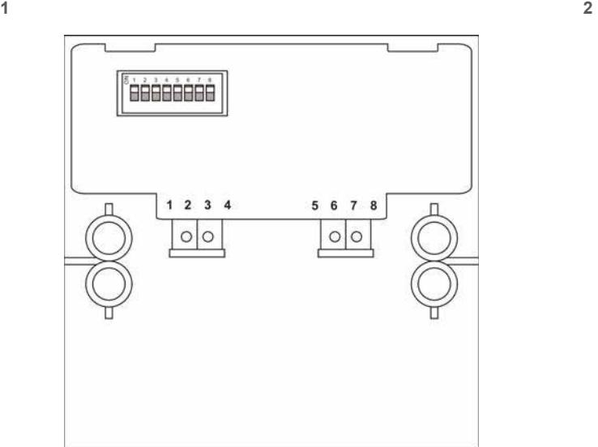
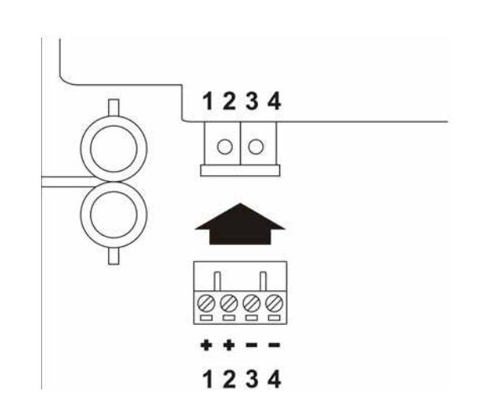
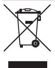

# DM2010 Manual Call Point Installation Sheet

#### **EN DA ET IT LT LV PL SV**

## **EN: Installation Sheet**

#### **Description**

This document includes installation information for UTC Fire & Security DM2010 manual call points. These manual call points are designed for use in UTC Fire & Security Aritech analogue addressable fire alarm systems and include models for indoor and outdoor use.

#### **Installation**

**Caution:** This product must be installed by qualified personnel adhering to the CEN/TS 54-14 standard and any other applicable local authority laws.

#### **Electrical connections**

Connect to the DM2010 connection block (Figure 2) as follows:

- 1. Line in (positive)
- 2. Line out (positive)
- 3. Line in (negative)
- 4. Line out (negative)

#### **Addressing**

Use the DIP switch (Figure 1) to allocate a device address from 1 to 128 (see page 8).

#### **Maintenance**

Basic maintenance consists of a yearly inspection. Do not modify internal wiring or circuitry.

#### **Specifications**

| Voltage                | 17 to 28 VDC             |
|------------------------|--------------------------|
| Current consumption    |                          |
| Standby                | max. 250 ǐA              |
| Alarm                  | max. 2.5 mA              |
| Cable size             |                          |
| Minimum                | 0.8 mm2                  |
| Maximum                | 2.5 mm2                  |
| IP rating              |                          |
| DM2010, DM2010-18      | IP24D                    |
| DM2010E, DM2010E-18    | IP67                     |
| Operating environment  |                          |
| Operating temperature  | í10°C to +70°C           |
| Storage temperature    | í20°C to +70°C           |
| Relative humidity      | 10% to 95% noncondensing |
| Dimensions (W × H × D) |                          |
| DM2010, DM2010-18      | 89 x 93 x 27.5 mm [1]    |
| DM2010E, DM2010E-18    | 97.5 x 93 x 27.5 mm [1]  |
| Weight                 | 187 g                    |

[1] Excluding surface mount

### **Regulatory information**

| Manufacturer                                                                | KAC Alarm Company Ltd. KAC House, Thornhill Road, North Moons Moat, Redditch, Worcestershire, 898 9ND, England                                                                                                                                                                                                                                                             |
|-----------------------------------------------------------------------------|----------------------------------------------------------------------------------------------------------------------------------------------------------------------------------------------------------------------------------------------------------------------------------------------------------------------------------------------------------------------------------------|
|                                                                             | Authorized EU manufacturing representative: UTC Fire & Security B.V. Kelvinstraat 7, 6003 DH Weert, Netherlands                                                                                                                                                                                                                                                            |
| Year of manufacture                                                         | The first two digits of the product serial number (located on the product identification label) are the year of manufacture.                                                                                                                                                                                                                                                  |
|                                                                             | The first two digits of the DATE MFG number (located on the product identification label) are the year of manufacture.                                                                                                                                                                                                                                                        |
| Certification                                                               |                                                                                                                                                                                                                                                                                                                                                                                        |
| CPD certificate DM2010, DM2010-18 DM2010E, DM2010E-18 DM201006-KIT | 0832-CPD-0753 0832-CPD-0755 0832-CPD-0754                                                                                                                                                                                                                                                                                                                                        |
| EN 54                                                                       | EN 54-11 Type A                                                                                                                                                                                                                                                                                                                                                                        |
|                                                                             | 2002/96/EC (WEEE directive): Products marked with this symbol cannot be disposed of as unsorted municipal waste in the European Union. For proper recycling, return this product to your local supplier upon the purchase of equivalent new equipment, or dispose of it at designated collection points. For more information see: www.recyclethis.info. |

#### **Contact information**

For contact information, see www.utcfireandsecurity.com.

### **DA: Installations instruktioner**

#### **Beskrivelse**

Dette dokument indeholder installations instruktioner for UTC Fire & Security brandtryk type DM2010. Disse brandtryk er designet til brug for UTC Fire & Security's adresserbare Aritech brandcentraler, og indeholder typer til både indendørs og udendørs brug.

#### **Installation**

**Advarsel:** Dette produkt skal installeres af uddannede personer i overensstemmelse med CEN/TS 54-14-standarden og andre relevante lokale love.

#### **Elektriske forbindelser**

Forbind klemrækken på DM2010 (Se figur 2) som følger:

- 1. Linje ind (positiv)
- 2. Linje ud (positiv)
- 3. Linje ind (negativ)
- 4. Linje ud (negativ)

#### **Adressering**

Brug DIP-switchen (figur 1) til at konfigurere en enhedsadresse fra 1 til 128 (se side 8).

#### **Vedligeholdelse**

Vedligeholdelse er begrænset til et årligt eftersyn. Undgå at ændre den interne kabelføring og det elektriske kredsløb.

### **Tekniske specifikationer**

| Driftsspænding                                                      | 17 til 28 VDC                                    |
|---------------------------------------------------------------------|--------------------------------------------------|
| Strømforbrug Hviletilstand Alarm                              | maks. 250 ǐA maks. 2.5 mA                     |
| Kabelstørrelse Min. Maks.                                     | 0.8 mm2 2.5 mm2                               |
| Beskyttelsesklasse DM2010, DM2010-18 DM2010E, DM2010E-18      | IP24D IP67                                    |
| Driftstemperatur                                                    | í10°C til +70°C                                  |
| Opbevaringstemperatur                                               | í20°C til +70°C                                  |
| Relativ luftfugtighed                                               | 10% til 95% (ikke-kondenserende)                 |
| Dimensioner (B × H × L) DM2010, DM2010-18 DM2010E, DM2010E-18 | 89 x 93 x 27.5 mm [1] 97.5 x 93 x 27.5 mm [1] |
| Vægt                                                                | 187 g                                            |

[1] Undtaget overflade montering

### **Lovgivningsmæsig information**

| Producent                                                                     | KAC Alarm Company Ltd. KAC House, Thornhill Road, North Moons Moat, Redditch, Worcestershire, 898 9ND, England |
|-------------------------------------------------------------------------------|----------------------------------------------------------------------------------------------------------------------------|
|                                                                               | Virksomhedens autoriserede repræsentant i EU: UTC Fire & Security B.V., Kelvinstraat 7, 6003 DH Weert, Holland |
| Produktionsår                                                                 | Produktionsåret er de første to tal af produktets serie nummer (Placeret på indentifikationsmærkatet).               |
| Certificering                                                                 |                                                                                                                            |
| Certifikatnummer: DM2010, DM2010-18 DM2010E, DM2010E-18 DM201006-KIT | 0832-CPD-0753 0832-CPD-0755 0832-CPD-0754                                                                            |
| EN54                                                                          | EN 54-11 Type A                                                                                                            |

W Unii Europejskiej produkty oznaczone tym symbolem mogą byü usuwane tylko jako posegregowane odpady komunalne. Dla zapewnienia wáaĞciwej utylizacji, naleĪy zwróciü ten produkt do dostawcy przy zakupie ekwiwalentnego, nowego urządzenia albo dostarczyü go do wyznaczonego punktu zbiórki. WiĊcej informacji moĪna znaleĨü na stronie internetowej www.recyclethis.info.

#### **Informacje kontaktowe**

Informacje kontaktowe zawiera witryna internetowa: www.utcfireandsecurity.com.

### **SV: Installationsinstruktioner**

#### **Beskrivning**

Installationsinstruktionen för UTC Fire & Security DM2010 larmtryckknapp. DM2010 larmtryckknapp är designad för UTC Fire & Security Aritech analoga adresserbara brandlarms system och inkluderar inomhus/utomhus modellerna.

#### **Installation**

**Rubrik:** Den här produkten får bara installeras av behöriga tekniker, enligt standarden CEN/TS 54-14 och andra tillämpliga lokala föreskrifter.

#### **Elektroniska kopplingar**

Anslut DM2010 anslutningsplint enligt (figur 2):

- 1. Slinga in (positiv)
- 2. Slinga ut (positiv)
- 3. Slinga in (negativ)
- 4. Slinga ut (negativ)

#### **Adressering**

Använd DIP-omkopplaren (figur 1) för att tilldela en enhetsadress från 1 till 128 (se sidan 8).

#### **Underhåll**

Grundläggande underhåll har reducerats till en årlig inspektion. Ändra inte internt kablage eller kretsar.

#### **Tekniska specifikationer**

| Driftspänning                | 17 till 28 VDC |  |
|------------------------------|----------------|--|
| Strömförbrukning Vilström | max. 250 ǐA    |  |
| Larm                         | max. 2.5 mA    |  |

| Kabelstorlek            |                                   |
|-------------------------|-----------------------------------|
| Min.                    | 0.8 mm2                           |
| Max.                    | 2.5 mm2                           |
| IP-märkning             |                                   |
| DM2010, DM2010-18       | IP24D                             |
| DM2010E, DM2010E-18     | IP67                              |
| Drifttemperatur         | í10°C till +70°C                  |
| Lagringstemperatur      | í20°C till +70°C                  |
| Relativ fuktighet       | 10% till 95% (icke-kondenserande) |
| Dimensioner (B × H × D) |                                   |
| DM2010, DM2010-18       | 89 x 93 x 27.5 mm [1]             |
| DM2010E, DM2010E-18     | 97.5 x 93 x 27.5 mm [1]           |
| Vikt                    | 187 g                             |

[1] Exklusive bakstycke.

#### **Information om regler och föreskrifter**

| Tillverkare                                                                | KAC Alarm Company Ltd. KAC House, Thornhill Road, North Moons Moat, Redditch, Worcestershire, 898 9ND, England                                                                                                                                                                                                                                     |  |  |  |
|----------------------------------------------------------------------------|----------------------------------------------------------------------------------------------------------------------------------------------------------------------------------------------------------------------------------------------------------------------------------------------------------------------------------------------------------------|--|--|--|
|                                                                            | Tillverkarens EU-auktoriserade ombud: UTC Fire & Security B.V., Kelvinstraat 7, 6003 DH Weert, Nederländerna                                                                                                                                                                                                                                       |  |  |  |
| Tillverknings år                                                           | De två första siffrorna i produktens serie nummer är tillverknings år ( som är placerad på produktens etikett).                                                                                                                                                                                                                                       |  |  |  |
| Certifiering                                                               |                                                                                                                                                                                                                                                                                                                                                                |  |  |  |
| CPD-certifikat DM2010, DM2010-18 DM2010E, DM2010E-18 DM201006-KIT | 0832-CPD-0753 0832-CPD-0755 0832-CPD-0754                                                                                                                                                                                                                                                                                                                |  |  |  |
| EN54                                                                       | EN 54-11 Type A                                                                                                                                                                                                                                                                                                                                                |  |  |  |
|                                                                            | Produkter märkta med denna symbol får inte kastas i allmänna sophanteringssytem inom den europeiska unionen. För korrekt återvinning av utrustningen skall den returneras din lokala återförsäljare vid köp av liknande ny utrustning eller lämnas till en därför avsedd deponering. För mer information, se: www.recyclethis.info. |  |  |  |

#### **Kontaktuppgifter**

För information om kontaktuppgifter besök: www.utcfireandsecurity.com.

| 8 9 10 11 12 13 14 15 16 17 18 19 20 21 22 23 24 25 26 27 28 29 30 31 32 33 34 35 36 37 38 39 40 41 42 | 1  | 2  | 3  | 4  | 5  | 6  | 7  |
|--------------------------------------------------------------------------------------------------------------------------------------------------------------------------------------------------------------|----|----|----|----|----|----|----|
|                                                                                                                                                                                                              |    |    |    |    |    |    |    |
|                                                                                                                                                                                                              |    |    |    |    |    |    |    |
|                                                                                                                                                                                                              |    |    |    |    |    |    |    |
|                                                                                                                                                                                                              |    |    |    |    |    |    |    |
|                                                                                                                                                                                                              |    |    |    |    |    |    |    |
|                                                                                                                                                                                                              |    |    |    |    |    |    |    |
|                                                                                                                                                                                                              |    |    |    |    |    |    |    |
|                                                                                                                                                                                                              |    |    |    |    |    |    |    |
|                                                                                                                                                                                                              |    |    |    |    |    |    |    |
|                                                                                                                                                                                                              | 43 | 44 | 45 | 46 | 47 | 48 | 49 |
|                                                                                                                                                                                                              |    |    |    |    |    |    |    |
|                                                                                                                                                                                                              |    |    |    |    |    |    |    |
| 50 51 52 53 54 55 56                                                                                                                                                                       |    |    |    |    |    |    |    |
|                                                                                                                                                                                                              |    |    |    |    |    |    |    |
| 57 58 59 60 61 62 63                                                                                                                                                                       |    |    |    |    |    |    |    |
|                                                                                                                                                                                                              |    |    |    |    |    |    |    |
| 64 65 66 67 68 69 70                                                                                                                                                                       |    |    |    |    |    |    |    |
|                                                                                                                                                                                                              |    |    |    |    |    |    |    |
| 71 72 73 74 75 76 77                                                                                                                                                                       |    |    |    |    |    |    |    |
|                                                                                                                                                                                                              |    |    |    |    |    |    |    |
| 78 79 80 81 82 83 84                                                                                                                                                                       |    |    |    |    |    |    |    |
|                                                                                                                                                                                                              |    |    |    |    |    |    |    |
| 85 86 87 88 89 90 91                                                                                                                                                                       |    |    |    |    |    |    |    |
|                                                                                                                                                                                                              |    |    |    |    |    |    |    |
| 92 93 94 95 96 97 98                                                                                                                                                                       |    |    |    |    |    |    |    |
|                                                                                                                                                                                                              |    |    |    |    |    |    |    |
| 99 100 101 102 103 104 105                                                                                                                                                                 |    |    |    |    |    |    |    |
|                                                                                                                                                                                                              |    |    |    |    |    |    |    |
| 106 107 108 109 110 111 112                                                                                                                                                                |    |    |    |    |    |    |    |
|                                                                                                                                                                                                              |    |    |    |    |    |    |    |
| 113 114 115 116 117 118 119                                                                                                                                                                |    |    |    |    |    |    |    |
|                                                                                                                                                                                                              |    |    |    |    |    |    |    |
| 120 121 122 123 124 125 126                                                                                                                                                                |    |    |    |    |    |    |    |
|                                                                                                                                                                                                              |    |    |    |    |    |    |    |
| 127 128                                                                                                                                                                                                   |    |    |    |    |    |    |    |