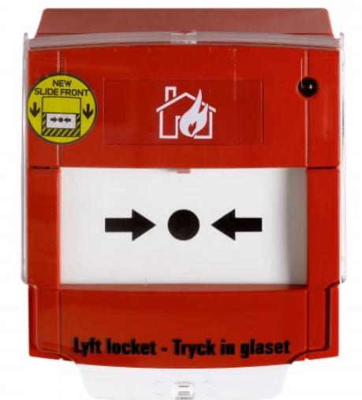

## DM201006-KIT

Produktblad

Adresserbar larmknapp komplett med bakstycke och skyddslock

#### Allmänt

DM201006-KIT är en röd adresserbar utanpåliggande larmknapp för inomhusmiljöer. Den levereras komplett med ett skyddslock och en test-/återställningsnyckel. Larmknappen är försedd med en röd LED-indikering som indikerar när knappen är utlöst.

#### Indikering

En LED-indikering ger visuell bekräftelse av larminitiering. En testnyckel (ingår med varje enhet) möjliggör funktionellt test av larmknappen utan att bryta glaset. Den manuella larmknappen levereras komplett med glas, men glaset kan bytas ut mot ett återställningsbart plastglas.

#### Installation och användning

Den manuella larmknappen DM2010 kan användas tillsammans med brandlarm centraler i Aritech FP1200/2000-serien och 2Xserien via två-tråds adresslinga som ger både ström och kommunikation. Larmknappens adress ställs enkelt in med dip switchar och adressen ligger kvar även vid strömavbrott.

#### Standardprestanda

- EAdresserbar manuell larmknapp med skyddslock
- ELED-indikering för utlöst larmknapp
- EEngångsbrytglas (återställnigsbart plastglas som tillbehör)
- ETestfunktion med testnyckel
- EEN54 godkänd

# DM201006-KIT

Adresserbar larmknapp komplett med bakstycke och skyddslock

### Tekniska data

| Spänning                              |                    |
|---------------------------------------|--------------------|
| Matningsspänning                      | 17-28 VDC          |
| Spänningsmodulering                   | 4-9 V              |
| Strömförbrukning                      |                    |
| Vila                                  | < 250 µA           |
| Larm                                  | < 2.5 mA           |
| Miljö                                 |                    |
| Arbetstemperatur                      | -10°C till +55°C   |
| Förvaringstemperatur                  | -25°C till +70°C   |
| Luftfuktighet (icke kondenserande) | 10-95 %            |
| Kapslingsklass                        | IP24D              |
| Fysiskt                               |                    |
| Kabelspecification                    | 0.5 till 2.5 mm²   |
| Mått (Bx D x H)                       | 92 x 115 x 59.5 mm |
| Vikt                                  | 215 g              |

Order data

Artikelnummer Beskrivning

DM201006-KIT

Adresserbar larmknapp komplett med bakstycke och skyddslock

