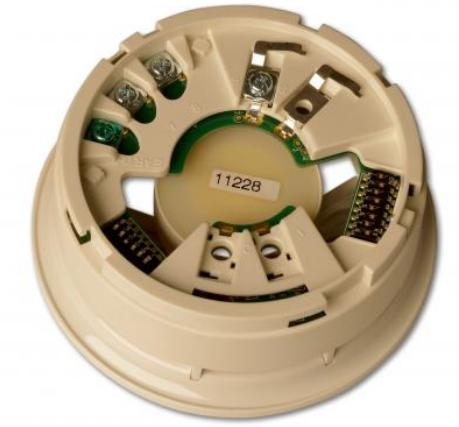

# DB2368IAS-W

Produktblad

DB2368IAS är en adresserbar sockelsiren med inbyggd

### DB2368IAS-W

DB2368IAS-W är en adresserbar sockelsiren med inbyggd kortslutningsisolator för brandlarmsystem i Aritech 2000-serien adresserbara brandlarmsprotokoll. Sockelsirenen kan installeras med en detektor eller användas som fristående siren med AS2368CAP-W täcklock. Flertalet signalkaraktärer och CPD-godkännande säkerställer överensstämmelserna med de lokala föreskrifterna. Alla larmdon i 2000-serien ansluts till ett 2- tråds ledningsnät för seriens slinga och strömförsörjs från slingan dvs ingen extern strömkälla krävs. Sirenen synkroniseras automatiskt från brandlarmcentralen.

#### Installation

Ledningsnät ansluts i sockelsirenen och detektorn monteras och låses sedan fast på sockelsirenen. En separat jordanslutning finns i sockeln för att användas vid behov.

#### Effektiv och mångsidig

2000-seriens sirener kan sättas i olika driftslägen beroende på lokala krav. De ger en hög ljudnivå samt låg strömförbrukning vilket minskar systemets totala kostnad. Sirenen är försedd med volymkontroll som standard vilket gör det enkelt att under installationen slutgiltigt anpassa ljudnivån. Val av signalkaraktär kan ske under installation. 32 stycken olika ljudkaraktärer är tillgängliga.

#### Standardprestanda

- ESlingmatad
- EInbyggd kortslutningsisolator
- EHög ljudvolym med låg strömförbrukning
- EFlertalet signalkaraktärer
- ELämplig för flera stegs utrymningssignal med upp till tre stycken förinställda ljudkaraktärer
- EAutomatisk synkronisering
- ECPD-godkänd

# DB2368IAS-W

DB2368IAS är en adresserbar sockelsiren med inbyggd

## Tekniska data

| Driftspänning                             | 17-28 VDC             |
|-------------------------------------------|-----------------------|
| Strömförbrukning vid 24 VDC               |                       |
| Överspänningsskydd                        | < 1.2 mA              |
| Strömförbrukning (vila)                   | 400 µA                |
| Strömförbrukning (aktiv)                  | 5.1 mA                |
| Isolated                                  | < 6 mA                |
| Siren                                     |                       |
| Utgång vid 90 º ± 3 dB (A)                | 94 dBA *              |
| Valbara signalkaraktärer                  | 32                    |
| Frekvensområdet                           | 400 - 2850 Hz *       |
| Volymjustering                            | 8 dB                  |
| Miljö                                     |                       |
| Arbetstemperatur                          | -10 °C till +55 °C    |
| Förvaringstemperatur                      | -10 °C till +55 °C    |
| Relativ fuktighet (icke kondenserande) | 5% till 95%           |
| IP-klass                                  | IP21                  |
| Kapsling                                  |                       |
| Material                                  | Pressad polykarbonat  |
| Vikt                                      | 140 g                 |
| Mått (diameter x H)                       | 115 x 43 mm           |
| Kabelarea                                 | 0.28 mm² till 2.5 mm² |
|                                           |                       |

* Beroende på vald signalkaraktär och

 matningsspänning.

### Order data

| Artikelnummer |
|---------------|
| DB2368IAS-W   |

DB2368IAS är en adresserbar sockelsiren med inbyggd kortslutningsisolator – VIT

Beskrivning

